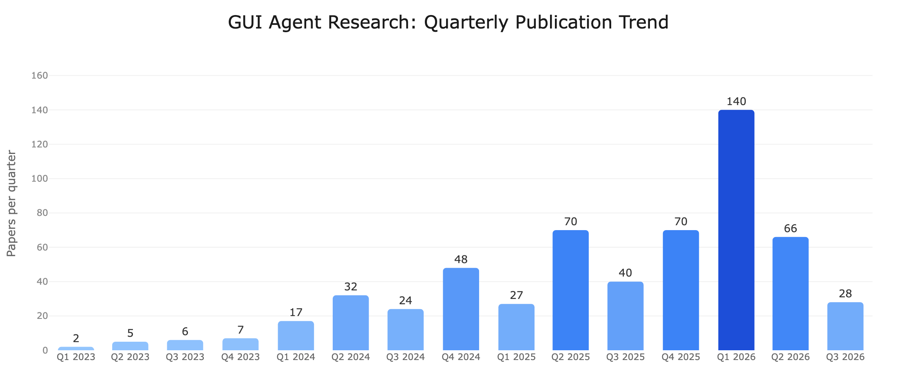
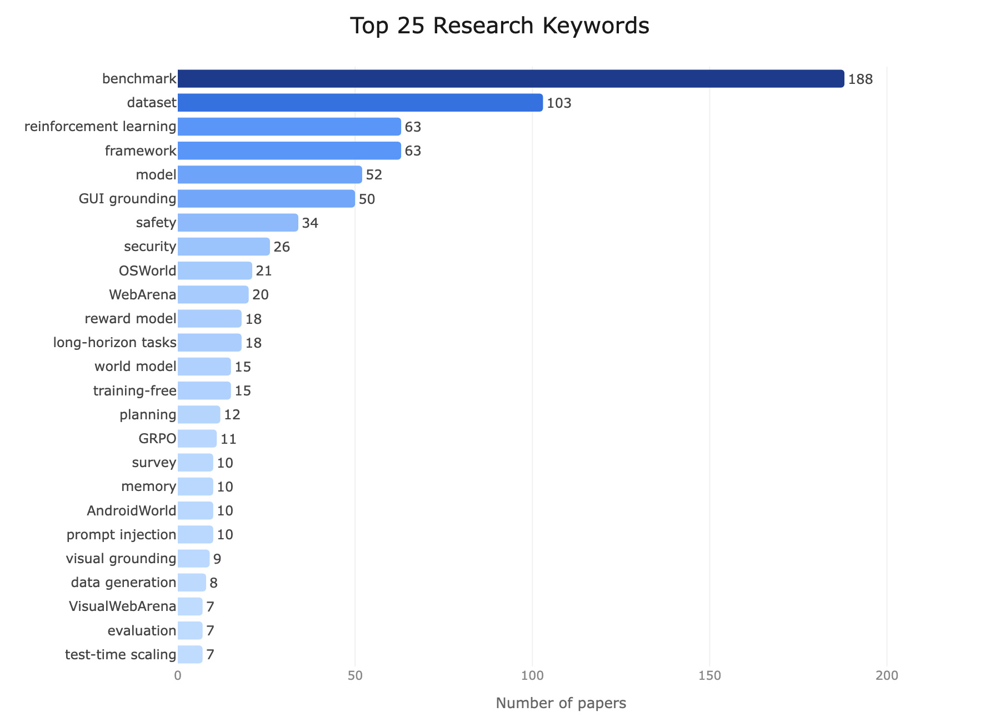

# Awesome GUI Agent Paper List

A curated list of **600** research papers on GUI agents — models, frameworks, benchmarks, datasets, and more — spanning topics like GUI grounding, planning, memory, safety, and reinforcement learning.

## 🌐 Read this list on the web

The website is the recommended way to read this list:

### → **[osu-nlp-group.github.io/GUI-Agents-Paper-List](https://osu-nlp-group.github.io/GUI-Agents-Paper-List/)**

What it adds over the raw markdown:

- **Full-text search** across titles, authors, institutions, TLDRs, and keywords
- **Multi-axis filtering** — environment, keyword (AND/OR), author, institution, year, venue — with shareable URLs
- **Per-paper detail pages** with the full TLDR, all keywords, and related papers
- **One-click BibTeX copy** — LaTeX-paste-ready (`@misc` for arXiv-only, `@inproceedings` / `@article` for venue papers). Auto-generated, so please verify before citing.
- **Interactive stats** — quarterly publication trend by environment, top keywords / institutions / authors / venues
- Warm-paper light theme + dark theme, keyboard shortcuts (`/`, `j`/`k`, `Esc`, `?`), no tracking

The structured store [`papers.yaml`](papers.yaml) (and [`adjacent.yaml`](adjacent.yaml)) is the source of truth — everything on the website and the README is generated from it.

## Browse by Environment
🌐 [Web (236)](https://osu-nlp-group.github.io/GUI-Agents-Paper-List/papers/?env=Web) · 🖥️ [Desktop (139)](https://osu-nlp-group.github.io/GUI-Agents-Paper-List/papers/?env=Desktop) · 📱 [Mobile (188)](https://osu-nlp-group.github.io/GUI-Agents-Paper-List/papers/?env=Mobile) · 🖼️ [General GUI (126)](https://osu-nlp-group.github.io/GUI-Agents-Paper-List/papers/?env=General+GUI)

## Browse by Keyword
[benchmark (188)](https://osu-nlp-group.github.io/GUI-Agents-Paper-List/papers/?key=benchmark) · [dataset (103)](https://osu-nlp-group.github.io/GUI-Agents-Paper-List/papers/?key=dataset) · [framework (63)](https://osu-nlp-group.github.io/GUI-Agents-Paper-List/papers/?key=framework) · [reinforcement learning (63)](https://osu-nlp-group.github.io/GUI-Agents-Paper-List/papers/?key=reinforcement+learning) · [model (52)](https://osu-nlp-group.github.io/GUI-Agents-Paper-List/papers/?key=model) [GUI grounding (50)](https://osu-nlp-group.github.io/GUI-Agents-Paper-List/papers/?key=GUI+grounding) · [safety (34)](https://osu-nlp-group.github.io/GUI-Agents-Paper-List/papers/?key=safety) · [security (26)](https://osu-nlp-group.github.io/GUI-Agents-Paper-List/papers/?key=security) · [OSWorld (21)](https://osu-nlp-group.github.io/GUI-Agents-Paper-List/papers/?key=OSWorld) · [WebArena (20)](https://osu-nlp-group.github.io/GUI-Agents-Paper-List/papers/?key=WebArena) [reward model (18)](https://osu-nlp-group.github.io/GUI-Agents-Paper-List/papers/?key=reward+model) · [long-horizon tasks (18)](https://osu-nlp-group.github.io/GUI-Agents-Paper-List/papers/?key=long-horizon+tasks) · [world model (15)](https://osu-nlp-group.github.io/GUI-Agents-Paper-List/papers/?key=world+model) · [training-free (15)](https://osu-nlp-group.github.io/GUI-Agents-Paper-List/papers/?key=training-free) · [planning (12)](https://osu-nlp-group.github.io/GUI-Agents-Paper-List/papers/?key=planning) [GRPO (11)](https://osu-nlp-group.github.io/GUI-Agents-Paper-List/papers/?key=GRPO) · [survey (10)](https://osu-nlp-group.github.io/GUI-Agents-Paper-List/papers/?key=survey) · [memory (10)](https://osu-nlp-group.github.io/GUI-Agents-Paper-List/papers/?key=memory) · [AndroidWorld (10)](https://osu-nlp-group.github.io/GUI-Agents-Paper-List/papers/?key=AndroidWorld) · [prompt injection (10)](https://osu-nlp-group.github.io/GUI-Agents-Paper-List/papers/?key=prompt+injection)

## Browse by Author
[Wei Liu (24)](https://osu-nlp-group.github.io/GUI-Agents-Paper-List/papers/?author=Wei+Liu) · [Jian Luan (23)](https://osu-nlp-group.github.io/GUI-Agents-Paper-List/papers/?author=Jian+Luan) · [Pengzhi Gao (18)](https://osu-nlp-group.github.io/GUI-Agents-Paper-List/papers/?author=Pengzhi+Gao) · [Graham Neubig (14)](https://osu-nlp-group.github.io/GUI-Agents-Paper-List/papers/?author=Graham+Neubig) · [Yu Su (14)](https://osu-nlp-group.github.io/GUI-Agents-Paper-List/papers/?author=Yu+Su) [Huan Sun (14)](https://osu-nlp-group.github.io/GUI-Agents-Paper-List/papers/?author=Huan+Sun) · [Yuanchun Li (12)](https://osu-nlp-group.github.io/GUI-Agents-Paper-List/papers/?author=Yuanchun+Li) · [Mike Zheng Shou (12)](https://osu-nlp-group.github.io/GUI-Agents-Paper-List/papers/?author=Mike+Zheng+Shou) · [Zhuosheng Zhang (12)](https://osu-nlp-group.github.io/GUI-Agents-Paper-List/papers/?author=Zhuosheng+Zhang) · [Tao Yu (11)](https://osu-nlp-group.github.io/GUI-Agents-Paper-List/papers/?author=Tao+Yu) [Boyuan Zheng (11)](https://osu-nlp-group.github.io/GUI-Agents-Paper-List/papers/?author=Boyuan+Zheng) · [Shuyan Zhou (11)](https://osu-nlp-group.github.io/GUI-Agents-Paper-List/papers/?author=Shuyan+Zhou) · [Tianbao Xie (10)](https://osu-nlp-group.github.io/GUI-Agents-Paper-List/papers/?author=Tianbao+Xie) · [Qiushi Sun (10)](https://osu-nlp-group.github.io/GUI-Agents-Paper-List/papers/?author=Qiushi+Sun) · [Kevin Qinghong Lin (10)](https://osu-nlp-group.github.io/GUI-Agents-Paper-List/papers/?author=Kevin+Qinghong+Lin) [Yuxiang Chai (10)](https://osu-nlp-group.github.io/GUI-Agents-Paper-List/papers/?author=Yuxiang+Chai) · [Han Xiao (10)](https://osu-nlp-group.github.io/GUI-Agents-Paper-List/papers/?author=Han+Xiao) · [Kun Shao (10)](https://osu-nlp-group.github.io/GUI-Agents-Paper-List/papers/?author=Kun+Shao) · [Jun Wang (10)](https://osu-nlp-group.github.io/GUI-Agents-Paper-List/papers/?author=Jun+Wang) · [Zichen Ding (9)](https://osu-nlp-group.github.io/GUI-Agents-Paper-List/papers/?author=Zichen+Ding)

## Contributing

We welcome contributions from the community!

- **Missing a paper?** Open an [issue](https://github.com/OSU-NLP-Group/GUI-Agents-Paper-List/issues) with the paper title, link, and any relevant details — we'll add it.
- **Want to add papers yourself?** Edit [`papers.yaml`](papers.yaml), run `bash scripts/update_repo.sh`, then submit the regenerated diff. See [CLAUDE.md](CLAUDE.md) for the YAML schema and local update workflow.
- **Spotted an error?** Feel free to open an issue or PR to correct any paper metadata (authors, dates, institutions, etc.).

## Recent Papers (from most recent to oldest)

> This README shows the 500 most recent papers. See [`papers.yaml`](papers.yaml) for the full structured source — including BibTeX, OpenReview / publisher / homepage / code / dataset links, and the `bibtex_confirmed` flag. For non-canonical adjacent papers see [`adjacent.yaml`](adjacent.yaml).

- [Task-Adaptive Rubrics for GUI Reward Modeling](https://arxiv.org/abs/2608.24174)
    - Tao Xiong, Xavier Hu, Wenkai Wang, Qinzhuo Wu, Changqiao Wu, Pengzhi Gao, Wei Liu, Jian Luan, Shengyu Zhang
    - 🏛️ Institutions: Zhejiang University, MiLM Plus, Xiaomi
    - 📅 Date: August 25, 2026
    - 📑 Publisher: arXiv
    - 💻 Env: [General GUI]
    - 🔑 Key: [reward model], [task-adaptive rubric], [outcome verification], [reinforcement learning], [AdaptRubric]
    - 📖 TLDR: AdaptRubric makes GUI reward verification task-adaptive by routing each instruction to a task family for coarse rubric retrieval and then generating instance-level checks for concrete values, scopes, and constraints. It improves offline reward F1 by 3.6 points over the matched baseline average and raises downstream task success by 4.23 points in online reinforcement learning.

- [GSAR: Goal-State-Anchor Rewards for Mobile GUI Agents with Self-Evolving Data Synthesis](https://arxiv.org/abs/2608.22847)
    - Long Zhang, Yuhan Chen, Chaoran Zhang, Wanxia Cao, Kun Huang, Pengzhi Gao, Wei Liu, Jian Luan, Chenliang Li, Lixin Zou
    - 🏛️ Institutions: Wuhan University, Xiaomi
    - 📅 Date: August 24, 2026
    - 📑 Publisher: arXiv
    - 💻 Env: [Mobile]
    - 🔑 Key: [reinforcement learning], [reward model], [data synthesis], [goal-state anchors], [GSAR]
    - 📖 TLDR: GSAR addresses the limited diversity of GUI-agent training environments and the unreliability of scalable evaluators with self-evolving task synthesis and goal-state anchors. The anchors identify task-relevant UI elements in successful states to provide accurate rewards, achieving over 90% offline trajectory-verification accuracy and improving agents on AndroidWorld and a new benchmark.

- [CoAdapt-GUI: Joint Workflow Context and Policy Adaptation for Unseen GUI Applications](https://arxiv.org/abs/2608.11588)
    - Linqiang Guo, Li Gu, Zihuan Jiang, Zhixiang Chi, Siobhan Reid, Ziqiang Wang, Yuanhao Yu, Wei Liu, Yang Wang, Tse-Hsun (Peter) Chen
    - 🏛️ Institutions: Concordia University, Mila, University of Toronto, McMaster University
    - 📅 Date: August 12, 2026
    - 📑 Publisher: arXiv
    - 💻 Env: [Mobile]
    - 🔑 Key: [CoAdapt-GUI], [test-time adaptation], [workflow context], [GRPO], [AndroidWorld-Generalization]
    - 📖 TLDR: Mobile GUI agents stay brittle on applications absent from source training, so CoAdapt-GUI performs test-time adaptation that jointly updates a structured workflow context and the policy from the agent's own target-app rollouts and rewards. The workflow context retains transferable procedures, failure modes, and verification rules while excluding app-bound source details, and policy adaptation uses a task-context-matched group-relative objective over a LoRA adapter on a frozen VLM. It reaches 45.0% on AndroidWorld-Generalization against 37.5% for the reported Policy-Only TTA baseline, and lifts AndroidWorld Plus from 38.6% to 52.9%.

- [Hallucination-Free GUI Grounding via Regression-Free Layout-Aware Matching](https://arxiv.org/abs/2608.09654)
    - Yuke Li, Xuehan Hou
    - 🏛️ Institutions: Unknown
    - 📅 Date: August 10, 2026
    - 📑 Publisher: arXiv
    - 💻 Env: [General GUI]
    - 🔑 Key: [GUI grounding], [layout-aware matching], [coordinate hallucination]
    - 📖 TLDR: A regression-free GUI grounding pipeline lets a frozen MLLM turn an instruction into a structured visual description, then matches that description against layout-prior candidates. The paper reports gains on ScreenSpot-Pro and Mind2Web while avoiding coordinate-regression fine-tuning.

- [Software Engineering for and with GUI Agent](https://arxiv.org/abs/2608.09278)
    - Shengcheng Yu, Yuchen Ling, Junyang Xing, Quan Zhou, Chunrong Fang, Zhenyu Chen
    - 🏛️ Institutions: Unknown
    - 📅 Date: August 10, 2026
    - 📑 Publisher: arXiv
    - 💻 Env: [General GUI]
    - 🔑 Key: [survey], [software engineering], [reliability], [lifecycle]
    - 📖 TLDR: This survey reviews 336 GUI-agent papers through a software-engineering lens, covering architectures, evaluation, lifecycle concerns, and deployment gaps. It identifies recurring weaknesses in recovery, safety enforcement, auditability, testing, and maintenance.

- [AppDeltaWorld: Transition-Grounded Delta Code World Model for Mobile GUI Agents](https://arxiv.org/abs/2608.05891)
    - Weikai Xu, Yunren Feng, Haoxiang Lei, Kun Huang, Yuxuan Liu, Kang Zhao, Xiaolin Hu, Shuo Shang, Bo An
    - 🏛️ Institutions: Unknown
    - 📅 Date: August 06, 2026
    - 📑 Publisher: arXiv
    - 💻 Env: [Mobile]
    - 🔑 Key: [world model], [executable HTML], [mobile agents], [AppDeltaWorld]
    - 📖 TLDR: AppDeltaWorld models mobile GUI transitions as constrained executable HTML updates rather than unconstrained next-screen generation. It uses retrieved app structures and predicted next-screen content to support a mobile-agent training environment and test-time adaptation.

- [Routing Is Least Learnable Where It Is Most Valuable: Bounds on Representation Routing for Web Agents](https://arxiv.org/abs/2608.06171)
    - Jiaming Wei, Zekun Wu, Adriano Koshiyama, Maria Perez-Ortiz
    - 🏛️ Institutions: Unknown
    - 📅 Date: August 06, 2026
    - 📑 Publisher: arXiv
    - 💻 Env: [Web]
    - 🔑 Key: [observation routing], [multimodal observation], [WebArena], [VisualWebArena]
    - 📖 TLDR: This paper measures when web agents should use text, pixels, or both. Repeated runs show that apparent oracle routing gains are heavily affected by execution noise; learned routers do not consistently beat a fixed mode, while unsolved-task routing can still reduce cost without lowering success.

- [StepJack: Benchmarking Computer-Use Agent Safety Against Multi-Step Indirect Prompt Injection](https://arxiv.org/abs/2608.06477)
    - Zhuoxin Zhan, Akbar Rafiey, Avery Ma, Leila Pishdad, Layla El Asri
    - 🏛️ Institutions: Unknown
    - 📅 Date: August 06, 2026
    - 📑 Publisher: arXiv
    - 💻 Env: [Web]
    - 🔑 Key: [benchmark], [safety], [indirect prompt injection], [StepJack]
    - 📖 TLDR: StepJack studies indirect prompt injection chains in which a harmful goal is split into seemingly innocuous steps across linked pages. Its 480-example benchmark evaluates whether computer-use agents follow these multi-step attacks and releases the attack-generation pipeline.

- [StepReflect: Structured UI Transition Reflection for Mobile GUI Agents](https://arxiv.org/abs/2608.05587)
    - Linqiang Guo, Wei Liu, Li Gu, Yang Wang, Tse-Hsun (Peter) Chen
    - 🏛️ Institutions: Unknown
    - 📅 Date: August 06, 2026
    - 📑 Publisher: arXiv
    - 💻 Env: [Mobile]
    - 🔑 Key: [reflection], [UI transitions], [structured prediction], [StepReflect]
    - 📖 TLDR: StepReflect recasts after-action reflection for mobile GUI agents as structured transition prediction over paired visual evidence. Its staged training recipe produces a local reflection model that improves several evaluated agent configurations while reducing dependence on repeated frontier-model calls.

- [The Next Screenshot Knows: Gated Hindsight Distillation for Mobile GUI Agents](https://arxiv.org/abs/2608.06065)
    - Weiwei Li, Junzhuo Liu, Tong Chu, Hengfu Yu, Wen Li
    - 🏛️ Institutions: Unknown
    - 📅 Date: August 06, 2026
    - 📑 Publisher: arXiv
    - 💻 Env: [Mobile]
    - 🔑 Key: [hindsight distillation], [mobile agents], [privileged information], [GHD]
    - 📖 TLDR: Gated Hindsight Distillation uses the next screenshot as training-only privileged information to rescore an on-policy student's actions. It distills the signal only when that view recovers a missed demonstrated action, improving mobile-agent task success over the compared GRPO baseline.

- [LoginTrap: Uncovering Task-Agnostic Phishing-Style Indirect Prompt Injection Attacks against LLM-based Web Agents](https://arxiv.org/abs/2608.04741)
    - Longtao Guo, Zelin Zhang, Kaifeng Huang, Yang Shi
    - 🏛️ Institutions: Unknown
    - 📅 Date: August 05, 2026
    - 📑 Publisher: arXiv
    - 💻 Env: [Web]
    - 🔑 Key: [security], [indirect prompt injection], [authentication], [LoginTrap]
    - 📖 TLDR: LoginTrap is a black-box, task-agnostic attack that uses page-specific indirect instructions to make a controlled login flow appear necessary. The paper evaluates end-to-end credential-oriented attack success across web-agent configurations and defenses.

- [GUI-Lens: Coarse-to-Fine Cropping for GUI Grounding with General-Purpose VLMs](https://arxiv.org/abs/2608.03270)
    - Zichuan Fu, Shirong Wang, Wenlin Zhang, Guojing Li, Yimin Deng, Jingtong Gao, Junjia Qi, Hanyu Yan, Yefeng Zheng, Xiaopeng Li, Wanyu Wang, Xian Wu, Xiangyu Zhao
    - 🏛️ Institutions: CityU, Tencent Jarvis Lab, Westlake University
    - 📅 Date: August 04, 2026
    - 📑 Publisher: arXiv
    - 💻 Env: [General GUI]
    - 🔑 Key: [GUI-Lens], [GUI grounding], [coarse-to-fine cropping], [coordinate priming], [visual verification]
    - 📖 TLDR: GUI-Lens turns GUI grounding into an iterative visual-search process: OCR and detected components provide coordinate references, a general-purpose VLM selects progressively enlarged crops, and separate verification gates reject bad crop or click proposals. Across four grounding benchmarks and three VLM backends, the paper reports gains of up to 24.9 percentage points, with GPT-5.5 reaching 87.9% on ScreenSpot-Pro.

- [Screenshots or Tools? Eliciting Tool Use and Managing Multimodal Context in Hybrid GUI-MCP Computer-Use Agents](https://arxiv.org/abs/2608.03327)
    - Siqi Fan, Minghao Li, Xiaoqian Ma, Wenhui Tan, Xiusheng Huang, Juntong Wu, Liujie Zhang, Shuo Shang, Weihang Chen
    - 🏛️ Institutions: Unknown
    - 📅 Date: August 04, 2026
    - 📑 Publisher: arXiv
    - 💻 Env: [Desktop]
    - 🔑 Key: [MCP], [tool use], [multimodal context], [OSWorld-MCP]
    - 📖 TLDR: This work examines hybrid computer-use agents that can choose screenshots or text tools on OSWorld-MCP. It identifies an adoption gap in tool use and shows that training with a compatible post-tool observation policy can reduce image-context cost while improving the reported operating point.

- [Qwen-CUA: Native Computer Use for (almost) Everything](https://arxiv.org/abs/2608.02352)
    - Dunjie Lu, Shuai Bai, Tianyi Bai, Sicheng Fan, Chang Gao, Jian Guan, Feng Hu, Mianqiu Huang, Xingyang Huang, Yizhen Jiang, Yuheng Jing, Dehui Kong, Ning Li, Dayiheng Liu, Shixuan Liu, Zheng Liu, Que Shen, Bowen Wang, Junli Wang, Chencan Wu, Rui Xie, Tianbao Xie, Zhihui Xie, Haiyang Xu, An Yang, Tao Yu, Wenzhen Yuan, Xi Zhang, Zhenru Zhang, Mingkang Zhu, Zhaoqing Zhu, Yizhong Cao, Kai Dang, Binyuan Hui, Kaixin Li, Junyang Lin, Haiquan Wang, Zekun Wang, Yiheng Xu, Fan Yan, Mengqi Yuan, Danyang Zhang, Jiajun Zhang, Zhipeng Zhang, Fan Zhou
    - 🏛️ Institutions: Unknown
    - 📅 Date: August 03, 2026
    - 📑 Publisher: arXiv
    - 💻 Env: [Desktop], [Web]
    - 🔑 Key: [model], [computer use], [online reinforcement learning], [verifiable tasks], [Qwen-CUA]
    - 📖 TLDR: Qwen-CUA is a screenshot-only native computer-use agent that controls software through keyboard and mouse events without DOM, accessibility, or task-specific APIs. It combines large-scale verifiable task construction, long-horizon trajectory optimization, and visual-history management, and evaluates across desktop and browser computer-use benchmarks.

- [CUADebug: Diagnosing and Repairing Computer-Use Agent Failures](https://arxiv.org/abs/2608.02643)
    - Weijia Zhang, Kunlun Zhu, Zeyi Liu, Yinting Chen, Tianyi Ma, Jiateng Liu, Jiaxun Zhang, Bingxuan Li, Xiangru Tang, Heng Ji, Jiaxuan You
    - 🏛️ Institutions: Unknown
    - 📅 Date: July 31, 2026
    - 📑 Publisher: arXiv
    - 💻 Env: [Desktop]
    - 🔑 Key: [debugging], [benchmark], [error diagnosis], [CUAErrorBench]
    - 📖 TLDR: CUADebug introduces a computer-use failure taxonomy, an OSWorld failure benchmark with human annotations, and an active debugger that inspects suspect before-and-after steps. Its structured diagnoses identify root-cause actions and corrective strategies for subsequent execution.

- [MAGA: Multi-Platform Self-Fusion of GUI Agents via Structured Action Distillation](https://arxiv.org/abs/2607.29320)
    - Hang Yan, Zhangxuan Gu, Beitong Zhou, Jiaxuan Chen, Runze Li, Yusong Hu, Shuheng Shen, Changhua Meng
    - 🏛️ Institutions: Unknown
    - 📅 Date: July 31, 2026
    - 📑 Publisher: arXiv
    - 💻 Env: [Desktop], [Mobile], [Web]
    - 🔑 Key: [model fusion], [action distillation], [cross-platform agents], [MAGA]
    - 📖 TLDR: MAGA consolidates domain-specific GUI agents into a cross-platform policy using structured action distillation. It emphasizes incorrectly generated actions while suppressing invalid or unnecessary teacher signals, improving average task success over the compared fusion baselines.

- [OSReward: Instituting Standardized Evaluation for Cross-Platform Computer-Use Reward Models](https://os-copilot.github.io/OSReward-Home/)
    - Qiushi Sun, Kanzhi Cheng, Yian Wang, Bowen Yang, Hang Yan, Liheng Chen, Fangzhi Xu, Zichen Ding, Nuo Chen, Jialin Cao, Xingdong Gong, Zehao Li, Kaiming Jin, Xinfeng Yuan, Zhoumianze Liu, Jingyang Gong, Zhangyue Yin, Jiahui Gao, Zhiyong Wu, Tianbao Xie, Jianbing Zhang, Ben Kao, Lingpeng Kong
    - 🏛️ Institutions: Unknown
    - 📅 Date: July 30, 2026
    - 📑 Publisher: arXiv
    - 💻 Env: [Desktop], [Mobile], [Web]
    - 🔑 Key: [benchmark], [reward model], [trajectory evaluation], [OSReward]
    - 📖 TLDR: OSReward evaluates vision-language reward models for computer-use trajectories across platforms, including a hard subset and fine-grained efficiency/alignment assessment. It also releases OS-Shepherd, an open corpus and reward-model family for lower-cost trajectory judgment.

- [Qwen-UI-Agent Technical Report: Toward Next-Generation Real-World Centric Foundation GUI Agents](https://arxiv.org/abs/2607.28227)
    - Hanzhang Zhou, Panrong Tong, Xu Zhang, Quyu Kong, Chenglin Cai, Tianyu Xia, Gongjie Zhang, Jianan Zhang, Long Li, Long Chen, Lei Wang, Gaole Dai, Pengxiang Li, Liangyu Chen, Yue Wang, Steven Hoi
    - 🏛️ Institutions: Unknown
    - 📅 Date: July 30, 2026
    - 📑 Publisher: arXiv
    - 💻 Env: [Desktop], [Mobile], [Web]
    - 🔑 Key: [model], [online reinforcement learning], [real-device training], [Qwen-UI-Agent]
    - 📖 TLDR: Qwen-UI-Agent is a cross-platform foundation GUI agent spanning mobile, computer, and browser use. It combines sandbox and real-device runtimes, mixed GUI/CLI actions, batched action generation, an automated data flywheel, and long-horizon online RL.

- [OmegaUse-OfficeVal: Benchmarking LLM Agents on Long-Horizon Office-Suite Tasks with Economic Grounding](https://omegause-officeval.github.io)
    - Jingbo Zhou, Yusai Zhao, Qi Bao, Jingjia Cao, Zhenghai Chen, Chang Gao, Kaiqi Guo, Muxin Guo, Mingxuan Li, Xinjiang Lu, Yanru Ma, Yixiong Xiao, Zenghui Zhang, Le Zhang, Hua Wu
    - 🏛️ Institutions: Unknown
    - 📅 Date: July 29, 2026
    - 📑 Publisher: arXiv
    - 💻 Env: [Desktop]
    - 🔑 Key: [benchmark], [office suite], [economic grounding], [OmegaUse-OfficeVal]
    - 📖 TLDR: OmegaUse-OfficeVal benchmarks agents on 100 long-horizon office-suite tasks with code-based verifiers and task-level human labor and price signals. The economic annotations enable comparisons of deliverable quality, inference cost, and execution time against human work.

- [Scaling GUI Agents with Visual State Transitions](https://arxiv.org/abs/2607.24112)
    - Xiangyan Liu, Kaixin Li, Haonan Wang, Biao Wu, Meng Fang, Longxu Dou, Chao Du, Michael Qizhe Shieh, Tianyu Pang
    - 🏛️ Institutions: Unknown
    - 📅 Date: July 27, 2026
    - 📑 Publisher: arXiv
    - 💻 Env: [Desktop], [Mobile]
    - 🔑 Key: [pretraining], [visual state transitions], [world model], [STP]
    - 📖 TLDR: State Transition Pretraining jointly learns inverse dynamics and forward GUI dynamics from visual state transitions before instruction-conditioned trajectory fine-tuning. The paper evaluates the resulting models on desktop and mobile agent benchmarks and releases its official implementation.

- [SeekJudge: A Practical Reward Framework for Reinforcement Learning in Computer-Use Agents](https://arxiv.org/abs/2607.23263)
    - Yang Wan, Zhenhao Zhang, Jierui Wang, Linchao Zhu
    - 🏛️ Institutions: Unknown
    - 📅 Date: July 25, 2026
    - 📑 Publisher: arXiv
    - 💻 Env: [Desktop]
    - 🔑 Key: [reward model], [reinforcement learning], [trajectory evaluation], [SeekJudge]
    - 📖 TLDR: SeekJudge uses specialized Condense, Ground, Seek, and Analyze roles to judge whether long computer-use trajectories satisfy their instructions. Its distilled shared-backbone design supplies step-level reward signals intended to make model-based supervision practical for online RL.

- [StateAct: Program State, before Pixels, for Long-Horizon Computer-Use Agents](https://arxiv.org/abs/2607.22798)
    - Yan Yang, Xiangru Jian, Ziyang Luo, Zirui Zhao, Yutong Dai, Ziji Shi, Hanshu Yan, Jun Hao Liew, Silvio Savarese, Junnan Li
    - 🏛️ Institutions: Unknown
    - 📅 Date: July 24, 2026
    - 📑 Publisher: arXiv
    - 💻 Env: [Desktop]
    - 🔑 Key: [program state], [multi-agent harness], [verification], [StateAct]
    - 📖 TLDR: StateAct is a code-first computer-use harness that lets a main agent directly inspect and edit program state, reserving GUI interaction for subgoals that require it. An independent finish gate validates results, and fresh subagents keep long-horizon context focused.

- [SEE: Structure-aware Exploring and Exploiting for Long-horizon GUI Agent Trajectory Synthesis](https://arxiv.org/abs/2607.18046)
    - Zhuohang Fan, Beichen Zhang, Yuanfa Li, Changqiao Wu, Wei Liu, Jian Luan, Weigang Zhang
    - 🏛️ Institutions: Unknown
    - 📅 Date: July 20, 2026
    - 📑 Publisher: arXiv
    - 💻 Env: [Mobile]
    - 🔑 Key: [trajectory synthesis], [UI transition graph], [data generation], [SEE]
    - 📖 TLDR: SEE builds UI transition graphs through structured exploration, then synthesizes diverse long-horizon mobile trajectories with graph-based planning and controlled sampling. The method targets coverage of rare transitions while avoiding spurious interaction cycles.

- [EvoGUI: An Evolution-Aware Benchmark for GUI State-Transition Understanding](https://arxiv.org/abs/2607.17050)
    - Yaohan Yang, Minglei Shi, Borui Zhang, Jie Zhou, Jiwen Lu
    - 🏛️ Institutions: Unknown
    - 📅 Date: July 19, 2026
    - 📑 Publisher: arXiv
    - 💻 Env: [Web]
    - 🔑 Key: [benchmark], [state transitions], [visual question answering], [EvoGUI]
    - 📖 TLDR: EvoGUI turns normalized web GUI trajectories into temporal ordering, inverse action/value prediction, and successor-state discrimination tasks. The benchmark is constructed from Mind2Web and WebLINX to isolate state-transition understanding from end-to-end agent success.

- [SeerGuard: A Safety Framework for Mobile GUI Agents via World Model Prediction](https://arxiv.org/abs/2607.15550)
    - Xue Yu, Bo Yuan, Pengshuai Yang, Kailin Zhao, Hong Hu, Junlan Feng
    - 🏛️ Institutions: Unknown
    - 📅 Date: July 17, 2026
    - 📑 Publisher: arXiv
    - 💻 Env: [Mobile]
    - 🔑 Key: [safety], [world model], [risk assessment], [SeerGuard]
    - 📖 TLDR: SeerGuard combines instruction screening with pre-execution action risk assessment for mobile GUI agents. Its safety-augmented world model jointly predicts likely next states and action risk so the agent can reject harmful actions before execution.

- [SCALECUA: Scaling Computer Use Agents with Verifiable Task Synthesis and Efficient Online RL](https://arxiv.org/abs/2607.11185)
    - Bowen Lv, Xiao Liu, Yanyu Ren, Hanyu Lai, Bohao Jing, Hanchen Zhang, Yanxiao Zhao, Shuntian Yao, Jie Tang, Yuxiao Dong
    - 🏛️ Institutions: Unknown
    - 📅 Date: July 13, 2026
    - 📑 Publisher: arXiv
    - 💻 Env: [Desktop], [Web]
    - 🔑 Key: [reinforcement learning], [verifiable task synthesis], [training framework], [SCALECUA]
    - 📖 TLDR: SCALECUA couples Docker-based verifiable task synthesis with frontier sampling and a visual-context segmentation training system for online CUA reinforcement learning. The released framework covers task generation, RL training, and OSWorld/ScienceBoard evaluation.

- [StructAgent: Harness Long-horizon Digital Agents with Unified Causal Structure](https://arxiv.org/abs/2607.11388)
    - Wenyi Wu, Sibo Zhu, Kun Zhou, Aayush Salvi, Zixuan Song, Biwei Huang
    - 🏛️ Institutions: UC San Diego, Aether AI Lab
    - 📅 Date: July 13, 2026
    - 📑 Publisher: arXiv
    - 💻 Env: [Desktop], [Web]
    - 🔑 Key: [long-horizon tasks], [state tracking], [verification], [failure recovery], [StructAgent]
    - 📖 TLDR: StructAgent organizes long-horizon computer use around a unified, evidence-backed representation of task progress shared by its planner, actor, and verifier. Verifier-gated state transitions support checkpointing, evidence-based completion, and targeted recovery across OSWorld-Verified and other digital environments.

- [WebRetriever: A Large-Scale Comprehensive Benchmark for Efficient Web Agent Evaluation](https://arxiv.org/abs/2607.06118)
    - Wei Dong, Tianyu Fu, Zhe Yu, Hanning Wang, Anyang Su, Zhizhou Fang, Yuyang Chen, Shuo Wang, Minghui Wu, Ping Jiang, Zhen Lei, Chenxu Zhao
    - 🏛️ Institutions: Unknown
    - 📅 Date: July 07, 2026
    - 📑 Publisher: arXiv
    - 💻 Env: [Web]
    - 🔑 Key: [benchmark], [web agent evaluation], [navigation evaluation], [WebRetriever]
    - 📖 TLDR: WebRetriever provides 1,550 web-agent tasks across 800 websites and evaluates navigation, knowledge-assisted interaction, and end-to-end information extraction. Its NavEval judge incorporates richer interaction context than screenshots alone for fine-grained evaluation.

- [Xiaomi-GUI-0 Technical Report](https://seerray-lab.github.io/Xiaomi-GUI-0/)
    - Wanxia Cao, Chengzhen Duan, Pei Fu, Pengzhi Gao, Niu Lian, Fazhan Liu, Hui Liu, Heng Qu, Qinzhuo Wu, Zhehao Yu, Tongbo Chen, Shiqi Cui, Anan Du, Shukai Jia, Yuanfa Li, Wei Liu, Yike Liu, Wenchao Lu, Zhenbo Luo, Haoyuan Sun, Jiatong Sun, Cheng Tan, Yajie Wang, Changqiao Wu, Tao Xiong, Jiahui Yang, Yuxuan Yuan, Ruoceng Zhang, Shaojie Zhang, Jian Zhu, Jian Luan, Cong Zou
    - 🏛️ Institutions: Xiaomi
    - 📅 Date: June 30, 2026
    - 📑 Publisher: arXiv
    - 💻 Env: [Mobile]
    - 🔑 Key: [model], [real-device training], [real-world deployment], [error recovery], [Xiaomi-GUI-0]
    - 📖 TLDR: Xiaomi-GUI-0 trains and evaluates a native multimodal mobile GUI agent in a real-device-dominant closed loop instead of relying only on offline trajectories and simulated environments. Its multi-source data, error-driven flywheel, and progressive SFT/step-RL/agentic-RL pipeline reach 72.0% on the RealMobile benchmark and 78.9% on AndroidWorld, while improving abnormal-state recognition and recovery.

- [AOHP: An Open-Source OS-Level Agent Harness for Personalized, Efficient and Secure Interaction](https://arxiv.org/abs/2606.23449)
    - Shanhui Zhao, Jiacheng Liu, Guohong Liu, Jichao Yan, Jialei Ye, Yuhao Yang, Hao Wen, Shizuo Tian, Yizhen Yuan, Yuxuan Chen, Yunxin Liu, Ju Ren, Ya-Qin Zhang, Chao Huang, Yao Guo, Yuanchun Li
    - 🏛️ Institutions: Tsinghua, PKU, HKU
    - 📅 Date: June 22, 2026
    - 📑 Publisher: arXiv
    - 💻 Env: [Mobile]
    - 🔑 Key: [AOHP], [framework], [agent-native OS], [information-flow tracking]
    - 📖 TLDR: AOHP is an open-source OS-level agent harness built on AOSP that treats agents as first-class OS actors, introducing personalized service composition, efficient agent interfaces, and secure information-flow tracking while preserving the existing Android software and hardware ecosystem. On tasks covering key OS-agent capabilities it improves task completion by 21.12 points and cuts token cost by 51.55% versus baseline, while enforcing security-policy compliance.

- [Mobile GUI Agents under Real-world Threats: Are We There Yet?](https://agenthazard.github.io)
    - Guohong Liu, Jialei Ye, Jiacheng Liu, Wei Liu, Pengzhi Gao, Jian Luan, Yuanchun Li, Yunxin Liu
    - 🏛️ Institutions: AIR, Tsinghua, University of Electronic Science and Technology of China, PKU, MiLM Plus, Xiaomi
    - 📅 Date: June 20, 2026
    - 📑 Publisher: MobiSys 2026
    - 💻 Env: [Mobile]
    - 🔑 Key: [safety], [security], [adversarial attacks], [third-party content], [AgentHazard]
    - 📖 TLDR: AgentHazard evaluates mobile GUI agents when untrusted third-party content appears inside otherwise legitimate app regions, a threat missing from standard static-content benchmarks. Its instrumentation framework supports a dynamic environment with 122 tasks and a static dataset with more than 3,000 scenarios; evaluated agents show average misleading rates of 42.0% and 36.1% in the two settings.

- [Naive Visual Memory is Not Enough: A Failure-Mode Study of GUI Agents](https://arxiv.org/abs/2606.14106)
    - Seoyoung Choi, Minseok Ko, Hyunseok Lee, Kunwoong Kim, Woomin Song, Chanseok Jeon, Jinwoo Shin
    - 🏛️ Institutions: Unknown
    - 📅 Date: June 12, 2026
    - 📑 Publisher: arXiv
    - 💻 Env: [General GUI]
    - 🔑 Key: [visual memory], [failure modes], [experiential memory], [grounding error]
    - 📖 TLDR: This paper studies how visual memory affects GUI agents by classifying failures into cognitive failure, visual state misunderstanding, hidden operation blindness, and grounding error. It finds that full-image memory can reduce state-level failures while worsening action-level failures such as hidden operation blindness and grounding errors.

- [WebChallenger: A Reliable and Efficient Generalist Web Agent](https://arxiv.org/abs/2606.10423)
    - Jayoo Hwang, Xiaowen Zhang, Vedant Padwal
    - 🏛️ Institutions: Independent
    - 📅 Date: June 09, 2026
    - 📑 Publisher: arXiv
    - 💻 Env: [Web]
    - 🔑 Key: [web agent], [PageMem], [selective observation], [site memory], [compound actions], [WebChallenger]
    - 📖 TLDR: WebChallenger is a web-agent framework built around PageMem, a structured page representation that supports selective observation, persistent site memory, and compound action workflows. Without additional training, it combines a 32B LLM and 7B VLM to improve performance across WebArena, VisualWebArena, Online-Mind2Web, and WorkArena.

- [Workflow-GYM: Towards Long-Horizon Evaluation of Computer-use Agentic tasks in Real-World Professional Fields](https://arxiv.org/abs/2606.11042)
    - Liya Zhu, Jingzhe Ding, Jian Zhang, Jianbo Xue, Shihao Liang, Ge Zhang, Yi Zhu, Duju Zeng, Xiang Gao, Qingshui Gu, Mailun Gao, Huimin Che, Yan Zhao, Peiheng Zhou, Haojun Wang, Chaobo Xian, Lili Le, Chi Wu, Yiwei Liu, Shengda Long, Jiale Yang, Fangzhi Xu, Sijin Wu, Haodong Duan, Chao He, Zhaojian Li, Minchao Wang, Huan Zhou, Jiani Hou, Chuqian Yu, Weiran Shi, Hongwan Gao, Jiamin Chen, Guanhong Chen, Tingqin Luo, Kaiyuan Zhang, Zhixin Yao, Qing Hua, Yuhao Jiang, Jin Chen, Pu Chen, Zhenyu Hu, Xingyu Li, Zhengxuan Jiang, Meng Cao, Tianfeng Long, Haozhe Wang, Mingzhang Wang, Yichen Zhang, Yiming Dai, Chenchen Zhang, Jiaying Wang, Xinying Liu, Xingzu Liu, Lingling Zhang, Xinjie Chen, Yujia Qin, Wangchunshu Zhou, Zhiyong Wu, Yang Liu, Jiaheng Liu, Lei Zhang, Shen Yan, Wenhao Huang, Zaiyuan Wang, Xiaolong Chang
    - 🏛️ Institutions: Unknown
    - 📅 Date: June 09, 2026
    - 📑 Publisher: arXiv
    - 💻 Env: [Desktop]
    - 🔑 Key: [benchmark], [long-horizon tasks], [professional workflows], [Workflow-GYM]
    - 📖 TLDR: Workflow-GYM is a benchmark for long-horizon computer-use tasks in professional software environments. It evaluates whether agents can complete domain-specific workflows through GUIs and reports that current state-of-the-art models still struggle with end-to-end professional tasks.

- [Benchmarking Living-Screen-Native GUI Agents on Short-Video Platforms](https://arxiv.org/abs/2606.04701)
    - Jiashu Yao, Heyan Huang, Daiqing Wu, Wangke Chen, Huaxi Ai, Haoyu Wen, Zeming Liu, Yuhang Guo
    - 🏛️ Institutions: BIT, THU, Beihang
    - 📅 Date: June 03, 2026
    - 📑 Publisher: arXiv
    - 💻 Env: [Mobile]
    - 🔑 Key: [benchmark], [dynamic interface], [short-video platform], [observation control], [LivingScreen]
    - 📖 TLDR: LivingScreen is a benchmark for "living-screen-native" GUI agents that must act on continuously updating interfaces such as short-video platforms, where on-screen content changes between agent actions. Evaluating frontier models, it finds none reaches human cost-accuracy performance and identifies over- and under-observation as key failure modes, motivating better observation-control capabilities.

- [Online Skill Learning for Web Agents via State-Grounded Dynamic Retrieval](https://arxiv.org/abs/2606.04391)
    - Jiaxi Li, Ke Deng, Yun Wang, Jingyuan Huang, Yucheng Shi, Qiaoyu Tan, Jin Lu, Ninghao Liu
    - 🏛️ Institutions: University of Georgia, Tencent America, New York University, PolyU
    - 📅 Date: June 03, 2026
    - 📑 Publisher: arXiv
    - 💻 Env: [Web]
    - 🔑 Key: [SGDR], [online skill learning], [dynamic retrieval], [executable skills], [WebArena]
    - 📖 TLDR: SGDR converts successful WebArena trajectories into verified, executable text-code subprocedures using sliding windows, then retrieves a diverse skill set at every step from both the current page state and task goal rather than once per task. It raises average success to 37.5% with GPT-4.1 and 24.3% with Qwen3-4B, improvements of 3.6 and 2.2 percentage points over the strongest compared baseline.

- [Demo2Tutorial: From Human Experience to Multimodal Software Tutorials](https://arxiv.org/abs/2606.03951)
    - Zechen Bai, Zhiheng Chen, Yiqi Lin, Kevin Qinghong Lin, Difei Gao, Xiangwu Guo, Xin Wang, Mike Zheng Shou
    - 🏛️ Institutions: NUS
    - 📅 Date: June 02, 2026
    - 📑 Publisher: CVPR 2026
    - 💻 Env: [General GUI]
    - 🔑 Key: [software tutorials], [task graphs], [planning], [Demo2Tutorial]
    - 📖 TLDR: Demo2Tutorial converts screen recordings and interaction logs into structured multimodal software tutorials with parsed actions, intents, and hierarchical task graphs. The paper evaluates tutorial generation quality and shows that the resulting representations improve downstream GUI-agent planning and generalization.

- [Context-Aware Workflow Decomposition for Automated Mobile UI Annotation Using Multimodal Large Language Models](https://arxiv.org/abs/2606.02208)
    - Athar Parvez, Muhammad Jawad Mufti, Muqaddas Gull, Omar Hammad
    - 🏛️ Institutions: Unknown
    - 📅 Date: June 01, 2026
    - 📑 Publisher: arXiv
    - 💻 Env: [Mobile]
    - 🔑 Key: [UI annotation], [mobile UI understanding], [workflow decomposition], [MUIAnno]
    - 📖 TLDR: This paper studies automated mobile UI annotation for UI understanding, accessibility, testing, dataset construction, and GUI agents. It decomposes annotation into context-aware stages with structured prompts and schema-constrained outputs, improving precision on expert-annotated MUIAnno mobile screens.

- [STaR-KV: Spatio-Temporal Adaptive Re-weighting for KV Cache Compression in GUI Vision-Language Models](https://arxiv.org/abs/2606.01790)
    - Yuhang Han, Wenzheng Yang, Yujie Chen, Xiangqi Jin, Yaojie Zhang, Siteng Huang, Linfeng Zhang
    - 🏛️ Institutions: SJTU, HKUST (GZ), ZJU
    - 📅 Date: June 01, 2026
    - 📑 Publisher: arXiv
    - 💻 Env: [General GUI]
    - 🔑 Key: [efficiency], [KV cache compression], [vision-language model], [training-free], [STaR-KV]
    - 📖 TLDR: STaR-KV is a training-free KV cache compression framework for GUI vision-language models, whose cache grows linearly with interaction steps. It combines subspace-aware spatial scoring with temporal-stability re-weighting to retain salient tokens, reducing memory while preserving accuracy across GUI agent benchmarks.

- [GUI-C²: Coarse-to-Fine GUI Grounding via Difficulty-Aware Reinforcement Learning](https://z1oong.github.io/GUI-C2/)
    - Junlong Li, Chao Hao, Lap-Pui Chau, Yi Wang
    - 🏛️ Institutions: PolyU
    - 📅 Date: May 29, 2026
    - 📑 Publisher: arXiv
    - 💻 Env: [General GUI]
    - 🔑 Key: [GUI grounding], [reinforcement learning], [difficulty-aware data curation], [coarse-to-fine refinement], [GUI-C²]
    - 📖 TLDR: GUI-C² targets data efficiency and inference overhead in RL-based GUI grounding by combining GUI-D, a difficulty-scored data curation pipeline, with area-gated coarse-to-fine visual refinement. Its improvement-aware stage rewards and simplified decision process achieve 46.4% on ScreenSpot-Pro with a 3B model while adding minimal inference time.

- [UI-KOBE: Knowledge-Oriented Behavior Exploration for Lightweight Graph-Guided GUI Agents](https://arxiv.org/abs/2605.29534)
    - Yuxiang Chai, Han Xiao, Xinyu Fu, Jinpeng Chen, Rui Liu, Hongsheng Li
    - 🏛️ Institutions: Unknown
    - 📅 Date: May 28, 2026
    - 📑 Publisher: arXiv
    - 💻 Env: [Mobile]
    - 🔑 Key: [lightweight agents], [knowledge graph], [app exploration], [UI-KOBE]
    - 📖 TLDR: UI-KOBE improves lightweight mobile GUI agents by autonomously exploring apps and building reusable app knowledge graphs. At runtime, the agent uses the graph to identify UI states and choose executable transitions, reducing reliance on large vision-language models for long-horizon planning.

- [GUI Agents for Continual Game Generation](https://arxiv.org/abs/2605.28258)
    - Yixu Huang, Bo Li, Na Li, Zhe Wang, Kaijie Chen, Haonan Ge, Qingyi Si, Yuanzhe Shen, Ruihan Yang, Guangjing Wang, Hongcheng Guo
    - 🏛️ Institutions: Unknown
    - 📅 Date: May 27, 2026
    - 📑 Publisher: arXiv
    - 💻 Env: [Web]
    - 🔑 Key: [game generation], [PlaytestArena], [Play2Code], [browser games]
    - 📖 TLDR: This paper studies GUI agents as playtesters for continual browser-game generation. It introduces PlaytestArena, where a GUI agent plays generated games against rubrics, and Play2Code, a loop where game and GUI agents use play feedback to improve generated games.

- [AndroidDaily: A Verifiable Benchmark for Mobile GUI Agents on Real-World Closed-Source Applications](https://arxiv.org/abs/2605.27761)
    - Yifan Sui, Xin Huang, Hongbing Li, Fang Xu, Jiahe Lv, Haolong Yan, Yeqing Shen, Litao Liu, Zhimin Fan, Ziyang Meng, Jia Wang, Junbo Qi, Kaijun Tan, Zheng Ge, Xiangyu Zhang, Daxin Jiang, Osamu Yoshie
    - 🏛️ Institutions: BUPT, StepFun, Waseda
    - 📅 Date: May 26, 2026
    - 📑 Publisher: arXiv
    - 💻 Env: [Mobile]
    - 🔑 Key: [benchmark], [mobile GUI agent], [closed-source apps], [trajectory evaluation], [AndroidDaily], [GRADE]
    - 📖 TLDR: AndroidDaily is a verifiable benchmark of 350 daily-use tasks across 94 commercial, closed-source Android apps for evaluating mobile GUI agents. It introduces GRADE, an evaluator that judges agents by tracking the visual trajectory against observable external guidelines rather than internal app state, reaching 87.37% agreement with human judgment.

- [Scaling, Benchmarking, and Reasoning of Vision-Language Agents for Mobile GUI Navigation](https://arxiv.org/abs/2605.27134)
    - Heng Qu, Yike Liu, Renren Jin, Wenzong Zhang, Pengzhi Gao, Wei Liu, Jian Luan
    - 🏛️ Institutions: MiLM Plus, Xiaomi
    - 📅 Date: May 26, 2026
    - 📑 Publisher: ICML 2026 (Poster)
    - 💻 Env: [Mobile]
    - 🔑 Key: [dataset], [benchmark], [data scaling], [reasoning], [HyperTrack], [GUIEvalKit]
    - 📖 TLDR: This study examines data scaling, benchmarking, and reasoning for VLM-based mobile GUI agents. It introduces HyperTrack, a dataset of more than 16,000 tasks across over 650 Chinese mobile apps, and GUIEvalKit for unified offline evaluation, finding that reinforcement-based fine-tuning is especially effective for out-of-domain generalization.

- [MobileGym: A Verifiable and Highly Parallel Simulation Platform for Mobile GUI Agent Research](https://arxiv.org/abs/2605.26114)
    - Dingbang Wu, Rui Hao, Haiyang Wang, Shuzhe Wu, Han Xiao, Zhenghong Li, Bojiang Zhou, Zheng Ju, Zichen Liu, Lue Fan, Zhaoxiang Zhang
    - 🏛️ Institutions: CASIA, PKU, CUHK
    - 📅 Date: May 25, 2026
    - 📑 Publisher: arXiv
    - 💻 Env: [Mobile]
    - 🔑 Key: [benchmark], [framework], [reinforcement learning], [simulation platform], [sim-to-real], [MobileGym]
    - 📖 TLDR: MobileGym is a browser-hosted Android-like simulation platform for mobile GUI agent research that represents full environment state as structured JSON, enabling deterministic state-based judging, snapshot/reset/fork, side-effect detection, and highly parallel rollouts for online RL. Its MobileGym-Bench provides 416 parameterized task templates over 28 apps, and GRPO training on Qwen3-VL-4B-Instruct improves a 256-task test set by +12.8 points with 95.1% sim-to-real gain retention on a real-device subset.

- [ScaleWoB: Guiding GUI Agents with Coding Agents via Large-Scale Environmental Synthesis](https://scalewob.github.io)
    - Guohong Liu, Jialei Ye, Pengzhi Gao, Wei Liu, Jian Luan, Yunxin Liu, Yuanchun Li
    - 🏛️ Institutions: AIR, Tsinghua, University of Electronic Science and Technology of China, MiLM Plus, Xiaomi
    - 📅 Date: May 24, 2026
    - 📑 Publisher: arXiv
    - 💻 Env: [Mobile]
    - 🔑 Key: [framework], [benchmark], [environment synthesis], [verifiable rewards], [long-horizon tasks], [ScaleWoB]
    - 📖 TLDR: ScaleWoB uses coding agents to synthesize high-fidelity, backend-free interactive environments with verifiable rewards for GUI-agent evaluation and training across mobile, desktop, and automotive interfaces. Its release covers more than 100 environments and 1,000 tasks, including a 120-task mobile benchmark where current agents average 27.92% success and only 17.82% on long-horizon tasks, compared with 92.08% for humans.

- [MementoGUI: Learning Agentic Multimodal Memory Control for Long-Horizon GUI Agents](https://arxiv.org/abs/2605.18652)
    - Ziyun Zeng, Hang Hua, Bocheng Zou, Mu Cai, Rogerio Feris, Jiebo Luo
    - 🏛️ Institutions: Unknown
    - 📅 Date: May 18, 2026
    - 📑 Publisher: arXiv
    - 💻 Env: [General GUI]
    - 🔑 Key: [memory control], [long-horizon tasks], [MementoGUI], [MementoGUI-Bench]
    - 📖 TLDR: MementoGUI is a plug-in memory framework for long-horizon GUI agents. It introduces MementoCore for online memory selection, compression, and retrieval, plus MementoGUI-Bench and metrics for evaluating semantic action matching, task progress, and memory consistency.

- [SE-GA: Memory-Augmented Self-Evolution for GUI Agents](https://arxiv.org/abs/2605.16883)
    - Shilong Jin, Lanjun Wang, Zhuosheng Zhang
    - 🏛️ Institutions: Unknown
    - 📅 Date: May 16, 2026
    - 📑 Publisher: ICML 2026
    - 💻 Env: [Mobile]
    - 🔑 Key: [memory], [self-evolution], [AndroidWorld], [SE-GA]
    - 📖 TLDR: SE-GA is a memory-augmented self-evolving GUI agent framework for multi-step tasks. It combines Test-Time Memory Extension with a Memory-Augmented Self-Evolution training pipeline and reports improved results on ScreenSpot, AndroidControl-High, and AndroidWorld.

- [Video2GUI: Synthesizing Large-Scale Interaction Trajectories for Generalized GUI Agent Pretraining](https://arxiv.org/abs/2605.14747)
    - Weimin Xiong, Shuhao Gu, Bowen Ye, Zihao Yue, Lei Li, Feifan Song, Sujian Li, Hao Tian
    - 🏛️ Institutions: Unknown
    - 📅 Date: May 14, 2026
    - 📑 Publisher: arXiv
    - 💻 Env: [General GUI]
    - 🔑 Key: [pretraining], [trajectory synthesis], [dataset], [WildGUI], [Video2GUI]
    - 📖 TLDR: Video2GUI is an automated pipeline for extracting grounded GUI interaction trajectories from unlabeled Internet videos. It constructs WildGUI, a dataset of 12 million interaction trajectories across more than 1,500 applications and websites, and uses it for generalized GUI-agent pretraining.

- [Executable Agentic Memory for GUI Agent](https://arxiv.org/abs/2605.12294)
    - Zerui Qin, Sheng Yue, Xingyuan Hua, Yongjian Fu, Ju Ren
    - 🏛️ Institutions: Unknown
    - 📅 Date: May 12, 2026
    - 📑 Publisher: arXiv
    - 💻 Env: [General GUI]
    - 🔑 Key: [memory], [knowledge graph], [planning], [EAM]
    - 📖 TLDR: Executable Agentic Memory (EAM) represents reusable GUI routines as a structured knowledge graph. It uses state-aware exploration, action-group mining, and value-guided graph search to shift GUI planning from repeated free-form model calls toward retrieval and execution over learned routines.

- [How Mobile World Model Guides GUI Agents?](https://arxiv.org/abs/2605.10347)
    - Weikai Xu, Kun Huang, Yunren Feng, Jiaxing Li, Yuhan Chen, Yuxuan Liu, Zhizheng Jiang, Heng Qu, Pengzhi Gao, Wei Liu, Jian Luan, Xiaolin Hu, Bo An
    - 🏛️ Institutions: Nanyang Technological University, MiLM Plus, Xiaomi, Renmin University of China, Wuhan University, Xiamen University
    - 📅 Date: May 11, 2026
    - 📑 Publisher: arXiv
    - 💻 Env: [Mobile]
    - 🔑 Key: [world model], [model-based planning], [data synthesis], [test-time guidance], [MobileWorldBench]
    - 📖 TLDR: This study compares delta-text, full-text, diffusion-image, and renderable-code mobile world models and evaluates how their generated rollouts guide GUI agents. Renderable code gives strong in-distribution fidelity and training supervision, while text feedback is more robust for online out-of-distribution execution; generated trajectories also improve end-to-end training, but do not preserve the original data distribution.

- [LiteGUI: Distilling Compact GUI Agents with Reinforcement Learning](https://arxiv.org/abs/2605.07505)
    - Yubin Wu, Zicheng Cai, Liping Ning, Hua Wang, Zhi Chen, Yaohua Tang, Hao Chen
    - 🏛️ Institutions: Unknown
    - 📅 Date: May 08, 2026
    - 📑 Publisher: arXiv
    - 💻 Env: [General GUI]
    - 🔑 Key: [lightweight agents], [reinforcement learning], [distillation], [LiteGUI]
    - 📖 TLDR: LiteGUI proposes an SFT-free training paradigm for compact on-device vision-language GUI agents. It uses Guided On-policy Distillation with oracle trajectories and dynamic retrieval to improve small GUI-agent performance while reducing hallucination and cognitive misalignment.

- [Planner Matters! An Efficient and Unbalanced Multi-agent Collaboration Framework for Long-horizon Planning](https://arxiv.org/abs/2605.02168)
    - Wenyi Wu, Sibo Zhu, Kun Zhou, Biwei Huang
    - 🏛️ Institutions: UC San Diego
    - 📅 Date: May 04, 2026
    - 📑 Publisher: arXiv
    - 💻 Env: [Desktop], [Web]
    - 🔑 Key: [long-horizon planning], [multi-agent system], [planner-centric reinforcement learning], [compute allocation], [Planner Matters]
    - 📖 TLDR: Planner Matters decomposes long-horizon computer use into a planner, actor, and memory manager, then finds that performance depends disproportionately on planner capacity. Its planner-centric reinforcement learning updates only the planner with trajectory-level VLM-judge rewards while leaving execution and memory components fixed.

- [A11y-Compressor: A Framework for Enhancing the Efficiency of GUI Agent Observations through Visual Context Reconstruction and Redundancy Reduction](https://arxiv.org/abs/2605.00551)
    - Michito Takeshita, Takuro Kawada, Takumi Ohashi, Shunsuke Kitada, Hitoshi Iyatomi
    - 🏛️ Institutions: Hosei University
    - 📅 Date: May 01, 2026
    - 📑 Publisher: arXiv
    - 💻 Env: [Desktop]
    - 🔑 Key: [accessibility tree], [observation compression], [efficiency], [A11y-Compressor]
    - 📖 TLDR: A11y-Compressor reformats linearized accessibility-tree observations into compact, structured representations for GUI agents, addressing the cost and noise of raw a11y trees. The compression cuts input tokens to 22% of the original while improving OSWorld task success rate by an average of 5.1 percentage points.

- [WindowsWorld: A Process-Centric Benchmark of Autonomous GUI Agents in Professional Cross-Application Environments](https://arxiv.org/abs/2604.27776)
    - Jinchao Li, Yunxin Li, Chenrui Zhao, Zhenran Xu, Baotian Hu, Min Zhang
    - 🏛️ Institutions: HIT-Shenzhen
    - 📅 Date: April 30, 2026
    - 📑 Publisher: arXiv
    - 💻 Env: [Desktop]
    - 🔑 Key: [benchmark], [process-centric], [cross-application], [Windows], [WindowsWorld]
    - 📖 TLDR: WindowsWorld targets the gap that existing GUI benchmarks focus on isolated single-application tasks, presenting a process-centric suite of 181 cross-application desktop tasks (avg 5.0 sub-goals across 17 applications, 78% multi-application). Evaluated computer-use agents fall below 21% success on multi-application tasks, substantially trailing single-application performance and exposing weak workflow-level coordination.

- [Step-level Optimization for Efficient Computer-use Agents](https://arxiv.org/abs/2604.27151)
    - Jinbiao Wei, Kangqi Ni, Yilun Zhao, Guo Gan, Arman Cohan
    - 🏛️ Institutions: Unknown
    - 📅 Date: April 29, 2026
    - 📑 Publisher: arXiv
    - 💻 Env: [General GUI]
    - 🔑 Key: [efficiency], [step-level optimization], [model routing], [computer-use agents]
    - 📖 TLDR: This paper targets the cost and latency of computer-use agents that call large multimodal models at nearly every GUI step. It argues that long-horizon trajectories have heterogeneous step difficulty and studies step-level optimization so routine actions can be handled by cheaper policies while high-risk moments receive stronger compute.

- [Training Computer Use Agents to Assess the Usability of Graphical User Interfaces](https://arxiv.org/abs/2604.26020)
    - Alice Gao, Weixi Tong, Rishab Vempati, Katharina Reinecke, R. Benjamin Shapiro, Tianyi Zhang, Jason Wu
    - 🏛️ Institutions: UW, Purdue
    - 📅 Date: April 28, 2026
    - 📑 Publisher: arXiv
    - 💻 Env: [General GUI]
    - 🔑 Key: [model], [usability], [interaction flow prioritization], [uxCUA]
    - 📖 TLDR: uxCUA frames automated GUI usability assessment as a learned agent task by (i) prioritizing important interaction flows, (ii) executing them with human-like interactions, and (iii) predicting a numerical usability score. The trained agent outperforms larger general-purpose LLMs at scoring usability and generating actionable critiques on both experimental and production interfaces.

- [AutoGUI-v2: A Comprehensive Multi-Modal GUI Functionality Understanding Benchmark](https://arxiv.org/abs/2604.24441)
    - Hongxin Li, Xiping Wang, Jingran Su, Zheng Ju, Yuntao Chen, Qing Li, Zhaoxiang Zhang
    - 🏛️ Institutions: UCAS, CASIA, PolyU, Shanghai AI Laboratory
    - 📅 Date: April 27, 2026
    - 📑 Publisher: arXiv
    - 💻 Env: [General GUI]
    - 🔑 Key: [benchmark], [GUI functionality understanding], [region semantics], [state prediction], [AutoGUI-v2]
    - 📖 TLDR: AutoGUI-v2 unifies region-level semantics, element grounding, and state prediction into 2,753 tasks spanning six operating systems, addressing the bifurcation between black-box task-completion and shallow grounding benchmarks. Open-source models excel at functional grounding while commercial models do better at functionality description, but all struggle with complex interaction logic in uncommon actions.

- [Odysseys: Benchmarking Web Agents on Realistic Long Horizon Tasks](https://arxiv.org/abs/2604.24964)
    - Lawrence Keunho Jang, Jing Yu Koh, Daniel Fried, Ruslan Salakhutdinov
    - 🏛️ Institutions: CMU
    - 📅 Date: April 27, 2026
    - 📑 Publisher: arXiv
    - 💻 Env: [Web]
    - 🔑 Key: [benchmark], [long-horizon], [multi-site], [rubric evaluation], [Odysseys]
    - 📖 TLDR: Odysseys targets the saturation of short single-site web-agent benchmarks by curating 200 realistic long-horizon multi-site workflows graded with 1,225 rubric items. The benchmark exposes large gaps between frontier computer-use agents and human performance on extended cross-site reasoning and persistent task state.

- [VLAA-GUI: Knowing When to Stop, Recover, and Search, A Modular Framework for GUI Automation](https://arxiv.org/abs/2604.21375)
    - Qijun Han, Haoqin Tu, Zijun Wang, Haoyue Dai, Yiyang Zhou, Nancy Lau, Alvaro A. Cardenas, Yuhui Xu, Ran Xu, Caiming Xiong, Zeyu Zheng, Huaxiu Yao, Yuyin Zhou, Cihang Xie
    - 🏛️ Institutions: UCSC, CMU, UNC, Salesforce, UC Berkeley
    - 📅 Date: April 23, 2026
    - 📑 Publisher: arXiv
    - 💻 Env: [Desktop]
    - 🔑 Key: [framework], [early stopping], [recovery], [VLAA-GUI]
    - 📖 TLDR: VLAA-GUI tackles two recurring failure modes of autonomous GUI agents — premature task termination and unproductive action loops — with a modular framework that decides when to Stop, Recover, and Search. The system reaches 77.5% on OSWorld and 61.0% on WindowsAgentArena, top-performing on both with multiple LLM backbones.

- [Human-Guided Harm Recovery for Computer Use Agents](https://arxiv.org/abs/2604.18847)
    - Christy Li, Sky CH-Wang, Andi Peng, Andreea Bobu
    - 🏛️ Institutions: Unknown
    - 📅 Date: April 20, 2026
    - 📑 Publisher: arXiv
    - 💻 Env: [General GUI]
    - 🔑 Key: [safety], [harm recovery], [human preferences], [recovery planning]
    - 📖 TLDR: This paper formalizes harm recovery for computer-use agents: steering an agent from a harmful post-execution state back to a safe one aligned with human preferences. It builds a user-study-derived rubric, collects pairwise recovery judgments, and uses a reward model to rank recovery plans.

- [GUI-Perturbed: Domain Randomization Reveals Systematic Brittleness in GUI Grounding Models](https://arxiv.org/abs/2604.14262)
    - Yangyue Wang, Harshvardhan Sikka, Yash Mathur, Tony Zhou, Jinu Nyachhyon, Pranav Guruprasad
    - 🏛️ Institutions: Fig AI, Manifold Research
    - 📅 Date: April 15, 2026
    - 📑 Publisher: arXiv
    - 💻 Env: [General GUI]
    - 🔑 Key: [benchmark], [GUI grounding], [domain randomization], [robustness], [GUI-Perturbed]
    - 📖 TLDR: GUI-Perturbed introduces a controlled perturbation framework that independently varies visual scenes and instructions to probe grounding robustness beyond static benchmarks. Models reporting >85% on standard benchmarks lose 27-56 points when spatial reasoning is required, exposing systematic brittleness rather than genuine grounding ability.

- [UI-Zoomer: Uncertainty-Driven Adaptive Zoom-In for GUI Grounding](https://arxiv.org/abs/2604.14113)
    - Fei Tang, Bofan Chen, Zhengxi Lu, Tongbo Chen, Songqin Nong, Tao Jiang, Wenhao Xu, Weiming Lu, Jun Xiao, Yueting Zhuang, Yongliang Shen
    - 🏛️ Institutions: ZJU
    - 📅 Date: April 15, 2026
    - 📑 Publisher: arXiv
    - 💻 Env: [General GUI]
    - 🔑 Key: [GUI grounding], [training-free], [uncertainty quantification], [adaptive zoom], [UI-Zoomer]
    - 📖 TLDR: UI-Zoomer treats the trigger and scale of zoom-in as a prediction uncertainty quantification problem. A confidence-aware gate activates zoom-in only when needed, while an uncertainty-driven module picks per-instance crop sizes via variance decomposition. The training-free method improves GUI grounding by 4.2-13.4% on three benchmarks and is compatible with multiple model architectures.

- [See, Point, Refine: Multi-Turn Approach to GUI Grounding with Visual Feedback](https://arxiv.org/abs/2604.13019)
    - Himangi Mittal, Gaurav Mittal, Nelson Daniel Troncoso, Yu Hu
    - 🏛️ Institutions: Microsoft, CMU
    - 📅 Date: April 14, 2026
    - 📑 Publisher: arXiv
    - 💻 Env: [General GUI]
    - 🔑 Key: [GUI grounding], [multi-turn], [visual feedback], [editing-level grounding], [See-Point-Refine]
    - 📖 TLDR: See-Point-Refine reframes GUI grounding as an iterative loop where the agent points, observes visual feedback, and refines, targeting editing-level grounding in dense coding interfaces that require sub-pixel accuracy. The multi-turn formulation improves grounding precision over single-shot baselines by recovering from initial errors using closed-loop visual evidence.

- [ClawGUI: A Unified Framework for Training, Evaluating, and Deploying GUI Agents](https://arxiv.org/abs/2604.11784)
    - Fei Tang, Zhiqiong Lu, Boxuan Zhang, Weiming Lu, Jun Xiao, Yueting Zhuang, Yongliang Shen
    - 🏛️ Institutions: ZJU
    - 📅 Date: April 13, 2026
    - 📑 Publisher: arXiv
    - 💻 Env: [Mobile]
    - 🔑 Key: [model], [framework], [reinforcement learning], [reward model], [GiGPO], [ClawGUI]
    - 📖 TLDR: ClawGUI provides an open-source full-stack GUI agent framework with three components: ClawGUI-RL (online RL training infrastructure for parallel virtual environments and real devices using GiGPO + Process Reward Model), ClawGUI-Eval (standardized evaluation across 6 benchmarks with 95.8% reproduction), and ClawGUI-Agent (multi-OS deployment via 12+ chat platforms). The trained ClawGUI-2B outperforms MAI-UI-2B by 6 points on MobileWorld.

- [CocoaBench: Evaluating Unified Digital Agents in the Wild](https://arxiv.org/abs/2604.11201)
    - Shibo Hao, Zhining Zhang, Zhiqi Liang, Tianyang Liu, Yuheng Zha, Qiyue Gao, Jixuan Chen, Zilong Wang, Zhoujun Cheng, Haoxiang Zhang, Junli Wang, Hexi Jin, Boyuan Zheng, Kun Zhou, Yu Wang, Feng Yao, Licheng Liu, Yijiang Li, Zhifei Li, Zhengtao Han, Pracha Promthaw, Tommaso Cerruti, Xiaohan Fu, Ziqiao Ma, Jingbo Shang, Lianhui Qin, Julian McAuley, Eric P. Xing, Zhengzhong Liu, Rupesh Kumar Srivastava, Zhiting Hu
    - 🏛️ Institutions: UC San Diego, MBZUAI, University of Michigan, UC Berkeley, ETH, University of Cambridge, Gray Swan AI
    - 📅 Date: April 13, 2026
    - 📑 Publisher: arXiv
    - 💻 Env: [General GUI]
    - 🔑 Key: [benchmark], [unified digital agents], [long-horizon tasks], [visual grounding], [CocoaBench], [CocoaAgent]
    - 📖 TLDR: CocoaBench evaluates unified digital agents on long-horizon tasks requiring flexible composition of vision, search, and coding. Tasks are specified by an instruction and an automatic evaluation function, enabling reliable scalable evaluation across agent infrastructures. The best-evaluated system reaches only 45.1%, exposing gaps in reasoning, tool use, and visual grounding.

- [WebForge: Breaking the Realism-Reproducibility-Scalability Trilemma in Browser Agent Benchmark](https://arxiv.org/abs/2604.10988)
    - Peng Yuan, Yuyang Yin, Yuxuan Cai, Zheng Wei
    - 🏛️ Institutions: Unknown
    - 📅 Date: April 13, 2026
    - 📑 Publisher: arXiv
    - 💻 Env: [Web]
    - 🔑 Key: [benchmark], [dataset], [automated environment generation], [WebForge], [WebForge-Bench]
    - 📖 TLDR: WebForge automates browser agent benchmark construction via a four-agent Plan-Generate-Refine-Validate pipeline that produces interactive, self-contained web environments without human annotation. It releases WebForge-Bench (934 tasks across 7 domains and 3 difficulty levels) with seven-dimensional difficulty control that enables systematic capability profiling beyond aggregate scores.

- [The Blind Spot of Agent Safety: How Benign User Instructions Expose Critical Vulnerabilities in Computer-Use Agents](https://arxiv.org/abs/2604.10577)
    - Xuwei Ding, Skylar Zhai, Linxin Song, Jiate Li, Taiwei Shi, Nicholas Meade, Siva Reddy, Jian Kang, Jieyu Zhao
    - 🏛️ Institutions: USC, McGill, Mila
    - 📅 Date: April 12, 2026
    - 📑 Publisher: arXiv
    - 💻 Env: [Desktop]
    - 🔑 Key: [benchmark], [safety], [security], [unintended attacks], [OS-BLIND]
    - 📖 TLDR: OS-BLIND benchmarks computer-use agents under unintended attack scenarios where benign instructions trigger harmful outcomes through environmental context. Most agents exceed 90% attack success rate, and even safety-aligned Claude 4.5 Sonnet reaches 73%. Existing safety defenses activate only initially and fail to re-engage during execution, especially when subtask decomposition obscures harmful intent.

- [The Amazing Agent Race: Strong Tool Users, Weak Navigators](https://arxiv.org/abs/2604.10261)
    - Zae Myung Kim, Dongseok Lee, Jaehyung Kim, Vipul Raheja, Dongyeop Kang
    - 🏛️ Institutions: University of Minnesota
    - 📅 Date: April 11, 2026
    - 📑 Publisher: arXiv
    - 💻 Env: [Web]
    - 🔑 Key: [benchmark], [DAG puzzles], [navigation], [tool use], [Wikipedia], [AAR]
    - 📖 TLDR: The Amazing Agent Race introduces 1,400 DAG-puzzle legs that require fork-merge tool chains over Wikipedia, distinguishing navigation from tool-use ability. The best agent reaches only 37.2%, with navigation errors dominating (27-52% of trials) while tool-use errors stay below 17%, revealing a navigation blind spot invisible to linear benchmarks.

- [CORA: Conformal Risk-Controlled Agents for Safeguarded Mobile GUI Automation](https://arxiv.org/abs/2604.09155)
    - Yushi Feng, Junye Du, Qifan Wang, Zizhan Ma, Qian Niu, Yutaka Matsuo, Long Feng, Lequan Yu
    - 🏛️ Institutions: HKU, CUHK, University of Tokyo
    - 📅 Date: April 10, 2026
    - 📑 Publisher: arXiv
    - 💻 Env: [Mobile]
    - 🔑 Key: [safety], [benchmark], [conformal risk control], [Phone-Harm], [CORA]
    - 📖 TLDR: CORA reformulates safety as selective action execution: a Guardian model estimates action-conditional risk, Conformal Risk Control calibrates an execute/abstain boundary under a user-specified risk budget, and a Diagnostician proposes interventions for rejected actions. A Goal-Lock mechanism resists visual injection. Phone-Harm benchmark with step-level harm labels is also released.

- [EE-MCP: Self-Evolving MCP-GUI Agents via Automated Environment Generation and Experience Learning](https://arxiv.org/abs/2604.09815)
    - Tiantian He, Yihang Chen, Keyue Jiang, Ka Yiu Lee, Kaiwen Zhou, Kun Shao, Shuai Wang
    - 🏛️ Institutions: Huawei Noah's Ark Lab
    - 📅 Date: April 10, 2026
    - 📑 Publisher: arXiv
    - 💻 Env: [Desktop]
    - 🔑 Key: [framework], [MCP], [self-evolving], [experience learning], [hybrid policy], [EE-MCP]
    - 📖 TLDR: EE-MCP frames computer-use agent design as hybrid policy learning that balances GUI interaction and MCP API calls, with an automated pipeline for environment generation, trajectory collection, and gap-driven task synthesis. An experience bank of LLM-learned rules enables inference-time improvement: distillation wins on MCP-dominant tasks (+17.8pp) while the experience bank excels on GUI-intensive tasks (+10.0pp).

- [HealthAdminBench: Evaluating Computer-Use Agents on Healthcare Administration Tasks](https://arxiv.org/abs/2604.09937)
    - Suhana Bedi, Ryan Welch, Ethan Steinberg, Michael Wornow, Taeil Matthew Kim, Haroun Ahmed, Peter Sterling, Bravim Purohit, Qurat Akram, Angelic Acosta, Esther Nubla, Pritika Sharma, Michael A. Pfeffer, Sanmi Koyejo, Nigam H. Shah
    - 🏛️ Institutions: Stanford
    - 📅 Date: April 10, 2026
    - 📑 Publisher: arXiv
    - 💻 Env: [Desktop]
    - 🔑 Key: [benchmark], [healthcare], [HealthAdminBench], [EHR], [long-horizon tasks]
    - 📖 TLDR: HealthAdminBench evaluates computer-use agents on healthcare administration via 4 realistic GUI environments (EHR, two payer portals, fax) and 135 expert-defined tasks decomposed into 1,698 subtasks. The best agent (Claude Opus 4.6 CUA) reaches only 36.3% end-to-end despite 82.8% subtask success, exposing a large gap to real-world reliability.

- [Are GUI Agents Focused Enough? Automated Distraction via Semantic-level UI Element Injection](https://arxiv.org/abs/2604.07831)
    - Wenkui Yang, Chao Jin, Haisu Zhu, Weilin Luo, Derek Yuen, Kun Shao, Huaibo Huang, Junxian Duan, Jie Cao, Ran He
    - 🏛️ Institutions: UCAS, CASIA, Huawei, ShanghaiTech
    - 📅 Date: April 09, 2026
    - 📑 Publisher: arXiv
    - 💻 Env: [General GUI]
    - 🔑 Key: [safety], [red teaming], [visual grounding], [UI injection]
    - 📖 TLDR: This paper proposes Semantic-level UI Element Injection, a red-teaming method that overlays safety-aligned UI elements onto screenshots to misdirect GUI agents' visual grounding. Using a modular Editor-Overlapper-Victim pipeline with iterative search, optimized attacks improve attack success rate by up to 4.4x over random injection and transfer across models.

- [ClawBench: Can AI Agents Complete Everyday Online Tasks?](https://arxiv.org/abs/2604.08523)
    - Yuxuan Zhang, Yubo Wang, Yipeng Zhu, Penghui Du, Junwen Miao, Xuan Lu, Wendong Xu, Yunzhuo Hao, Songcheng Cai, Xiaochen Wang, Huaisong Zhang, Xian Wu, Yi Lu, Minyi Lei, Kai Zou, Huifeng Yin, Ping Nie, Liang Chen, Dongfu Jiang, Wenhu Chen, Kelsey R. Allen
    - 🏛️ Institutions: UBC, Vector Institute, CMU, UWaterloo, SJTU, ZJU, HKUST, Tsinghua
    - 📅 Date: April 09, 2026
    - 📑 Publisher: arXiv
    - 💻 Env: [Web]
    - 🔑 Key: [benchmark], [realistic website], [long-horizon tasks], [ClawBench]
    - 📖 TLDR: ClawBench evaluates browser agents on 283 everyday online tasks (V1 153 + V2 130) across 163 live production websites spanning purchases, bookings, and job applications. A lightweight interception layer blocks final submissions for safe evaluation while preserving end-to-end interaction. Its two-stage interception and judge protocol exposes a persistent gap in real-world web automation.

- [KnowU-Bench: Towards Interactive, Proactive, and Personalized Mobile Agent Evaluation](https://arxiv.org/abs/2604.08455)
    - Tongbo Chen, Zhengxi Lu, Zhan Xu, Guocheng Shao, Shaohan Zhao, Fei Tang, Yong Du, Kaitao Song, Yizhou Liu, Yuchen Yan, Wenqi Zhang, Xu Tan, Weiming Lu, Jun Xiao, Yueting Zhuang, Yongliang Shen
    - 🏛️ Institutions: ZJU, Apple, Tencent
    - 📅 Date: April 09, 2026
    - 📑 Publisher: arXiv
    - 💻 Env: [Mobile]
    - 🔑 Key: [benchmark], [personalization], [proactive agents], [KnowU-Bench]
    - 📖 TLDR: KnowU-Bench is an online benchmark for personalized mobile agents on Android emulation with 42 general, 86 personalized, and 64 proactive tasks. It hides user profiles from the agent and forces genuine preference inference through multi-turn dialogues. Even frontier models fall below 50% under vague instructions requiring preference inference.

- [MolmoWeb: Open Visual Web Agent and Open Data for the Open Web](https://arxiv.org/abs/2604.08516)
    - Tanmay Gupta, Piper Wolters, Zixian Ma, Peter Sushko, Rock Yuren Pang, Diego Llanes, Yue Yang, Taira Anderson, Boyuan Zheng, Zhongzheng Ren, Harsh Trivedi, Taylor Blanton, Caleb Ouellette, Winson Han, Ali Farhadi, Ranjay Krishna
    - 🏛️ Institutions: AI2, UW, UNC
    - 📅 Date: April 09, 2026
    - 📑 Publisher: arXiv
    - 💻 Env: [Web]
    - 🔑 Key: [model], [dataset], [MolmoWeb], [open-source]
    - 📖 TLDR: MolmoWeb is a family of fully open multimodal web agents (4B and 8B) trained on MolmoWebMix (100K+ synthetic trajectories and 30K+ human demonstrations). Operating as screenshot-only visual-language action policies without HTML or accessibility tree access, it achieves SOTA on WebVoyager, Online-Mind2Web, and DeepShop, outperforming larger closed models like GPT-4o.

- [Preference Redirection via Attention Concentration: An Attack on Computer Use Agents](https://arxiv.org/abs/2604.08005)
    - Dominik Seip, Matthias Hein
    - 🏛️ Institutions: University of Tübingen
    - 📅 Date: April 09, 2026
    - 📑 Publisher: arXiv
    - 💻 Env: [Desktop]
    - 🔑 Key: [security], [safety], [attack], [adversarial patch], [attention manipulation], [PRAC]
    - 📖 TLDR: PRAC is a novel attack on Computer Use Agents that redirects model attention toward a stealthy adversarial patch to alter internal preferences rather than directly manipulating outputs. The attack influences product selection on online shopping platforms and generalizes across fine-tuned variants of the same backbone, highlighting risks for CUAs built on open-weight models.

- [Same Outcomes, Different Journeys: A Trace-Level Framework for Comparing Human and GUI-Agent Behavior in Production Search Systems](https://arxiv.org/abs/2604.07929)
    - Maria Movin, Claudia Hauff, Aron Henriksson, Panagiotis Papapetrou
    - 🏛️ Institutions: Stockholm University, Spotify
    - 📅 Date: April 09, 2026
    - 📑 Publisher: arXiv
    - 💻 Env: [Web]
    - 🔑 Key: [evaluation], [trace-level analysis], [user simulation], [search systems], [behavioral alignment]
    - 📖 TLDR: This paper presents a trace-level evaluation framework comparing human and GUI-agent behavior across task outcome, query formulation, and navigation in a production audio-streaming search application. With 39 participants and a state-of-the-art GUI agent on 10 multi-hop search tasks, the agent matches task success but follows search-centric, low-branching strategies versus humans' content-centric exploration.

- [Android Coach: Improve Online Agentic Training Efficiency with Single State Multiple Actions](https://arxiv.org/abs/2604.07277)
    - Guo Gan, Yuxuan Ding, Cong Chen, Yuwei Ren, Yin Huang, Hong Zhou
    - 🏛️ Institutions: Unknown
    - 📅 Date: April 08, 2026
    - 📑 Publisher: arXiv
    - 💻 Env: [Mobile]
    - 🔑 Key: [reinforcement learning], [reward model], [training efficiency], [process reward model], [Android Coach]
    - 📖 TLDR: Android Coach shifts online RL training from Single State Single Action to Single State Multiple Actions by learning a critic that estimates action values and integrating a process reward model with group-wise advantage estimation. It improves UI-TARS-1.5-7B by 7.5% on AndroidLab and 8.3% on AndroidWorld with 1.4x higher training efficiency than PPO and GRPO.

- [GameWorld: Towards Standardized and Verifiable Evaluation of Multimodal Game Agents](https://arxiv.org/abs/2604.07429)
    - Mingyu Ouyang, Siyuan Hu, Kevin Qinghong Lin, Hwee Tou Ng, Mike Zheng Shou
    - 🏛️ Institutions: NUS, Oxford
    - 📅 Date: April 08, 2026
    - 📑 Publisher: arXiv
    - 💻 Env: [Web]
    - 🔑 Key: [benchmark], [game agent], [computer-use control], [semantic control], [GameWorld]
    - 📖 TLDR: GameWorld is a standardized browser-based benchmark for multimodal game agents with 34 games and 170 tasks. Two game agent interfaces are studied: (i) computer-use agents that directly emit keyboard and mouse controls, and (ii) generalist multimodal agents that act in a semantic action space.

- [What's Missing in Screen-to-Action? Towards a UI-in-the-Loop Paradigm for Multimodal GUI Reasoning](https://arxiv.org/abs/2604.06995)
    - Songze Li, Xiaoke Guo, Tianqi Liu, Biao Yi, Zhaoyan Gong, Zhiqiang Liu, Huajun Chen, Wen Zhang
    - 🏛️ Institutions: ZJU
    - 📅 Date: April 08, 2026
    - 📑 Publisher: Findings of ACL 2026
    - 💻 Env: [General GUI]
    - 🔑 Key: [GUI grounding], [benchmark], [UILoop], [UI comprehension]
    - 📖 TLDR: UILoop treats GUI reasoning as a cyclic Screen-UI elements-Action process, enabling MLLMs to explicitly learn the localization, semantic functions, and usage of key UI elements. It introduces UI Comprehension-Bench (26K samples) and achieves state-of-the-art GUI reasoning performance with improved interpretability.

- [Don't Act Blindly: Robust GUI Automation via Action-Effect Verification and Self-Correction](https://arxiv.org/abs/2604.05477)
    - Yuzhe Zhang, Xianwei Xue, Xingyong Wu, Mengke Chen, Chen Liu, Xinran He, Run Shao, Feiran Liu, Huanmin Xu, Qiutong Pan, Haiwei Wang
    - 🏛️ Institutions: Unknown
    - 📅 Date: April 07, 2026
    - 📑 Publisher: ACL 2026
    - 💻 Env: [Mobile]
    - 🔑 Key: [benchmark], [reinforcement learning], [GRPO], [action verification], [self-correction], [VeriGUI], [AndroidControl]
    - 📖 TLDR: VeriGUI treats action-effect verification as a first-class RL objective to handle non-deterministic GUI environments with network delays, rendering lags, and system failures. A Thinking-Verification-Action-Expectation framework identifies failures; two-phase training with Robust SFT and GRPO using asymmetric verification rewards reduces failure loops. A new Robustness Benchmark built on AndroidControl evaluates failure recognition and correction.

- [Gym-Anything: Turn any Software into an Agent Environment](https://arxiv.org/abs/2604.06126)
    - Pranjal Aggarwal, Graham Neubig, Sean Welleck
    - 🏛️ Institutions: CMU
    - 📅 Date: April 07, 2026
    - 📑 Publisher: arXiv
    - 💻 Env: [Desktop]
    - 🔑 Key: [benchmark], [dataset], [Gym-Anything], [CUA-World], [long-horizon tasks]
    - 📖 TLDR: Gym-Anything converts any software into an interactive computer-use environment via multi-agent setup and audit. It produces CUA-World with 10K+ long-horizon tasks spanning medical science, astronomy, and enterprise systems, plus CUA-World-Long with tasks requiring 500+ steps, far exceeding existing benchmarks.

- [MAESTRO: Adapting GUIs and Guiding Navigation with User Preferences in Conversational Agents with GUIs](https://arxiv.org/abs/2604.06134)
    - Sangwook Lee, Sang Won Lee, Adnan Abbas, Young-Ho Kim, Yan Chen
    - 🏛️ Institutions: Virginia Tech, NAVER AI Lab
    - 📅 Date: April 07, 2026
    - 📑 Publisher: arXiv
    - 💻 Env: [General GUI]
    - 🔑 Key: [personalization], [MAESTRO], [preference], [GUI adaptation]
    - 📖 TLDR: MAESTRO extends GUI agents from task execution to decision support by maintaining a shared preference memory. It provides Preference-Grounded GUI Adaptation (augment, sort, filter, highlight) and Preference-Guided Workflow Navigation that detects preference conflicts and proposes backtracking.

- [WebSP-Eval: Evaluating Web Agents on Website Security and Privacy Tasks](https://arxiv.org/abs/2604.06367)
    - Guruprasad Viswanathan Ramesh, Asmit Nayak, Basieem Siddique, Kassem Fawaz
    - 🏛️ Institutions: UW-Madison
    - 📅 Date: April 07, 2026
    - 📑 Publisher: arXiv
    - 💻 Env: [Web]
    - 🔑 Key: [benchmark], [security], [privacy], [WebSP-Eval]
    - 📖 TLDR: WebSP-Eval is the first framework evaluating web agents on user-facing website security and privacy tasks such as cookie preferences, privacy settings, and session revocation. Across 200 task instances on 28 websites, agents fail more than 45% on tasks with stateful UI elements like toggles and checkboxes.

- [GUIDE: Interpretable GUI Agent Evaluation via Hierarchical Diagnosis](https://arxiv.org/abs/2604.04399)
    - Yuwen Zhai, Runze Li, Liang Wang, Nian Shi, Liwu Xu, Wei Zhang, Ran Lin, Bo Xu, Benlei Cui
    - 🏛️ Institutions: Unknown
    - 📅 Date: April 06, 2026
    - 📑 Publisher: arXiv
    - 💻 Env: [General GUI]
    - 🔑 Key: [benchmark], [evaluation], [trajectory diagnosis], [hierarchical diagnosis], [error analysis], [GUIDE]
    - 📖 TLDR: GUIDE decomposes GUI agent trajectory evaluation into three sequential stages — trajectory segmentation, subtask diagnosis, and structured error analysis — mirroring the compositional structure of GUI tasks. Evaluated on 932 industrial e-commerce trajectories, AGENTREWARDBENCH, and AndroidBench, it improves accuracy by up to 5.35 points over baselines while producing diagnostic insights.

- [IntentScore: Intent-Conditioned Action Evaluation for Computer-Use Agents](https://arxiv.org/abs/2604.05157)
    - Rongqian Chen, Yu Li, Zeyu Fang, Sizhe Tang, Weidong Cao, Tian Lan
    - 🏛️ Institutions: George Washington University
    - 📅 Date: April 06, 2026
    - 📑 Publisher: arXiv
    - 💻 Env: [Desktop]
    - 🔑 Key: [reward model], [model], [plan-aware reward], [contrastive alignment], [margin ranking], [OSWorld], [IntentScore]
    - 📖 TLDR: IntentScore is a plan-aware reward model for computer-use agents trained from 398K offline GUI interaction steps across three OSes, using contrastive alignment and margin ranking objectives. It achieves 97.5% pairwise discrimination and, when used as a re-ranker for Agent S3 on OSWorld, improves task success rate by 6.9 points.

- [The Art of Building Verifiers for Computer Use Agents](https://arxiv.org/abs/2604.06240)
    - Corby Rosset, Pratyusha Sharma, Andrew Zhao, Miguel Gonzalez-Fernandez, Ahmed Awadallah
    - 🏛️ Institutions: MSR
    - 📅 Date: April 05, 2026
    - 📑 Publisher: arXiv
    - 💻 Env: [Web]
    - 🔑 Key: [benchmark], [reward model], [verification], [CUAVerifierBench]
    - 📖 TLDR: Presents lessons from building Universal Verifier for web agent trajectories, based on four principles: meaningful rubrics, separated process/outcome rewards, controllable vs. uncontrollable failure distinction, and divide-and-conquer context management. Reduces false positive rates to near zero compared to WebVoyager (45%+) and WebJudge (22%+).

- [AgentHazard: A Benchmark for Evaluating Harmful Behavior in Computer-Use Agents](https://arxiv.org/abs/2604.02947)
    - Yunhao Feng, Yifan Ding, Yingshui Tan, Xingjun Ma, Yige Li, Yutao Wu, Yifeng Gao, Kun Zhai, Yanming Guo
    - 🏛️ Institutions: Unknown
    - 📅 Date: April 03, 2026
    - 📑 Publisher: arXiv
    - 💻 Env: [General GUI]
    - 🔑 Key: [safety benchmark], [harmful behavior], [multi-step risk], [AgentHazard]
    - 📖 TLDR: AgentHazard is a benchmark for harmful behavior in computer-use agents. It contains 2,653 instances across risk categories and attack strategies, pairing harmful objectives with locally legitimate steps to test whether agents recognize and interrupt unsafe multi-step behavior.

- [The Tool Illusion: Rethinking Tool Use in Web Agents](https://arxiv.org/abs/2604.03465)
    - Renze Lou, Baolin Peng, Wenlin Yao, Qianhui Wu, Hao Cheng, Suman Nath, Wenpeng Yin, Jianfeng Gao
    - 🏛️ Institutions: Penn State, MSR
    - 📅 Date: April 03, 2026
    - 📑 Publisher: arXiv
    - 💻 Env: [Web]
    - 🔑 Key: [empirical study], [tool use], [WebArena]
    - 📖 TLDR: An extensive controlled study across diverse tool sources, backbone models, tool-use frameworks, and evaluation benchmarks to determine whether tools provide consistent gains for web agents. Findings revise some prior conclusions and complement others with broader evidence.

- [GPA: Learning GUI Process Automation from Demonstrations](https://arxiv.org/abs/2604.01676)
    - Zirui Zhao, Jun Hao Liew, Yan Yang, Wenzhuo Yang, Ziyang Luo, Doyen Sahoo, Silvio Savarese, Junnan Li
    - 🏛️ Institutions: Salesforce AI Research
    - 📅 Date: April 02, 2026
    - 📑 Publisher: arXiv
    - 💻 Env: [Desktop]
    - 🔑 Key: [training-free], [process automation], [long-horizon tasks], [GPA], [robotic process automation]
    - 📖 TLDR: GPA is a vision-based GUI process automation system that enables fast and stable process replay from a single demonstration. Using Sequential Monte Carlo-based localization and readiness calibration, it achieves higher success rates with 10x faster execution than Gemini 3 Pro on long-horizon GUI tasks, running entirely locally without cloud LLMs.

- [HippoCamp: Benchmarking Contextual Agents on Personal Computers](https://arxiv.org/abs/2604.01221)
    - Zhe Yang, Shulin Tian, Kairui Hu, Shuai Liu, Hoang-Nhat Nguyen, Yichi Zhang, Zujin Guo, Mengying Yu, Zinan Zhang, Jingkang Yang, Chen Change Loy, Ziwei Liu
    - 🏛️ Institutions: NTU
    - 📅 Date: April 01, 2026
    - 📑 Publisher: arXiv
    - 💻 Env: [Desktop]
    - 🔑 Key: [benchmark], [contextual agent], [personal files], [multimodal file management], [HippoCamp]
    - 📖 TLDR: HippoCamp evaluates contextual agents on personal computers by modeling individual user profiles and requiring search over massive personal file collections to support context-aware reasoning, going beyond app-isolated benchmarks. The benchmark emphasizes multimodal file management as a first-class capability for personal-computing assistants.

- [Proactive Agent Research Environment: Simulating Active Users to Evaluate Proactive Assistants](https://arxiv.org/abs/2604.00842)
    - Deepak Nathani, Cheng Zhang, Chang Huan, Jiaming Shan, Yinfei Yang, Alkesh Patel, Zhe Gan, William Yang Wang, Michael Saxon, Xin Eric Wang
    - 🏛️ Institutions: UC Santa Barbara, Apple
    - 📅 Date: April 01, 2026
    - 📑 Publisher: arXiv
    - 💻 Env: [Mobile]
    - 🔑 Key: [benchmark], [proactive agents], [Pare]
    - 📖 TLDR: Pare models digital apps as finite state machines with stateful navigation to enable realistic active user simulation for proactive agents. Pare-Bench provides 143 diverse tasks spanning communication, productivity, scheduling, and lifestyle apps to test context observation, goal inference, and intervention timing.

- [When Users Change Their Mind: Evaluating Interruptible Agents in Long-Horizon Web Navigation](https://arxiv.org/abs/2604.00892)
    - Henry Peng Zou, Chunyu Miao, Wei-Chieh Huang, Yankai Chen, Yue Zhou, Hanrong Zhang, Yaozu Wu, Liancheng Fang, Zhengyao Gu, Zhen Zhang, Kening Zheng, Fangxin Wang, Yi Nian, Shanghao Li, Wenzhe Fan, Langzhou He, Weizhi Zhang, Xue Liu, Philip S. Yu
    - 🏛️ Institutions: UIC, McGill, MBZUAI, UCSB, USC
    - 📅 Date: April 01, 2026
    - 📑 Publisher: arXiv
    - 💻 Env: [Web]
    - 🔑 Key: [benchmark], [interruptibility], [InterruptBench], [WebArena]
    - 📖 TLDR: The first systematic study of interruptible agents in long-horizon web navigation. It formalizes three interruption types (addition, revision, retraction) and introduces InterruptBench derived from WebArena-Lite, showing that handling mid-task user interruptions remains challenging for current LLMs.

- [PSPA-Bench: A Personalized Benchmark for Smartphone GUI Agent](https://arxiv.org/abs/2603.29318)
    - Hongyi Nie, Xunyuan Liu, Yudong Bai, Yaqing Wang, Yang Liu, Quanming Yao, Zhen Wang
    - 🏛️ Institutions: Northwestern Polytechnical University, Tsinghua, PKU
    - 📅 Date: March 31, 2026
    - 📑 Publisher: arXiv
    - 💻 Env: [Mobile]
    - 🔑 Key: [benchmark], [dataset], [personalization], [PSPA-Bench]
    - 📖 TLDR: PSPA-Bench evaluates personalization in smartphone GUI agents with 12,855+ personalized instructions across 10 daily-use scenarios and 22 mobile apps. Even the strongest of 11 benchmarked agents performs poorly under personalized settings, highlighting gaps in reasoning, perception, and long-term memory.

- [Terminal Agents Suffice for Enterprise Automation](https://arxiv.org/abs/2604.00073)
    - Patrice Bechard, Orlando Marquez Ayala, Emily Chen, Jordan Skelton, Sagar Davasam, Srinivas Sunkara, Vikas Yadav, Sai Rajeswar
    - 🏛️ Institutions: ServiceNow
    - 📅 Date: March 31, 2026
    - 📑 Publisher: arXiv
    - 💻 Env: [General GUI]
    - 🔑 Key: [enterprise automation], [terminal agents], [empirical study]
    - 📖 TLDR: This paper shows that a coding agent equipped only with a terminal and filesystem can match or outperform GUI-driven and MCP tool-augmented agents for enterprise automation tasks across ServiceNow, GitLab, and ERPNext, arguing that simple programmatic API interfaces combined with strong foundation models suffice.

- [WebArena-Infinity: Generating Browser Environments with Verifiable Tasks at Scale](https://webarena.dev/webarena-infinity/)
    - Shuyan Zhou
    - 🏛️ Institutions: Duke University
    - 📅 Date: March 2026
    - 📑 Publisher: Blog Post
    - 💻 Env: [Web]
    - 🔑 Key: [benchmark], [dataset], [environment synthesis], [verifiable rewards], [reinforcement learning], [WebArena], [WebArena-Infinity]
    - 📖 TLDR: WebArena-Infinity automates the generation of high-authenticity web environments with verifiable tasks from static artifacts like user manuals, using a multi-agent pipeline of coding and browser-use agents. It produces 10 environments with 1,260 tasks and 2,070 trajectories. Agents achieve notably lower success rates than on manually built benchmarks, suggesting the generated tasks capture meaningful complexity.

- [GUIDE: Resolving Domain Bias in GUI Agents through Real-Time Web Video Retrieval and Plug-and-Play Annotation](https://arxiv.org/abs/2603.26266)
    - Rui Xie, Zhi Gao, Chenrui Shi, Zirui Shang, Lu Chen, Qing Li
    - 🏛️ Institutions: SJTU, State Key Laboratory of General Artificial Intelligence, BIGAI, Beijing Institute of Technology
    - 📅 Date: March 27, 2026
    - 📑 Publisher: arXiv
    - 💻 Env: [Desktop]
    - 🔑 Key: [video retrieval], [automatic annotation], [domain bias], [training-free], [OSWorld], [GUIDE]
    - 📖 TLDR: GUIDE is a training-free add-on for desktop GUI agents that retrieves relevant tutorial videos, turns them into planning and grounding annotations, and injects that expertise into existing agents without changing model parameters. On OSWorld, it improves multiple agent families while also reducing execution steps.

- [Rethinking Token Pruning for Historical Screenshots in GUI Visual Agents: Semantic, Spatial, and Temporal Perspectives](https://arxiv.org/abs/2603.26041)
    - Daiqiang Li, Zihao Pan, Zeyu Zhang, Ronghao Chen, Huacan Wang, Honggang Chen, Haiyun Jiang
    - 🏛️ Institutions: Sichuan University, Sun Yat-sen University, Australian National University, PKU, University of Chinese Academy of Sciences
    - 📅 Date: March 27, 2026
    - 📑 Publisher: arXiv
    - 💻 Env: [General GUI]
    - 🔑 Key: [token pruning], [historical screenshots], [random pruning], [recency effect], [empirical study]
    - 📖 TLDR: This paper studies token pruning for historical GUI screenshots and finds that background regions still carry useful state-transition cues, random pruning preserves spatial structure surprisingly well, and allocating larger token budgets to recent screenshots keeps performance nearly unchanged while reducing cost.

- [Towards GUI Agents: Vision-Language Diffusion Models for GUI Grounding](https://arxiv.org/abs/2603.26211)
    - Shrinidhi Kumbhar, Haofu Liao, Srikar Appalaraju, Kunwar Yashraj Singh
    - 🏛️ Institutions: Arizona State University, Amazon (AWS Agentic AI)
    - 📅 Date: March 27, 2026
    - 📑 Publisher: CVPR 2026
    - 💻 Env: [General GUI]
    - 🔑 Key: [GUI grounding], [diffusion models], [hybrid masking], [bounding-box prediction], [LLaDA-V], [cross-platform]
    - 📖 TLDR: This paper adapts the discrete diffusion model LLaDA-V to GUI grounding and proposes a hybrid masking schedule for bounding-box prediction. Across web, desktop, and mobile benchmarks, the diffusion model outperforms its linear-masked variant and remains competitive with autoregressive VLMs.

- [Vision2Web: A Hierarchical Benchmark for Visual Website Development with Agent Verification](https://arxiv.org/abs/2603.26648)
    - Zehai He, Wenyi Hong, Zhen Yang, Ziyang Pan, Mingdao Liu, Xiaotao Gu, Jie Tang
    - 🏛️ Institutions: Tsinghua, Zhipu
    - 📅 Date: March 27, 2026
    - 📑 Publisher: arXiv
    - 💻 Env: [Web]
    - 🔑 Key: [benchmark], [website development], [agent verification], [UI-to-code], [full-stack development], [Vision2Web]
    - 📖 TLDR: Vision2Web is a hierarchical benchmark for visual website development that spans static UI-to-code, interactive frontend reproduction, and full-stack website construction. It evaluates coding agents with workflow-based verification using a GUI agent verifier and a VLM judge, and shows that current models still struggle badly on full-stack tasks.

- [GUIDE: A Benchmark for Understanding and Assisting Users in Open-Ended GUI Tasks](https://arxiv.org/abs/2603.25864)
    - Saelyne Yang, Jaesang Yu, Yi-Hao Peng, Kevin Qinghong Lin, Jae Won Cho, Yale Song, Juho Kim
    - 🏛️ Institutions: KAIST, CMU, Oxford, Konkuk University, Google, SkillBench
    - 📅 Date: March 26, 2026
    - 📑 Publisher: CVPR 2026
    - 💻 Env: [General GUI]
    - 🔑 Key: [benchmark], [collaborative assistance], [behavior state detection], [intent prediction], [help prediction], [think-aloud data], [GUIDE]
    - 📖 TLDR: GUIDE studies collaborative GUI assistance rather than pure task automation, using 67.5 hours of think-aloud recordings from 120 novice users across 10 software applications. It benchmarks behavior-state detection, intent prediction, and help prediction, and shows that current multimodal models still struggle to infer what users are doing and when intervention would be useful.

- [WebTestBench: Evaluating Computer-Use Agents towards End-to-End Automated Web Testing](https://arxiv.org/abs/2603.25226)
    - Fanheng Kong, Jingyuan Zhang, Yang Yue, Chenxi Sun, Yang Tian, Shi Feng, Xiaocui Yang, Daling Wang, Yu Tian, Jun Du, Wenchong Zeng, Han Li, Kun Gai
    - 🏛️ Institutions: Northeastern University, Kuaishou Technology
    - 📅 Date: March 26, 2026
    - 📑 Publisher: arXiv
    - 💻 Env: [Web]
    - 🔑 Key: [benchmark], [automated testing], [defect detection], [checklist generation], [latent logical defects], [WebTestBench], [WebTester]
    - 📖 TLDR: WebTestBench studies end-to-end automated web testing rather than ordinary task completion, decomposing the problem into checklist generation and defect detection across diverse web applications. Its WebTester baseline shows that current systems still struggle with test completeness, latent logical defects, and long-horizon reliability.

- [CUA-Suite: Massive Human-annotated Video Demonstrations for Computer-Use Agents](https://arxiv.org/abs/2603.24440)
    - Xiangru Jian, Shravan Nayak, Kevin Qinghong Lin, Aarash Feizi, Kaixin Li, Patrice Bechard, Spandana Gella, Sai Rajeswar
    - 🏛️ Institutions: ServiceNow, University of Waterloo, Mila, Université de Montréal, McGill University, Oxford, NUS
    - 📅 Date: March 25, 2026
    - 📑 Publisher: arXiv
    - 💻 Env: [Desktop]
    - 🔑 Key: [dataset], [video demonstrations], [desktop workflows], [grounding dataset], [VideoCUA], [GroundCUA], [UI-Vision], [CUA-Suite]
    - 📖 TLDR: CUA-Suite is a large-scale desktop-agent data ecosystem centered on continuous expert video rather than sparse screenshots. It combines VideoCUA, UI-Vision, and GroundCUA to provide 55 hours of demonstrations, dense grounding annotations, and evaluation data across 87 professional desktop applications where current foundation action models still fail frequently.

- [Towards Automated Crowdsourced Testing via Personified-LLM](https://arxiv.org/abs/2603.24160)
    - Shengcheng Yu, Yuchen Ling, Chunrong Fang, Zhenyu Chen, Chunyang Chen
    - 🏛️ Institutions: TUM, National Key Laboratory for Novel Software Technology, NJU
    - 📅 Date: March 25, 2026
    - 📑 Publisher: FSE 2026
    - 💻 Env: [Mobile]
    - 🔑 Key: [GUI testing], [crowdsourced testing], [persona-guided testing], [bug finding], [PersonaTester]
    - 📖 TLDR: PersonaTester automates crowdsourced GUI testing by injecting empirically derived tester personas into LLM agents. On 15 mobile apps, it reproduces more diverse testing behaviors than non-persona baselines and triggers more crashes and functional bugs.

- [UI-Voyager: A Self-Evolving GUI Agent Learning via Failed Experience](https://arxiv.org/abs/2603.24533)
    - Zichuan Lin, Feiyu Liu, Yijun Yang, Jiafei Lyu, Yiming Gao, Yicheng Liu, Zhicong Lu, Yangbin Yu, Mingyu Yang, Junyou Li, Deheng Ye, Jie Jiang
    - 🏛️ Institutions: Tencent Hunyuan
    - 📅 Date: March 25, 2026
    - 📑 Publisher: arXiv
    - 💻 Env: [Mobile]
    - 🔑 Key: [reinforcement learning], [self-evolving], [failed trajectory learning], [RFT], [GRSD], [AndroidWorld], [UI-Voyager]
    - 📖 TLDR: UI-Voyager is a self-evolving mobile GUI agent that learns from failed trajectories instead of manual annotations. Its two-stage training combines rejection fine-tuning with group-relative self-distillation to turn successful rollouts into dense corrective supervision, yielding 81.0% Pass@1 on AndroidWorld with a 4B model.

- [AgentRAE: Remote Action Execution through Notification-based Visual Backdoors against Screenshots-based Mobile GUI Agents](https://arxiv.org/abs/2603.23007)
    - Yutao Luo, Haotian Zhu, Shuchao Pang, Zhigang Lu, Tian Dong, Yongbin Zhou, Minhui Xue
    - 🏛️ Institutions: Nanjing University of Science and Technology, Macquarie University, Western Sydney University, HKU, CSIRO Data61
    - 📅 Date: March 24, 2026
    - 📑 Publisher: arXiv
    - 💻 Env: [Mobile]
    - 🔑 Key: [backdoor attack], [notification trigger], [security], [contrastive learning], [Remote Action Execution], [AgentRAE]
    - 📖 TLDR: AgentRAE is a backdoor attack against screenshot-based mobile GUI agents that uses benign-looking notification icons as triggers for remote action execution. Its contrastive-pretraining plus poisoning pipeline preserves clean performance, exceeds 90% attack success over ten mobile operations, and evades eight representative defenses.

- [CAPTCHA Solving for Native GUI Agents: Automated Reasoning-Action Data Generation and Self-Corrective Training](https://arxiv.org/abs/2603.23559)
    - Yuxi Chen, Haoyu Zhai, Chenkai Wang, Rui Yang, Lingming Zhang, Gang Wang, Huan Zhang
    - 🏛️ Institutions: UIUC
    - 📅 Date: March 23, 2026
    - 📑 Publisher: arXiv
    - 💻 Env: [General GUI]
    - 🔑 Key: [CAPTCHA], [reasoning-action data generation], [self-correction], [native GUI agent], [ReCAP]
    - 📖 TLDR: ReCAP is a native GUI agent specialized for interactive CAPTCHA solving. It builds a seven-type CAPTCHA environment, generates large-scale reasoning-action trajectories plus self-correction data from failed attempts, and improves success from about 30% to 80% without sacrificing general GUI-agent performance.

- [Ego2Web: A Web Agent Benchmark Grounded in Egocentric Videos](https://arxiv.org/abs/2603.22529)
    - Shoubin Yu, Lei Shu, Antoine Yang, Yao Fu, Srinivas Sunkara, Maria Wang, Jindong Chen, Mohit Bansal, Boqing Gong
    - 🏛️ Institutions: Google DeepMind, UNC
    - 📅 Date: March 23, 2026
    - 📑 Publisher: CVPR 2026
    - 💻 Env: [Web]
    - 🔑 Key: [benchmark], [egocentric video], [LLM-as-a-judge], [web planning], [Ego2Web], [Ego2WebJudge]
    - 📖 TLDR: Ego2Web is a benchmark that couples egocentric first-person videos with web tasks requiring real-world visual understanding before online interaction. It also introduces Ego2WebJudge, an LLM-as-a-judge evaluator with about 84% agreement with humans, and shows large headroom for current agents.

- [ContractSkill: Repairable Contract-Based Skills for Multimodal Web Agents](https://arxiv.org/abs/2603.20340)
    - Zijian Lu, Yiping Zuo, Yupeng Nie, Xin He, Weibei Fan, Lianyong Qi, Shi Jin
    - 🏛️ Institutions: Nanjing University of Posts and Telecommunications
    - 📅 Date: March 20, 2026
    - 📑 Publisher: arXiv
    - 💻 Env: [Web]
    - 🔑 Key: [agent skill], [contract], [program repair], [verification], [cross-model transfer]
    - 📖 TLDR: ContractSkill turns draft web-agent skills into executable artifacts with explicit contracts, enabling deterministic verification, local fault localization, and patch-based repair instead of full skill rewrites, improving skill reliability on VisualWebArena and MiniWoB while preserving transfer across models.

- [AndroTMem: From Interaction Trajectories to Anchored Memory in Long-Horizon GUI Agents](https://arxiv.org/abs/2603.18429)
    - Yibo Shi, Jungang Li, Linghao Zhang, Zihao Dongfang, Biao Wu, Sicheng Tao, Yibo Yan, Chenxi Qin, Weiting Liu, Zhixin Lin, Hanqian Li, Yu Huang, Song Dai, Yonghua Hei, Yue Ding, Xiang Li, Shikang Wang, Chengdong Xu, Jingqi Liu, Xueying Ma, Zhiwen Zheng, Xiaofei Zhang, Bincheng Wang, Nichen Yang, Jie Wu, Lihua Tian, Chen Li, Xuming Hu
    - 🏛️ Institutions: XJTU, HKUST(GZ), HKUST, CityU, University of Technology Sydney, Tianjin University, Fudan, Shandong University, CAS, Sun Yat-sen University, Northwestern Polytechnical University
    - 📅 Date: March 19, 2026
    - 📑 Publisher: arXiv
    - 💻 Env: [Mobile]
    - 🔑 Key: [benchmark], [agent memory], [long-horizon tasks], [Anchored State Memory], [AndroTMem-Bench], [AndroTMem]
    - 📖 TLDR: AndroTMem studies interaction memory in long-horizon Android GUI agents through a 1,069-task benchmark designed to require carrying forward critical intermediate state. It introduces Anchored State Memory, which stores causally linked state anchors and improves completion rates by 5%-30.16% over replay and summary baselines across 12 agents.

- [OS-Themis: A Scalable Critic Framework for Generalist GUI Rewards](https://arxiv.org/abs/2603.19191)
    - Zehao Li, Zhenyu Wu, Yibo Zhao, Bowen Yang, Jingjing Xie, Zhaoyang Liu, Zhoumianze Liu, Kaiming Jin, Jianze Liang, Zonglin Li, Feng Wu, Bowen Zhou, Zun Wang, Zichen Ding
    - 🏛️ Institutions: USTC, Shanghai AI Laboratory, CUHK MMLab, HKUST, NUS
    - 📅 Date: March 19, 2026
    - 📑 Publisher: arXiv
    - 💻 Env: [General GUI]
    - 🔑 Key: [reward model], [reinforcement learning], [critic framework], [OmniGUIRewardBench], [milestone decomposition], [OS-Themis]
    - 📖 TLDR: OS-Themis is a scalable critic framework for GUI reward modeling that breaks trajectories into verifiable milestones and audits the evidence chain before issuing a verdict. It improves AndroidWorld training and filtering loops and introduces OmniGUIRewardBench as a cross-platform benchmark for GUI outcome rewards.

- [AdaZoom-GUI: Adaptive Zoom-based GUI Grounding with Instruction Refinement](https://arxiv.org/abs/2603.17441)
    - Siqi Pei, Liang Tang, Tiaonan Duan, Long Chen, Shuxian Li, Kaer Huang, Yanzhe Jing, Yiqiang Yan, Bo Zhang, Chenghao Jiang, Borui Zhang, Jiwen Lu
    - 🏛️ Institutions: Lenovo Research
    - 📅 Date: March 18, 2026
    - 📑 Publisher: arXiv
    - 💻 Env: [General GUI]
    - 🔑 Key: [GUI grounding], [instruction refinement], [adaptive zoom], [GRPO], [bounding-box prediction], [AdaZoom-GUI]
    - 📖 TLDR: AdaZoom-GUI targets two concrete GUI-grounding bottlenecks: ambiguous natural-language instructions and tiny UI elements in high-resolution screenshots. It combines instruction rewriting with a conditional second-stage zoom-in pass and reports state-of-the-art grounding performance among comparable model sizes.

- [FailureMem: A Failure-Aware Multimodal Framework for Autonomous Software Repair](https://arxiv.org/abs/2603.17826)
    - Ruize Ma, Yilei Jiang, Shilin Zhang, Zheng Ma, Yi Feng, Vincent Ng, Zhi Wang, Xiangyu Yue, Chuanyi Li, Lewei Lu
    - 🏛️ Institutions: NJU, SenseTime, CUHK, University of Texas at Dallas
    - 📅 Date: March 18, 2026
    - 📑 Publisher: arXiv
    - 💻 Env: [General GUI]
    - 🔑 Key: [multimodal program repair], [software engineering], [program repair], [failure memory], [SWE-bench Multimodal], [FailureMem]
    - 📖 TLDR: FailureMem is a multimodal automated program repair framework for settings where repair requires joint reasoning over code, issue text, and GUI screenshots. It combines hybrid workflow-agent control, region-level visual grounding, and a Failure Memory Bank that converts failed repair attempts into reusable guidance, improving resolved rate over GUIRepair on SWE-bench Multimodal.

- [WebPII: Benchmarking Visual PII Detection for Computer-Use Agents](https://arxiv.org/abs/2603.17357)
    - Nathan Zhao
    - 🏛️ Institutions: Stanford
    - 📅 Date: March 18, 2026
    - 📑 Publisher: arXiv
    - 💻 Env: [Web]
    - 🔑 Key: [benchmark], [privacy], [PII detection], [visual redaction], [e-commerce UI], [WebPII], [WebRedact]
    - 📖 TLDR: WebPII is a benchmark for detecting personally identifiable information in web screenshots, centered on e-commerce interfaces where agents may expose sensitive content during browsing and form completion. It extends the PII taxonomy to transaction-level identifiers and partially filled forms, and pairs the benchmark with WebRedact to show practical privacy-preserving deployment.

- [GUI-CEval: A Hierarchical and Comprehensive Chinese Benchmark for Mobile GUI Agents](https://arxiv.org/abs/2603.15039)
    - Yang Li, Yuchen Liu, Haoyu Lu, Zhiqiang Xia, Hongzhen Wang, Kaiyang Han, Changpeng Yang, Jinyang Wu, Jiaming Xu, Runyu Shi, Ying Huang
    - 🏛️ Institutions: HyperAI Team, Xiaomi
    - 📅 Date: March 16, 2026
    - 📑 Publisher: CVPR 2026
    - 💻 Env: [Mobile]
    - 🔑 Key: [benchmark], [chinese], [hierarchical evaluation], [physical-device evaluation], [GUI-CEval]
    - 📖 TLDR: GUI-CEval is the first comprehensive Chinese benchmark for mobile GUI agents, spanning 201 apps across four device types with a hierarchical two-level evaluation structure (atomic abilities and application-level tasks) along five dimensions (perception, planning, reflection, execution, evaluation), revealing that most MLLMs still struggle with reflective decision-making and post-action self-evaluation.

- [Visual Confused Deputy: Exploiting and Defending Perception Failures in Computer-Using Agents](https://arxiv.org/abs/2603.14707)
    - Xunzhuo Liu, Bowei He, Xue Liu, Andy Luo, Haichen Zhang, Huamin Chen
    - 🏛️ Institutions: McGill University, AMD, Red Hat
    - 📅 Date: March 16, 2026
    - 📑 Publisher: arXiv
    - 💻 Env: [General GUI]
    - 🔑 Key: [security], [guardrail], [visual confused deputy], [TOCTOU], [grounding errors], [dual-channel contrastive classification]
    - 📖 TLDR: This paper reframes perception failures in GUI agents as a security problem rather than just a performance issue, formalizing the visual confused deputy where misperceived UI state causes privileged actions on the wrong target. It then proposes a dual-channel guardrail that separately checks the visual target and the agent's textual reasoning to block unsafe executions.

- [Why Do LLM-based Web Agents Fail? A Hierarchical Planning Perspective](https://arxiv.org/abs/2603.14248)
    - Mohamed Aghzal, Gregory J. Stein, Ziyu Yao
    - 🏛️ Institutions: George Mason University
    - 📅 Date: March 15, 2026
    - 📑 Publisher: arXiv
    - 💻 Env: [Web]
    - 🔑 Key: [failure analysis], [hierarchical planning], [PDDL], [replanning], [grounding]
    - 📖 TLDR: This paper analyzes web-agent failures through a three-layer hierarchy of high-level planning, low-level execution, and replanning rather than relying only on end-to-end success. It finds that structured PDDL plans improve strategic planning over natural-language plans, but that execution and grounding remain the dominant reliability bottlenecks.

- [Zoom to Essence: Trainless GUI Grounding by Inferring upon Interface Elements](https://arxiv.org/abs/2603.14448)
    - Ziwei Liu, Tao Feng, Borui Kang, Yanbing Yang, Jun Luo
    - 🏛️ Institutions: Sichuan University, Tsinghua, NJU, NTU
    - 📅 Date: March 15, 2026
    - 📑 Publisher: arXiv
    - 💻 Env: [General GUI]
    - 🔑 Key: [GUI grounding], [training-free], [inference scaling], [ZoomUI], [instruction rewriting], [progressive zooming]
    - 📖 TLDR: ZoomUI is a training-free GUI grounding method built on the idea that complex interfaces can be decomposed into simpler visual elements that generic MLLMs already understand. It rewrites instructions into element-level visual descriptions and progressively zooms onto candidate UI regions, reaching or surpassing fine-tuned baselines without additional training.

- [AI Planning Framework for LLM-Based Web Agents](https://arxiv.org/abs/2603.12710)
    - Orit Shahnovsky, Rotem Dror
    - 🏛️ Institutions: University of Haifa
    - 📅 Date: March 13, 2026
    - 📑 Publisher: arXiv
    - 💻 Env: [Web]
    - 🔑 Key: [AI planning], [evaluation metrics], [WebArena], [trajectory analysis], [planning taxonomy]
    - 📖 TLDR: This paper maps common LLM-based web-agent designs to classical planning paradigms such as BFS, best-first tree search, and DFS, then argues that trajectory-level metrics are needed alongside raw success rate. Using 794 human-labeled WebArena trajectories, it shows that different agent architectures optimize different dimensions of performance.

- [Adaptive Vision-Language Model Routing for Computer Use Agents](https://arxiv.org/abs/2603.12823)
    - Xunzhuo Liu, Bowei He, Xue Liu, Andy Luo, Haichen Zhang, Huamin Chen
    - 🏛️ Institutions: vLLM Semantic Router Project, MBZUAI, McGill University, AMD, Red Hat
    - 📅 Date: March 13, 2026
    - 📑 Publisher: arXiv
    - 💻 Env: [General GUI]
    - 🔑 Key: [VLM routing], [cost-accuracy tradeoff], [semantic routing], [OpenClaw], [AVR], [guardrail escalation]
    - 📖 TLDR: AVR inserts a semantic routing layer between a computer-use agent and a pool of VLMs, selecting the cheapest model that satisfies a target reliability threshold for each action. It projects up to 78% inference-cost reduction while staying close to all-large-model performance, and can escalate risky actions when combined with the Visual Confused Deputy guardrail.

- [HATS: Hardness-Aware Trajectory Synthesis for GUI Agents](https://arxiv.org/abs/2603.12138)
    - Rui Shao, Ruize Gao, Bin Xie, Yixing Li, Kaiwen Zhou, Shuai Wang, Weili Guan, Gongwei Chen
    - 🏛️ Institutions: HIT-Shenzhen, NUS, CNRS@CREATE, Shenzhen Loop Area Institute, Huawei Noah's Ark Lab
    - 📅 Date: March 12, 2026
    - 📑 Publisher: CVPR 2026
    - 💻 Env: [Web], [Mobile]
    - 🔑 Key: [trajectory synthesis], [semantic ambiguity], [hardness-aware exploration], [alignment-guided refinement], [WebArena], [AndroidWorld]
    - 📖 TLDR: HATS synthesizes GUI-agent training trajectories by modeling action hardness as semantic ambiguity and combining hardness-driven exploration with alignment-guided refinement, improving data quality and downstream performance on both WebArena and AndroidWorld.

- [CUAAudit: Meta-Evaluation of Vision-Language Models as Auditors of Autonomous Computer-Use Agents](https://arxiv.org/abs/2603.10577)
    - Marta Sumyk, Oleksandr Kosovan
    - 🏛️ Institutions: Ukrainian Catholic University
    - 📅 Date: March 11, 2026
    - 📑 Publisher: HEAL @ CHI 2026 Workshop
    - 💻 Env: [Desktop]
    - 🔑 Key: [evaluation], [VLM judge], [agent-as-a-judge], [calibration], [meta-evaluation], [CUAAudit]
    - 📖 TLDR: CUAAudit studies vision-language models as autonomous judges of desktop-agent task success from observable interactions alone. Across multiple operating-system benchmarks, it finds that even strong VLM auditors degrade on harder environments and disagree substantially with one another, highlighting limits of model-based auditing.

- [Hybrid Self-evolving Structured Memory for Computer-Use Agents](https://arxiv.org/abs/2603.10291)
    - Sibo Zhu, Wenyi Wu, Kun Zhou, Stephen Wang, Biwei Huang
    - 🏛️ Institutions: UC San Diego, Abel.ai
    - 📅 Date: March 11, 2026
    - 📑 Publisher: Findings of ACL 2026
    - 💻 Env: [Web]
    - 🔑 Key: [memory], [graph-based retrieval], [self-evolving memory], [HyMEM], [multi-hop retrieval]
    - 📖 TLDR: HyMEM is a graph-based memory system for GUI agents that couples symbolic nodes with continuous trajectory embeddings, supports multi-hop retrieval, and updates itself over time. It substantially boosts open-source 7B/8B GUI agents and can match or surpass stronger closed-source models on several benchmarks.

- [Safe and Scalable Web Agent Learning via Recreated Websites](https://arxiv.org/abs/2603.10505)
    - Hyungjoo Chae, Jungsoo Park, Alan Ritter
    - 🏛️ Institutions: Georgia Tech
    - 📅 Date: March 11, 2026
    - 📑 Publisher: arXiv
    - 💻 Env: [Web]
    - 🔑 Key: [training environment], [VeriEnv], [synthetic environment], [programmatically verifiable rewards], [self-evolution]
    - 📖 TLDR: VeriEnv uses language models to clone real-world websites into executable synthetic environments with deterministic, programmatically verifiable rewards. This makes web-agent training safer and more scalable, and the paper shows agents trained in recreated sites can generalize to unseen websites and benefit from scaling the environment pool.

- [SpecOps: A Fully Automated AI Agent Testing Framework in Real-World GUI Environments](https://arxiv.org/abs/2603.10268)
    - Syed Yusuf Ahmed, Shiwei Feng, Chanwoo Bae, Calix Barrus Xiangyu Zhang
    - 🏛️ Institutions: Purdue University, University of Texas at San Antonio
    - 📅 Date: March 10, 2026
    - 📑 Publisher: ICSE 2026
    - 💻 Env: [Desktop], [Web]
    - 🔑 Key: [testing framework], [bug finding], [specialist agents], [real-world evaluation], [multimodal testing], [SpecOps]
    - 📖 TLDR: SpecOps is a fully automated testing framework that uses four specialist agents to generate cases, set up environments, execute tasks, and validate outcomes for real-world software agents. Across five deployed agents spanning CLI tools, web apps, and browser extensions, it finds 164 true bugs with 0.89 F1 while keeping each test under eight minutes and under $0.73.

- [Video-Based Reward Modeling for Computer-Use Agents](https://arxiv.org/abs/2603.10178)
    - Linxin Song, Jieyu Zhang, Huanxin Sheng, Taiwei Shi, Gupta Rahul, Yang Liu, Ranjay Krishna, Jian Kang, Jieyu Zhao
    - 🏛️ Institutions: USC, University of Washington, MBZUAI, Amazon AGI
    - 📅 Date: March 10, 2026
    - 📑 Publisher: arXiv
    - 💻 Env: [Desktop], [Mobile]
    - 🔑 Key: [reward model], [dataset], [execution video], [trajectory evaluation], [spatiotemporal token pruning], [ExeVR-53k], [ExeVRM]
    - 📖 TLDR: This paper studies reward modeling from execution video rather than agent internals, introducing the ExeVR-53k dataset and an execution-video reward model that predicts success from keyframes plus the user instruction. The model scales evaluation across Ubuntu, macOS, Windows, and Android, outperforming strong proprietary models while providing finer temporal attribution.

- [AgentOS: From Application Silos to a Natural Language-Driven Data Ecosystem](https://arxiv.org/abs/2603.08938)
    - Rui Liu, Tao Zhe, Dongjie Wang, Zijun Yao, Kunpeng Liu, Yanjie Fu, Huan Liu, Jian Pei
    - 🏛️ Institutions: University of Kansas, Clemson University
    - 📅 Date: March 09, 2026
    - 📑 Publisher: arXiv
    - 💻 Env: [Desktop]
    - 🔑 Key: [operating system], [natural user interface], [agent kernel], [skill modules], [knowledge discovery], [AgentOS]
    - 📖 TLDR: AgentOS proposes replacing application silos and traditional desktops with a natural-language-driven operating system centered on an Agent Kernel and modular skill components. The paper frames this system as a knowledge discovery problem involving intent mining, workflow automation, recommender systems, and personal knowledge graphs.

- [OSExpert: Computer-Use Agents Learning Professional Skills via Exploration](https://arxiv.org/abs/2603.07978)
    - Jiateng Liu, Zhenhailong Wang, Rushi Wang, Bingxuan Li, Jeonghwan Kim, Aditi Tiwari, Pengfei Yu, Denghui Zhang, Heng Ji
    - 🏛️ Institutions: UIUC, Stevens Institute of Technology
    - 📅 Date: March 09, 2026
    - 📑 Publisher: arXiv
    - 💻 Env: [Desktop]
    - 🔑 Key: [exploration], [skill learning], [benchmark], [action primitives], [GUI-DFS], [OSExpert-Eval]
    - 📖 TLDR: OSExpert studies how computer-use agents can learn professional software skills through exploration, introducing GUI-DFS to verify unit functions, discover action primitives, and compose them into longer workflows. The learned skill library improves performance on OSExpert-Eval by about 20% and closes roughly 80% of the efficiency gap to human experts.

- [PIRA-Bench: A Transition from Reactive GUI Agents to GUI-based Proactive Intent Recommendation Agents](https://arxiv.org/abs/2603.08013)
    - Yuxiang Chai, Shunye Tang, Han Xiao, Rui Liu, Hongsheng Li
    - 🏛️ Institutions: CUHK MMLab, Nankai University, Huawei Research
    - 📅 Date: March 09, 2026
    - 📑 Publisher: arXiv
    - 💻 Env: [Desktop], [Mobile]
    - 🔑 Key: [benchmark], [proactive recommendation], [intent inference], [continuous screenshots], [PIRF], [multithreaded trajectories]
    - 📖 TLDR: PIRA-Bench studies proactive GUI assistance, where an agent infers user intent from continuous visual streams instead of waiting for explicit commands. It focuses on long, noisy, interleaved trajectories with user-profile context, and introduces PIRF as a memory-aware baseline for proactive intent recommendation.

- [SecAgent: Efficient Mobile GUI Agent with Semantic Context](https://arxiv.org/abs/2603.08533)
    - Yiping Xie, Song Chen, Jingxuan Xing, Wei Jiang, Zekun Zhu, Yingyao Wang, Pi Bu, Jun Song, Yuning Jiang, Bo Zheng
    - 🏛️ Institutions: Taobao & Tmall Group of Alibaba
    - 📅 Date: March 09, 2026
    - 📑 Publisher: arXiv
    - 💻 Env: [Mobile]
    - 🔑 Key: [model], [semantic context], [dataset], [benchmark], [history summarization], [chinese mobile apps], [SecAgent]
    - 📖 TLDR: SecAgent is a 3B mobile GUI agent that summarizes history screenshots and actions into concise semantic context, reducing computation while preserving task-relevant information. It also introduces a human-verified Chinese mobile GUI dataset and benchmark, and reaches performance comparable to 7B-8B models through supervised and reinforcement fine-tuning.

- [SlowBA: An efficiency backdoor attack towards VLM-based GUI agents](https://arxiv.org/abs/2603.08316)
    - Junxian Li, Tu Lan, Haozhen Tan, Yan Meng, Haojin Zhu
    - 🏛️ Institutions: SJTU
    - 📅 Date: March 09, 2026
    - 📑 Publisher: arXiv
    - 💻 Env: [General GUI]
    - 🔑 Key: [backdoor attack], [response latency], [reward-level backdoor injection], [popup trigger], [security], [SlowBA]
    - 📖 TLDR: SlowBA studies a backdoor attack on VLM-based GUI agents that targets response efficiency rather than action correctness, using realistic pop-up triggers to induce excessively long reasoning chains. Its two-stage reward-level backdoor injection stays stealthy, preserves task accuracy, and substantially increases latency under trigger conditions.

- [Generalization in Online Reinforcement Learning for Mobile Agents](https://arxiv.org/abs/2603.07432)
    - Li Gu, Zihuan Jiang, Zhixiang Chi, Huan Liu, Ziqiang Wang, Yuanhao Yu, Glen Berseth, Yang Wang
    - 🏛️ Institutions: Mila, Concordia University, Université de Montréal, CIFAR AI Chair, University of Toronto, McMaster University
    - 📅 Date: March 08, 2026
    - 📑 Publisher: arXiv
    - 💻 Env: [Mobile]
    - 🔑 Key: [reinforcement learning], [benchmark], [generalization], [AndroidWorld-Generalization], [GRPO], [test-time adaptation]
    - 📖 TLDR: This paper studies generalization in online RL for mobile agents, introducing AndroidWorld-Generalization to measure transfer to unseen instances, templates, and applications. Its open RL training system shows gains over supervised fine-tuning on unseen instances, but also highlights that unseen templates and apps remain much harder without additional adaptation.

- [Enhancing Web Agents with a Hierarchical Memory Tree](https://arxiv.org/abs/2603.07024)
    - Yunteng Tan, Zhi Gao, Xinxiao Wu
    - 🏛️ Institutions: Beijing Institute of Technology
    - 📅 Date: March 07, 2026
    - 📑 Publisher: arXiv
    - 💻 Env: [Web]
    - 🔑 Key: [memory], [hierarchical memory tree], [cross-website generalization], [planner-actor decomposition], [HMT], [Mind2Web]
    - 📖 TLDR: This paper proposes Hierarchical Memory Tree, which separates task intent, reusable stages, and action patterns to decouple planning from page-specific execution. The resulting planner-actor setup improves web-agent generalization on Mind2Web and WebArena, especially in cross-website and cross-domain settings.

- [TimeWarp: Evaluating Web Agents by Revisiting the Past](https://arxiv.org/abs/2603.04949)
    - Md Farhan Ishmam, Kenneth Marino
    - 🏛️ Institutions: University of Utah
    - 📅 Date: March 05, 2026
    - 📑 Publisher: arXiv
    - 💻 Env: [Web]
    - 🔑 Key: [benchmark], [evolving interfaces], [plan distillation], [TimeWarp], [TimeTraj], [behavior cloning]
    - 📖 TLDR: TimeWarp evaluates web agents under interface drift by recreating multiple historical UI versions of the same environments. The paper shows current agents are brittle to design changes and introduces TimeTraj, which distills plans across versions to improve robustness.

- [WebChain: A Large-Scale Human-Annotated Dataset of Real-World Web Interaction Traces](https://arxiv.org/abs/2603.05295)
    - Sicheng Fan, Rui Wan, Yifei Leng, Gaoning Liang, Li Ling, Yanyi Shang, Dehan Kong
    - 🏛️ Institutions: Fudan, IMean AI
    - 📅 Date: March 05, 2026
    - 📑 Publisher: arXiv
    - 💻 Env: [Web]
    - 🔑 Key: [dataset], [benchmark], [triple alignment], [human annotation], [dual mid-training], [WebChainBench]
    - 📖 TLDR: WebChain is a large human-annotated dataset of real-world web interaction traces with aligned visual, structural, and action supervision. The paper also proposes Dual Mid-Training, which separates spatial grounding from planning and improves performance on WebChainBench and other public web-agent benchmarks.

- [WebFactory: Automated Compression of Foundational Language Intelligence into Grounded Web Agents](https://arxiv.org/abs/2603.05044)
    - Sicheng Fan, Qingyun Shi, Shengze Xu, Shengbo Cai, Tieyong Zeng, Li Ling, Yanyi Shang, Dehan Kong
    - 🏛️ Institutions: Fudan, IMean AI, CUHK, Tsinghua
    - 📅 Date: March 05, 2026
    - 📑 Publisher: arXiv
    - 💻 Env: [Web]
    - 🔑 Key: [reinforcement learning], [synthetic data], [environment synthesis], [task generation], [embodiment potential], [WebFactory]
    - 📖 TLDR: WebFactory presents a closed-loop training pipeline that compresses LLM latent internet knowledge into grounded web-agent behavior through synthetic environment generation, task generation, trajectory collection, and decomposed-reward RL. It matches agents trained on comparable amounts of human data while using synthetic data from only 10 websites.

- [Dual-Modality Multi-Stage Adversarial Safety Training: Robustifying Multimodal Web Agents Against Cross-Modal Attacks](https://arxiv.org/abs/2603.04364)
    - Haoyu Liu, Dingcheng Li, Lukas Rutishauser, Zeyu Zheng
    - 🏛️ Institutions: UC Berkeley, IEOR & BAIR, Google, Google DeepMind
    - 📅 Date: March 04, 2026
    - 📑 Publisher: arXiv
    - 💻 Env: [Web]
    - 🔑 Key: [security], [safety], [defense], [adversarial training], [cross-modal attack], [DOM injection], [DMAST], [GRPO]
    - 📖 TLDR: DMAST is a three-stage adversarial safety training pipeline for multimodal web agents that jointly reasons over screenshots and accessibility trees. It targets cross-modal DOM injection attacks, substantially reducing adversarial risk while improving efficiency on out-of-distribution MiniWob++ tasks.

- [CGL: Advancing Continual GUI Learning via Reinforcement Fine-Tuning](https://arxiv.org/abs/2603.02951)
    - Zhenquan Yao, Zitong Huang, Yihan Zeng, Jianhua Han, Hang Xu, Chun-Mei Feng, Jianwei Ma, Wangmeng Zuo
    - 🏛️ Institutions: Harbin Institute of Technology, Huawei Noah's Ark Lab, University College Dublin, PKU
    - 📅 Date: March 03, 2026
    - 📑 Publisher: arXiv
    - 💻 Env: [General GUI]
    - 🔑 Key: [continual learning], [reinforcement learning], [GRPO], [gradient surgery], [policy entropy], [AndroidControl-CL], [CGL]
    - 📖 TLDR: CGL studies continual GUI learning under app updates, combining supervised adaptation with reinforcement fine-tuning to retain prior interaction skills. It uses policy-entropy-guided SFT weighting and gradient surgery against GRPO anchor gradients, and introduces AndroidControl-CL to benchmark continual adaptation without catastrophic forgetting.

- [K²-Agent: Co-Evolving Know-What and Know-How for Hierarchical Mobile Device Control](https://arxiv.org/abs/2603.00676)
    - Zhe Wu, Donglin Mo, Hongjin Lu, Junliang Xing, Jianheng Liu, Yuheng Jing, Kai Li, Kun Shao, Jianye Hao, Yuanchun Shi
    - 🏛️ Institutions: Tsinghua, Huawei Noah’s Ark Lab, Institute of Automation, CAS
    - 📅 Date: February 28, 2026
    - 📑 Publisher: ICLR 2026 (Poster)
    - 💻 Env: [Mobile]
    - 🔑 Key: [hierarchical control], [declarative knowledge], [procedural knowledge], [SRLR], [C-GRPO], [K²-Agent]
    - 📖 TLDR: K²-Agent separates mobile control into a high-level declarative reasoner and a low-level procedural executor, then co-evolves both through self-refinement and curriculum-guided RL. The design reaches 76.1% on AndroidWorld and transfers well to ScreenSpot-v2 and AITW.

- [M^2: Dual-Memory Augmentation for Long-Horizon Web Agents via Trajectory Summarization and Insight Retrieval](https://arxiv.org/abs/2603.00503)
    - Dawei Yan, Haokui Zhang, Guangda Huzhang, Yang Li, Yibo Wang, Qing-Guo Chen, Zhao Xu, Weihua Luo, Ying Li, Wei Dong, Chunhua Shen
    - 🏛️ Institutions: Northwestern Polytechnical University, Alibaba Group, Xi'an University of Architecture and Technology, ZJU
    - 📅 Date: February 28, 2026
    - 📑 Publisher: arXiv
    - 💻 Env: [Web]
    - 🔑 Key: [memory augmentation], [trajectory summarization], [insight retrieval], [training-free], [long-horizon tasks], [M^2]
    - 📖 TLDR: M^2 is a training-free memory augmentation method for long-horizon web agents that combines dynamic trajectory summarization with offline insight retrieval. It improves success rates on WebVoyager and OnlineMind2Web while substantially reducing token usage.

- [MobiFlow: Real-World Mobile Agent Benchmarking through Trajectory Fusion](https://arxiv.org/abs/2604.09587)
    - Yunfei Feng, Xi Zhao, Cheng Zhang, Dahu Feng, Daolin Cheng, Jianqi Yu, Yubin Xia, Erhu Feng
    - 🏛️ Institutions: SJTU
    - 📅 Date: February 28, 2026
    - 📑 Publisher: arXiv
    - 💻 Env: [Mobile]
    - 🔑 Key: [benchmark], [trajectory fusion], [third-party apps], [MobiFlow]
    - 📖 TLDR: MobiFlow benchmarks mobile agents on third-party Android applications without relying on system-level APIs, using a graph-construction algorithm based on multi-trajectory fusion to compress state space and support dynamic interaction. It covers 20 widely used apps and 240 real-world tasks, with evaluation results better aligned to human assessments than AndroidWorld.

- [CoME: Empowering Channel-of-Mobile-Experts with Informative Hybrid-Capabilities Reasoning](https://arxiv.org/abs/2602.24142)
    - Yuxuan Liu, Weikai Xu, Kun Huang, Changyu Chen, Jiankun Zhao, Pengzhi Gao, Wei Liu, Jian Luan, Shuo Shang, Bo Du, Ji-Rong Wen, Rui Yan
    - 🏛️ Institutions: Renmin University of China, MiLM Plus, Xiaomi, Nanyang Technological University, Wuhan University
    - 📅 Date: February 27, 2026
    - 📑 Publisher: ICML 2026 (Poster)
    - 💻 Env: [Mobile]
    - 🔑 Key: [model], [mixture of experts], [hybrid-capabilities reasoning], [progressive training], [Info-DPO], [CoME]
    - 📖 TLDR: CoME aligns four output-oriented experts with the screen-summary, subtask-planning, action-decision, and action-function stages of mobile-agent reasoning. Progressive expert, router, and chain-of-thought training plus information-gain-driven DPO improve the balance and informativeness of intermediate reasoning, outperforming dense mobile agents and other MoE methods on AITZ and AMEX.

- [GUI-Libra: Training Native GUI Agents to Reason and Act with Action-aware Supervision and Partially Verifiable RL](https://arxiv.org/abs/2602.22190)
    - Rui Yang, Qianhui Wu, Zhaoyang Wang, Hanyang Chen, Ke Yang, Hao Cheng, Huaxiu Yao, Baoling Peng, Huan Zhang, Jianfeng Gao, Tong Zhang
    - 🏛️ Institutions: UIUC, Microsoft, UNC
    - 📅 Date: February 25, 2026
    - 📑 Publisher: arXiv
    - 💻 Env: [General GUI]
    - 🔑 Key: [post-training], [reinforcement learning], [action-aware supervision], [partial verifiability], [GUI reasoning dataset], [GUI-Libra]
    - 📖 TLDR: GUI-Libra is a post-training recipe for native GUI agents that combines curated reasoning data, action-aware supervised fine-tuning, and partially verifiable RL. It targets the mismatch between chain-of-thought reasoning and grounding, and improves both step-level accuracy and end-to-end task completion on web and mobile benchmarks.

- [OpeFlo: Automated UX Evaluation via Simulated Human Web Interaction with GUI Grounding](https://arxiv.org/abs/2604.09581)
    - Wee Joe Tan, Zi Rui Lucas Lim, Shashank Durgad, Karim Obegi, Aiden Yiliu Li
    - 🏛️ Institutions: Onflow AI
    - 📅 Date: February 25, 2026
    - 📑 Publisher: arXiv
    - 💻 Env: [Web]
    - 🔑 Key: [framework], [GUI grounding], [UX evaluation], [user simulation], [OpenFlo]
    - 📖 TLDR: OpenFlo simulates user behavior on websites with multimodal GUI grounding rather than DOM parsing, producing standardized UX reports that integrate the System Usability Scale, Single Ease Questions, and Think Aloud. Built on Avenir-Web, it pairs robust web interaction with simulated user behavior profiles for continuous, scalable usability testing.

- [ActionEngine: From Reactive to Programmatic GUI Agents via State Machine Memory](https://arxiv.org/abs/2602.20502)
    - Hongbin Zhong, Fazle Faisal, Luis França, Tanakorn Leesatapornwongsa, Adriana Szekeres, Kexin Rong, Suman Nath
    - 🏛️ Institutions: Georgia Tech, MSR
    - 📅 Date: February 24, 2026
    - 📑 Publisher: arXiv
    - 💻 Env: [General GUI]
    - 🔑 Key: [programmatic planning], [state machine memory], [crawling agent], [execution agent], [re-grounding fallback], [ActionEngine]
    - 📖 TLDR: ActionEngine shifts GUI agents from reactive step-by-step execution to programmatic planning by building an updatable state-machine memory and synthesizing executable programs from it. Its crawler-plus-executor design reaches 95% success on WebArena Reddit tasks while greatly reducing cost and latency.

- [Turing Test on Screen: A Benchmark for Mobile GUI Agent Humanization](https://arxiv.org/abs/2604.09574)
    - Jiachen Zhu, Lingyu Yang, Rong Shan, Congmin Zheng, Zeyu Zheng, Weiwen Liu, Yong Yu, Weinan Zhang, Jianghao Lin
    - 🏛️ Institutions: SJTU
    - 📅 Date: February 24, 2026
    - 📑 Publisher: arXiv
    - 💻 Env: [Mobile]
    - 🔑 Key: [benchmark], [dataset], [humanization], [anti-detection], [touch dynamics], [AHB]
    - 📖 TLDR: This paper formalizes mobile GUI agent humanization as a MinMax optimization between detector and agent, releases a high-fidelity dataset of mobile touch dynamics, and establishes the Agent Humanization Benchmark (AHB). Vanilla LMM agents are easily detectable due to unnatural kinematics; data-driven behavioral matching achieves high imitability without sacrificing utility.

- [IntentCUA: Learning Intent-level Representations for Skill Abstraction and Multi-Agent Planning in Computer-Use Agents](https://arxiv.org/abs/2602.17049)
    - Seoyoung Lee, Seobin Yoon, Seongbeen Lee, Yoojung Chun, Dayoung Park, Doyeon Kim, Joo Yong Sim
    - 🏛️ Institutions: Sookmyung Women's University
    - 📅 Date: February 19, 2026
    - 📑 Publisher: AAMAS 2026
    - 💻 Env: [Desktop]
    - 🔑 Key: [multi-agent planning], [skill abstraction], [intent representation], [plan memory], [long-horizon automation], [IntentCUA]
    - 📖 TLDR: IntentCUA learns intent-level abstractions for desktop automation and uses them to support reusable skills and multi-agent planning. Its Planner, Plan-Optimizer, and Critic coordinate over intent-aligned memory, improving both success rate and step efficiency on long-horizon tasks.

- [Modeling Distinct Human Interaction in Web Agents](https://arxiv.org/abs/2602.17588)
    - Faria Huq, Zora Zhiruo Wang, Zhanqiu Guo, Venu Arvind Arangarajan, Tianyue Ou, Frank Xu, Shuyan Zhou, Graham Neubig, Jeffrey P. Bigham
    - 🏛️ Institutions: CMU, Duke University
    - 📅 Date: February 19, 2026
    - 📑 Publisher: arXiv
    - 💻 Env: [Web]
    - 🔑 Key: [dataset], [human-agent interaction], [intervention prediction], [interaction styles], [CowCorpus], [collaborative web agents]
    - 📖 TLDR: This paper studies collaborative web agents through human intervention patterns, introducing CowCorpus with 400 real-user trajectories that mix human and agent actions. Modeling four distinct interaction styles substantially improves intervention prediction and raises user-rated usefulness in live agents.

- [Persona2Web: Benchmarking Personalized Web Agents for Contextual Reasoning with User History](https://arxiv.org/abs/2602.17003)
    - Serin Kim, Sangam Lee, Dongha Lee
    - 🏛️ Institutions: Yonsei University
    - 📅 Date: February 19, 2026
    - 📑 Publisher: arXiv
    - 💻 Env: [Web]
    - 🔑 Key: [benchmark], [personalization], [user history], [contextual reasoning], [clarify-to-personalize], [Persona2Web]
    - 📖 TLDR: Persona2Web benchmarks personalized web agents on ambiguous tasks that require inferring user preferences from browsing history rather than explicit instructions. It highlights the difficulty of contextual reasoning with user-specific state across multiple web-agent architectures and backbone models.

- [Web Verbs: Typed Abstractions for Reliable Task Composition on the Agentic Web](https://arxiv.org/abs/2602.17245)
    - Linxi Jiang, Rui Xi, Zhijie Liu, Shuo Chen, Zhiqiang Lin, Suman Nath
    - 🏛️ Institutions: OSU, University of British Columbia, MSR
    - 📅 Date: February 19, 2026
    - 📑 Publisher: arXiv
    - 💻 Env: [Web]
    - 🔑 Key: [typed action abstraction], [task composition], [semantic action layer], [typed contracts], [agentic web], [Web Verbs]
    - 📖 TLDR: Web Verbs proposes a semantic action layer for web agents built from typed, composable actions with explicit contracts, policies, and logging. It aims to replace brittle low-level clicks and keystrokes with more reliable, efficient, and auditable task composition.

- [World-Model-Augmented Web Agents with Action Correction](https://arxiv.org/abs/2602.15384)
    - Zhouzhou Shen, Xueyu Hu, Xiyun Li, Tianqing Fang, Juncheng Li, Shengyu Zhang
    - 🏛️ Institutions: ZJU, Tencent AI Lab
    - 📅 Date: February 17, 2026
    - 📑 Publisher: arXiv
    - 💻 Env: [Web]
    - 🔑 Key: [world model], [action correction], [judge model], [consequence simulation], [WAC], [multi-agent collaboration]
    - 📖 TLDR: WAC augments web agents with a world model for strategic guidance and consequence simulation, plus a judge model for feedback-driven action correction. This combination improves performance on VisualWebArena and Online-Mind2Web over prior methods.

- [EmbeWebAgent: Embedding Web Agents into Any Customized UI](https://arxiv.org/abs/2602.14865)
    - Chenyang Ma, Clyde Fare, Matthew Wilson, Dave Braines
    - 🏛️ Institutions: IBM Research Europe, UK, Oxford
    - 📅 Date: February 16, 2026
    - 📑 Publisher: arXiv
    - 💻 Env: [Web]
    - 🔑 Key: [embedded agents], [customized UI], [ARIA], [frontend hooks], [function registry], [EmbeWebAgent]
    - 📖 TLDR: EmbeWebAgent embeds web agents directly into customized web UIs through lightweight frontend hooks such as curated ARIA labels, URL-based observations, and a per-page function registry. It targets stack-agnostic enterprise settings where agents need mixed-granularity actions without replacing the existing UI.

- [WebWorld: A Large-Scale World Model for Web Agent Training](https://arxiv.org/abs/2602.14721)
    - Zikai Xiao, Jianhong Tu, Chuhang Zou, Yuxin Zuo, Zhi Li, Peng Wang, Bowen Yu, Fei Huang, Junyang Lin, Zuozhu Liu
    - 🏛️ Institutions: Qwen Team, Alibaba Group, ZJU
    - 📅 Date: February 16, 2026
    - 📑 Publisher: arXiv
    - 💻 Env: [Web]
    - 🔑 Key: [world model], [data generation], [environment simulation], [trajectory synthesis], [WebArena], [WebWorld]
    - 📖 TLDR: WebWorld is a large-scale world model for web-agent training built from over one million real web interactions. It synthesizes long-horizon trajectories for training, improves WebArena performance, and is designed to transfer beyond web tasks to broader interactive environments.

- [AutoWebWorld: Synthesizing Infinite Verifiable Web Environments via Finite State Machines](https://arxiv.org/abs/2602.14296)
    - Yifan Wu, Yiran Peng, Yiyu Chen, Jianhao Ruan, Zijie Zhuang, Cheng Yang, Jiayi Zhang, Man Chen, Yenchi Tseng, Zhaoyang Yu, Liang Chen, Yuyao Zhai, Bang Liu, Chenglin Wu, Yuyu Luo
    - 🏛️ Institutions: HKUST(GZ), DeepWisdom, PKU, Université de Montréal, Mila
    - 📅 Date: February 15, 2026
    - 📑 Publisher: arXiv
    - 💻 Env: [Web]
    - 🔑 Key: [data generation], [environment synthesis], [finite state machine], [verifiable environments], [search-and-verify], [AutoWebWorld]
    - 📖 TLDR: AutoWebWorld synthesizes controllable web environments as finite state machines, enabling automated search-and-verify trajectory generation at scale. Agents trained on the resulting synthetic data achieve strong WebVoyager performance and improve consistently with more generated data.

- [GUI-GENESIS: Automated Synthesis of Efficient Environments with Verifiable Rewards for GUI Agent Post-Training](https://arxiv.org/abs/2602.14093)
    - Yuan Cao, Dezhi Ran, Mengzhou Wu, Yuzhe Guo, Xin Chen, Ang Li, Gang Cao, Gong Zhi, Hao Yu, Linyi Li, Wei Yang, Tao Xie
    - 🏛️ Institutions: PKU, Tencent Inc., HKUST, Simon Fraser University, University of Texas at Dallas
    - 📅 Date: February 15, 2026
    - 📑 Publisher: arXiv
    - 💻 Env: [Web]
    - 🔑 Key: [environment synthesis], [verifiable reward], [training efficiency], [post-training], [code-native rewards], [GUI-GENESIS]
    - 📖 TLDR: GUI-GENESIS automatically synthesizes lightweight GUI training environments with code-native verifiable rewards derived from real applications. It targets efficient post-training, cutting latency and cost while improving over both the base model and RL baselines on held-out tasks.

- [Mobile-Agent-v3.5: Multi-platform Fundamental GUI Agents](https://arxiv.org/abs/2602.16855)
    - Haiyang Xu, Xi Zhang, Haowei Liu, Junyang Wang, Zhaozai Zhu, Shengjie Zhou, Xuhao Hu, Feiyu Gao, Junjie Cao, Zihua Wang, Zhiyuan Chen, Jitong Liao, Qi Zheng, Jiahui Zeng, Ze Xu, Shuai Bai, Junyang Lin, Jingren Zhou, Ming Yan
    - 🏛️ Institutions: Tongyi Lab, Alibaba Group
    - 📅 Date: February 15, 2026
    - 📑 Publisher: arXiv
    - 💻 Env: [Desktop], [Mobile], [Web]
    - 🔑 Key: [model], [GUI-Owl-1.5], [multi-platform], [tool use], [memory], [MRPO], [data flywheel]
    - 📖 TLDR: Mobile-Agent-v3.5 introduces GUI-Owl-1.5, a family of native GUI agents spanning desktop, mobile, and browser settings. The work combines a hybrid data flywheel, stronger memory and tool use, and multi-platform RL with MRPO to improve results across many open GUI benchmarks.

- [Moving Beyond Sparse Grounding with Complete Screen Parsing Supervision](https://arxiv.org/abs/2602.14276)
    - A. Said Gurbuz, Sunghwan Hong, Ahmed Nassar, Marc Pollefeys, Peter Staar
    - 🏛️ Institutions: IBM Research, ETH, KAIST
    - 📅 Date: February 15, 2026
    - 📑 Publisher: arXiv
    - 💻 Env: [General GUI]
    - 🔑 Key: [GUI grounding], [dataset], [screen parsing], [dense supervision], [ScreenParse], [UI understanding]
    - 📖 TLDR: This paper argues that sparse grounding supervision is insufficient for GUI understanding and introduces ScreenParse, a large-scale densely annotated screen-parsing dataset. It provides complete UI-element supervision across web screenshots to support richer grounding and UI understanding models.

- [Building Autonomous GUI Navigation via Agentic-Q Estimation and Step-Wise Policy Optimization](https://arxiv.org/abs/2602.13653)
    - Yibo Wang, Guangda Huzhang, Yuwei Hu, Yu Xia, Shiyin Lu, Qing-Guo Chen, Zhao Xu, Weihua Luo, Kaifu Zhang, Lijun Zhang
    - 🏛️ Institutions: National Key Laboratory for Novel Software Technology, NJU, Ovis Team, Alibaba Group
    - 📅 Date: February 14, 2026
    - 📑 Publisher: arXiv
    - 💻 Env: [General GUI]
    - 🔑 Key: [reinforcement learning], [agentic-Q estimation], [step-wise policy optimization], [Ovis2.5-9B], [grounding]
    - 📖 TLDR: This paper trains GUI agents with an agentic-Q model that estimates each action's contribution to task completion and a step-wise policy optimization routine decoupled from online interaction. The design keeps data collection manageable while stabilizing updates and improving navigation and grounding performance.

- [OpAgent: Operator Agent for Web Navigation](https://arxiv.org/abs/2602.13559)
    - Yuyu Guo, Wenjie Yang, Siyuan Yang, Ziyang Liu, Cheng Chen, Yuan Wei, Yun Hu, Yang Huang, Guoliang Hao, Dongsheng Yuan, Jianming Wang, Xin Chen, Hang Yu, Lei Lei, Peng Di
    - 🏛️ Institutions: Ant Group
    - 📅 Date: February 14, 2026
    - 📑 Publisher: arXiv
    - 💻 Env: [Web]
    - 🔑 Key: [reinforcement learning], [planner-grounder-reflector-summarizer], [hierarchical multitask fine-tuning], [WebArena], [OpAgent]
    - 📖 TLDR: OpAgent combines a modular planner-grounder-reflector-summarizer design with online reinforcement learning on unconstrained web environments. The paper reports strong WebArena performance and studies how modular coordination and RL improve web navigation.

- [Scaling Web Agent Training through Automatic Data Generation and Fine-grained Evaluation](https://arxiv.org/abs/2602.12544)
    - Lajanugen Logeswaran, Jaekyeom Kim, Sungryull Sohn, Creighton Glasscock, Honglak Lee
    - 🏛️ Institutions: LG AI Research
    - 📅 Date: February 13, 2026
    - 📑 Publisher: COLM 2025
    - 💻 Env: [Web]
    - 🔑 Key: [data generation], [fine-grained evaluation], [constraint-based evaluator], [BookingArena], [knowledge distillation], [partial progress]
    - 📖 TLDR: This paper builds a scalable web-agent training pipeline around a constraint-based evaluator that scores partial progress instead of only final success. It introduces BookingArena and shows that using automatically generated data plus fine-grained evaluation can train smaller web agents that match or exceed much larger systems.

- [WebClipper: Efficient Evolution of Web Agents with Graph-based Trajectory Pruning](https://arxiv.org/abs/2602.12852)
    - Junjie Wang, Zequn Xie, Dan Yang, Jie Feng, Yue Shen, Duolin Sun, Meixiu Long, Yihan Jiao, Zhehao Tan, Jian Wang, Peng Wei, Jinjie Gu
    - 🏛️ Institutions: Ant Group, ZJU
    - 📅 Date: February 13, 2026
    - 📑 Publisher: arXiv
    - 💻 Env: [Web]
    - 🔑 Key: [trajectory pruning], [graph-based optimization], [minimum DAG], [accuracy-efficiency tradeoff], [F-AE Score], [WebClipper]
    - 📖 TLDR: WebClipper represents web-agent search traces as state graphs and prunes them into a minimum necessary DAG that removes loops and low-value branches. Training on these refined traces improves accuracy while reducing tool-call rounds, and the paper introduces F-AE Score to evaluate the accuracy-efficiency balance.

- [Adaptive Milestone Reward for GUI Agents](https://arxiv.org/abs/2602.11524)
    - Congmin Zheng, Xiaoyun Mo, Xinbei Ma, Qiqiang Lin, Yin Zhao, Jiachen Zhu, Xingyu Lou, Jun Wang, Zhaoxiang Wang, Weiwen Liu, Zhuosheng Zhang, Yong Yu, Weinan Zhang
    - 🏛️ Institutions: SJTU, OPPO Research Institute
    - 📅 Date: February 12, 2026
    - 📑 Publisher: arXiv
    - 💻 Env: [Mobile]
    - 🔑 Key: [reinforcement learning], [reward shaping], [credit assignment], [milestone reward], [ADMIRE], [AndroidWorld]
    - 📖 TLDR: ADMIRE is a reinforcement-learning reward design for GUI agents that distills adaptive, verifiable milestones from successful trajectories and pairs them with asymmetric credit assignment. It improves AndroidWorld performance by more than 10 absolute points and transfers to other RL algorithms and environments.

- [Agentic Test-Time Scaling for WebAgents](https://arxiv.org/abs/2602.12276)
    - Nicholas Lee, Lutfi Eren Erdogan, Chris Joseph John, Surya Krishnapillai, Michael W. Mahoney, Kurt Keutzer, Amir Gholami
    - 🏛️ Institutions: UC Berkeley, ICSI, LBNL
    - 📅 Date: February 12, 2026
    - 📑 Publisher: arXiv
    - 💻 Env: [Web]
    - 🔑 Key: [test-time scaling], [CATTS], [inference-time compute], [uncertainty estimation], [LLM arbiter], [WebArena-Lite]
    - 📖 TLDR: CATTS dynamically allocates test-time compute for multi-step web agents by using vote-based uncertainty signals to invoke an LLM arbiter only on contentious decisions. It improves performance on WebArena-Lite and GoBrowse while using fewer tokens than uniform scaling.

- [AmbiBench: Benchmarking Mobile GUI Agents Beyond One-Shot Instructions in the Wild](https://arxiv.org/abs/2602.11750)
    - Jiazheng Sun, Mingxuan Li, Yingying Zhang, Jiayang Niu, Yachen Wu, Ruihan Jin, Shuyu Lei, Pengrongrui Tan, Zongyu Zhang, Ruoyi Wang, Jiachen Yang, Boyu Yang, Jiacheng Liu, Xin Peng
    - 🏛️ Institutions: Fudan, Jilin University
    - 📅 Date: February 12, 2026
    - 📑 Publisher: arXiv
    - 💻 Env: [Mobile]
    - 🔑 Key: [benchmark], [dataset], [intent alignment], [ambiguous instructions], [MUSE], [AmbiBench]
    - 📖 TLDR: Reframes mobile-agent evaluation around intent alignment rather than perfect one-shot instructions by organizing 240 real-world tasks across 25 apps into four clarity levels from detailed to ambiguous. It also introduces MUSE, an automated judge that scores not just task completion but interaction quality, showing that current agents still struggle badly when users are incomplete or ambiguous.

- [How Smart Is Your GUI Agent? A Framework for the Future of Software Interaction](https://arxiv.org/abs/2602.11514)
    - Sidong Feng, Chunyang Chen
    - 🏛️ Institutions: CUHK-Shenzhen, TUM
    - 📅 Date: February 12, 2026
    - 📑 Publisher: arXiv
    - 💻 Env: [General GUI]
    - 🔑 Key: [autonomy levels], [taxonomy], [trustworthy AI], [software interaction], [GUI Agent Autonomy Levels], [conceptual framework]
    - 📖 TLDR: This paper is a conceptual framing proposal rather than a new agent system. It introduces GUI Agent Autonomy Levels, a six-level taxonomy for describing capability, responsibility, and risk, with the goal of giving the field a clearer language for benchmarking and trustworthy deployment.

- [WebTestPilot: Agentic End-to-End Web Testing against Natural Language Specification by Inferring Oracles with Symbolized GUI Elements](https://arxiv.org/abs/2602.11724)
    - Xiwen Teoh, Yun Lin, Duc-Minh Nguyen, Ruofei Ren, Wenjie Zhang, Jin Song Dong
    - 🏛️ Institutions: NUS, SJTU
    - 📅 Date: February 12, 2026
    - 📑 Publisher: arXiv
    - 💻 Env: [Web]
    - 🔑 Key: [web testing], [bug detection], [GUI grounding], [test oracle], [symbolized GUI elements], [WebTestPilot]
    - 📖 TLDR: WebTestPilot is an agentic end-to-end web-testing system that symbolizes GUI elements and infers test oracles from natural-language specifications. It achieves high precision and recall on bug-injected web apps and outperforms existing baselines in automated web testing.

- [Zooming without Zooming: Region-to-Image Distillation for Fine-Grained Multimodal Perception](https://arxiv.org/abs/2602.11858)
    - Lai Wei, Liangbo He, Jun Lan, Lingzhong Dong, Yutong Cai, Siyuan Li, Huijia Zhu, Weiqiang Wang, Linghe Kong, Yue Wang, Zhuosheng Zhang, Weiran Huang
    - 🏛️ Institutions: SJTU, Ant Group, Zhongguancun Academy, Shanghai Innovation Institute
    - 📅 Date: February 12, 2026
    - 📑 Publisher: arXiv
    - 💻 Env: [General GUI]
    - 🔑 Key: [knowledge distillation], [fine-grained perception], [region-to-image distillation], [ZoomBench], [training data generation], [multimodal perception]
    - 📖 TLDR: This paper proposes Region-to-Image Distillation, which teaches a model to internalize zoom-in behavior without requiring explicit crop-and-reason inference at test time. It also introduces ZoomBench and shows stronger fine-grained perception on both perception and GUI-agent benchmarks.

- [Blind Gods and Broken Screens: Architecting a Secure, Intent-Centric Mobile Agent Operating System](https://arxiv.org/abs/2602.10915)
    - Zhenhua Zou, Sheng Guo, Qiuyang Zhan, Lepeng Zhao, Shuo Li, Qi Li, Ke Xu, Mingwei Xu, Zhuotao Liu
    - 🏛️ Institutions: Tsinghua
    - 📅 Date: February 11, 2026
    - 📑 Publisher: arXiv
    - 💻 Env: [Mobile]
    - 🔑 Key: [agent security], [prompt injection], [access control], [intent-centric OS], [MobileSafetyBench], [Aura]
    - 📖 TLDR: This paper analyzes security failures in mobile GUI agents and proposes Aura, an intent-centric runtime architecture that replaces GUI scraping with structured interaction mediated by identity, semantic firewalls, taint-aware memory, and access control. It reports strong task performance while greatly reducing attack success on MobileSafetyBench.

- [See, Plan, Snap: Evaluating Multimodal GUI Agents in Scratch](https://arxiv.org/abs/2602.10814)
    - Xingyi Zhang, Yulei Ye, Kaifeng Huang, Wenhao Li, Xiangfeng Wang
    - 🏛️ Institutions: East China Normal University, Tongji University
    - 📅 Date: February 11, 2026
    - 📑 Publisher: arXiv
    - 💻 Env: [General GUI]
    - 🔑 Key: [benchmark], [ScratchWorld], [drag-and-drop], [block-based programming], [reasoning-acting gap], [scratch]
    - 📖 TLDR: ScratchWorld evaluates multimodal GUI agents on Scratch program construction tasks that require fine-grained drag-and-drop manipulation. The benchmark exposes a large gap between high-level planning success and low-level GUI execution.

- [UI-Oceanus: Scaling GUI Agents with Synthetic Environmental Dynamics](https://arxiv.org/abs/2604.02345)
    - Mengzhou Wu, Yuzhe Guo, Yuan Cao, Haochuan Lu, Songhe Zhu, Pingzhe Qu, Xin Chen, Kang Qin, Zhongpu Wang, Xiaode Zhang, Xinyi Wang, Wei Dai, Gang Cao, Yuetang Deng, Zhi Gong, Dezhi Ran, Linyi Li, Wei Yang, Tao Xie
    - 🏛️ Institutions: PKU, Tencent
    - 📅 Date: February 11, 2026
    - 📑 Publisher: arXiv
    - 💻 Env: [Mobile]
    - 🔑 Key: [model], [world model], [data generation]
    - 📖 TLDR: UI-Oceanus shifts learning from mimicking trajectories to mastering interaction physics via forward dynamics prediction. Using synthetic environmental dynamics as supervision, it improves GUI agents by 7% on offline benchmarks and 16.8% in online navigation, with performance scaling log-linearly with data volume.

- [Autonomous Continual Learning of Computer-Use Agents for Environment Adaptation](https://arxiv.org/abs/2602.10356)
    - Tianci Xue, Zeyi Liao, Tianneng Shi, Zilu Wang, Kai Zhang, Dawn Song, Yu Su, Huan Sun
    - 🏛️ Institutions: OSU, UC Berkeley
    - 📅 Date: February 10, 2026
    - 📑 Publisher: arXiv
    - 💻 Env: [General GUI]
    - 🔑 Key: [continual learning], [reinforcement learning], [environment adaptation], [CUAJudge], [ACuRL], [curriculum learning]
    - 📖 TLDR: ACuRL studies continual adaptation for computer-use agents in changing environments without human demonstrations. It combines autonomous curriculum generation with CUAJudge-based evaluation to improve both within-environment and cross-environment adaptation while limiting forgetting.

- [Code2World: A GUI World Model via Renderable Code Generation](https://arxiv.org/abs/2602.09856)
    - Yuhao Zheng, Li'an Zhong, Yi Wang, Rui Dai, Kaikui Liu, Xiangxiang Chu, Linyuan Lv, Philip Torr, Kevin Qinghong Lin
    - 🏛️ Institutions: USTC, AMAP, Alibaba Group, Sun Yat-sen University, Oxford
    - 📅 Date: February 10, 2026
    - 📑 Publisher: arXiv
    - 💻 Env: [Mobile]
    - 🔑 Key: [world model], [renderable code generation], [AndroidCode], [render-aware reinforcement learning], [next-state prediction], [Code2World]
    - 📖 TLDR: Code2World models GUI dynamics by generating renderable code for the next interface state rather than directly predicting pixels. Trained on AndroidCode with render-aware RL, it improves next-state prediction and downstream Android navigation.

- [TreeCUA: Efficiently Scaling GUI Automation with Tree-Structured Verifiable Evolution](https://arxiv.org/abs/2602.09662)
    - Deyang Jiang, Jing Huang, Xuanle Zhao, Lei Chen, Liming Zheng, Fanfan Liu, Haibo Qiu, Peng Shi, Zhixiong Zeng
    - 🏛️ Institutions: Meituan
    - 📅 Date: February 10, 2026
    - 📑 Publisher: arXiv
    - 💻 Env: [General GUI]
    - 🔑 Key: [planning], [multi-agent], [tree-structured evolution], [trajectory generation], [TreeCUA], [TreeCUA-DPO]
    - 📖 TLDR: TreeCUA tackles the scaling bottleneck in GUI planning by organizing exploration trajectories as reusable tree structures with verification, summarization, and evaluation. The resulting data supports TreeCUA-DPO, which improves planning quality and out-of-domain generalization.

- [When Actions Go Off-Task: Detecting and Correcting Misaligned Actions in Computer-Use Agents](https://arxiv.org/abs/2602.08995)
    - Yuting Ning, Jaylen Jones, Zhehao Zhang, Chentao Ye, Weitong Ruan, Junyi Li, Rahul Gupta, Huan Sun
    - 🏛️ Institutions: OSU, Amazon AGI
    - 📅 Date: February 09, 2026
    - 📑 Publisher: arXiv
    - 💻 Env: [Desktop]
    - 🔑 Key: [safety], [guardrail], [misaligned actions], [benchmark], [dataset], [MisActBench], [DeAction]
    - 📖 TLDR: This paper introduces MisActBench, a benchmark of 2,264 human-annotated action-level alignment labels covering malicious instruction following, harmful unintended behavior, and task-irrelevant actions. It proposes DeAction, a two-stage guardrail that detects misaligned actions before execution and iteratively corrects them, improving F1 by 15%+ over baselines and reducing attack success rate by over 90%.

- [When Benign Inputs Lead to Severe Harms: Eliciting Unsafe Unintended Behaviors of Computer-Use Agents](https://arxiv.org/abs/2602.08235)
    - Jaylen Jones, Zhehao Zhang, Yuting Ning, Eric Fosler-Lussier, Pierre-Luc St-Charles, Yoshua Bengio, Dawn Song, Yu Su, Huan Sun
    - 🏛️ Institutions: OSU, LawZero, Mila, UdeM, UC Berkeley
    - 📅 Date: February 09, 2026
    - 📑 Publisher: arXiv
    - 💻 Env: [Desktop]
    - 🔑 Key: [safety], [unintended behaviors], [AutoElicit], [benchmark], [red teaming]
    - 📖 TLDR: AutoElicit is an agentic framework that iteratively perturbs benign instructions using CUA execution feedback to surface unintended harmful behaviors while keeping inputs realistic. It elicits severe harms from frontier CUAs like Claude 4.5 and Operator in up to 72.5% of OS-domain seeds, and evaluates cross-model transferability of verified perturbations.

- [Mapping the Design Space of User Experience for Computer Use Agents](https://arxiv.org/abs/2602.07283)
    - Ruijia Cheng, Jenny T. Liang, Eldon Schoop, Jeffrey Nichols
    - 🏛️ Institutions: Apple, CMU
    - 📅 Date: February 07, 2026
    - 📑 Publisher: IUI 2026
    - 💻 Env: [Desktop]
    - 🔑 Key: [UX design], [human-computer interaction], [user study], [taxonomy], [wizard-of-oz]
    - 📖 TLDR: This paper maps the UX design space for computer-use agents through expert interviews and Wizard-of-Oz studies. It contributes a taxonomy covering prompts, explainability, control, and mental models for agent-driven software interaction.

- [ANCHOR: Branch-Point Data Generation for GUI Agents](https://arxiv.org/abs/2602.07153)
    - Jinbiao Wei, Yilun Zhao, Kangqi Ni, Arman Cohan
    - 🏛️ Institutions: Yale University, UNC
    - 📅 Date: February 06, 2026
    - 📑 Publisher: arXiv
    - 💻 Env: [Desktop]
    - 🔑 Key: [data generation], [trajectory expansion], [branch-point sampling], [desktop automation], [verification], [ANCHOR]
    - 📖 TLDR: ANCHOR expands seed GUI demonstrations by identifying branch points and generating verified alternative task continuations. The resulting data improves desktop-agent performance on OSWorld and WindowsAgentArena over zero-shot and simpler synthesis baselines.

- [POINTS-GUI-G: GUI-Grounding Journey](https://arxiv.org/abs/2602.06391)
    - Zhongyin Zhao, Yuan Liu, Yikun Liu, Haicheng Wang, Le Tian, Xiao Zhou, Yangxiu You, Zilin Yu, Yang Yu, Jie Zhou
    - 🏛️ Institutions: WeChat AI
    - 📅 Date: February 06, 2026
    - 📑 Publisher: arXiv
    - 💻 Env: [General GUI]
    - 🔑 Key: [GUI grounding], [data engineering], [vision encoder training], [verifiable rewards], [POINTS-GUI-G-8B], [ScreenSpot-pro]
    - 📖 TLDR: POINTS-GUI-G studies how to build strong GUI grounding from a base model without strong initial spatial grounding. It attributes gains to multi-source data engineering, improved vision-encoder training, and RL with verifiable rewards, producing competitive results across several grounding benchmarks.

- [Trifuse: Enhancing Attention-Based GUI Grounding via Multimodal Fusion](https://arxiv.org/abs/2602.06351)
    - Longhui Ma, Di Zhao, Siwei Wang, Zhao Lv, Miao Wang
    - 🏛️ Institutions: National University of Defense Technology, Academy of Military Sciences
    - 📅 Date: February 06, 2026
    - 📑 Publisher: arXiv
    - 💻 Env: [General GUI]
    - 🔑 Key: [GUI grounding], [multimodal fusion], [attention mechanism], [training-free], [OCR], [Trifuse]
    - 📖 TLDR: Trifuse is a training-free GUI grounding method that fuses MLLM attention, OCR text, and icon caption signals through a consensus-based fusion strategy. It improves grounding across multiple benchmarks without task-specific fine-tuning.

- [VenusBench-Mobile: A Challenging and User-Centric Benchmark for Mobile GUI Agents with Capability Diagnostics](https://arxiv.org/abs/2604.06182)
    - Yichen Gong, Zhuohan Cai, Sunhao Dai, Yuqi Zhou, Zhangxuan Gu, Changhua Meng, Shuheng Shen
    - 🏛️ Institutions: Ant Group, RUC
    - 📅 Date: February 06, 2026
    - 📑 Publisher: arXiv
    - 💻 Env: [Mobile]
    - 🔑 Key: [benchmark], [user-centric], [capability diagnostics], [perception], [memory], [VenusBench-Mobile]
    - 📖 TLDR: VenusBench-Mobile addresses the app-centric, task-homogeneous nature of prior mobile-GUI benchmarks with a user-intent-driven task design and a capability-oriented annotation scheme for fine-grained behavior analysis. SOTA mobile GUI agents see large drops relative to existing benchmarks, with failures dominated by perception and memory deficiencies and near-zero success under environment variations, signaling persistent brittleness in realistic conditions.

- [M$^2$-Miner: Multi-Agent Enhanced MCTS for Mobile GUI Agent Data Mining](https://arxiv.org/abs/2602.05429)
    - Rui Lv, Juncheng Mo, Tianyi Chu, Chen Rao, Hongyi Jing, Jiajie Teng, Jiafu Chen, Shiqi Zhang, Liangzi Ding, Shuo Fang, Huaizhong Lin, Ziqiang Dang, Chenguang Ma, Lei Zhao
    - 🏛️ Institutions: Ant Group, ZJU
    - 📅 Date: February 05, 2026
    - 📑 Publisher: ICLR 2026 (Poster)
    - 💻 Env: [Mobile]
    - 🔑 Key: [data mining], [monte carlo tree search], [multi-agent system], [trajectory annotation], [intent recycling], [M$^2$-Miner]
    - 📖 TLDR: M$^2$-Miner is a mobile GUI data-mining system that combines MCTS with multiple collaborating agents to generate and verify high-quality intent-trajectory training data. It also introduces intent recycling and model-in-the-loop training, leading to stronger mobile-agent performance.

- [PATHWAYS: Evaluating Investigation and Context Discovery in AI Web Agents](https://arxiv.org/abs/2602.05354)
    - Shifat E. Arman, Syed Nazmus Sakib, Tapodhir Karmakar Taton, Nafiul Haque, Shahrear Bin Amin
    - 🏛️ Institutions: Robotics and Mechatronics Engineering, University of Dhaka
    - 📅 Date: February 05, 2026
    - 📑 Publisher: arXiv
    - 💻 Env: [Web]
    - 🔑 Key: [benchmark], [context discovery], [investigation], [hallucination], [PATHWAYS]
    - 📖 TLDR: PATHWAYS is a benchmark of 250 multi-step web decision tasks designed to test whether agents can uncover and correctly use hidden contextual information instead of stopping at surface cues. The results show that agents often fail to retrieve decisive hidden evidence, hallucinate investigative reasoning, and struggle to incorporate discovered context into final decisions.

- [SVRepair: Structured Visual Reasoning for Automated Program Repair](https://arxiv.org/abs/2602.06090)
    - Xiaoxuan Tang, Jincheng Wang, Liwei Luo, Jingxuan Xu, Sheng Zhou, Dajun Chen, Wei Jiang, Yong Li
    - 🏛️ Institutions: Ant Group, Zhejiang Key Laboratory of Accessible Perception and Intelligent Systems, ZJU
    - 📅 Date: February 05, 2026
    - 📑 Publisher: arXiv
    - 💻 Env: [General GUI]
    - 🔑 Key: [GUI understanding], [program repair], [scene graph], [visual reasoning], [coding agent]
    - 📖 TLDR: SVRepair is a multimodal automated program repair framework that fine-tunes a vision-language model to convert GUI visual artifacts (screenshots, control-flow graphs) into structured semantic scene graphs, enabling a coding agent to localize faults and synthesize patches with state-of-the-art results on SWE-Bench M, MMCode, and CodeVision benchmarks.

- [UI-Mem: Self-Evolving Experience Memory for Online Reinforcement Learning in Mobile GUI Agents](https://arxiv.org/abs/2602.05832)
    - Han Xiao, Guozhi Wang, Hao Wang, Shilong Liu, Yuxiang Chai, Yue Pan, Yufeng Zhou, Xiaoxin Chen, Yafei Wen, Hongsheng Li
    - 🏛️ Institutions: Multimedia Laboratory (MMLab), CUHK, vivo AI Lab, Princeton, Shenzhen Loop Area Institute, Shanghai AI Laboratory
    - 📅 Date: February 05, 2026
    - 📑 Publisher: arXiv
    - 💻 Env: [Mobile]
    - 🔑 Key: [memory], [reinforcement learning], [online RL], [hierarchical experience memory], [stratified group sampling], [UI-Mem]
    - 📖 TLDR: UI-Mem augments online RL for mobile GUI agents with a hierarchical experience memory that stores reusable workflows, subtask skills, and failure patterns as transferable templates. Its stratified group sampling lets the policy absorb memory-informed behavior and improves over standard online RL baselines.

- [Agent Alpha: Tree Search Unifying Generation, Exploration and Evaluation for Computer-Use Agents](https://arxiv.org/abs/2602.02995)
    - Sizhe Tang, Rongqian Chen, Tian Lan
    - 🏛️ Institutions: George Washington University
    - 📅 Date: February 03, 2026
    - 📑 Publisher: arXiv
    - 💻 Env: [General GUI]
    - 🔑 Key: [test-time compute], [tree search], [MCTS], [alpha-UCT], [OSWorld], [Agent Alpha]
    - 📖 TLDR: Agent Alpha applies step-level MCTS with alpha-UCT exploration, comparison-based evaluation, and diversity-aware expansion to computer-use agents. It improves OSWorld performance substantially over trajectory-level sampling under similar compute.

- [LPS-Bench: Benchmarking Safety Awareness of Computer-Use Agents in Long-Horizon Planning under Benign and Adversarial Scenarios](https://arxiv.org/abs/2602.03255)
    - Tianyu Chen, Chujia Hu, Ge Gao, Ruofeng Yu, Yao Lu
    - 🏛️ Institutions: ShanghaiTech University, Shanghai AI Laboratory, Rice University
    - 📅 Date: February 03, 2026
    - 📑 Publisher: arXiv
    - 💻 Env: [General GUI]
    - 🔑 Key: [benchmark], [safety], [MCP], [long-horizon planning], [LPS-Bench]
    - 📖 TLDR: LPS-Bench is a benchmark evaluating the planning-time safety awareness of MCP-based computer-use agents under long-horizon tasks, covering 65 scenarios across 7 task domains and 9 risk types with both benign and adversarial interactions, revealing substantial safety deficiencies in existing agents.

- [MemGUI-Bench: Benchmarking Memory of Mobile GUI Agents in Dynamic Environments](https://arxiv.org/abs/2602.06075)
    - Guangyi Liu, Pengxiang Zhao, Yaozhen Liang, Qinyi Luo, Shunye Tang, Yuxiang Chai, Weifeng Lin, Han Xiao, WenHao Wang, Siheng Chen, Zhengxi Lu, Gao Wu, Hao Wang, Liang Liu, Yong Liu
    - 🏛️ Institutions: ZJU, Nankai University, CUHK, SJTU, vivo AI Lab
    - 📅 Date: February 03, 2026
    - 📑 Publisher: arXiv
    - 💻 Env: [Mobile]
    - 🔑 Key: [benchmark], [dataset], [memory], [evaluation], [MemGUI-Eval], [MemGUI-Bench]
    - 📖 TLDR: MemGUI-Bench is a memory-focused benchmark for mobile GUI agents covering dynamic tasks that require cross-temporal and cross-spatial retention. Paired with MemGUI-Eval, it reveals large hidden memory deficits in current agents that standard benchmarks miss.

- [WebSentinel: Detecting and Localizing Prompt Injection Attacks for Web Agents](https://arxiv.org/abs/2602.03792)
    - Xilong Wang, Yinuo Liu, Zhun Wang, Dawn Song, Neil Gong
    - 🏛️ Institutions: Duke University, UC Berkeley
    - 📅 Date: February 03, 2026
    - 📑 Publisher: arXiv
    - 💻 Env: [Web]
    - 🔑 Key: [defense], [prompt injection], [WebSentinel], [security], [attack detection]
    - 📖 TLDR: WebSentinel is a two-step defense framework that detects and localizes prompt injection attacks in webpages by first extracting segments of interest that may be contaminated and then evaluating each segment's consistency with the webpage content, substantially outperforming baseline methods on multiple datasets.

- [Avenir-Web: Human-Experience-Imitating Multimodal Web Agents with Mixture of Grounding Experts](https://arxiv.org/abs/2602.02468)
    - Aiden Yiliu Li, Xinyue Hao, Shilong Liu, Mengdi Wang
    - 🏛️ Institutions: UCL, Princeton, University of Edinburgh
    - 📅 Date: February 02, 2026
    - 📑 Publisher: arXiv
    - 💻 Env: [Web]
    - 🔑 Key: [mixture of grounding experts], [experience-imitation planning], [adaptive memory], [online-Mind2Web], [Avenir-Web]
    - 📖 TLDR: Avenir-Web combines mixture-of-grounding experts, experience-imitation planning, task-tracking checklists, and adaptive memory for live web tasks. It reaches strong open-source performance on Online-Mind2Web and narrows the gap to proprietary systems.

- [SafePred: A Predictive Guardrail for Computer-Using Agents via World Models](https://arxiv.org/abs/2602.01725)
    - Yurun Chen, Zeyi Liao, Ping Yin, Taotao Xie, Keting Yin, Shengyu Zhang
    - 🏛️ Institutions: Tsinghua, OSU, CUHK-Shenzhen
    - 📅 Date: February 02, 2026
    - 📑 Publisher: arXiv
    - 💻 Env: [General GUI]
    - 🔑 Key: [guardrail], [world model], [risk prediction], [safety], [long-horizon risk], [SafePred]
    - 📖 TLDR: SafePred is a predictive guardrail that uses a world model to simulate future states and assess delayed risk before a computer-use agent acts. It targets long-horizon hazards that reactive safety filters tend to miss.

- [Agentic Reward Modeling: Verifying GUI Agent via Online Proactive Interaction](https://arxiv.org/abs/2602.00575)
    - Chaoqun Cui, Jing Huang, Shijing Wang, Liming Zheng, Qingchao Kong, Zhixiong Zeng
    - 🏛️ Institutions: Institute of Automation, CAS, University of Chinese Academy of Sciences, Meituan, Beijing Jiaotong University
    - 📅 Date: January 31, 2026
    - 📑 Publisher: arXiv
    - 💻 Env: [General GUI]
    - 🔑 Key: [reward modeling], [verification], [proactive interaction], [VAGEN], [OSWorld], [AndroidWorld]
    - 📖 TLDR: VAGEN turns GUI-agent verification into an active interaction problem, using a verifier agent to probe the environment for evidence of task completion instead of relying on passive judgment. This substantially improves verification accuracy on OSWorld and AndroidWorld.

- [Darwinian Memory: A Training-Free Self-Regulating Memory System for GUI Agent Evolution](https://arxiv.org/abs/2601.22528)
    - Hongze Mi, Yibo Feng, WenJie Lu, Song Cao, Jinyuan Li, Yanming Li, Xuelin Zhang, Haotian Luo, Songyang Peng, He Cui, Tengfei Tian, Jun Fang, Hua Chai, Naiqiang Tan
    - 🏛️ Institutions: Didichuxing Co. Ltd, CUHK-Shenzhen, Tianjin University, Sun Yat-sen University, Fudan
    - 📅 Date: January 30, 2026
    - 📑 Publisher: arXiv
    - 💻 Env: [General GUI]
    - 🔑 Key: [memory system], [training-free], [self-regulating memory], [multi-app], [Darwinian Memory], [trajectory pruning]
    - 📖 TLDR: Darwinian Memory is a training-free memory system that treats agent memories as an evolving ecosystem, selecting and pruning trajectories through utility-driven competition. It improves success rate and execution stability on real-world multi-app GUI benchmarks.

- [Learning with Challenges: Adaptive Difficulty-Aware Data Generation for Mobile GUI Agent Training](https://arxiv.org/abs/2601.22781)
    - Linjia Kang, Zhimin Wang, Yongkang Zhang, Duo Wu, Jinghe Wang, Ming Ma, Haopeng Yan, Zhi Wang
    - 🏛️ Institutions: Tsinghua, Huazhong Agricultural University, Kuaishou Technology
    - 📅 Date: January 30, 2026
    - 📑 Publisher: arXiv
    - 💻 Env: [Mobile]
    - 🔑 Key: [data generation], [curriculum learning], [difficulty-aware generation], [capability frontier], [MobileGen], [training data]
    - 📖 TLDR: MobileGen generates mobile GUI training data with difficulty-aware control over structural and semantic challenge. By matching synthesized trajectories to an agent's capability frontier, it improves downstream mobile-agent performance substantially over baseline data generation schemes.

- [SSL: Sweet Spot Learning for Differentiated Guidance in Agentic Optimization](https://arxiv.org/abs/2601.22491)
    - Jinyang Wu, Changpeng Yang, Yuhao Shen, Fangzhi Xu, Bolin Ni, Chonghua Liao, Yuchen Liu, Hongzhen Wang, Shuai Nie, Shuai Zhang, Haoran Luo, Jiaming Xu
    - 🏛️ Institutions: Tsinghua, Xiaomi, ZJU, NTU, Institute of Automation, CAS
    - 📅 Date: January 30, 2026
    - 📑 Publisher: arXiv
    - 💻 Env: [General GUI]
    - 🔑 Key: [reinforcement learning], [tiered rewards], [reward shaping], [GUI grounding], [planning], [SSL]
    - 📖 TLDR: SSL replaces binary verifier rewards with progressively amplified tiered rewards that distinguish higher- and lower-quality successful trajectories. Across GUI perception, short- and long-horizon planning, and reasoning benchmarks, it improves optimization stability and reaches up to 2.5x better sample efficiency than binary-reward baselines.

- [ToolTok: Tool Tokenization for Efficient and Generalizable GUI Agents](https://arxiv.org/abs/2602.02548)
    - Xiaoce Wang, Guibin Zhang, Junzhe Li, Jinzhe Tu, Chun Li, Ming Li
    - 🏛️ Institutions: Tsinghua, NUS, PKU, Shenzhen MSU-BIT University, Guangming Laboratory
    - 📅 Date: January 30, 2026
    - 📑 Publisher: arXiv
    - 💻 Env: [General GUI]
    - 🔑 Key: [tool use], [tokenization], [curriculum learning], [visual grounding], [data efficiency], [ToolTok]
    - 📖 TLDR: ToolTok treats GUI operations as paths over learnable tool tokens with semantic anchoring and curriculum learning. This makes GUI agents more efficient and generalizable, reaching competitive performance with far less training data than other post-training methods.

- [Where Not to Learn: Prior-Aligned Training with Subset-based Attribution Constraints for Reliable Decision-Making](https://arxiv.org/abs/2602.07008)
    - Ruoyu Chen, Shangquan Sun, Xiaoqing Guo, Sanyi Zhang, Kangwei Liu, Shiming Liu, Zhangcheng Wang, Qunli Zhang, Hua Zhang, Xiaochun Cao
    - 🏛️ Institutions: Institute of Information Engineering, CAS, University of Chinese Academy of Sciences, NTU, Hong Kong Baptist University, Communication University of China, Huawei, USTC, Sun Yat-sen University
    - 📅 Date: January 30, 2026
    - 📑 Publisher: arXiv
    - 💻 Env: [General GUI]
    - 🔑 Key: [training], [attribution], [subset-based attribution constraints], [human prior alignment], [reliability], [explainability]
    - 📖 TLDR: This paper proposes prior-aligned training with subset-based attribution constraints, penalizing models for relying on evidence that conflicts with human priors. It improves both accuracy and decision reasonability on image classification and GUI-agent click decision tasks.

- [BEAP-Agent: Backtrackable Execution and Adaptive Planning for GUI Agents](https://arxiv.org/abs/2601.21352)
    - Ziyu Lu, Tengjin Weng, Yiying Yang, Yuhang Zhao, Xinxin Huang, Wenhao Jiang
    - 🏛️ Institutions: Guangdong Laboratory of Artificial Intelligence and Digital Economy (SZ), Shenzhen University, Guangdong University of Technology
    - 📅 Date: January 29, 2026
    - 📑 Publisher: arXiv
    - 💻 Env: [General GUI]
    - 🔑 Key: [backtracking], [DFS planning], [task tracking], [error recovery], [OSWorld], [BEAP-Agent]
    - 📖 TLDR: BEAP-Agent formulates long-horizon GUI execution as depth-first search and adds explicit multi-level backtracking when the agent commits to a wrong exploration branch. Its Planner, Executor, and Tracker jointly support state rollback and task updates, improving recovery on OSWorld.

- [DynaWeb: Model-Based Reinforcement Learning of Web Agents](https://arxiv.org/abs/2601.22149)
    - Hang Ding, Peidong Liu, Junqiao Wang, Ziwei Ji, Meng Cao, Rongzhao Zhang, Lynn Ai, Eric Yang, Tianyu Shi, Lei Yu
    - 🏛️ Institutions: SJTU, Sichuan University, HKUST, McGill University, Shanghai AI Laboratory, Gradient, University of Toronto, Mila
    - 📅 Date: January 29, 2026
    - 📑 Publisher: arXiv
    - 💻 Env: [Web]
    - 🔑 Key: [model-based reinforcement learning], [world model], [imagined rollouts], [WebArena], [WebVoyager], [DynaWeb]
    - 📖 TLDR: DynaWeb trains web agents with model-based reinforcement learning by learning a web world model that supports imagined rollouts, then interleaving those rollouts with real expert trajectories. This synthetic-environment training loop improves open-source web agents on both WebArena and WebVoyager.

- [How do Visual Attributes Influence Web Agents? A Comprehensive Evaluation of User Interface Design Factors](https://arxiv.org/abs/2601.21961)
    - Kuai Yu, Naicheng Yu, Han Wang, Rui Yang, Huan Zhang
    - 🏛️ Institutions: Columbia, UC San Diego, UIUC
    - 📅 Date: January 29, 2026
    - 📑 Publisher: arXiv
    - 💻 Env: [Web]
    - 🔑 Key: [evaluation pipeline], [visual attribute factors], [VAF], [visual grounding], [robustness]
    - 📖 TLDR: This paper introduces VAF, a controlled evaluation pipeline for measuring how benign UI visual attributes affect web-agent choices while preserving page semantics. Across 48 variants, 5 real websites, and 4 agents, it shows that contrast, size, position, and card clarity strongly influence agent behavior, while several text-style factors matter much less.

- [WebArbiter: A Principle-Guided Reasoning Process Reward Model for Web Agents](https://arxiv.org/abs/2601.21872)
    - Yao Zhang, Shijie Tang, Zeyu Li, Zhen Han, Volker Tresp
    - 🏛️ Institutions: LMU Munich, TUM, Munich Center for Machine Learning (MCML)
    - 📅 Date: January 29, 2026
    - 📑 Publisher: ICLR 2026 (Poster)
    - 💻 Env: [Web]
    - 🔑 Key: [process reward model], [reasoning verifier], [WebPRMBench], [reward-guided search], [WebArbiter]
    - 📖 TLDR: WebArbiter is a reasoning-first web process reward model that generates structured justifications, a preference verdict, and the better next action instead of a single scalar score. It also introduces WebPRMBench and outperforms prior web PRMs on both benchmark evaluation and reward-guided trajectory search.

- [CUA-Skill: Develop Skills for Computer Using Agent](https://arxiv.org/abs/2601.21123)
    - Tianyi Chen, Yinheng Li, Michael Solodko, Sen Wang, Nan Jiang, Tingyuan Cui, Junheng Hao, Jongwoo Ko, Sara Abdali, Leon Xu, Suzhen Zheng, Hao Fan, Pashmina Cameron, Justin Wagle, Kazuhito Koishida
    - 🏛️ Institutions: Microsoft
    - 📅 Date: January 28, 2026
    - 📑 Publisher: arXiv
    - 💻 Env: [Desktop]
    - 🔑 Key: [skill abstraction], [skill library], [composition graphs], [desktop automation], [Windows], [CUA-Skill]
    - 📖 TLDR: CUA-Skill builds a reusable skill base for computer-use agents by encoding human computer-use knowledge as parameterized skills plus execution and composition graphs. The resulting CUA-Skill Agent improves robustness and reaches strong performance on WindowsAgentArena through dynamic skill retrieval and memory-aware recovery.

- [Continual GUI Agents](https://arxiv.org/abs/2601.20732)
    - Ziwei Liu, Borui Kang, Hangjie Yuan, Zixiang Zhao, Wei Li, Yifan Zhu, Tao Feng
    - 🏛️ Institutions: Tsinghua, ZJU, ETH, Beijing University of Posts and Telecommunications
    - 📅 Date: January 28, 2026
    - 📑 Publisher: arXiv
    - 💻 Env: [General GUI]
    - 🔑 Key: [continual learning], [reinforcement fine-tuning], [domain shift], [resolution shift], [GUI-AiF]
    - 📖 TLDR: This paper defines continual GUI agents as agents that must keep grounding accurately while interface domains and resolutions shift over time. It introduces GUI-AiF, a reinforcement fine-tuning method with anchoring-point and anchoring-region rewards, and reports stronger continual-domain and continual-resolution performance than prior baselines.

- [MobileBench-OL: A Comprehensive Chinese Benchmark for Evaluating Mobile GUI Agents in Real-World Environment](https://arxiv.org/abs/2601.20335)
    - Qinzhuo Wu, Zhizhuo Yang, Hanhao Li, Pengzhi Gao, Wei Liu, Jian Luan
    - 🏛️ Institutions: MiLM Plus, Xiaomi, PKU, CUHK
    - 📅 Date: January 28, 2026
    - 📑 Publisher: Findings of ACL 2026
    - 💻 Env: [Mobile]
    - 🔑 Key: [benchmark], [chinese benchmark], [long-horizon tasks], [noise robustness], [auto-evaluation], [MobileBench-OL]
    - 📖 TLDR: MobileBench-OL benchmarks mobile GUI agents on 1,080 online tasks from 80 Chinese apps. It extends evaluation beyond instruction following to long-horizon execution, reasoning and exploration, and robustness to real-world noise, and pairs the benchmark with an automatic evaluation pipeline that supports environment reset.

- [OS-Marathon: Benchmarking Computer-Use Agents on Long-Horizon Repetitive Tasks](https://arxiv.org/abs/2601.20650)
    - Jing Wu, Daphne Barretto, Yiye Chen, Nicholas Gydé, Yanan Jian, Yuhang He, Vibhav Vineet
    - 🏛️ Institutions: Oxford, Microsoft, Georgia Tech
    - 📅 Date: January 28, 2026
    - 📑 Publisher: arXiv
    - 💻 Env: [Desktop]
    - 🔑 Key: [benchmark], [long-horizon tasks], [repetitive workflows], [condensed demonstrations], [OS-Marathon]
    - 📖 TLDR: OS-Marathon benchmarks computer-use agents on 242 long-horizon repetitive desktop workflows such as expense processing and grade entry. The paper also introduces a few-shot condensed-demonstration method for teaching the recurring sub-workflow logic behind these tasks.

- [OmegaUse: Building a General-Purpose GUI Agent for Autonomous Task Execution](https://arxiv.org/abs/2601.20380)
    - Le Zhang, Yixiong Xiao, Xinjiang Lu, Jingjia Cao, Yusai Zhao, Jingbo Zhou, Lang An, Zikan Feng, Wanxiang Sha, Yu Shi, Congxi Xiao, Jian Xiong, Yankai Zhang, Hua Wu, Haifeng Wang
    - 🏛️ Institutions: Baidu Frontier Research Department
    - 📅 Date: January 28, 2026
    - 📑 Publisher: arXiv
    - 💻 Env: [Desktop], [Mobile]
    - 🔑 Key: [model], [synthetic data], [Mixture-of-Experts], [GRPO], [OS-Nav], [ChiM-Nav], [Ubu-Nav], [OmegaUse]
    - 📖 TLDR: OmegaUse is a general-purpose GUI agent for both phone-use and computer-use settings trained with a curated-plus-synthetic data pipeline and a two-stage SFT-then-GRPO recipe on an MoE backbone. It also introduces the OS-Nav suite and reports strong cross-terminal results on ScreenSpot-v2, AndroidControl, ChiM-Nav, and Ubu-Nav.

- [MAGNET: Towards Adaptive GUI Agents with Memory-Driven Knowledge Evolution](https://arxiv.org/abs/2601.19199)
    - Libo Sun, Jiwen Zhang, Siyuan Wang, Zhongyu Wei
    - 🏛️ Institutions: Fudan, USC, Shanghai Innovation Institute
    - 📅 Date: January 27, 2026
    - 📑 Publisher: arXiv
    - 💻 Env: [Mobile]
    - 🔑 Key: [dataset], [procedural memory], [stationary memory], [dynamic memory evolution], [UI-40K], [MAGNET]
    - 📖 TLDR: MAGNET targets appearance drift and workflow drift in mobile GUI agents with dual-level memory: stationary memory for stable functional semantics and procedural memory for reusable task workflows. It also adds a dynamic memory evolution mechanism and the UI-40K dataset, and improves results on AndroidWorld and offline distribution-shift benchmarks.

- [GAIA: A Data Flywheel System for Training GUI Test-Time Scaling Critic Models](https://arxiv.org/abs/2601.18197)
    - Shaokang Wang, Pei Fu, Ruoceng Zhang, Shaojie Zhang, Xiuwen Xi, Jiahui Yang, Bin Qin, Ying Huang, Zhenbo Luo, Jian Luan
    - 🏛️ Institutions: MiLM Plus, Xiaomi
    - 📅 Date: January 26, 2026
    - 📑 Publisher: arXiv
    - 💻 Env: [General GUI]
    - 🔑 Key: [critic model], [test-time scaling], [data flywheel], [Intuitive Critic Model], [GAIA]
    - 📖 TLDR: GAIA trains an Intuitive Critic Model that judges the immediate correctness of candidate GUI actions before execution. It then uses a data flywheel that recycles agent-generated positive and negative action samples to iteratively improve the critic, yielding better test-time performance for both open-source and closed-source GUI agents.

- [GUIGuard: Toward a General Framework for Privacy-Preserving GUI Agents](https://arxiv.org/abs/2601.18842)
    - Yanxi Wang, Zhiling Zhang, Wenbo Zhou, Weiming Zhang, Jie Zhang, Qiannan Zhu, Yu Shi, Shuxin Zheng, Jiyan He
    - 🏛️ Institutions: Beijing Normal University, Zhongguancun Academy, USTC, A*STAR, Zhongguancun Institution of Artificial Intelligence
    - 📅 Date: January 26, 2026
    - 📑 Publisher: arXiv
    - 💻 Env: [General GUI]
    - 🔑 Key: [benchmark], [dataset], [privacy recognition], [privacy protection], [privacy grounding], [GUIGuard], [GUIGuard-Bench]
    - 📖 TLDR: GUIGuard formulates privacy-preserving GUI automation as privacy recognition, privacy protection, and protected task execution. It also introduces GUIGuard-Bench, a cross-platform benchmark with 630 trajectories and 13,830 screenshots annotated for region-level privacy grounding, risk level, privacy category, and task necessity, and shows that current models still recognize private content very poorly.

- [LongHorizonUI: A Unified Framework for Robust long-horizon Task Automation of GUI Agent](https://openreview.net/forum?id=BK7Mk5d4WE)
    - Bin Kang, Shaoguo Wen, Yifei Bi, Shunlong Wu, Xinbin Yuan, Rui Shao, Junle Wang, Zhuotao Tian
    - 🏛️ Institutions: Chengdu Institute of Computer Applications, CAS, University of Chinese Academy of Sciences, Tencent Turing Lab, Georgia Tech, Tsinghua, Nankai University, Shenzhen Loop Area Institute
    - 📅 Date: January 26, 2026
    - 📑 Publisher: ICLR 2026 (Poster)
    - 💻 Env: [General GUI]
    - 🔑 Key: [framework], [benchmark], [long-horizon tasks], [reflection], [rollback], [LongGUIBench], [LongHorizonUI]
    - 📖 TLDR: LongHorizonUI targets error accumulation in long-horizon GUI control by combining indexed multimodal perception, structured reflective decision-making, and rollback-based compensatory execution. It also introduces LongGUIBench for tasks longer than 15 steps across games and complex applications, and reports substantial gains on long-horizon evaluation while staying competitive on public benchmarks.

- [SMAN-Bench: A Cross-System Benchmark for Mobile Agents under Single- and Multi-path, Ambiguous, and Noisy Tasks](https://openreview.net/forum?id=IWDpCaSF9Q)
    - Weikai Xu, Zhizheng Jiang, Yuxuan Liu, Pengzhi Gao, Wei Liu, Jian Luan, Yunxin Liu, Yuanchun Li, Bin Wang, Bo An
    - 🏛️ Institutions: NTU, University of Electronic Science and Technology of China, Renmin University of China, MiLM Plus, Xiaomi, Institute for AI Industry Research, Tsinghua
    - 📅 Date: January 26, 2026
    - 📑 Publisher: ICLR 2026 (Poster)
    - 💻 Env: [Mobile]
    - 🔑 Key: [benchmark], [dataset], [multi-path evaluation], [ambiguous instructions], [noisy environment], [SMAN-Bench]
    - 📖 TLDR: SMAN-Bench evaluates mobile agents under single-path, multi-path, ambiguous, and noisy task settings that are poorly covered by prior benchmarks. It builds these splits from a graph-structured unlabeled mobile corpus, adds offline multi-path reward evaluation, and includes both contaminated noisy environments and preset Q&A interactions for ambiguous instructions.

- [SwipeGen: Bridging the Execution Gap in GUI Agents via Human-like Swipe Synthesis](https://arxiv.org/abs/2601.18305)
    - Xuan Wang, Siyuan Su, Quantong Fu, Yongxiang Hu, Yangfan Zhou
    - 🏛️ Institutions: Fudan
    - 📅 Date: January 26, 2026
    - 📑 Publisher: arXiv
    - 💻 Env: [Mobile]
    - 🔑 Key: [benchmark], [dataset], [swipe synthesis], [swipe execution], [SwipeBench], [GUISwiper], [SwipeGen]
    - 📖 TLDR: SwipeGen decomposes human swipe gestures into quantifiable dimensions and uses GUI exploration to synthesize human-like swipe interactions. It also releases SwipeBench and trains GUISwiper on the synthesized data, reaching 69.07% swipe execution accuracy, a 214% improvement over existing VLM baselines.

- [EntWorld: A Holistic Environment and Benchmark for Verifiable Enterprise GUI Agents](https://arxiv.org/abs/2601.17722)
    - Ying Mo, Yu Bai, Dapeng Sun, Yuqian Shi, Yukai Miao, Li Chen, Dan Li
    - 🏛️ Institutions: Zhongguancun Laboratory, Tsinghua
    - 📅 Date: January 25, 2026
    - 📑 Publisher: arXiv
    - 💻 Env: [Desktop]
    - 🔑 Key: [benchmark], [environment], [enterprise workflows], [schema-grounded task generation], [SQL verification], [EntWorld]
    - 📖 TLDR: EntWorld introduces a verifiable enterprise-agent environment and a 1,756-task benchmark spanning six business domains such as CRM, ITIL, and ERP. It synthesizes workflows from database schemas and uses SQL-based deterministic verification instead of visual matching, and current top models still trail human performance by a large margin.

- [GraphPilot: GUI Task Automation with One-Step LLM Reasoning Powered by Knowledge Graph](https://arxiv.org/abs/2601.17418)
    - Mingxian Yu, Siqi Luo, Xu Chen
    - 🏛️ Institutions: Sun Yat-sen University
    - 📅 Date: January 24, 2026
    - 📑 Publisher: Journal of Intelligent Computing and Networking
    - 💻 Env: [Mobile]
    - 🔑 Key: [framework], [knowledge graph], [one-query planning], [validator], [GraphPilot]
    - 📖 TLDR: GraphPilot builds app-specific knowledge graphs that encode page functions, element roles, and transition rules, then uses them to plan nearly complete action sequences in almost one LLM query. On DroidTask it improves task completion while sharply reducing latency and the number of LLM calls relative to stepwise mobile agents.

- [EvoCUA: Evolving Computer Use Agents via Learning from Scalable Synthetic Experience](https://arxiv.org/abs/2601.15876)
    - Taofeng Xue, Chong Peng, Mianqiu Huang, Linsen Guo, Tiancheng Han, Haozhe Wang, Jianing Wang, Xiaocheng Zhang, Xin Yang, Dengchang Zhao, Jinrui Ding, Xiandi Ma, Yuchen Xie, Peng Pei, Xunliang Cai, Xipeng Qiu
    - 🏛️ Institutions: Meituan, Fudan, Tongji University, HKUST
    - 📅 Date: January 22, 2026
    - 📑 Publisher: arXiv
    - 💻 Env: [Desktop]
    - 🔑 Key: [model], [synthetic experience], [verifiable synthesis], [OSWorld], [EvoCUA]
    - 📖 TLDR: EvoCUA replaces static imitation with an evolving training loop built on verifiable task synthesis, high-throughput sandbox rollouts, and iterative policy optimization from both successful and failed trajectories. On OSWorld it reaches 56.7% success, outperforming prior open-source computer-use agents and even some leading closed-weight systems.

- [The Behavioral Fabric of LLM-Powered GUI Agents: Human Values and Interaction Outcomes](https://arxiv.org/abs/2601.16356)
    - Simret Araya Gebreegziabher, Yukun Yang, Charles Chiang, Hojun Yoo, Chaoran Chen, Hyo Jin Do, Zahra Ashktorab, Werner Geyer, Diego Gómez-Zará, Toby Jia-Jun Li
    - 🏛️ Institutions: University of Notre Dame, IBM Research
    - 📅 Date: January 22, 2026
    - 📑 Publisher: IUI 2026
    - 💻 Env: [Web]
    - 🔑 Key: [testbed], [alignment], [human values], [preferences], [value-action gap]
    - 📖 TLDR: This paper studies how explicit user values and preferences shape the behavior of web agents on 14 interactive tasks built from replica websites. It finds that value- and preference-infused prompts do change trajectories and outcomes, but strong interface cues such as discounts and ads often override those instructions and expose a value-action gap.

- [MagicGUI-RMS: A Multi-Agent Reward Model System for Self-Evolving GUI Agents via Automated Feedback Reflux](https://arxiv.org/abs/2601.13060)
    - Zecheng Li, Zhihui Cao, Wenke Huang, Yudong Zhang, Keying Qi, Rui Wang, Zeyu Zheng, Jian Zhao, Hao Zhu, Hengxin Wu, Yuran Wang, Guitao Fan, Guokun Wu, Yicong Liu, Zhilin Gao, Haikun Xu, He Yang, Minqi Xiang, Xingyu Liu, Zuojian Wang
    - 🏛️ Institutions: Honor Device Co., Ltd.
    - 📅 Date: January 19, 2026
    - 📑 Publisher: arXiv
    - 💻 Env: [General GUI]
    - 🔑 Key: [reward model], [multi-agent system], [data construction], [data reflux], [MagicGUI-RMS]
    - 📖 TLDR: MagicGUI-RMS combines a domain-specific reward model with a general-purpose reward model to score GUI trajectories, propose corrections, and feed improved data back into later training rounds. It also introduces an automated reward-data construction pipeline and reports gains in task accuracy and behavioral robustness.

- [MirrorGuard: Toward Secure Computer-Use Agents via Simulation-to-Real Reasoning Correction](https://arxiv.org/abs/2601.12822)
    - Wenqi Zhang, Yulin Shen, Changyue Jiang, Jiarun Dai, Geng Hong, Xudong Pan
    - 🏛️ Institutions: Fudan, Shanghai Innovation Institute
    - 📅 Date: January 19, 2026
    - 📑 Publisher: arXiv
    - 💻 Env: [Desktop]
    - 🔑 Key: [benchmark], [simulation-to-real], [reasoning correction], [MirrorWorld], [MirrorGuard]
    - 📖 TLDR: MirrorGuard is a plug-and-play defense that trains on high-risk trajectories synthesized in a neural-symbolic text simulator called MirrorWorld, then corrects insecure reasoning before real computer-use agents act. Across multiple benchmarks and architectures, it cuts unsafe behavior sharply while preserving utility better than prior defenses.

- [Zero-Permission Manipulation: Can We Trust Large Multimodal Model Powered GUI Agents?](https://arxiv.org/abs/2601.12349)
    - Yi Qian, Kunwei Qian, Xingbang He, Ligeng Chen, Jikang Zhang, Tiantai Zhang, Haiyang Wei, Linzhang Wang, Hao Wu, Bing Mao
    - 🏛️ Institutions: National Key Laboratory for Novel Software Technology, NJU, Honor Device Co., Ltd., Institute of Dataspace, Hefei Comprehensive National Science Center
    - 📅 Date: January 18, 2026
    - 📑 Publisher: arXiv
    - 💻 Env: [Mobile]
    - 🔑 Key: [security], [attack], [Android], [Action Rebinding], [verification gates]
    - 📖 TLDR: This paper introduces Action Rebinding, a zero-permission Android attack that exploits the observation-to-action gap in multimodal GUI agents by changing foreground UI state before the planned action executes. Across six agents and 15 tasks it achieves 100% atomic rebinding success, and with intent alignment can also bypass confirmation-style verification gates.

- [CaMeLs Can Use Computers Too: System-level Security for Computer Use Agents](https://arxiv.org/abs/2601.09923)
    - Hanna Foerster, Tom Blanchard, Kristina Nikolić, Ilia Shumailov, Cheng Zhang, Robert Mullins, Nicolas Papernot, Florian Tramèr, Yiren Zhao
    - 🏛️ Institutions: University of Cambridge, University of Toronto, Vector Institute, ETH, AI Sequrity Company
    - 📅 Date: January 14, 2026
    - 📑 Publisher: arXiv
    - 💻 Env: [Desktop]
    - 🔑 Key: [safety], [prompt injection], [control flow integrity], [Single-Shot Planning], [Branch Steering], [OSWorld], [CaMeLs]
    - 📖 TLDR: This paper adapts the Dual-LLM security paradigm to computer-use agents through Single-Shot Planning, where a trusted planner writes a full branching execution graph before seeing untrusted UI content. That gives control-flow integrity against injected instructions, but the paper also identifies Branch Steering as a remaining data-flow threat and studies its tradeoff with utility on OSWorld.

- [Compress to Focus: Efficient Coordinate Compression for Policy Optimization in Multi-Turn GUI Agents](https://arxiv.org/abs/2601.11631)
    - Yurun Song, Jiong Yin, Rongjunchen Zhang, Ian G. Harris
    - 🏛️ Institutions: HiThink Research, UC Irvine, Hangzhou Dianzi University
    - 📅 Date: January 14, 2026
    - 📑 Publisher: arXiv
    - 💻 Env: [General GUI]
    - 🔑 Key: [policy optimization], [coordinate compression], [Coordinate-Aware Spatial Compression], [distance-based advantage], [CCPO]
    - 📖 TLDR: CCPO tackles context inflation in multi-turn GUI agents by compressing historical screenshots around task-relevant coordinates collected across rollouts. Its Coordinate-Aware Spatial Compression and distance-based advantage improve both compression quality and grounding, reaching state-of-the-art results with up to 55% token compression and 3.8x training speedup.

- [GUI-Eyes: Tool-Augmented Perception for Visual Grounding in GUI Agents](https://arxiv.org/abs/2601.09770)
    - Chen Chen, Jiawei Shao, Dakuan Lu, Haoyi Hu, Xiangcheng Liu, Hantao Yao, Wu Liu
    - 🏛️ Institutions: USTC, Institute of Artificial Intelligence (TeleAI), China Telecom, Shanghai Innovation Institute, SJTU
    - 📅 Date: January 14, 2026
    - 📑 Publisher: arXiv
    - 💻 Env: [General GUI]
    - 🔑 Key: [reinforcement learning], [active perception], [tool-augmented perception], [ScreenSpot-pro], [GUI-Eyes]
    - 📖 TLDR: GUI-Eyes frames GUI grounding as active perception, letting the agent learn when and how to call tools such as cropping and zooming inside a two-stage reasoning process. It pairs that policy with a spatially continuous reward for tool use and reaches 44.8% grounding accuracy on ScreenSpot-Pro using only 3k labeled samples.

- [PersonalAlign: Hierarchical Implicit Intent Alignment for Personalized GUI Agent with Long-Term User-Centric Records](https://arxiv.org/abs/2601.09636)
    - Yibo Lyu, Gongwei Chen, Rui Shao, Weili Guan, Liqiang Nie
    - 🏛️ Institutions: HIT-Shenzhen
    - 📅 Date: January 14, 2026
    - 📑 Publisher: arXiv
    - 💻 Env: [Mobile]
    - 🔑 Key: [benchmark], [personalization], [implicit intent], [proactive assistance], [AndroidIntent], [HIM-Agent]
    - 📖 TLDR: PersonalAlign studies personalized GUI agents that must infer omitted preferences and latent routines from long-term user records rather than explicit instructions alone. It introduces the AndroidIntent benchmark with 775 annotated user preferences and 215 routines from 20k records, and proposes HIM-Agent to hierarchically organize those signals for better execution and proactive assistance.

- [ExpSeek: Self-Triggered Experience Seeking for Web Agents](https://arxiv.org/abs/2601.08605)
    - Wenyuan Zhang, Xinghua Zhang, Haiyang Yu, Shuaiyi Nie, Bingli Wu, Juwei Yue, Tingwen Liu, Yongbin Li
    - 🏛️ Institutions: Institute of Information Engineering, CAS, University of Chinese Academy of Sciences, Tongyi Lab, Alibaba Group
    - 📅 Date: January 13, 2026
    - 📑 Publisher: arXiv
    - 💻 Env: [Web]
    - 🔑 Key: [experience seeking], [entropy-based triggering], [experience intervention], [ExpSeek]
    - 📖 TLDR: ExpSeek turns experience intervention from a passive pre-task context into a step-level mechanism that is triggered only when the agent’s own entropy signal indicates uncertainty. It also generates tailored experience content per step, improving Qwen3-8B and 32B web agents by 9.3 and 7.5 absolute points across four benchmarks.

- [WebTrap Park: An Automated Platform for Systematic Security Evaluation of Web Agents](https://arxiv.org/abs/2601.08406)
    - Xinyi Wu, Jiagui Chen, Geng Hong, Jiayi Dong, Xudong Pan, Jiarun Dai, Min Yang
    - 🏛️ Institutions: Fudan, Shanghai Innovation Institute
    - 📅 Date: January 13, 2026
    - 📑 Publisher: arXiv
    - 💻 Env: [Web]
    - 🔑 Key: [benchmark], [safety], [security evaluation], [behavioral evaluation], [WebTrap Park]
    - 📖 TLDR: WebTrap Park is an automated platform for evaluating web-agent security by directly observing actions on live web pages rather than relying on internal logs. It instantiates malicious user prompts, prompt injections, and deceptive website designs into 1,226 executable tasks and shows clear security differences across agent frameworks.

- [ColorBrowserAgent: Complex Long-Horizon Browser Agent with Adaptive Knowledge Evolution](https://arxiv.org/abs/2601.07262)
    - Jihong Wang, Jiamu Zhou, Weiming Zhang, Weiwen Liu, Zhuosheng Zhang, Xingyu Lou, Weinan Zhang, Huarong Deng, Jun Wang
    - 🏛️ Institutions: OPPO Research Institute, SJTU
    - 📅 Date: January 12, 2026
    - 📑 Publisher: arXiv
    - 💻 Env: [Web]
    - 🔑 Key: [framework], [human-in-the-loop], [knowledge adaptation], [progress summarization], [WebArena], [ColorBrowserAgent]
    - 📖 TLDR: ColorBrowserAgent targets site heterogeneity and long-horizon instability in web automation with two mechanisms: human-in-the-loop knowledge adaptation and progressive progress summarization. On WebArena it reaches 71.2% success, and the paper also reports transfer to WebChoreArena and gains in industrial deployment.

- [ShowUI-Aloha: Human-Taught GUI Agent](https://arxiv.org/abs/2601.07181)
    - Yichun Zhang, Xiangwu Guo, Yauhong Goh, Jessica Hu, Zhiheng Chen, Xin Wang, Difei Gao, Mike Zheng Shou
    - 🏛️ Institutions: Show Lab, NUS
    - 📅 Date: January 12, 2026
    - 📑 Publisher: arXiv
    - 💻 Env: [Desktop]
    - 🔑 Key: [framework], [learning from demonstration], [screen recording], [human teaching], [ShowUI-Aloha]
    - 📖 TLDR: ShowUI-Aloha converts in-the-wild desktop screen recordings into structured teaching trajectories through a recorder, learner, planner, and executor pipeline. The goal is to let GUI agents learn complex desktop tasks from ordinary human demonstrations rather than curated annotations or synthetic traces.

- [V2P: Visual Attention Calibration for GUI Grounding via Background Suppression and Center Peaking](https://arxiv.org/abs/2601.06899)
    - Jikai Chen, Long Chen, Dong Wang, Qinglin Su, Zhixuan Chu, Bingguang Hao, Leilei Gan, Chenyi Zhuang, Jinjie Gu
    - 🏛️ Institutions: ZJU, Inclusion AI, Ant Group
    - 📅 Date: January 11, 2026
    - 📑 Publisher: arXiv
    - 💻 Env: [General GUI]
    - 🔑 Key: [GUI grounding], [visual attention], [background suppression], [Fitts' law], [V2P]
    - 📖 TLDR: V2P improves attention-based GUI grounding by suppressing irrelevant background regions and using a Fitts’ Law-inspired Gaussian peak to emphasize an element’s actionable center over its edges. The paper reports 92.4% on ScreenSpot-v2 and 52.5% on ScreenSpot-Pro, with ablations confirming both components matter.

- [From Off-Policy to On-Policy: Enhancing GUI Agents via Bi-level Expert-to-Policy Assimilation](https://arxiv.org/abs/2601.05787)
    - Zezhou Wang, Ziyun Zhang, Xiaoyi Zhang, Zhuzhong Qian, Yan Lu
    - 🏛️ Institutions: NJU, PKU, MSR Asia
    - 📅 Date: January 09, 2026
    - 📑 Publisher: arXiv
    - 💻 Env: [General GUI]
    - 🔑 Key: [reinforcement learning], [RLVR], [off-policy assimilation], [BEPA], [OSWorld]
    - 📖 TLDR: BEPA improves end-to-end GUI-agent training with verifiable rewards by turning scarce off-policy expert traces into policy-aligned guidance through self-rolled reachable trajectories and a dynamically updated per-task cache. On OSWorld-Verified it raises UI-TARS-1.5-7B from 22.87% to 32.13%, with additional gains on MMBench-GUI and Online-Mind2Web.

- [GUITester: Enabling GUI Agents for Exploratory Defect Discovery](https://arxiv.org/abs/2601.04500)
    - Yifei Gao, Jiang Wu, Xiaoyi Chen, Yifan Yang, Zhe Cui, Tianyi Ma, Jiaming Zhang, Jitao Sang
    - 🏛️ Institutions: Beijing Jiaotong University, Hithink Research, NTU
    - 📅 Date: January 08, 2026
    - 📑 Publisher: arXiv
    - 💻 Env: [Mobile]
    - 🔑 Key: [framework], [benchmark], [GUI testing], [defect discovery], [GUITestBench], [GUITester]
    - 📖 TLDR: GUITester targets exploratory defect discovery in mobile apps, where agents must both navigate and recognize that anomalous behavior is a product defect rather than their own mistake. It introduces GUITestBench with 143 tasks across 26 defects and a multi-agent framework that separates planning-execution from hierarchical reflection, reaching 48.90% F1 (Pass@3).

- [Agent-Dice: Disentangling Knowledge Updates via Geometric Consensus for Agent Continual Learning](https://arxiv.org/abs/2601.03641)
    - Zheng Wu, Xingyu Lou, Xinbei Ma, Yansi Li, Weiwen Liu, Weinan Zhang, Jun Wang, Zhuosheng Zhang
    - 🏛️ Institutions: SJTU, OPPO Research Institute
    - 📅 Date: January 07, 2026
    - 📑 Publisher: arXiv
    - 💻 Env: [General GUI]
    - 🔑 Key: [continual learning], [parameter fusion], [catastrophic forgetting], [geometric consensus], [Agent-Dice]
    - 📖 TLDR: Agent-Dice addresses the stability-plasticity dilemma in agent continual learning by separating shared knowledge from task-specific interference during parameter fusion. Its two-stage method combines geometric consensus filtering with curvature-based importance weighting, and the paper reports strong continual-learning results for both GUI and tool-use agents.

- [InfiniteWeb: Scalable Web Environment Synthesis for GUI Agent Training](https://arxiv.org/abs/2601.04126)
    - Ziyun Zhang, Zezhou Wang, Xiaoyi Zhang, Zongyu Guo, Jiahao Li, Bin Li, Yan Lu
    - 🏛️ Institutions: PKU, NJU, MSR Asia
    - 📅 Date: January 07, 2026
    - 📑 Publisher: arXiv
    - 💻 Env: [Web]
    - 🔑 Key: [environment synthesis], [data generation], [verifiable rewards], [InfiniteWeb]
    - 📖 TLDR: InfiniteWeb automatically builds functional multi-page web environments for GUI-agent training rather than just generating isolated webpages. It uses unified specifications, task-centric test-driven development, and reference design images, and the resulting environments improve agent training on Online-Mind2Web and OSWorld.

- [MobileDreamer: Generative Sketch World Model for GUI Agent](https://arxiv.org/abs/2601.04035)
    - Yilin Cao, Yufeng Zhong, Zhixiong Zeng, Liming Zheng, Jing Huang, Haibo Qiu, Peng Shi, Wenji Mao, Wan Guanglu
    - 🏛️ Institutions: State Key Laboratory of Multimodal Artificial Intelligence Systems, Institute of Automation, CAS, University of Chinese Academy of Sciences, Meituan
    - 📅 Date: January 07, 2026
    - 📑 Publisher: arXiv
    - 💻 Env: [Mobile]
    - 🔑 Key: [world model], [lookahead], [rollout imagination], [MobileDreamer]
    - 📖 TLDR: MobileDreamer equips mobile GUI agents with a lightweight world model that predicts task-relevant textual sketches of future interface states instead of full screenshots. It then uses rollout imagination over those predicted futures for action selection, improving AndroidWorld performance by 5.25% and reaching state of the art.

- [WebGym: Scaling Training Environments for Visual Web Agents with Realistic Tasks](https://arxiv.org/abs/2601.02439)
    - Hao Bai, Alexey Taymanov, Tong Zhang, Aviral Kumar, Spencer Whitehead
    - 🏛️ Institutions: Microsoft, UIUC, CMU
    - 📅 Date: January 05, 2026
    - 📑 Publisher: arXiv
    - 💻 Env: [Web]
    - 🔑 Key: [benchmark], [training environment], [reinforcement learning], [asynchronous rollouts], [WebGym]
    - 📖 TLDR: WebGym provides a large-scale open training environment for visual web agents with nearly 300,000 rubric-evaluated tasks on realistic websites. It also includes a high-throughput asynchronous rollout system, and agents fine-tuned on WebGym improve from 26.2% to 42.9% on out-of-distribution websites, outperforming GPT-4o and GPT-5-Thinking.

- [ShowUI-π: Flow-based Generative Models as GUI Dexterous Hands](https://arxiv.org/abs/2512.24965)
    - Siyuan Hu, Kevin Qinghong Lin, Mike Zheng Shou
    - 🏛️ Institutions: Show Lab, NUS
    - 📅 Date: December 31, 2025
    - 📑 Publisher: arXiv
    - 💻 Env: [Desktop]
    - 🔑 Key: [dataset], [benchmark], [model], [drag interaction], [flow-based model], [continuous action], [ScreenDrag], [ShowUI-π]
    - 📖 TLDR: ShowUI-π treats GUI dragging as a continuous dexterous-control problem rather than only discrete point prediction, while still supporting ordinary click actions in the same model. It also introduces ScreenDrag with 20K trajectories across five domains, and the 450M-parameter model outperforms much larger proprietary GUI agents on this benchmark.

- [It's a TRAP! Task-Redirecting Agent Persuasion Benchmark for Web Agents](https://arxiv.org/abs/2512.23128)
    - Karolina Korgul, Yushi Yang, Arkadiusz Drohomirecki, Piotr Błaszczyk, Will Howard, Lukas Aichberger, Chris Russell, Philip H.S. Torr, Adam Mahdi, Adel Bibi
    - 🏛️ Institutions: Oxford, SoftServe, Independent, Johannes Kepler University Linz
    - 📅 Date: December 29, 2025
    - 📑 Publisher: arXiv
    - 💻 Env: [Web]
    - 🔑 Key: [benchmark], [safety], [prompt injection], [social engineering], [TRAP]
    - 📖 TLDR: TRAP studies persuasion-style prompt injection on realistic cloned websites, varying factors such as injection interface, persuasion principle, placement, and tailoring. Across six frontier models, it finds web agents are redirected in 25% of tasks on average, and small interface or contextual changes often double attack success.

- [DECEPTICON: How Dark Patterns Manipulate Web Agents](https://arxiv.org/abs/2512.22894)
    - Phil Cuvin, Hao Zhu, Diyi Yang
    - 🏛️ Institutions: Stanford
    - 📅 Date: December 28, 2025
    - 📑 Publisher: arXiv
    - 💻 Env: [Web]
    - 🔑 Key: [benchmark], [safety], [dark patterns], [human benchmark], [DECEPTICON]
    - 📖 TLDR: DECEPTICON isolates individual dark patterns in 700 web-navigation tasks, including 600 generated tasks and 100 real-world ones, to measure both task success and manipulation effectiveness. It finds dark patterns steer state-of-the-art web agents toward malicious outcomes in over 70% of tested tasks, exceed human susceptibility, and remain hard to mitigate with current defenses.

- [MAI-UI Technical Report: Real-World Centric Foundation GUI Agents](https://tongyi-mai.github.io/MAI-UI-blog/)
    - Hanzhang Zhou, Xu Zhang, Panrong Tong, Jianan Zhang, Liangyu Chen, Quyu Kong, Chenglin Cai, Chen Liu, Yue Wang, Jingren Zhou, Steven Hoi
    - 🏛️ Institutions: Tongyi Lab, Alibaba Group
    - 📅 Date: December 26, 2025
    - 📑 Publisher: arXiv
    - 💻 Env: [Desktop], [Mobile]
    - 🔑 Key: [model], [agent-user interaction], [MCP], [device-cloud collaboration], [online reinforcement learning], [MAI-UI]
    - 📖 TLDR: MAI-UI is a foundation GUI-agent family aimed at realistic deployment rather than benchmark-only optimization. It extends pure UI control with agent-user interaction, MCP tool calls, native device-cloud collaboration, and long-horizon online reinforcement learning, and sets strong results on grounding, AndroidWorld, and MobileWorld.

- [SmartSnap: Proactive Evidence Seeking for Self-Verifying Agents](https://arxiv.org/abs/2512.22322)
    - Shaofei Cai, Yulei Qin, Haojia Lin, Zihan Xu, Gang Li, Yuchen Shi, Zongyi Li, Yong Mao, Siqi Cai, Xiaoyu Tan, Yitao Liang, Ke Li, Xing Sun
    - 🏛️ Institutions: Tencent Youtu Lab, Institute for Artificial Intelligence, PKU
    - 📅 Date: December 26, 2025
    - 📑 Publisher: arXiv
    - 💻 Env: [Mobile]
    - 🔑 Key: [reinforcement learning], [self-verification], [evidence seeking], [LLM-as-a-judge], [AndroidLab]
    - 📖 TLDR: SmartSnap turns task verification from a passive post-hoc check into proactive evidence seeking, training mobile GUI agents to collect a minimal set of decisive snapshots under the 3C principles so an LLM judge can verify success more reliably, yielding large gains on AndroidLab across 8B and 30B agents.

- [iSHIFT: Lightweight Slow-Fast GUI Agent with Adaptive Perception](https://arxiv.org/abs/2512.22009)
    - Sarthak Mehrotra, Sairam V C Rebbapragada, Mani Hemanth Reddy Bonthu, Vineeth N Balasubramanian
    - 🏛️ Institutions: Indian Institute of Technology, Bombay, Indian Institute of Technology, Hyderabad
    - 📅 Date: December 26, 2025
    - 📑 Publisher: arXiv
    - 💻 Env: [General GUI]
    - 🔑 Key: [slow-fast reasoning], [visual grounding], [latent thinking], [adaptive perception], [iSHIFT]
    - 📖 TLDR: iSHIFT is a 2.5B GUI agent that combines latent thinking with perception-control tokens so it can switch between a fast global mode and a slower grounding-heavy mode. The paper positions this as a way to allocate reasoning depth and visual focus adaptively while still matching state-of-the-art results on multiple GUI benchmarks.

- [AndroidLens: Long-latency Evaluation with Nested Sub-targets for Android GUI Agents](https://arxiv.org/abs/2512.21302)
    - Yue Cao, Yingyao Wang, Pi Bu, Jingxuan Xing, Wei Jiang, Zekun Zhu, Junpeng Ma, Sashuai Zhou, Tong Lu, Jun Song, Yu Cheng, Yuning Jiang, Bo Zheng
    - 🏛️ Institutions: NJU, Alibaba Group, Fudan, ZJU
    - 📅 Date: December 24, 2025
    - 📑 Publisher: arXiv
    - 💻 Env: [Mobile]
    - 🔑 Key: [benchmark], [long-latency tasks], [nested sub-targets], [Average Task Progress], [AndroidLens]
    - 📖 TLDR: AndroidLens evaluates Android GUI agents on 571 long-latency tasks from 38 domains in both Chinese and English settings, with each task decomposed into nested sub-targets. It combines anomaly-preserving static evaluation with milestone-based Average Task Progress, and the paper reports that even the best models remain far from robust on these tasks.

- [EchoTrail-GUI: Building Actionable Memory for GUI Agents via Critic-Guided Self-Exploration](https://arxiv.org/abs/2512.19396)
    - Runze Li, Yuwen Zhai, Bo Xu, LiWu Xu, Nian Shi, Wei Zhang, Ran Lin, Liang Wang
    - 🏛️ Institutions: East China Normal University, Alibaba Group, Shanghai Innovation Institute
    - 📅 Date: December 22, 2025
    - 📑 Publisher: arXiv
    - 💻 Env: [Mobile]
    - 🔑 Key: [actionable memory], [trajectory retrieval], [critic-guided exploration], [in-context learning], [EchoTrail-GUI]
    - 📖 TLDR: EchoTrail-GUI tackles GUI-agent "digital amnesia" by first using critic-guided self-exploration to build a human-free repository of successful trajectories, then retrieving relevant ones as actionable memories for new tasks. The paper shows this memory loop improves both success rate and efficiency on Android World and AndroidLab.

- [MobileWorld: Benchmarking Autonomous Mobile Agents in Agent-User Interactive and MCP-Augmented Environments](https://arxiv.org/abs/2512.19432)
    - Quyu Kong, Xu Zhang, Zhenyu Yang, Nolan Gao, Chen Liu, Panrong Tong, Chenglin Cai, Hanzhang Zhou, Jianan Zhang, Liangyu Chen, Zhidan Liu, Steven Hoi, Yue Wang
    - 🏛️ Institutions: Tongyi Lab, Alibaba Group, HKUST(GZ), University of Florida
    - 📅 Date: December 22, 2025
    - 📑 Publisher: arXiv
    - 💻 Env: [Mobile]
    - 🔑 Key: [benchmark], [agent-user interaction], [MCP], [cross-app workflows], [long-horizon tasks], [MobileWorld]
    - 📖 TLDR: MobileWorld is a harder mobile-agent benchmark built to move beyond AndroidWorld by adding longer cross-app workflows, explicit user interaction, and MCP-augmented tool use. Across 201 tasks over 20 apps, it shows that current agents remain weak at clarification, memory, tool integration, and long-horizon coordination.

- [DAVE: A VLM Vision Encoder for Document Understanding and Web Agents](https://arxiv.org/abs/2512.17221)
    - Brandon Huang, Hang Hua, Zhuoran Yu, Trevor Darrell, Rogerio Feris, Roei Herzig
    - 🏛️ Institutions: MIT-IBM Watson AI Lab, UC Berkeley, University of Wisconsin-Madison
    - 📅 Date: December 19, 2025
    - 📑 Publisher: arXiv
    - 💻 Env: [Web]
    - 🔑 Key: [vision encoder], [document understanding], [web localization], [self-supervised pretraining], [DAVE]
    - 📖 TLDR: DAVE is a vision encoder tailored to document understanding and web-agent workloads, where structural and spatial features matter more than generic image semantics. Its pipeline combines self-supervised pretraining on unlabeled document and web images with supervised pretraining, model merging across decoder setups, and ensemble training with generalist encoders.

- [OS-Oracle: A Comprehensive Framework for Cross-Platform GUI Critic Models](https://arxiv.org/abs/2512.16295)
    - Zhenyu Wu, Jingjing Xie, Zehao Li, Bowen Yang, Qiushi Sun, Zhaoyang Liu, Zhoumianze Liu, Yu Qiao, Xiangyu Yue, Zun Wang, Zichen Ding
    - 🏛️ Institutions: SJTU, Shanghai AI Laboratory, CUHK MMLab, HKU, HKUST
    - 📅 Date: December 18, 2025
    - 📑 Publisher: arXiv
    - 💻 Env: [Desktop], [Mobile], [Web]
    - 🔑 Key: [critic model], [benchmark], [step-level evaluation], [CP-GRPO], [OS-Critic Bench], [OS-Oracle]
    - 📖 TLDR: OS-Oracle targets step-level action criticism for computer-use agents with a 310k-sample cross-platform training pipeline, a two-stage SFT plus CP-GRPO recipe, and the OS-Critic Bench benchmark. The resulting 7B critic reaches state of the art among open-source VLM critics and improves downstream GUI agents when used as a pre-critic.

- [VenusBench-GD: A Comprehensive Multi-Platform GUI Benchmark for Diverse Grounding Tasks](https://arxiv.org/abs/2512.16501)
    - Beitong Zhou, Zhexiao Huang, Yuan Guo, Zhangxuan Gu, Tianyu Xia, Zichen Luo, Fei Tang, Dehan Kong, Yanyi Shang, Suling Ou, Zhenlin Guo, Changhua Meng, Shuheng Shen
    - 🏛️ Institutions: Venus Team, Ant Group, iMean AI
    - 📅 Date: December 18, 2025
    - 📑 Publisher: arXiv
    - 💻 Env: [Desktop], [Mobile], [Web]
    - 🔑 Key: [benchmark], [GUI grounding], [bilingual benchmark], [hierarchical evaluation], [VenusBench-GD]
    - 📖 TLDR: VenusBench-GD is a bilingual GUI grounding benchmark spanning mobile, desktop, and web platforms, and organizes evaluation into basic and advanced grounding tasks. The paper uses this hierarchy to show that general-purpose multimodal models have mostly caught up on basic grounding, while advanced tasks still expose substantial reasoning and robustness gaps.

- [Step-GUI Technical Report](https://arxiv.org/abs/2512.15431)
    - Haolong Yan, Jia Wang, Xin Huang, Yeqing Shen, Ziyang Meng, Zhimin Fan, Kaijun Tan, Jin Gao, Lieyu Shi, Mi Yang, Shiliang Yang, Zhirui Wang, Brian Li, Kang An, Chenyang Li, Lei Lei, Mengmeng Duan, Danxun Liang, Guodong Liu, Hang Cheng, Hao Wu, Jie Dong, Junhao Huang, Mei Chen, Renjie Yu, Shunshan Li, Xu Zhou, Yiting Dai, Yineng Deng, Yingdan Liang, Zelin Chen, Wen Sun, Chengxu Yan, Chunqin Xu, Dong Li, Fengqiong Xiao, Guanghao Fan, Guopeng Li, Guozhen Peng, Hongbing Li, Hang Li, Hongming Chen, Jingjing Xie, Jianyong Li, Jingyang Zhang, Jiaju Ren, Jiayu Yuan, Jianpeng Yin, Kai Cao, Liang Zhao, Liguo Tan, Liying Shi, Mengqiang Ren, Min Xu, Manjiao Liu, Mao Luo, Mingxin Wan, Na Wang, Nan Wu, Ning Wang, Peiyao Ma, Qingzhou Zhang, Qiao Wang, Qinlin Zeng, Qiong Gao, Qiongyao Li, Shangwu Zhong, Shuli Gao, Shaofan Liu, Shisi Gao, Shuang Luo, Xingbin Liu, Xiaojia Liu, Xiaojie Hou, Xin Liu, Xuanti Feng, Xuedan Cai, Xuan Wen, Xianwei Zhu, Xin Liang, Xin Zhou, Yifan Sui, Yingxiu Zhao, Yukang Shi, Yunfang Xu, Yuqing Zeng, Yixun Zhang, Zejia Weng, Zhonghao Yan, Zhiguo Huang, Zhuoyu Wang, Zihan Yan, Zheng Ge, Jing Li, Yibo Zhu, Binxing Jiao, Xiangyu Zhang, Daxin Jiang
    - 🏛️ Institutions: StepFun
    - 📅 Date: December 17, 2025
    - 📑 Publisher: arXiv
    - 💻 Env: [Desktop], [Mobile]
    - 🔑 Key: [model], [Calibrated Step Reward System], [self-evolving training], [GUI-MCP], [AndroidDaily], [Step-GUI]
    - 📖 TLDR: Step-GUI centers on a self-evolving training pipeline built around the Calibrated Step Reward System, which calibrates model-generated GUI trajectories against trajectory-level signals to produce high-quality supervision at much lower annotation cost. On top of that pipeline, the paper introduces 4B and 8B GUI specialist models, the GUI-MCP protocol, and the AndroidDaily benchmark.

- [MobileWorldBench: Towards Semantic World Modeling For Mobile Agents](https://arxiv.org/abs/2512.14014)
    - Shufan Li, Konstantinos Kallidromitis, Akash Gokul, Yusuke Kato, Kazuki Kozuka, Aditya Grover
    - 🏛️ Institutions: UCLA, Panasonic AI Research, Salesforce AI Research
    - 📅 Date: December 16, 2025
    - 📑 Publisher: arXiv
    - 💻 Env: [Mobile]
    - 🔑 Key: [dataset], [benchmark], [semantic world model], [world model], [planning], [MobileWorldBench]
    - 📖 TLDR: MobileWorldBench studies mobile world modeling through language-described state transitions instead of pixel prediction. It benchmarks vision-language models as mobile world models, releases a 1.4M-sample MobileWorld training set, and shows that these semantic world models can directly improve downstream mobile-agent planning.

- [Modular and Multi-Path-Aware Offline Benchmarking for Mobile GUI Agents](https://arxiv.org/abs/2512.12634)
    - Youngmin Im, Byeongung Jo, Jaeyoung Wi, Seungwoo Baek, Tae Hoon Min, Joo Hyung Lee, Sangeun Oh, Insik Shin, Sunjae Lee
    - 🏛️ Institutions: KAIST, Sungkyunkwan University, Korea University, Fluiz
    - 📅 Date: December 14, 2025
    - 📑 Publisher: arXiv
    - 💻 Env: [Mobile]
    - 🔑 Key: [benchmark], [offline evaluation], [modular analysis], [multi-path evaluation], [MobiBench]
    - 📖 TLDR: MobiBench is an offline mobile-agent benchmark that explicitly supports multiple valid action paths and evaluates agent modules separately rather than treating the system as a black box. The paper reports 94.72% agreement with human evaluators while preserving the scalability and reproducibility advantages of offline evaluation.

- [WebOperator: Action-Aware Tree Search for Autonomous Agents in Web Environment](https://arxiv.org/abs/2512.12692)
    - Mahir Labib Dihan, Tanzima Hashem, Mohammed Eunus Ali, Md Rizwan Parvez
    - 🏛️ Institutions: Bangladesh University of Engineering and Technology (BUET), Monash University, Qatar Computing Research Institute (QCRI)
    - 📅 Date: December 14, 2025
    - 📑 Publisher: arXiv
    - 💻 Env: [Web]
    - 🔑 Key: [tree search], [backtracking], [action safety], [WebArena], [WebOperator]
    - 📖 TLDR: WebOperator adds action-aware tree search to web agents, combining best-first exploration with safety-aware action ranking and verified backtracking before replaying prior paths. It also diversifies and filters candidate actions before execution, and reaches a reported 54.6% success rate on WebArena with GPT-4o.

- [Using GUI Agent for Electronic Design Automation](https://arxiv.org/abs/2512.11611)
    - Chunyi Li, Longfei Li, Zicheng Zhang, Xiaohong Liu, Min Tang, Weisi Lin, Guangtao Zhai
    - 🏛️ Institutions: NTU, Shanghai AI Laboratory, SJTU
    - 📅 Date: December 12, 2025
    - 📑 Publisher: arXiv
    - 💻 Env: [Desktop]
    - 🔑 Key: [benchmark], [EDA], [GUI-EDA], [EDAgent], [industrial CAD]
    - 📖 TLDR: This paper presents GUI-EDA, the first large-scale benchmark for deploying GUI agents in Electronic Design Automation workflows across 5 CAD tools and 5 physical domains, and proposes EDAgent, an EDA-specialized GUI agent with a reflection mechanism that outperforms PhD students in Electrical Engineering on industrial CAD software tasks.

- [AgentProg: Empowering Long-Horizon GUI Agents with Program-Guided Context Management](https://arxiv.org/abs/2512.10371)
    - Shizuo Tian, Hao Wen, Yuxuan Chen, Jiacheng Liu, Shanhui Zhao, Guohong Liu, Ju Ren, Yunxin Liu, Yuanchun Li
    - 🏛️ Institutions: Tsinghua, PKU
    - 📅 Date: December 11, 2025
    - 📑 Publisher: arXiv
    - 💻 Env: [Mobile]
    - 🔑 Key: [context management], [belief state], [Semantic Task Program], [AW-Extend], [AgentProg]
    - 📖 TLDR: AgentProg targets the context-overload problem in long-horizon mobile GUI tasks, where flat interaction histories become expensive and lose task-critical state. It reframes execution history as a Semantic Task Program with variables and control flow, adds a global belief state for partial observability, and reports stronger long-horizon performance on AndroidWorld and AW-Extend than context-compression baselines.

- [GAIR: GUI Automation via Information-Joint Reasoning and Group Reflection](https://arxiv.org/abs/2512.09396)
    - Zishu Wei, Qixiang Ma, Xavier Hu, Yuhang Liu, Hui Zang, Yudong Zhao, Tao Wang, Shengyu Zhang, Fei Wu
    - 🏛️ Institutions: ZJU, Huawei Technologies Ltd.
    - 📅 Date: December 10, 2025
    - 📑 Publisher: arXiv
    - 💻 Env: [General GUI]
    - 🔑 Key: [information-joint reasoning], [group reflection], [multi-model collaboration], [decision making], [GAIR]
    - 📖 TLDR: GAIR builds a GUI automation system by combining several GUI-specific MLLMs with a general-purpose decision model that jointly reasons over their observations. When evidence is insufficient, its group-reflection stage sends targeted follow-up instructions back to the specialist models, and the framework reports gains on web, desktop, and mobile GUI benchmarks such as UI-I2E-Bench and ScreenSpot.

- [MVP: Multiple View Prediction Improves GUI Grounding](https://arxiv.org/abs/2512.08529)
    - Yunzhu Zhang, Zeyu Pan, Zhengwen Zeng, Shuheng Shen, Changhua Meng, Linchao Zhu
    - 🏛️ Institutions: ZJU, Hangzhou Dianzi University, Ant Group
    - 📅 Date: December 09, 2025
    - 📑 Publisher: arXiv
    - 💻 Env: [General GUI]
    - 🔑 Key: [GUI grounding], [training-free], [multi-view inference], [prediction instability], [coordinate clustering], [MVP]
    - 📖 TLDR: MVP studies prediction instability in GUI grounding, where tiny visual perturbations can flip coordinate predictions between correct and incorrect. It improves training-free grounding by proposing attention-guided cropped views and clustering the resulting coordinate predictions, yielding consistent gains on ScreenSpot-Pro, UI-Vision, and OS-World-G.

- [Privacy Practices of Browser Agents](https://arxiv.org/abs/2512.07725)
    - Alisha Ukani, Hamed Haddadi, Ali Shahin Shamsabadi, Peter Snyder
    - 🏛️ Institutions: UC San Diego, Brave Software, Imperial College London
    - 📅 Date: December 08, 2025
    - 📑 Publisher: arXiv
    - 💻 Env: [Web]
    - 🔑 Key: [privacy], [privacy measurement], [cross-site tracking], [personal information leakage], [security evaluation]
    - 📖 TLDR: This paper systematically audits the privacy behavior of eight browser agents across 15 measurements covering browser configuration, website protections, cross-site tracking, privacy-relevant prompts, and personal-data leakage. It identifies 30 vulnerabilities, including disabled browser privacy features and unintended disclosure of sensitive user information in web forms.

- [Permission Manifests for Web Agents](https://arxiv.org/abs/2601.02371)
    - Samuele Marro, Alan Chan, Xinxing Ren, Lewis Hammond, Jesse Wright, Gurjyot Wanga, Tiziano Piccardi, Nuno Campos, Tobin South, Jialin Yu, Sunando Sengupta, Eric Sommerlade, Alex Pentland, Philip Torr, Jiaxin Pei
    - 🏛️ Institutions: Oxford, Institute for Decentralized AI, Centre for the Governance of AI, Coral Protocol, Cooperative AI Foundation, Webair, JHU, Witan Labs, Anthropic, Stanford, UT Austin
    - 📅 Date: December 07, 2025
    - 📑 Publisher: arXiv
    - 💻 Env: [Web]
    - 🔑 Key: [safety], [agent-permissions.json], [permission manifest], [robots.txt-style governance], [web governance]
    - 📖 TLDR: This paper proposes agent-permissions.json, a lightweight robots.txt-style manifest for web agents that lets site owners specify which resources and interactions are allowed, optionally pointing agents to preferred APIs. The goal is to replace blanket blocking with a lower-friction compliance mechanism for browser-based agent traffic.

- [Zoom in, Click out: Unlocking and Evaluating the Potential of Zooming for GUI Grounding](https://arxiv.org/abs/2512.05941)
    - Zhiyuan Jiang, Shenghao Xie, Wenyi Li, Wenqiang Zu, Peihang Li, Jiahao Qiu, Siqi Pei, Lei Ma, Tiejun Huang, Mengdi Wang, Shilong Liu
    - 🏛️ Institutions: Xi’an Jiaotong University, Princeton, PKU, University of Chinese Academy of Sciences, HKU, Michigan State University
    - 📅 Date: December 05, 2025
    - 📑 Publisher: arXiv
    - 💻 Env: [General GUI]
    - 🔑 Key: [GUI grounding], [training-free], [zoom], [test-time scaling], [ZoomClick], [GUIZoom-Bench]
    - 📖 TLDR: This paper studies zooming as a test-time prior for GUI grounding and proposes ZoomClick, which decides when to zoom, how far to zoom, and when to return to the original view during localization. It also introduces GUIZoom-Bench and reports stronger grounding results across several mainstream benchmarks.

- [GUI Exploration Lab: Enhancing Screen Navigation in Agents via Multi-Turn Reinforcement Learning](https://arxiv.org/abs/2512.02423)
    - Haolong Yan, Yeqing Shen, Xin Huang, Jia Wang, Kaijun Tan, Zhixuan Liang, Hongxin Li, Zheng Ge, Osamu Yoshie, Si Li, Xiangyu Zhang, Daxin Jiang
    - 🏛️ Institutions: Beijing University of Posts and Telecommunications, StepFun, Waseda University, Institute of Automation, CAS
    - 📅 Date: December 02, 2025
    - 📑 Publisher: arXiv
    - 💻 Env: [General GUI]
    - 🔑 Key: [screen navigation], [simulation environment], [reinforcement learning], [exploration strategy], [GUI Exploration Lab]
    - 📖 TLDR: GUI Exploration Lab is a simulation engine for studying screen navigation, exposing full screen and navigation-graph structure so agents can be trained and evaluated without proprietary GUI environments. The paper compares supervised fine-tuning, single-turn RL, and multi-turn RL, and finds that multi-turn RL is what most clearly induces exploratory navigation behavior.

- [DrawingBench: Evaluating Spatial Reasoning and UI Interaction Capabilities of Large Language Models through Mouse-Based Drawing Tasks](https://arxiv.org/abs/2512.01174)
    - Hyunjun Kim, Sooyoung Ryu
    - 🏛️ Institutions: Independent
    - 📅 Date: December 01, 2025
    - 📑 Publisher: AAAI 2026 TrustAgent Workshop
    - 💻 Env: [General GUI]
    - 🔑 Key: [benchmark], [spatial reasoning], [mouse-based drawing], [verifiable evaluation], [multi-turn feedback], [DrawingBench]
    - 📖 TLDR: DrawingBench evaluates agentic models through mouse-based drawing tasks that require issuing low-level GUI actions on a canvas UI rather than answering static spatial questions. It provides 250 prompts, deterministic rule-based scoring, and multi-turn external feedback, showing both strong baseline performance and clear failure modes in tool-state management and long-horizon control.

- [HiconAgent: History Context-aware Policy Optimization for GUI Agents](https://arxiv.org/abs/2512.01763)
    - Xurui Zhou, Gongwei Chen, Yuquan Xie, Zaijing Li, Kaiwen Zhou, Shuai Wang, Shuo Yang, Zhuotao Tian, Rui Shao
    - 🏛️ Institutions: HIT-Shenzhen, Huawei Noah’s Ark Lab
    - 📅 Date: December 01, 2025
    - 📑 Publisher: arXiv
    - 💻 Env: [General GUI]
    - 🔑 Key: [reinforcement learning], [history usage], [Dynamic Context Sampling], [Anchor-guided History Compression], [HiconAgent]
    - 📖 TLDR: HiconAgent studies how GUI agents should use historical context during sequential navigation instead of always keeping a fixed full history. Its HCPO training recipe combines Dynamic Context Sampling with Anchor-guided History Compression, and the resulting 3B model improves GUI-Odyssey while matching or approaching larger baselines on AndroidControl and AITW at lower compute cost.

- [AFRAgent : An Adaptive Feature Renormalization Based High Resolution Aware GUI agent](https://arxiv.org/abs/2512.00846)
    - Neeraj Anand, Rishabh Jain, Sohan Patnaik, Balaji Krishnamurthy, Mausoom Sarkar
    - 🏛️ Institutions: Adobe
    - 📅 Date: November 30, 2025
    - 📑 Publisher: WACV 2026
    - 💻 Env: [Mobile]
    - 🔑 Key: [model], [GUI grounding], [smartphone automation], [adaptive feature renormalization], [instruct-BLIP], [AFRAgent]
    - 📖 TLDR: AFRAgent targets the loss of spatial detail that hurts mobile GUI automation models built on low-resolution vision features. It adds an adaptive feature renormalization module to enrich instruct-BLIP image embeddings with high-resolution information, and reports state-of-the-art results on Meta-GUI and AITW with a much smaller model than prior baselines.

- [MPR-GUI: Benchmarking and Enhancing Multilingual Perception and Reasoning in GUI Agents](https://arxiv.org/abs/2512.00756)
    - Ruihan Chen, Qiming Li, Xiaocheng Feng, Xiaoliang Yang, Weihong Zhong, Yuxuan Gu, Zekun Zhou, Bing Qin
    - 🏛️ Institutions: Harbin Institute of Technology, Pengcheng Laboratory
    - 📅 Date: November 30, 2025
    - 📑 Publisher: arXiv
    - 💻 Env: [General GUI]
    - 🔑 Key: [benchmark], [multilingual], [cross-lingual], [perception and reasoning], [MPR-GUI-Bench], [GUI-XLI]
    - 📖 TLDR: MPR-GUI studies the gap between English and non-English GUI understanding by introducing a fine-grained multilingual benchmark for GUI perception and reasoning. It also proposes GUI-XLI, a hidden-state intervention method for cross-lingual transfer, and reports average multilingual gains of 6.5%.

- [LegalWebAgent: Empowering Access to Justice via LLM-Based Web Agents](https://arxiv.org/abs/2512.04105)
    - Jinzhe Tan, Karim Benyekhlef
    - 🏛️ Institutions: Université de Montréal
    - 📅 Date: November 28, 2025
    - 📑 Publisher: arXiv
    - 💻 Env: [Web]
    - 🔑 Key: [benchmark], [legal domain], [form filling], [schedule booking], [LegalWebAgent]
    - 📖 TLDR: LegalWebAgent applies browser-based web automation to access-to-justice workflows such as legal information search, form completion, and appointment booking on Quebec civil-law sites. The paper introduces a 15-task real-world benchmark around those processes and reports average success rates above 84% across tested models.

- [Training High-Level Schedulers with Execution-Feedback Reinforcement Learning for Long-Horizon GUI Automation](https://arxiv.org/abs/2511.22235)
    - Zehao Deng, Tianjie Ju, Zheng Wu, Zhuosheng Zhang, Gongshen Liu
    - 🏛️ Institutions: Soochow University, SJTU
    - 📅 Date: November 27, 2025
    - 📑 Publisher: CVPR 2026
    - 💻 Env: [General GUI]
    - 🔑 Key: [reinforcement learning], [long-horizon tasks], [state tracking], [task decomposition], [CES]
    - 📖 TLDR: This paper targets long-horizon GUI automation by training high-level scheduling modules instead of a single end-to-end executor. Its CES framework separates coordination, execution, and state tracking, and uses execution-feedback reinforcement learning to improve planning and task-state management across different low-level executors.

- [Prune4Web: DOM Tree Pruning Programming for Web Agent](https://arxiv.org/abs/2511.21398)
    - Jiayuan Zhang, Kaiquan Chen, Zhihao Lu, Enshen Zhou, Qian Yu, Jing Zhang
    - 🏛️ Institutions: Beihang University
    - 📅 Date: November 26, 2025
    - 📑 Publisher: AAAI 2026
    - 💻 Env: [Web]
    - 🔑 Key: [DOM pruning], [code generation], [observation simplification], [programmatic filtering], [Prune4Web]
    - 📖 TLDR: Prune4Web tackles oversized web DOMs by having the model generate executable Python scoring programs that prune irrelevant elements before grounding and action selection. This shifts work from raw DOM reading to programmatic filtering and substantially improves grounding accuracy while shrinking candidate sets by 25x to 50x.

- [STEP: Success-Rate-Aware Trajectory-Efficient Policy Optimization](https://arxiv.org/abs/2511.13091)
    - Yuhan Chen, Yuxuan Liu, Long Zhang, Pengzhi Gao, Jian Luan, Wei Liu
    - 🏛️ Institutions: MiLM Plus, Xiaomi, Renmin University of China, Wuhan University
    - 📅 Date: November 17, 2025
    - 📑 Publisher: Findings of ACL 2026
    - 💻 Env: [Desktop], [Mobile]
    - 🔑 Key: [reinforcement learning], [sample efficiency], [trajectory optimization], [step-level optimization], [OSWorld], [AndroidWorld], [STEP]
    - 📖 TLDR: STEP improves the efficiency of online GUI-agent reinforcement learning by using per-task success rates to resample difficult tasks and decomposing trajectories into step-level training samples. Its success-rate-weighted advantages and step-level GRPO augmentation improve sample efficiency and training stability over trajectory-level GRPO on OSWorld and AndroidWorld.

- [Adapting Web Agents with Synthetic Supervision](https://arxiv.org/abs/2511.06101)
    - Zhaoyang Wang, Yiming Liang, Xuchao Zhang, Qianhui Wu, Siwei Han, Anson Bastos, Rujia Wang, Chetan Bansal, Baolin Peng, Jianfeng Gao, Saravan Rajmohan, Huaxiu Yao
    - 🏛️ Institutions: UNC, Purdue University, Microsoft
    - 📅 Date: November 08, 2025
    - 📑 Publisher: arXiv
    - 💻 Env: [Web]
    - 🔑 Key: [synthetic data], [training data], [trajectory refinement], [task synthesis], [SynthAgent]
    - 📖 TLDR: SynthAgent adapts web agents to new sites by synthesizing site-specific tasks and demonstrations, then refining both the tasks and collected trajectories to reduce hallucinations and execution noise. The paper argues that this dual refinement is what makes synthetic supervision effective for website adaptation.

- [Beyond Clicking: A Step Towards Generalist GUI Grounding via Text Dragging](https://arxiv.org/abs/2601.06031)
    - Zeyi Liao, Yadong Lu, Boyu Gou, Huan Sun, Ahmed Awadallah
    - 🏛️ Institutions: OSU, MSR, Redmond
    - 📅 Date: November 07, 2025
    - 📑 Publisher: arXiv
    - 💻 Env: [General GUI]
    - 🔑 Key: [GUI grounding], [dataset], [benchmark], [text dragging], [GUI-Drag], [ScreenDrag]
    - 📖 TLDR: This paper expands GUI grounding beyond click actions by focusing on text dragging, a common but previously underexplored mouse interaction. It introduces the GUI-Drag training set and the ScreenDrag benchmark, and shows that continual training for dragging can improve drag performance without sacrificing click grounding.

- [GUI-360: A Comprehensive Dataset and Benchmark for Computer-Using Agents](https://arxiv.org/abs/2511.04307)
    - Jian Mu, Chaoyun Zhang, Chiming Ni, Lu Wang, Bo Qiao, Kartik Mathur, Qianhui Wu, Yuhang Xie, Xiaojun Ma, Mengyu Zhou, Si Qin, Liqun Li, Yu Kang, Minghua Ma, Qingwei Lin, Saravan Rajmohan, Dongmei Zhang
    - 🏛️ Institutions: Microsoft, NJU, ZJU-UIUC, PKU
    - 📅 Date: November 06, 2025
    - 📑 Publisher: arXiv
    - 💻 Env: [Desktop]
    - 🔑 Key: [dataset], [benchmark], [Windows], [accessibility metadata], [reasoning supervision], [GUI-360]
    - 📖 TLDR: GUI-360 addresses the lack of large real-world CUA data and unified evaluation by releasing 1.2M+ executed action steps across thousands of trajectories in popular Windows office applications, including full-resolution screenshots, accessibility metadata, intermediate reasoning, and both successful and failed trajectories. It is the first corpus to jointly cover GUI grounding, screen parsing, action prediction, and API-level actions, exposing cascading failures of off-the-shelf VLMs on heterogeneous layouts.

- [Hijacking JARVIS: Benchmarking Mobile GUI Agents against Unprivileged Third Parties](https://doi.org/10.1145/3737902.3768354)
    - Guohong Liu, Jialei Ye, Jiacheng Liu, Yuanchun Li, Wei Liu, Pengzhi Gao, Jian Luan, Yunxin Liu
    - 🏛️ Institutions: AIR, Tsinghua, University of Electronic Science and Technology of China, PKU, MiLM Plus, Xiaomi
    - 📅 Date: November 04, 2025
    - 📑 Publisher: MobiCom 2025 Workshop
    - 💻 Env: [Mobile]
    - 🔑 Key: [safety], [security], [benchmark], [adversarial interaction], [third-party interference], [JARVIS]
    - 📖 TLDR: Hijacking JARVIS benchmarks whether mobile GUI agents can be redirected or disrupted by unprivileged third parties during task execution. It frames third-party interference as a mobile-agent security problem and evaluates agent behavior under hijacking-style threats beyond standard task-success benchmarks.

- [WebATLAS: An LLM Agent with Experience-Driven Memory and Action Simulation](https://arxiv.org/abs/2510.22732)
    - Jiali Cheng, Anjishnu Kumar, Roshan Lal, Rishi Rajasekaran, Hani Ramezani, Omar Zia Khan, Oleg Rokhlenko, Sunny Chiu-Webster, Gang Hua, Hadi Amiri
    - 🏛️ Institutions: University of Massachusetts Lowell, Amazon Alexa AI
    - 📅 Date: October 26, 2025
    - 📑 Publisher: NeurIPS 2025 Workshop on Language Agents and World Models
    - 💻 Env: [Web]
    - 🔑 Key: [training-free], [framework], [memory], [planning], [action simulation], [WebArena-Lite], [WebATLAS]
    - 📖 TLDR: WebATLAS is a training-free web agent that reuses past interaction outcomes as persistent experience memory and simulates candidate actions before executing them. Its planner-simulator-critic loop is designed to improve long-horizon behavior on unseen websites, and it reports 63% success on WebArena-Lite without site-specific fine-tuning.

- [Surfer 2: The Next Generation of Cross-Platform Computer Use Agents](https://arxiv.org/abs/2510.19949)
    - Mathieu Andreux, Märt Bakler, Yanael Barbier, Hamza Benchekroun, Emilien Biré, Antoine Bonnet, Riaz Bordie, Nathan Bout, Matthias Brunel, Aleix Cambray, Pierre-Louis Cedoz, Antoine Chassang, Gautier Cloix, Ethan Connelly, Alexandra Constantinou, Ramzi De Coster, Hubert de la Jonquiere, Aurélien Delfosse, Maxime Delpit, Alexis Deprez, Augustin Derupti, Mathieu Diaz, Shannon D'Souza, Julie Dujardin, Abai Edmund, Michael Eickenberg, Armand Fatalot, Wissem Felissi, Isaac Herring, Xavier Koegler, Erwan Le Jumeau de Kergaradec, Aurélien Lac, Maxime Langevin, Corentin Lauverjat, Antonio Loison, Avshalom Manevich, Axel Moyal, Axel Nguyen Kerbel, Marinela Parovic, Julien Revelle, Guillaume Richard, Mats Richter, Ronan Riochet, María Santos, Romain Savidan, Laurent Sifre, Maxime Theillard, Marc Thibault, Ivan Valentini, Tony Wu, Laura Yie, Kai Yuan, Jevgenij Zubovskij
    - 🏛️ Institutions: H Company
    - 📅 Date: October 22, 2025
    - 📑 Publisher: arXiv
    - 💻 Env: [Desktop], [Mobile], [Web]
    - 🔑 Key: [framework], [cross-platform], [hierarchical context management], [self-verification], [adaptive recovery], [Surfer 2]
    - 📖 TLDR: Surfer 2 is a visual-only cross-platform computer-use agent designed to work across web, desktop, and mobile without task-specific fine-tuning. It combines hierarchical context management, decoupled planning and execution, and self-verification with adaptive recovery, and reports state-of-the-art results on WebVoyager, WebArena, OSWorld, and AndroidWorld.

- [VideoAgentTrek: Computer Use Pretraining from Unlabeled Videos](https://arxiv.org/abs/2510.19488)
    - Dunjie Lu, Yiheng Xu, Junli Wang, Haoyuan Wu, Xinyuan Wang, Zekun Wang, Junlin Yang, Hongjin Su, Jixuan Chen, Junda Chen, Yuchen Mao, Jingren Zhou, Junyang Lin, Binyuan Hui, Tao Yu
    - 🏛️ Institutions: Google Cloud AI Research, OSU
    - 📅 Date: October 22, 2025
    - 📑 Publisher: arXiv
    - 💻 Env: [General GUI]
    - 🔑 Key: [dataset], [pretraining], [video mining], [inverse dynamics], [Video2Action], [VideoAgentTrek]
    - 📖 TLDR: VideoAgentTrek studies how to pretrain computer-use agents from passive screen recordings instead of manually labeled trajectories. Its Video2Action pipeline recovers action boundaries and structured parameters from 39,000 tutorial videos, yielding 1.52 million steps that improve both OSWorld-Verified and AgentNetBench after continued pretraining.

- [WebGraphEval: Multi-Turn Trajectory Evaluation for Web Agents using Graph Representation](https://arxiv.org/abs/2510.19205)
    - Yaoyao Qian, Yuanli Wang, Jinda Zhang, Yun Zong, Meixu Chen, Hanhan Zhou, Jindan Huang, Yifan Zeng, Xinyu Hu, Chan Hee Song, Danqing Zhang
    - 🏛️ Institutions: Northeastern University, Boston University, University of Victoria, University of Minnesota, George Washington University, Tufts University, Oregon State University, University of Texas at San Antonio, OSU, PathOnAI.org
    - 📅 Date: October 22, 2025
    - 📑 Publisher: NeurIPS 2025 Workshop on Multi-Turn Interactions in Large Language Models
    - 💻 Env: [Web]
    - 🔑 Key: [evaluation], [trajectory analysis], [weighted action graph], [multi-path evaluation], [WebGraphEval]
    - 📖 TLDR: WebGraphEval evaluates web agents by converting many interaction trajectories into a unified weighted action graph instead of scoring only final success or conformity to one reference path. This graph view highlights redundancy, inefficiency, and critical decision points across agents and benchmark runs.

- [CUARewardBench: A Benchmark for Evaluating Reward Models on Computer-using Agent](https://arxiv.org/abs/2510.18596)
    - Haojia Lin, Xiaoyu Tan, Yulei Qin, Zihan Xu, Yuchen Shi, Zongyi Li, Gang Li, Shaofei Cai, Siqi Cai, Chaoyou Fu, Ke Li, Xing Sun
    - 🏛️ Institutions: Tencent Youtu Lab, PKU, NJU
    - 📅 Date: October 21, 2025
    - 📑 Publisher: arXiv
    - 💻 Env: [Desktop]
    - 🔑 Key: [benchmark], [reward model], [outcome reward model], [process reward model], [expert annotation], [CUARewardBench], [UPE]
    - 📖 TLDR: CUARewardBench benchmarks both outcome and process reward models for desktop computer-use evaluation using expert-annotated trajectories from 10 software categories and 7 agent architectures. It shows that current reward models are still unreliable and introduces Unanimous Prompt Ensemble (UPE) to improve reward-model precision.

- [Genesis: Evolving Attack Strategies for LLM Web Agent Red-Teaming](https://arxiv.org/abs/2510.18314)
    - Zheng Zhang, Jiarui He, Yuchen Cai, Deheng Ye, Peilin Zhao, Ruili Feng, Hao Wang
    - 🏛️ Institutions: HKUST(GZ), Tencent, SJTU, Alibaba Group
    - 📅 Date: October 21, 2025
    - 📑 Publisher: ICME 2026
    - 💻 Env: [Web]
    - 🔑 Key: [safety], [attack], [prompt injection], [genetic algorithm], [red-teaming], [Genesis]
    - 📖 TLDR: Genesis studies automated red-teaming for web agents by evolving attack strategies over repeated interactions instead of relying on fixed prompts or manually designed attacks. Its attacker-scorer-strategist loop builds and reuses a growing strategy library, yielding stronger adversarial injections across web tasks.

- [Investigating the Impact of Dark Patterns on LLM-Based Web Agents](https://arxiv.org/abs/2510.18113)
    - Devin Ersoy, Brandon Lee, Ananth Shreekumar, Arjun Arunasalam, Muhammad Ibrahim, Antonio Bianchi, Z. Berkay Celik
    - 🏛️ Institutions: Purdue University, Florida International University, Georgia Tech
    - 📅 Date: October 20, 2025
    - 📑 Publisher: IEEE S&P 2026
    - 💻 Env: [Web]
    - 🔑 Key: [benchmark], [safety], [dark patterns], [TrickyArena], [LiteAgent]
    - 📖 TLDR: This paper studies how deceptive interface designs affect web agents, introducing LiteAgent for controlled execution and TrickyArena as a dark-pattern test environment. Across six agent frameworks and three underlying models, it finds that agents are frequently steered by dark patterns and that both visual and HTML-level manipulations can change susceptibility.

- [UltraCUA: A Foundation Model for Computer Use Agents with Hybrid Action](https://arxiv.org/abs/2510.17790)
    - Yuhao Yang, Zhen Yang, Zi-Yi Dou, Anh Nguyen, Keen You, Omar Attia, Andrew Szot, Michael Feng, Ram Ramrakhya, Alexander Toshev, Chao Huang, Yinfei Yang, Zhe Gan
    - 🏛️ Institutions: Apple, HKU
    - 📅 Date: October 20, 2025
    - 📑 Publisher: arXiv
    - 💻 Env: [Desktop], [Web]
    - 🔑 Key: [model], [hybrid action], [tool calls], [synthetic tasks], [online reinforcement learning], [UltraCUA]
    - 📖 TLDR: UltraCUA bridges low-level GUI actions and higher-level tool use in one computer-use model instead of forcing every task through clicks, typing, and scrolling alone. Its pipeline combines automated tool extraction, synthetic verifiable tasks, supervised fine-tuning, and online RL, and the resulting hybrid-action models improve both OSWorld performance and transfer to WindowsAgentArena.

- [CORE: Reducing UI Exposure in Mobile Agents via Collaboration Between Cloud and Local LLMs](https://arxiv.org/abs/2510.15455)
    - Gucongcong Fan, Chaoyue Niu, Chengfei Lyu, Fan Wu, Guihai Chen
    - 🏛️ Institutions: SJTU, Alibaba Group
    - 📅 Date: October 17, 2025
    - 📑 Publisher: NeurIPS 2025 (Poster)
    - 💻 Env: [Mobile]
    - 🔑 Key: [framework], [privacy], [cloud-local collaboration], [UI exposure reduction], [CORE]
    - 📖 TLDR: CORE studies how to reduce unnecessary screen exposure when mobile agents depend on cloud LLMs for planning and action selection. It partitions the UI into layout-aware blocks and lets local and cloud models collaborate on planning and decision-making so only task-relevant UI subsets are sent to the cloud, substantially reducing exposure while keeping accuracy close to cloud-only systems.

- [PolySkill: Learning Generalizable Skills Through Polymorphic Abstraction](https://arxiv.org/abs/2510.15863)
    - Simon Yu, Gang Li, Weiyan Shi, Peng Qi
    - 🏛️ Institutions: Northeastern University, Uniphore
    - 📅 Date: October 17, 2025
    - 📑 Publisher: arXiv
    - 💻 Env: [Web]
    - 🔑 Key: [framework], [skill learning], [compositional skills], [transfer generalization], [polymorphism], [PolySkill], [continual learning]
    - 📖 TLDR: PolySkill targets the tendency of web-agent skills to overfit one site by separating each skill's abstract goal from its concrete site-specific implementation. This polymorphic abstraction improves skill reuse, cross-site transfer, and continual learning behavior on Mind2Web-style settings.

- [WebServ: A Browser-Server Environment for Efficient Training of Reinforcement Learning-based Web Agents at Scale](https://arxiv.org/abs/2510.16252)
    - Yuxuan Lu, Jing Huang, Hui Liu, Jiri Gesi, Yan Han, Shihan Fu, Tianqi Zheng, Dakuo Wang
    - 🏛️ Institutions: Northeastern University, Amazon
    - 📅 Date: October 17, 2025
    - 📑 Publisher: arXiv
    - 💻 Env: [Web]
    - 🔑 Key: [reinforcement learning], [training environment], [browser-server architecture], [scalability], [WebServ]
    - 📖 TLDR: WebServ is a full-stack environment for large-scale RL training of web agents that combines a compact browser-side interface with efficient isolated server-side state management. It is designed to make parallel rollouts practical, and the paper reports faster launches, lower storage cost, and strong WebArena performance.

- [In-Browser LLM-Guided Fuzzing for Real-Time Prompt Injection Testing in Agentic AI Browsers](https://arxiv.org/abs/2510.13543)
    - Avihay Cohen
    - 🏛️ Institutions: BrowserTotal
    - 📅 Date: October 15, 2025
    - 📑 Publisher: arXiv
    - 💻 Env: [Web]
    - 🔑 Key: [prompt injection], [in-browser fuzzing], [feedback-guided fuzzing], [progressive evasion], [page summarization], [question answering]
    - 📖 TLDR: This paper studies prompt-injection testing for agentic AI browsers with an LLM-guided fuzzing loop that runs inside a real browser and mutates malicious pages using immediate attack feedback. It reports that simple attacks are usually blocked, but adaptive mutations drive failure rates to 58-74% by the tenth iteration, with page summarization and question-answering features showing the highest risk.

- [HackWorld: Evaluating Computer-Use Agents on Exploiting Web Application Vulnerabilities](https://arxiv.org/abs/2510.12200)
    - Xiaoxue Ren, Penghao Jiang, Kaixin Li, Zhiyong Huang, Xiaoning Du, Jiaojiao Jiang, Zhenchang Xing, Jiamou Sun, Terry Yue Zhuo
    - 🏛️ Institutions: ZJU, University of New South Wales, NUS, Monash University, CSIRO’s Data61, Australian National University
    - 📅 Date: October 14, 2025
    - 📑 Publisher: ICLR 2026 (Poster)
    - 💻 Env: [Web]
    - 🔑 Key: [benchmark], [security], [web vulnerabilities], [CTF], [penetration testing], [HackWorld]
    - 📖 TLDR: HackWorld uses a CTF-style setup over 36 vulnerable web applications spanning 11 frameworks and 7 languages to test whether computer-use agents can discover and exploit realistic web flaws through GUI interaction. Current agents achieve exploitation rates below 12% and often fail at multi-step attack planning and security-tool use.

- [R-WoM: Retrieval-augmented World Model For Computer-use Agents](https://arxiv.org/abs/2510.11892)
    - Kai Mei, Jiang Guo, Shuaichen Chang, Mingwen Dong, Dongkyu Lee, Xing Niu, Jiarong Jiang
    - 🏛️ Institutions: Rutgers University, AWS Agentic AI
    - 📅 Date: October 13, 2025
    - 📑 Publisher: ICLR 2026 (Poster)
    - 💻 Env: [General GUI]
    - 🔑 Key: [world model], [tutorial retrieval], [future state prediction], [OSWorld], [WebArena], [R-WoM]
    - 📖 TLDR: This paper tests whether LLMs can act as world models for computer-use agents and finds that simulation quality degrades sharply on full-procedure planning even when short-range prediction remains reasonable. R-WoM addresses this by grounding simulated rollouts with retrieved up-to-date tutorials, improving performance on OSWorld and WebArena, especially on longer-horizon tasks.

- [SusBench: An Online Benchmark for Evaluating Dark Pattern Susceptibility of Computer-Use Agents](https://arxiv.org/abs/2510.11035)
    - Longjie Guo, Chenjie Yuan, Mingyuan Zhong, Robert Wolfe, Ruican Zhong, Yue Xu, Bingbing Wen, Hua Shen, Lucy Lu Wang, Alexis Hiniker
    - 🏛️ Institutions: University of Washington, Rutgers University, CMU, New York University Shanghai
    - 📅 Date: October 13, 2025
    - 📑 Publisher: IUI 2026
    - 💻 Env: [Web]
    - 🔑 Key: [benchmark], [dark patterns], [human-agent comparison], [code injections], [SusBench]
    - 📖 TLDR: SusBench injects nine dark pattern types into 55 real consumer websites and evaluates five computer-use agents alongside 29 human participants across 313 tasks. It finds both agents and humans especially susceptible to preselection, trick wording, and hidden information, while other overt dark patterns are easier to resist.

- [WebRouter: Query-specific Router via Variational Information Bottleneck for Cost-sensitive Web Agent](https://arxiv.org/abs/2510.11221)
    - Tao Li, Jinlong Hu, Yang Wang, Junfeng Liu, Xuejun Liu
    - 🏛️ Institutions: Nanjing University of Aeronautics and Astronautics, Hong Kong Baptist University, Beihang University, Pengcheng Laboratory
    - 📅 Date: October 13, 2025
    - 📑 Publisher: arXiv
    - 💻 Env: [Web]
    - 🔑 Key: [query routing], [variational information bottleneck], [cost efficiency], [WebVoyager], [WebRouter]
    - 📖 TLDR: WebRouter trains a query-specific router for web agents with a cost-aware Variational Information Bottleneck objective that compresses verbose agent prompts before model selection. On five real-world WebVoyager websites, it reduces operational cost by 87.8% versus a GPT-4o baseline with only a 3.8% accuracy drop.

- [BrowserAgent: Building Web Agents with Human-Inspired Web Browsing Actions](https://arxiv.org/abs/2510.10666)
    - Tao Yu, Zhengbo Zhang, Zhiheng Lyu, Junhao Gong, Hongzhu Yi, Xinming Wang, Yuxuan Zhou, Jiabing Yang, Ping Nie, Yan Huang, Wenhu Chen
    - 🏛️ Institutions: CAS, University of Waterloo, PKU, Tsinghua, Independent Researcher
    - 📅 Date: October 12, 2025
    - 📑 Publisher: TMLR
    - 💻 Env: [Web]
    - 🔑 Key: [human-inspired actions], [Playwright], [rejection fine-tuning], [multi-hop QA], [BrowserAgent]
    - 📖 TLDR: BrowserAgent is a browser-native web agent that uses Playwright actions such as scrolling, clicking, typing, and tab management instead of converting pages into static text summaries. With a two-stage SFT plus rejection fine-tuning pipeline and an explicit memory mechanism, BrowserAgent-7B improves multi-hop QA performance by about 20% over Search-R1.

- [SecureWebArena: A Holistic Security Evaluation Benchmark for LVLM-based Web Agents](https://arxiv.org/abs/2510.10073)
    - Zonghao Ying, Yangguang Shao, Jianle Gan, Gan Xu, Junjie Shen, Wenxin Zhang, Quanchen Zou, Junzheng Shi, Zhenfei Yin, Mingchuan Zhang, Aishan Liu, Xianglong Liu
    - 🏛️ Institutions: Beihang University, Institute of Information Engineering, CAS, China University of Petroleum (East China), Zhejiang University of Technology, University of Chinese Academy of Sciences, 360 AI Security Lab, University of Sydney, Henan University of Science and Technology, Zhongguancun Laboratory, Institute of Dataspace
    - 📅 Date: October 11, 2025
    - 📑 Publisher: arXiv
    - 💻 Env: [Web]
    - 🔑 Key: [benchmark], [security evaluation], [attack taxonomy], [failure analysis], [adversarial manipulation], [SecureWebArena]
    - 📖 TLDR: SecureWebArena evaluates the security of LVLM-based web agents with six realistic simulated environments, 2,970 trajectories, and six attack vectors spanning both user-level and environment-level manipulations. Its multi-layered protocol separates failures in reasoning, behavior, and task outcome, and shows that all tested agents remain vulnerable to subtle adversarial attacks.

- [WARC-Bench: Web Archive Based Benchmark for GUI Subtask Executions](https://arxiv.org/abs/2510.09872)
    - Sanjari Srivastava, Gang Li, Cheng Chang, Rishu Garg, Manpreet Kaur, Charlene Y. Lee, Yuezhang Li, Yining Mao, Ignacio Cases, Yanan Xie, Peng Qi
    - 🏛️ Institutions: Uniphore
    - 📅 Date: October 10, 2025
    - 📑 Publisher: ICLR 2026 (Poster)
    - 💻 Env: [Web]
    - 🔑 Key: [benchmark], [GUI subtasks], [web archive], [RLVR], [WARC-Bench]
    - 📖 TLDR: WARC-Bench uses Web ARChive files to create sandboxed interactive webpages for evaluating short-horizon GUI subtasks such as date picking and container scrolling. Across 438 benchmark tasks, leading computer-use models still struggle, and RL with verifiable rewards improves open models beyond supervised fine-tuning alone.

- [Code Agent can be an End-to-end System Hacker: Benchmarking Real-world Threats of Computer-use Agent](https://arxiv.org/abs/2510.06607)
    - Weidi Luo, Qiming Zhang, Tianyu Lu, Xiaogeng Liu, Bin Hu, Hung-Chun Chiu, Siyuan Ma, Yizhe Zhang, Xusheng Xiao, Yinzhi Cao, Zhen Xiang, Chaowei Xiao
    - 🏛️ Institutions: University of Georgia, University of Wisconsin–Madison, JHU, UMD, HKUST, CUHK, Apple, Arizona State University
    - 📅 Date: October 08, 2025
    - 📑 Publisher: arXiv
    - 💻 Env: [Desktop]
    - 🔑 Key: [security benchmark], [MITRE ATT&CK], [kill chain], [multi-host sandbox], [hard-coded evaluation], [AdvCUA]
    - 📖 TLDR: This paper introduces AdvCUA, a security benchmark for desktop computer-use agents aligned with MITRE ATT&CK Enterprise tactics, techniques, and procedures. It evaluates 140 malicious tasks in a realistic multi-host sandbox with encrypted credentials and hard-coded judgment, showing that current CUAs still fail to cover many OS security threats even as they lower the skill needed for complex intrusions.

- [From Imperative to Declarative: Towards LLM-friendly OS Interfaces for Boosted Computer-Use Agents](https://arxiv.org/abs/2510.04607)
    - Yuan Wang, Mingyu Li, Haibo Chen
    - 🏛️ Institutions: Key Laboratory of System Software, Institute of Software, CAS, University of Chinese Academy of Sciences, SJTU
    - 📅 Date: October 06, 2025
    - 📑 Publisher: EuroSys 2026
    - 💻 Env: [Desktop]
    - 🔑 Key: [declarative interface], [policy-mechanism separation], [accessibility APIs], [Microsoft Office], [DMI]
    - 📖 TLDR: DMI transforms human-oriented GUIs into three declarative primitives, letting LLMs focus on semantic planning while the system handles low-level navigation and interaction through accessibility interfaces. On Microsoft Office tasks in Windows, it improves success rate by 67%, reduces interaction steps by 43.5%, and completes over 61% of successful tasks with a single LLM call.

- [Watch and Learn: Learning to Use Computers from Online Videos](https://arxiv.org/abs/2510.04673)
    - Chan Hee Song, Yiwen Song, Palash Goyal, Yu Su, Oriana Riva, Hamid Palangi, Tomas Pfister
    - 🏛️ Institutions: Google Cloud AI Research, OSU
    - 📅 Date: October 06, 2025
    - 📑 Publisher: CVPR 2026
    - 💻 Env: [Desktop]
    - 🔑 Key: [dataset], [video demonstrations], [inverse dynamics], [trajectory annotation], [OSWorld], [WindowsAgentArena], [Watch & Learn]
    - 📖 TLDR: Watch & Learn converts Internet videos of human computer use into more than 53K executable UI trajectories by framing annotation as an inverse dynamics problem over consecutive screen states. The resulting data improves both general-purpose and specialized CUAs on OSWorld and yields state-of-the-art 7B-scale performance on WindowsAgentArena under the 15-step limit.

- [GUI-Spotlight: Adaptive Iterative Focus Refinement for Enhanced GUI Visual Grounding](https://arxiv.org/abs/2510.04039)
    - Bin Lei, Nuo Xu, Ali Payani, Mingyi Hong, Chunhua Liao, Yu Cao, Caiwen Ding
    - 🏛️ Institutions: University of Minnesota, Cisco Research, Lawrence Livermore National Labs
    - 📅 Date: October 05, 2025
    - 📑 Publisher: arXiv
    - 💻 Env: [General GUI]
    - 🔑 Key: [GUI grounding], [image-grounded reasoning], [iterative focus refinement], [ScreenSpot-pro], [GUI-Spotlight]
    - 📖 TLDR: GUI-Spotlight is a GUI grounding model that performs image-grounded reasoning by iteratively invoking specialized tools to narrow attention to the relevant screen region. Trained with only 18.5K examples, it reaches 52.8% accuracy on ScreenSpot-Pro, outperforming prior 7B grounding models trained on much larger datasets.

- [JEF-Hinter: Leveraging Offline Knowledge for Improving Web Agents Adaptation](https://arxiv.org/abs/2510.04373)
    - Hadi Nekoei, Aman Jaiswal, Patrice Bechard, Oleh Shliazhko, Orlando Marquez Ayala, Mathieu Reymond, Massimo Caccia, Alexandre Drouin, Sarath Chandar, Alexandre Lacoste
    - 🏛️ Institutions: ServiceNow Research, Mila, Université de Montréal, Dalhousie University, Polytechnique Montréal, Canada CIFAR AI Chair
    - 📅 Date: October 05, 2025
    - 📑 Publisher: arXiv
    - 💻 Env: [Web]
    - 🔑 Key: [offline trajectories], [hint retrieval], [failed trajectories], [WebArena-Lite], [JEF-Hinter]
    - 📖 TLDR: JEF-Hinter distills offline web-agent traces into compact, context-aware hints that can be retrieved at inference time instead of relying on online exploration or large demonstration sets. It uses both successful and failed trajectories, highlights decisive steps with a zooming mechanism, and outperforms strong human- and document-hint baselines on MiniWoB++, WorkArena-L1, and WebArena-Lite.

- [Cross-Modal Content Optimization for Steering Web Agent Preferences](https://arxiv.org/abs/2510.03612)
    - Tanqiu Jiang, Min Bai, Nikolaos Pappas, Yanjun Qi, Sandesh Swamy
    - 🏛️ Institutions: Stony Brook University, AWS AI Labs
    - 📅 Date: October 04, 2025
    - 📑 Publisher: arXiv
    - 💻 Env: [Web]
    - 🔑 Key: [preference steering], [black-box attack], [multimodal attack], [stealth], [CPS]
    - 📖 TLDR: This paper introduces Cross-Modal Preference Steering (CPS), a black-box attack that jointly perturbs an item's image and text to bias web-agent ranking and selection decisions. Under a realistic threat model where the attacker controls only their own listing metadata, CPS outperforms prior baselines across GPT-4.1, Qwen-2.5VL, and Pixtral-Large while keeping detection rates much lower.

- [FocusAgent: Simple Yet Effective Ways of Trimming the Large Context of Web Agents](https://arxiv.org/abs/2510.03204)
    - Imene Kerboua, Sahar Omidi Shayegan, Megh Thakkar, Xing Han Lù, Léo Boisvert, Massimo Caccia, Jérémy Espinas, Alexandre Aussem, Véronique Eglin, Alexandre Lacoste
    - 🏛️ Institutions: LIRIS - CNRS, INSA Lyon, Universite Claude Bernard Lyon 1, Esker, ServiceNow Research, Mila, McGill University, Polytechnique Montréal
    - 📅 Date: October 03, 2025
    - 📑 Publisher: arXiv
    - 💻 Env: [Web]
    - 🔑 Key: [context pruning], [accessibility tree], [LLM retriever], [prompt injection defense], [FocusAgent]
    - 📖 TLDR: FocusAgent trims long web-agent observations by using a lightweight LLM retriever to keep only task-relevant lines from the accessibility tree. It cuts observation size by more than 50% while matching strong baselines on WorkArena and WebArena, and its defense variant reduces banner and pop-up prompt-injection success without hurting clean-task performance.

- [BrowserArena: Evaluating LLM Agents on Real-World Web Navigation Tasks](https://arxiv.org/abs/2510.02418)
    - Sagnik Anupam, Davis Brown, Shuo Li, Eric Wong, Hamed Hassani, Osbert Bastani
    - 🏛️ Institutions: University of Pennsylvania
    - 📅 Date: October 02, 2025
    - 📑 Publisher: arXiv
    - 💻 Env: [Web]
    - 🔑 Key: [live web evaluation], [head-to-head ranking], [step-level human feedback], [failure modes], [BrowserArena]
    - 📖 TLDR: BrowserArena is a live open-web evaluation platform that compares web agents on user-submitted tasks with Arena-style head-to-head judgments and step-level human annotations. It surfaces recurring real-world failure modes such as captcha resolution, pop-up removal, and direct URL navigation, and uses targeted datasets to study how different models handle them.

- [Just Do It!? Computer-Use Agents Exhibit Blind Goal-Directedness](https://arxiv.org/abs/2510.01670)
    - Erfan Shayegani, Keegan Hines, Yue Dong, Nael Abu-Ghazaleh, Roman Lutz, Spencer Whitehead, Vidhisha Balachandran, Besmira Nushi, Vibhav Vineet
    - 🏛️ Institutions: Microsoft Research AI Frontiers, Microsoft AI Red Team, University of California, Riverside, NVIDIA
    - 📅 Date: October 02, 2025
    - 📑 Publisher: ICLR 2026 (Poster)
    - 💻 Env: [General GUI]
    - 🔑 Key: [blind goal-directedness], [safety benchmark], [OSWorld], [thought-action disconnect], [BLIND-ACT]
    - 📖 TLDR: This paper identifies Blind Goal-Directedness (BGD), where computer-use agents continue pursuing goals despite feasibility, safety, reliability, or context concerns. It introduces BLIND-ACT, a 90-task benchmark on OSWorld, and finds high average BGD rates across frontier models even after prompting-based mitigations.

- [Say One Thing, Do Another? Diagnosing Reasoning-Execution Gaps in VLM-Powered Mobile-Use Agents](https://arxiv.org/abs/2510.02204)
    - Lingzhong Dong, Ziqi Zhou, Shuaibo Yang, Haiyue Sheng, Pengzhou Cheng, Zongru Wu, Zheng Wu, Gongshen Liu, Zhuosheng Zhang
    - 🏛️ Institutions: SJTU, Beijing Institute of Technology
    - 📅 Date: October 02, 2025
    - 📑 Publisher: arXiv
    - 💻 Env: [Mobile]
    - 🔑 Key: [reasoning-execution gap], [ground-truth alignment], [execution gap], [reasoning gap], [mobile evaluation], [GTA]
    - 📖 TLDR: This paper introduces Ground-Truth Alignment (GTA), a metric for checking whether a mobile agent's chain-of-thought implies the ground-truth action rather than only whether the final action is correct. Combined with Exact Match, the framework separates execution gaps from reasoning gaps and shows that execution gaps are common across mobile benchmarks even for larger VLM agents.

- [Scaling Agents for Computer Use](https://arxiv.org/abs/2510.02250)
    - Gonzalo Gonzalez-Pumariega, Vincent Tu, Chih-Lun Lee, Jiachen Yang, Ang Li, Xin Eric Wang
    - 🏛️ Institutions: Simular Research
    - 📅 Date: October 02, 2025
    - 📑 Publisher: arXiv
    - 💻 Env: [Desktop]
    - 🔑 Key: [test-time scaling], [multiple rollouts], [behavior narratives], [behavior judge], [OSWorld], [BJudge]
    - 📖 TLDR: This paper argues that computer-use agents scale more effectively across multiple rollouts than within a single rollout, and introduces Behavior Judge (BJudge) to compare candidate trajectories via compact behavior narratives. BJudge reaches 72.6% on OSWorld, slightly surpassing reported human performance, and also generalizes to WindowsAgentArena and AndroidWorld.

- [GUI-KV: Efficient GUI Agents via KV Cache with Spatio-Temporal Awareness](https://arxiv.org/abs/2510.00536)
    - Kung-Hsiang Huang, Haoyi Qiu, Yutong Dai, Caiming Xiong, Chien-Sheng Wu
    - 🏛️ Institutions: Salesforce AI Research, UCLA
    - 📅 Date: October 01, 2025
    - 📑 Publisher: arXiv
    - 💻 Env: [General GUI]
    - 🔑 Key: [training-free], [KV cache compression], [spatio-temporal redundancy], [spatial saliency], [AgentNetBench], [GUI-KV]
    - 📖 TLDR: GUI-KV is a training-free KV-cache compression method for GUI agents that exploits two GUI-specific signals: spatial saliency within a frame and temporal redundancy across frames. It closely matches or beats full-cache performance on standard benchmarks, and in a 5-screenshot AgentNetBench setting cuts decoding FLOPs by 38.9% while improving step accuracy.

- [PAL-UI: Planning with Active Look-back for Vision-Based GUI Agents](https://arxiv.org/abs/2510.00413)
    - Zikang Liu, Junyi Li, Wayne Xin Zhao, Dawei Gao, Yaliang Li, Ji-rong Wen
    - 🏛️ Institutions: Renmin University of China, NUS, Alibaba Group
    - 📅 Date: October 01, 2025
    - 📑 Publisher: arXiv
    - 💻 Env: [Mobile], [Web]
    - 🔑 Key: [active look-back], [memory retrieval], [screenshot retrieval], [mobile navigation], [PAL-UI]
    - 📖 TLDR: PAL-UI equips vision-based GUI agents with active look-back instead of relying only on truncated history or coarse textual summaries. It combines dual-level summaries with a retrieval tool for recalling specific past screenshots during planning, improving long-horizon mobile navigation and transferring to web navigation without additional training.

- [WAInjectBench: Benchmarking Prompt Injection Detections for Web Agents](https://arxiv.org/abs/2510.01354)
    - Yinuo Liu, Ruohan Xu, Xilong Wang, Yuqi Jia, Neil Zhenqiang Gong
    - 🏛️ Institutions: Duke University
    - 📅 Date: October 01, 2025
    - 📑 Publisher: arXiv
    - 💻 Env: [Web]
    - 🔑 Key: [prompt injection detection], [threat model taxonomy], [text detectors], [image detectors], [WAInjectBench]
    - 📖 TLDR: WAInjectBench is a benchmark study of prompt-injection detection for web agents that organizes attacks by threat model and evaluates both text-based and image-based detectors on malicious and benign samples. It finds that detectors can handle explicit textual attacks or visible image perturbations reasonably well, but largely fail on attacks without explicit instructions or with imperceptible perturbations.

- [WALT: Web Agents that Learn Tools](https://arxiv.org/abs/2510.01524)
    - Viraj Prabhu, Yutong Dai, Matthew Fernandez, Jing Gu, Krithika Ramakrishnan, Yanqi Luo, Silvio Savarese, Caiming Xiong, Junnan Li, Zeyuan Chen, Ran Xu
    - 🏛️ Institutions: Salesforce AI Research
    - 📅 Date: October 01, 2025
    - 📑 Publisher: ICLR 2026 (Poster)
    - 💻 Env: [Web]
    - 🔑 Key: [tool discovery], [latent website functionality], [browser automation], [VisualWebArena], [WebArena], [WALT]
    - 📖 TLDR: WALT reframes web automation around reusable tools already implicit in websites, such as search, filter, sort, posting, and content management, instead of relying on brittle low-level UI actions. By reverse-engineering these latent tools, it improves success on WebArena and VisualWebArena while using fewer steps and less LLM-heavy reasoning.

- [Ferret-UI Lite: Lessons from Building Small On-Device GUI Agents](https://arxiv.org/abs/2509.26539)
    - Zhen Yang, Zi-Yi Dou, Di Feng, Forrest Huang, Anh Nguyen, Keen You, Omar Attia, Yuhao Yang, Michael Feng, Haotian Zhang, Ram Ramrakhya, Chao Jia, Jeffrey Nichols, Alexander Toshev, Yinfei Yang, Zhe Gan
    - 🏛️ Institutions: Apple
    - 📅 Date: September 30, 2025
    - 📑 Publisher: arXiv
    - 💻 Env: [General GUI]
    - 🔑 Key: [on-device agent], [3B model], [visual tool-use], [ScreenSpot-V2], [OSWorld-G], [Ferret-UI Lite]
    - 📖 TLDR: Ferret-UI Lite is a compact 3B end-to-end GUI agent for on-device use across mobile, web, and desktop environments. Built from a mixed real-and-synthetic data recipe plus chain-of-thought, visual tool-use, and reward-designed RL, it reaches competitive grounding scores and navigation success despite the constraints of small on-device models.

- [SCUBA: Salesforce Computer Use Benchmark](https://openreview.net/forum?id=bkjKnO9s7T)
    - Yutong Dai, Krithika Ramakrishnan, Jing Gu, Matthew Fernandez, Yanqi Luo, Viraj Prabhu, Zhenyu Hu, Silvio Savarese, Caiming Xiong, Zeyuan Chen, Ran Xu
    - 🏛️ Institutions: Salesforce AI Research
    - 📅 Date: September 30, 2025
    - 📑 Publisher: ICLR 2026 (Poster)
    - 💻 Env: [General GUI]
    - 🔑 Key: [benchmark], [CRM workflows], [Salesforce sandbox], [milestone evaluation], [SCUBA]
    - 📖 TLDR: SCUBA is a benchmark for computer-use agents on Salesforce customer-relationship-management workflows, with 300 task instances derived from real user interviews across administrator, sales, and service personas. It runs in Salesforce sandbox environments with interpretable milestone evaluation and shows that enterprise tasks remain much harder than standard CUA benchmarks, especially for open models in zero-shot settings.

- [Scaling Synthetic Task Generation for Agents via Exploration](https://arxiv.org/abs/2509.25047)
    - Ram Ramrakhya, Andrew Szot, Omar Attia, Yuhao Yang, Anh Nguyen, Bogdan Mazoure, Zhe Gan, Harsh Agrawal, Alexander Toshev
    - 🏛️ Institutions: Apple
    - 📅 Date: September 29, 2025
    - 📑 Publisher: ICLR 2026 (Poster)
    - 💻 Env: [General GUI]
    - 🔑 Key: [dataset], [task generation], [environment exploration], [synthetic tasks], [AutoPlay], [Android apps], [Ubuntu apps]
    - 📖 TLDR: AutoPlay is a scalable task-generation pipeline that first explores interactive environments to uncover functionalities and then synthesizes diverse, executable, verifiable tasks grounded in those states. It generates 20k Android tasks and 10k Ubuntu tasks, enabling large-scale post-training and additional RL gains for UI agents without human annotation.

- [Efficient Multi-turn RL for GUI Agents via Decoupled Training and Adaptive Data Curation](https://arxiv.org/abs/2509.23866)
    - Pengxiang Li, Zechen Hu, Zirui Shang, Jingrong Wu, Yang Liu, Hui Liu, Zhi Gao, Chenrui Shi, Bofei Zhang, Zihao Zhang, Xiaochuan Shi, Zedong YU, Yuwei Wu, Xinxiao Wu, Yunde Jia, Liuyu Xiang, Zhaofeng He, Qing Li
    - 🏛️ Institutions: Beijing Institute of Technology, State Key Laboratory of General Artificial Intelligence, BIGAI, DataCanvas, Beijing University of Posts and Telecommunications, Shenzhen MSU-BIT University
    - 📅 Date: September 28, 2025
    - 📑 Publisher: arXiv
    - 💻 Env: [Desktop], [Mobile]
    - 🔑 Key: [reinforcement learning], [decoupled training], [adaptive data curation], [asynchronous modules], [OSWorld], [DART]
    - 📖 TLDR: DART is a decoupled RL training framework for GUI agents that separates environment execution, rollout service, data management, and training into asynchronous modules to improve multi-turn learning efficiency. It pairs that system design with adaptive data curation, including difficulty-aware rollout control and high-entropy step selection, and substantially improves OSWorld performance over the base model.

- [GUI-PRA: Process Reward Agent for GUI Tasks](https://arxiv.org/abs/2509.23263)
    - Tao Xiong, Xavier Hu, Yurun Chen, Yuhang Liu, Changqiao Wu, Pengzhi Gao, Wei Liu, Jian Luan, Shengyu Zhang
    - 🏛️ Institutions: Zhejiang University, MiLM Plus, Xiaomi
    - 📅 Date: September 27, 2025
    - 📑 Publisher: arXiv
    - 💻 Env: [Mobile]
    - 🔑 Key: [reward model], [process reward], [visual verification], [long-horizon tasks], [GUI-PRA]
    - 📖 TLDR: GUI-PRA turns GUI process-reward evaluation from passive scoring into active investigation. It synthesizes state-specific verification criteria from experience and uses them to navigate visual tools and gather grounded evidence, improving success over standard process reward models on AndroidWorld and Mobile-MiniWoB++.

- [ProRe: A Proactive Reward System for GUI Agents via Reasoner-Actor Collaboration](https://arxiv.org/abs/2509.21823)
    - Gaole Dai, Shiqi Jiang, Ting Cao, Yuqing Yang, Yuanchun Li, Rui Tan, Mo Li, Lili Qiu
    - 🏛️ Institutions: NTU, MSR, Institute for AI Industry Research (AIR), Tsinghua, HKUST
    - 📅 Date: September 26, 2025
    - 📑 Publisher: ICLR 2026 (Poster)
    - 💻 Env: [General GUI]
    - 🔑 Key: [proactive reward], [state probing], [reasoner-actor collaboration], [chain-of-claims], [reward accuracy], [ProRe]
    - 📖 TLDR: ProRe turns GUI-agent reward assignment into an active probing process: a general-purpose reasoner schedules targeted checks and evaluator agents interact with the environment to gather extra evidence before scoring a trajectory. On more than 3,000 trajectories it improves reward accuracy and F1 over static judges, and those rewards also improve downstream policy-agent success rates.

- [Secure and Efficient Access Control for Computer-Use Agents via Context Space](https://arxiv.org/abs/2509.22256)
    - Haochen Gong, Chenxiao Li, Rui Chang, Wenbo Shen
    - 🏛️ Institutions: ZJU
    - 📅 Date: September 26, 2025
    - 📑 Publisher: arXiv
    - 💻 Env: [Desktop]
    - 🔑 Key: [access control], [static policies], [intent-aware policies], [context-aware policies], [CSAgent]
    - 📖 TLDR: CSAgent is a system-level access-control framework for computer-use agents that combines static policies with intent- and context-aware constraints to limit what actions an agent may execute. It supports API, CLI, and GUI control paths, and the paper reports complete defense coverage on the benchmark with low performance overhead and modest utility loss.

- [BTL-UI: Blink-Think-Link Reasoning Model for GUI Agent](https://arxiv.org/abs/2509.15566)
    - Shaojie Zhang, Ruoceng Zhang, Pei Fu, Shaokang Wang, Jiahui Yang, Xin Du, Shiqi Cui, Bin Qin, Ying Huang, Zhenbo Luo, Jian Luan
    - 🏛️ Institutions: MiLM Plus, Xiaomi
    - 📅 Date: September 19, 2025
    - 📑 Publisher: NeurIPS 2025 (Poster)
    - 💻 Env: [General GUI]
    - 🔑 Key: [blink-think-link], [blink data generation], [BTL Reward], [process-and-outcome reward], [human-GUI interaction], [BTL-UI]
    - 📖 TLDR: BTL-UI models GUI interaction as Blink, Think, and Link phases inspired by human visual attention, planning, and action. It adds a blink-oriented data generation pipeline and a rule-based reward that supervises both process and outcome, and reports competitive results on both static GUI understanding and dynamic interaction benchmarks.

- [Mind2Web 2: Evaluating Agentic Search with Agent-as-a-Judge](https://openreview.net/forum?id=AUaW6DS9si)
    - Boyu Gou, Zanming Huang, Yuting Ning, Yu Gu, Michael Lin, Weijian Qi, Andrei Kopanev, Botao Yu, Bernal Jiménez Gutiérrez, Yiheng Shu, Chan Hee Song, Jiaman Wu, Shijie Chen, Hanane Nour Moussa, Tianshu Zhang, Jian Xie, Yifei Li, Tianci Xue, Zeyi Liao, Kai Zhang, Boyuan Zheng, Zhaowei Cai, Viktor Rozgic, Morteza Ziyadi, Huan Sun, Yu Su
    - 🏛️ Institutions: OSU, Amazon AGI
    - 📅 Date: September 18, 2025
    - 📑 Publisher: NeurIPS 2025 Datasets & Benchmarks Track (Poster)
    - 💻 Env: [Web]
    - 🔑 Key: [agentic search], [agent-as-a-judge], [tree-structured rubric], [source attribution], [human evaluation], [Mind2Web 2]
    - 📖 TLDR: Mind2Web 2 benchmarks long-horizon agentic search with 130 human-crafted tasks that require real-time browsing and citation-backed synthesis. It evaluates systems with task-specific judge agents built from tree-structured rubrics that score both answer correctness and source attribution, and compares ten frontier systems against human performance.

- [ScaleCUA: Scaling Open-Source Computer Use Agents with Cross-Platform Data](https://arxiv.org/abs/2509.15221)
    - Zhaoyang Liu, Jingjing Xie, Zichen Ding, Zehao Li, Bowen Yang, Zhenyu Wu, Xuehui Wang, Qiushi Sun, Shi Liu, Weiyun Wang, Shenglong Ye, Qingyun Li, Xuan Dong, Yue Yu, Chenyu Lu, YunXiang Mo, Yao Yan, Zeyue Tian, Xiao Zhang, Yuan Huang, Yiqian Liu, Weijie Su, Gen Luo, Xiangyu Yue, Biqing Qi, Kai Chen, Bowen Zhou, Yu Qiao, Qifeng Chen, Wenhai Wang
    - 🏛️ Institutions: Shanghai AI Laboratory
    - 📅 Date: September 18, 2025
    - 📑 Publisher: ICLR 2026 (Oral)
    - 💻 Env: [Desktop], [Mobile], [Web]
    - 🔑 Key: [model], [cross-platform data], [closed-loop data pipeline], [six operating systems], [grounding mode], [reasoned action], [ScaleCUA]
    - 📖 TLDR: ScaleCUA builds an open computer-use dataset across six operating systems and three GUI task families through a closed-loop pipeline that combines automated agents with human experts. Models trained on this corpus support grounding, direct-action, and reasoned-action inference modes and reach strong cross-platform results on WebArena-Lite-v2, OSWorld-G, and MMBench-GUI.

- [Environmental Injection Attacks against GUI Agents in Realistic Dynamic Environments](https://arxiv.org/abs/2509.11250)
    - Yitong Zhang, Ximo Li, Liyi Cai, Jia Li
    - 🏛️ Institutions: Tsinghua, Beihang University, PKU
    - 📅 Date: September 14, 2025
    - 📑 Publisher: arXiv
    - 💻 Env: [Web]
    - 🔑 Key: [security], [environmental injection attack], [dynamic environments], [LLM-driven environment simulation], [attention black hole], [trigger optimization], [Chameleon]
    - 📖 TLDR: This paper studies environmental injection attacks on GUI agents under dynamic web conditions where trigger position and surrounding context vary across pages and sessions. It shows prior attacks degrade sharply under this more realistic threat model, then proposes Chameleon with LLM-driven environment simulation and Attention Black Hole supervision to recover attack effectiveness across six websites and four LVLM agents.

- [MobileRL: Online Agentic Reinforcement Learning for Mobile GUI Agents](https://arxiv.org/abs/2509.18119)
    - Yifan Xu, Xiao Liu, Xinghan Liu, Jiaqi Fu, Hanchen Zhang, Bohao Jing, Shudan Zhang, Yuting Wang, Wenyi Zhao, Yuxiao Dong
    - 🏛️ Institutions: Tsinghua, Zhipu
    - 📅 Date: September 10, 2025
    - 📑 Publisher: ICLR 2026 (Poster)
    - 💻 Env: [Mobile]
    - 🔑 Key: [online reinforcement learning], [difficulty-adaptive GRPO], [positive replay], [failure curriculum filtering], [AndroidWorld], [AndroidLab], [MobileRL]
    - 📖 TLDR: MobileRL trains mobile GUI agents with online agentic reinforcement learning built around AdaGRPO, which combines shortest-path reward adjustment, difficulty-adaptive positive replay, and failure curriculum filtering. Applied to open vision-language models, it improves sample efficiency and reaches strong success rates on AndroidWorld and AndroidLab.

- [AgentSentinel: An End-to-End and Real-Time Security Defense Framework for Computer-Use Agents](https://arxiv.org/abs/2509.07764)
    - Haitao Hu, Peng Chen, Yanpeng Zhao, Yuqi Chen
    - 🏛️ Institutions: ShanghaiTech University, Independent Researcher
    - 📅 Date: September 09, 2025
    - 📑 Publisher: CCS 2025
    - 💻 Env: [Desktop]
    - 🔑 Key: [security], [real-time defense], [security audit], [system traces], [sensitive operations], [BadComputerUse], [AgentSentinel]
    - 📖 TLDR: AgentSentinel is a real-time defense layer for computer-use agents that intercepts sensitive operations and pauses execution until they are audited against both task context and system traces. The companion BadComputerUse benchmark contains 60 attacks across six categories, and the paper reports that AgentSentinel substantially improves defense success over baseline protections.

- [MAS-Bench: A Unified Benchmark for Shortcut-Augmented Hybrid Mobile GUI Agents](https://arxiv.org/abs/2509.06477)
    - Pengxiang Zhao, Guangyi Liu, Yaozhen Liang, Weiqing He, Zhengxi Lu, Yuehao Huang, Yaxuan Guo, Kexin Zhang, Hao Wang, Liang Liu, Yong Liu
    - 🏛️ Institutions: ZJU, vivo AI Lab, Huzhou Institute of Zhejiang University
    - 📅 Date: September 08, 2025
    - 📑 Publisher: arXiv
    - 💻 Env: [Mobile]
    - 🔑 Key: [shortcut-augmented agents], [APIs], [deep links], [RPA scripts], [shortcut generation], [MAS-Bench]
    - 📖 TLDR: MAS-Bench benchmarks hybrid mobile agents that can combine ordinary GUI interaction with shortcuts such as APIs, deep links, and RPA scripts. It covers 139 tasks across 11 real-world apps, includes 88 predefined shortcuts and 7 evaluation metrics, and explicitly tests whether agents can discover and construct reusable low-cost workflows on their own.

- [Are LLM Agents the New RPA? A Comparative Study with RPA Across Enterprise Workflows](https://arxiv.org/abs/2509.04198)
    - Petr Průcha, Michaela Matoušková, Jan Strnad
    - 🏛️ Institutions: Technical University of Liberec, Pointee Inc.
    - 📅 Date: September 04, 2025
    - 📑 Publisher: arXiv
    - 💻 Env: [Desktop]
    - 🔑 Key: [agentic automation with computer use], [robotic process automation], [UiPath], [Anthropic Computer Use], [development effort], [enterprise workflows]
    - 📖 TLDR: This paper compares traditional RPA with agentic automation based on computer-use agents across enterprise workflows for data entry, monitoring, and document extraction. It finds that UiPath remains faster and more reliable in repetitive stable settings, while Anthropic's Computer Use agent is more flexible and much quicker to develop for changing interfaces.

- [OmniActor: A Generalist GUI and Embodied Agent for 2D&3D Worlds](https://arxiv.org/abs/2509.02322)
    - Longrong Yang, Zhixiong Zeng, Yufeng Zhong, Huang Jing, Liming Zheng, Lei Chen, Haibo Qiu, Zequn Qin, Lin Ma, Xi Li
    - 🏛️ Institutions: ZJU, Meituan Technology
    - 📅 Date: September 02, 2025
    - 📑 Publisher: ICLR 2026 (Poster)
    - 💻 Env: [General GUI]
    - 🔑 Key: [generalist agent], [layer-heterogeneous MoE], [unified action space], [GUI-embodied transfer], [2D and 3D worlds], [OmniActor]
    - 📖 TLDR: OmniActor studies a single agent that can act in both GUI-based 2D environments and embodied 3D settings. It uses a layer-heterogeneous MoE design to share shallow GUI/embodied representations while separating deeper action-specific parameters, and combines that structure with unified action spaces and mixed training data to improve both GUI and embodied performance.

- [UI-TARS-2 Technical Report: Advancing GUI Agent with Multi-Turn Reinforcement Learning](https://arxiv.org/abs/2509.02544)
    - Haoming Wang, Haoyang Zou, Huatong Song, Jiazhan Feng, Junjie Fang, Junting Lu, Longxiang Liu, Qinyu Luo, Shihao Liang, Shijue Huang, Wanjun Zhong, Yining Ye, Yujia Qin, Yuwen Xiong, Yuxin Song, Zhiyong Wu, Aoyan Li, Bo Li, Chen Dun, Chong Liu, Daoguang Zan, Fuxing Leng, Hanbin Wang, Hao Yu, Haobin Chen, Hongyi Guo, Jing Su, Jingjia Huang, Kai Shen, Kaiyu Shi, Lin Yan, Peiyao Zhao, Pengfei Liu, Qinghao Ye, Renjie Zheng, Shulin Xin, Wayne Xin Zhao, Wen Heng, Wenhao Huang, Wenqian Wang, Xiaobo Qin, Yi Lin, Youbin Wu, Zehui Chen, Zihao Wang, Baoquan Zhong, Xinchun Zhang, Xujing Li, Yuanfan Li, Zhongkai Zhao, Chengquan Jiang, Faming Wu, Haotian Zhou, Jinlin Pang, Li Han, Qi Liu, Qianli Ma, Siyao Liu, Songhua Cai, Wenqi Fu, Xin Liu, Yaohui Wang, Zhi Zhang, Bo Zhou, Guoliang Li, Jiajun Shi, Jiale Yang, Jie Tang, Li Li, Qihua Han, Taoran Lu, Woyu Lin, Xiaokang Tong, Xinyao Li, Yichi Zhang, Yu Miao, Zhengxuan Jiang, Zili Li, Ziyuan Zhao, Chenxin Li, Dehua Ma, Feng Lin, Ge Zhang, Haihua Yang, Hangyu Guo, Hongda Zhu, Jiaheng Liu, Junda Du, Kai Cai, Kuanye Li, Lichen Yuan, Meilan Han, Minchao Wang, Shuyue Guo, Tianhao Cheng, Xiaobo Ma, Xiaojun Xiao, Xiaolong Huang, Xinjie Chen, Yidi Du, Yilin Chen, Yiwen Wang, Zhaojian Li, Zhenzhu Yang, Zhiyuan Zeng, Chaolin Jin, Chen Li, Hao Chen, Haoli Chen, Jian Chen, Qinghao Zhao, Guang Shi
    - 🏛️ Institutions: ByteDance Seed
    - 📅 Date: September 02, 2025
    - 📑 Publisher: arXiv
    - 💻 Env: [General GUI]
    - 🔑 Key: [data flywheel], [multi-turn reinforcement learning], [hybrid GUI-terminal environment], [unified sandbox], [online-Mind2Web], [UI-TARS-2]
    - 📖 TLDR: UI-TARS-2 studies how to scale native GUI agents with a data flywheel, stabilized multi-turn reinforcement learning, hybrid GUI-plus-terminal environments, and a unified sandbox. It reports strong results across GUI benchmarks, games, information-seeking tasks, and software-engineering settings, and also analyzes training dynamics and parameter interpolation during RL.

- [Succeed or Learn Slowly: Sample Efficient Off-Policy Reinforcement Learning for Mobile App Control](https://arxiv.org/abs/2509.01720)
    - Georgios Papoudakis, Thomas Coste, Jianye Hao, Jun Wang, Kun Shao
    - 🏛️ Institutions: Huawei Noah’s Ark Lab, UCL
    - 📅 Date: September 01, 2025
    - 📑 Publisher: NeurIPS 2025 (Poster)
    - 💻 Env: [Mobile]
    - 🔑 Key: [off-policy reinforcement learning], [positive-sample updates], [negative-sample regularization], [successful transition replay], [AndroidWorld], [SoLS], [STR]
    - 📖 TLDR: SoLS is an off-policy RL algorithm for mobile app control that updates directly on successful samples but applies conservative regularized updates on negative ones to avoid policy degradation in sparse-reward settings. With Successful Transition Replay, it improves AndroidWorld performance substantially while using far less compute than GPT-4o-based baselines.

- [Throttling Web Agents Using Reasoning Gates](https://arxiv.org/abs/2509.01619)
    - Abhinav Kumar, Jaechul Roh, Ali Naseh, Amir Houmansadr, Eugene Bagdasarian
    - 🏛️ Institutions: UMass Amherst
    - 📅 Date: September 01, 2025
    - 📑 Publisher: arXiv
    - 💻 Env: [Web]
    - 🔑 Key: [web agent throttling], [reasoning gates], [rebus puzzles], [computational asymmetry], [MCP servers], [resource access control]
    - 📖 TLDR: This paper proposes web-agent throttling by forcing agents to solve reasoning gates before they can access protected resources. It introduces rebus-based puzzles plus a scalable generation and verification pipeline, shows about 9.2x computational asymmetry on strong models, and evaluates the mechanism on both websites and MCP servers.

- [A Multimodal GUI Architecture for Interfacing with LLM-Based Conversational Assistants](https://arxiv.org/abs/2510.06223)
    - Hans G.W. van Dam
    - 🏛️ Institutions: uxx.ai
    - 📅 Date: August 31, 2025
    - 📑 Publisher: arXiv
    - 💻 Env: [General GUI]
    - 🔑 Key: [MCP], [MVVM], [GUI tree router], [speech-enabled assistants], [voice accessibility]
    - 📖 TLDR: This paper proposes an MCP-driven GUI architecture that lets existing applications expose navigation structure and action semantics to speech-enabled assistants through ViewModels and a GUI tree router. The design targets multimodal interaction with aligned spoken and visual feedback, and the paper also reports a small evaluation of locally deployable open-weight models for this setting.

- [Are CAPTCHAs Still Bot-hard? Generalized Visual CAPTCHA Solving with Agentic Vision Language Model](https://halligan.pages.dev/)
    - Xiwen Teoh, Yun Lin, Siqi Li, Ruofan Liu, Avi Sollomoni, Yaniv Harel, Jin Song Dong
    - 🏛️ Institutions: SJTU, NUS, Tel Aviv University
    - 📅 Date: August 2025
    - 📑 Publisher: USENIX Security 2025
    - 💻 Env: [Web]
    - 🔑 Key: [Halligan], [CAPTCHA], [benchmark], [visual reasoning]
    - 📖 TLDR: Halligan reduces visual CAPTCHA solving to a search problem over a standardized metamodel of frames, elements, and keypoints, letting one agentic vision-language model generalize across CAPTCHA types without per-challenge adaptation. It solves 60.7% of 2,600 challenges spanning 26 visual CAPTCHAs, and 70.6% of previously unseen CAPTCHAs in a 30-day field study, arguing that current visual CAPTCHA defenses are no longer reliably bot-hard.

- [CODA: Coordinating the Cerebrum and Cerebellum for a Dual-Brain Computer Use Agent with Decoupled Reinforcement Learning](https://arxiv.org/abs/2508.20096)
    - Zeyi Sun, Yuhang Cao, Jianze Liang, Qiushi Sun, Ziyu Liu, Zhixiong Zhang, Yuhang Zang, Xiaoyi Dong, Kai Chen, Dahua Lin, Jiaqi Wang
    - 🏛️ Institutions: SJTU, Shanghai AI Laboratory, CUHK, HKU
    - 📅 Date: August 27, 2025
    - 📑 Publisher: arXiv
    - 💻 Env: [Desktop]
    - 🔑 Key: [dual-brain architecture], [decoupled GRPO], [planner-executor coordination], [ScienceBoard], [specialization-to-generalization], [CODA]
    - 📖 TLDR: CODA is a trainable planner-executor composition for specialized computer-use tasks, where a generalist planner is paired with a specialist executor and improved through a two-stage specialization-then-generalization pipeline. On ScienceBoard's scientific software tasks, it uses decoupled GRPO to train application-specific planners and then consolidates successful trajectories into a stronger cross-domain planner.

- [Mobile-Agent-v3: Fundamental Agents for GUI Automation](https://arxiv.org/abs/2508.15144)
    - Jiabo Ye, Xi Zhang, Haiyang Xu, Haowei Liu, Junyang Wang, Zhaoqing Zhu, Ziwei Zheng, Feiyu Gao, Junjie Cao, Zhengxi Lu, Jitong Liao, Qi Zheng, Fei Huang, Jingren Zhou, Ming Yan
    - 🏛️ Institutions: Tongyi Lab, Alibaba Group
    - 📅 Date: August 21, 2025
    - 📑 Publisher: arXiv
    - 💻 Env: [Desktop], [Mobile]
    - 🔑 Key: [model], [GUI-Owl], [self-evolving trajectory production], [trajectory correctness judgment], [TRPO], [multi-agent framework], [Mobile-Agent-v3]
    - 📖 TLDR: This paper introduces GUI-Owl as a foundation model for GUI automation and builds Mobile-Agent-v3 as a multi-agent framework on top of it. The work combines cross-OS trajectory production, diverse GUI data synthesis, reasoning enhancement, and trajectory-aware RL, and reports stronger open-source results on both AndroidWorld and OSWorld.

- [ComputerRL: Scaling End-to-End Online Reinforcement Learning for Computer Use Agents](https://arxiv.org/abs/2508.14040)
    - Hanyu Lai, Xiao Liu, Yanxiao Zhao, Han Xu, Hanchen Zhang, Bohao Jing, Yanyu Ren, Shuntian Yao, Yuxiao Dong, Jie Tang
    - 🏛️ Institutions: Tsinghua, Zhipu, University of Chinese Academy of Sciences
    - 📅 Date: August 19, 2025
    - 📑 Publisher: ICLR 2026 (Poster)
    - 💻 Env: [Desktop]
    - 🔑 Key: [model], [reinforcement learning], [API-GUI paradigm], [distributed RL infrastructure], [parallel virtual desktops], [Entropulse], [OSWorld], [ComputerRL]
    - 📖 TLDR: ComputerRL is a desktop-agent training framework that combines direct GUI interaction with programmatic APIs and scales online RL through a distributed infrastructure over thousands of parallel virtual desktops. Its Entropulse schedule alternates RL and supervised fine-tuning to stabilize long training runs, and the resulting GLM-ComputerRL-9B reaches 48.9% on OSWorld.

- [WebMall -- A Multi-Shop Benchmark for Evaluating Web Agents [Technical Report]](https://arxiv.org/abs/2508.13024)
    - Ralph Peeters, Aaron Steiner, Luca Schwarz, Julian Yuya Caspary, Christian Bizer
    - 🏛️ Institutions: Data and Web Science Group, University of Mannheim
    - 📅 Date: August 18, 2025
    - 📑 Publisher: arXiv
    - 💻 Env: [Web]
    - 🔑 Key: [comparison shopping], [multi-shop benchmark], [offline web benchmark], [common crawl product offers], [WebMall]
    - 📖 TLDR: WebMall is an offline benchmark for comparison-shopping web agents built from four simulated shops populated with product offers extracted from the Common Crawl. It includes 91 cross-shop tasks spanning exact search, price comparison, vague search, substitute and complementary products, and checkout, and the paper shows that even the best agents remain weak on the harder shopping categories.

- [You Don’t Know Until You Click: Automated GUI Testing for Production-Ready Software Evaluation](https://arxiv.org/abs/2508.14104)
    - Yutong Bian, Xianhao Lin, Yupeng Xie, Tianyang Liu, Mingchen Zhuge, Siyuan Lu, Haoming Tang, Jinlin Wang, Jiayi Zhang, Jiaqi Chen, Xiangru Tang, Yongxin Ni, Sirui Hong, Chenglin Wu
    - 🏛️ Institutions: DeepWisdom, Fudan, HKUST(GZ), UC San Diego, KAUST, Westlake University, Stanford, Yale University, NUS
    - 📅 Date: August 17, 2025
    - 📑 Publisher: SEA @ NeurIPS 2025 (Poster)
    - 💻 Env: [General GUI]
    - 🔑 Key: [RealDevWorld], [RealDevBench], [AppEvalPilot], [agent-as-a-judge], [interactive GUI testing], [production-ready software]
    - 📖 TLDR: RealDevWorld is an evaluation framework for repository-scale software generation that judges whether produced applications actually work when interacted with through their GUIs. It pairs a 194-task benchmark, RealDevBench, with AppEvalPilot, an agent-as-a-judge system for functional, visual, and runtime evaluation, and reports strong alignment with expert human assessments.

- [MM-BrowseComp: A Comprehensive Benchmark for Multimodal Browsing Agents](https://arxiv.org/abs/2508.13186)
    - Shilong Li, Xingyuan Bu, Wenjie Wang, Jiaheng Liu, Jun Dong, Haoyang He, Hao Lu, Haozhe Zhang, Chenchen Jing, Zhen Li, Chuanhao Li, Jiayi Tian, Chenchen Zhang, Tianhao Peng, Yancheng He, Jihao Gu, Yuanxing Zhang, Jian Yang, Ge Zhang, Wenhao Huang, Wangchunshu Zhou, Zhaoxiang Zhang, Ruizhe Ding, Shilei Wen
    - 🏛️ Institutions: ByteDance, NJU, M-A-P, CASIA, ZJU
    - 📅 Date: August 14, 2025
    - 📑 Publisher: arXiv
    - 💻 Env: [Web]
    - 🔑 Key: [multimodal browsing], [multimodal retrieval], [image-and-video evidence], [verified checklist], [MM-BrowseComp]
    - 📖 TLDR: MM-BrowseComp is a 224-question benchmark for browsing agents that must retrieve and reason over multimodal web evidence rather than text alone. It pairs each question with a verified checklist for fine-grained analysis and shows that even strong tool-using models remain weak on multimodal browsing.

- [UI-Venus Technical Report: Building High-performance UI Agents with RFT](https://arxiv.org/abs/2508.10833)
    - Zhangxuan Gu, Zhengwen Zeng, Zhenyu Xu, Xingran Zhou, Shuheng Shen, Yunfei Liu, Beitong Zhou, Changhua Meng, Tianyu Xia, Weizhi Chen, Yue Wen, Jingya Dou, Fei Tang, Jinzhen Lin, Yulin Liu, Zhenlin Guo, Yichen Gong, Heng Jia, Changlong Gao, Yuan Guo, Yong Deng, Zhenyu Guo, Liang Chen, Weiqiang Wang
    - 🏛️ Institutions: Ant Group
    - 📅 Date: August 14, 2025
    - 📑 Publisher: arXiv
    - 💻 Env: [Desktop], [Mobile], [Web]
    - 🔑 Key: [model], [reinforcement fine-tuning], [trajectory history alignment], [sparse action enhancement], [Qwen2.5-VL], [UI-Venus]
    - 📖 TLDR: UI-Venus is a screenshot-only UI agent built on Qwen2.5-VL and trained with reinforcement fine-tuning plus data-cleaning pipelines for both grounding and navigation. The report attributes its gains to reward design and a self-evolving history-alignment and sparse-action mechanism, and reports strong results on ScreenSpot benchmarks and AndroidWorld.

- [OpenCUA: Open Foundations for Computer-Use Agents](https://arxiv.org/abs/2508.09123)
    - Xinyuan Wang, Bowen Wang, Dunjie Lu, Junlin Yang, Tianbao Xie, Junli Wang, Jiaqi Deng, Xiaole Guo, Yiheng Xu, Chen Henry Wu, Zhennan Shen, Zhuokai Li, Ryan Li, Xiaochuan Li, Junda Chen, Boyuan Zheng, Peihang Li, Fangyu Lei, Ruisheng Cao, Yeqiao Fu, Dongchan Shin, Martin Shin, Jiarui Hu, Yuyan Wang, Jixuan Chen, Yuxiao Ye, Danyang Zhang, Dikang Du, Hao Hu, Huarong Chen, Zaida Zhou, Haotian Yao, Ziwei Chen, Qizheng Gu, Yipu Wang, Heng Wang, Diyi Yang, Victor Zhong, Flood Sung, Y.Charles, Zhilin Yang, Tao Yu
    - 🏛️ Institutions: XLANG Lab, HKU, Moonshot AI, Stanford, University of Waterloo, CMU
    - 📅 Date: August 12, 2025
    - 📑 Publisher: NeurIPS 2025 (Spotlight)
    - 💻 Env: [Desktop], [Web]
    - 🔑 Key: [model], [dataset], [AgentNet], [AgentNet Tool], [reflective long CoT], [OSWorld-Verified], [OpenCUA]
    - 📖 TLDR: OpenCUA is an open-source computer-use stack centered on AgentNet Tool for demonstration capture, AgentNet for large-scale cross-platform trajectories, and a training pipeline that adds reflective long chain-of-thought supervision. The paper reports strong open-model results on OSWorld-Verified and argues that cross-platform data and test-time reasoning both materially improve agent performance.

- [Test‑Time Reinforcement Learning for GUI Grounding via Region Consistency](https://arxiv.org/abs/2508.05615)
    - Yong Du, Yuchen Yan, Fei Tang, Zhengxi Lu, Chang Zong, Weiming Lu, Shengpei Jiang, Yongliang Shen
    - 🏛️ Institutions: ZJU, Central South University, Zhejiang University of Science and Technology, SF Technology
    - 📅 Date: August 07, 2025
    - 📑 Publisher: AAAI 2026
    - 💻 Env: [Desktop], [Mobile], [Web]
    - 🔑 Key: [GUI-RC], [GUI-RCPO], [region consistency], [test-time scaling], [test-time reinforcement learning]
    - 📖 TLDR: This paper uses consistency across multiple grounding predictions as a test-time signal for GUI grounding. GUI-RC aggregates sampled outputs into consensus regions without extra training, while GUI-RCPO turns the same signal into rewards for test-time policy optimization on unlabeled data, improving ScreenSpot results across several model families.

- [Evolving in Tasks: Empowering the Multi-modality Large Language Model as the Computer Use Agent](https://arxiv.org/abs/2508.04037)
    - Yuhao Cheng, Liang Tang, Shuxian Li, Yukang Huo, Tiaonan Duan, Kaer Huang, Yanzhe Jing, Yiqiang Yan
    - 🏛️ Institutions: Lenovo, China Agricultural University
    - 📅 Date: August 06, 2025
    - 📑 Publisher: arXiv
    - 💻 Env: [Desktop], [Web]
    - 🔑 Key: [Self-Evolution Agent], [step-wise reinforcement learning], [grounding-based generalization enhancement], [temporal compressed sensing], [OSWorld]
    - 📖 TLDR: This paper proposes the Self-Evolution Agent (SEA) for computer use, combining automatic verifiable trajectory generation, efficient step-wise reinforcement learning, and a model-enhancement path that merges grounding and planning ability. It evaluates the resulting agent on grounding benchmarks and OSWorld and frames the method as a way to improve computer-use performance without relying purely on manually curated data.

- [GuirlVG: Incentivize GUI Visual Grounding via Empirical Exploration on Reinforcement Learning](https://arxiv.org/abs/2508.04389)
    - Weitai Kang, Bin Lei, Gaowen Liu, Caiwen Ding, Yan Yan
    - 🏛️ Institutions: University of Illinois Chicago, University of Minnesota, Cisco Research
    - 📅 Date: August 06, 2025
    - 📑 Publisher: ICLR 2026 (Poster)
    - 💻 Env: [Desktop], [Mobile], [Web]
    - 🔑 Key: [GUI visual grounding], [reinforcement fine-tuning], [Adversarial KL Factor], [ScreenSpot], [GuirlVG]
    - 📖 TLDR: GuirlVG studies how to make reinforcement fine-tuning work for GUI visual grounding instead of naively applying standard rule-based RL. It systematically tunes reward design, prediction format, and training setup, adds an Adversarial KL Factor for stabilization, and reports stronger ScreenSpot-family results with only 5.2K training samples.

- [SEAgent: Self-Evolving Computer Use Agent with Autonomous Learning from Experience](https://arxiv.org/abs/2508.04700)
    - Zeyi Sun, Ziyu Liu, Yuhang Zang, Yuhang Cao, Xiaoyi Dong, Tong Wu, Dahua Lin, Jiaqi Wang
    - 🏛️ Institutions: SJTU, Shanghai AI Laboratory, CUHK
    - 📅 Date: August 06, 2025
    - 📑 Publisher: arXiv
    - 💻 Env: [Desktop]
    - 🔑 Key: [world state model], [curriculum generator], [specialist-to-generalist], [experiential learning], [SEAgent]
    - 📖 TLDR: SEAgent is a self-evolving computer-use framework for unfamiliar software environments that learns from autonomous exploration and reinforcement from experience instead of relying on new human labels. Its main ingredients are a world state model for step-wise assessment, a curriculum generator for task growth, and a specialist-to-generalist training strategy that consolidates software-specific experience.

- [VeriWeb: Verifiable Long-Chain Web Benchmark for Agentic Information-Seeking](https://arxiv.org/abs/2508.04026)
    - Shunyu Liu, Minghao Liu, Huichi Zhou, Zhenyu Cui, Yang Zhou, Yuhao Zhou, Jialiang Gao, Heng Zhou, Yunhao Yang, Wendong Fan, puzhen zhang, Ge Zhang, Jiajun Shi, Weihao Xuan, Jiaxing Huang, Shuang Luo, Fang Wu, Heli Qi, Qingcheng Zeng, Junjie Wang, Aosong Feng, Jindi Lv, Sicong Jiang, Ziqi Ren, Wangchunshu Zhou, Zhenfei Yin, Wenlong Zhang, Guohao Li, Wenhao Yu, Lei Ma, Lei Bai, Qunshu Lin, Mingli Song, Dacheng Tao
    - 🏛️ Institutions: NTU, ZJU, University of Tokyo, Shanghai AI Laboratory, Google DeepMind, University of Alberta
    - 📅 Date: August 06, 2025
    - 📑 Publisher: arXiv
    - 💻 Env: [Web]
    - 🔑 Key: [long-chain web benchmark], [subtask-level verifiability], [breadth-and-depth search], [human demonstrations], [VeriWeb]
    - 📖 TLDR: VeriWeb is a web benchmark for long-chain information-seeking tasks that decomposes each problem into interdependent, verifiable subtasks instead of relying only on final-answer checks. It contains 302 human-annotated tasks across five domains and is designed to stress both coverage-oriented search and multi-hop context tracking in realistic web environments.

- [CoAct-1: Computer-using Multi-Agent System with Coding Actions](https://arxiv.org/abs/2508.03923)
    - Linxin Song, Yutong Dai, Viraj Prabhu, Jieyu Zhang, Taiwei Shi, Li Li, Junnan Li, Silvio Savarese, Zeyuan Chen, Jieyu Zhao, Ran Xu, Caiming Xiong
    - 🏛️ Institutions: USC, Salesforce AI Research, University of Washington
    - 📅 Date: August 05, 2025
    - 📑 Publisher: ICLR 2026 (Poster)
    - 💻 Env: [Desktop]
    - 🔑 Key: [coding actions], [programmer agent], [orchestrator], [OSWorld], [WindowsAgentArena], [CoAct-1]
    - 📖 TLDR: CoAct-1 augments desktop GUI control with direct Python and Bash execution by letting an orchestrator assign subtasks to either a GUI operator or a programmer agent. On OSWorld and WindowsAgentArena, this hybrid setup reduces brittle GUI-only action chains and improves both success rate and step efficiency.

- [NaviMaster: Learning a Unified Policy for GUI and Embodied Navigation Tasks](https://arxiv.org/abs/2508.02046)
    - Zhihao Luo, Wentao Yan, Jingyu Gong, Min Wang, Zhizhong Zhang, Xuhong Wang, Yuan Xie, Xin Tan
    - 🏛️ Institutions: East China Normal University, Shanghai AI Laboratory, SenseTime Research
    - 📅 Date: August 04, 2025
    - 📑 Publisher: arXiv
    - 💻 Env: [Desktop], [Mobile], [Web]
    - 🔑 Key: [GUI and embodied navigation], [visual-target trajectories], [distance-aware reward], [unified policy], [NaviMaster]
    - 📖 TLDR: NaviMaster studies whether GUI navigation and embodied navigation can share one policy by casting both as visual-target trajectory problems. It trains on mixed GUI and embodied data with a unified RL recipe and distance-aware reward, and reports stronger out-of-domain generalization on both GUI-navigation and embodied-navigation benchmarks.

- [Web-CogReasoner: Towards Knowledge-Induced Cognitive Reasoning for Web Agents](https://arxiv.org/abs/2508.01858)
    - Yuhan Guo, Cong Guo, Aiwen Sun, Hongliang He, Xinyu Yang, Yue Lu, Yingji Zhang, Xuntao Guo, Dong Zhang, Jianzhuang Liu, Jiang Duan, Yijia Xiao, Liangjian Wen, Hai-Ming Xu, Yong Dai
    - 🏛️ Institutions: Southwestern University of Finance and Economics, SJTU, Central South University, Hithink Research, Westlake University, Harbin Institute of Technology, University of Manchester, UCLA, University of Adelaide, Fudan, Shenzhen Institutes of Advanced Technology, CAS
    - 📅 Date: August 03, 2025
    - 📑 Publisher: ICLR 2026 (Poster)
    - 💻 Env: [Web]
    - 🔑 Key: [benchmark], [dataset], [knowledge-induced reasoning], [Web-CogBench], [Web-CogReasoner]
    - 📖 TLDR: Web-CogReasoner argues that web agents need explicit factual, conceptual, and procedural knowledge before stronger cognitive reasoning can emerge. It builds Web-CogDataset from 14 real websites, organizes evaluation with Web-CogBench, and trains a knowledge-driven CoT web agent that generalizes better on unseen tasks.

- [NaturalGAIA: Pushing the Frontiers of GUI Agents with a Challenging Benchmark and High-Quality Trajectory Dataset](https://arxiv.org/abs/2508.01330)
    - Zihan Zheng, Tianle Cui, Chuwen Xie, Jiahui Zhang, Jiahui Pan, Lewei He, Qianglong Chen
    - 🏛️ Institutions: South China Normal University, ZJU
    - 📅 Date: August 02, 2025
    - 📑 Publisher: arXiv
    - 💻 Env: [Desktop], [Mobile]
    - 🔑 Key: [benchmark], [dataset], [causal pathways], [LightManus], [NaturalGAIA]
    - 📖 TLDR: NaturalGAIA is a GUI benchmark that decomposes long-horizon tasks into causally structured, programmatically verifiable atomic steps and evaluates them with Weighted Pathway Success Rate. The paper pairs the benchmark with a human-verified trajectory dataset collected through the hierarchical LightManus framework and shows that even strong models struggle on the resulting desktop-and-mobile tasks.

- [Explorer: Scaling Exploration-driven Web Trajectory Synthesis for Multimodal Web Agents](https://aclanthology.org/2025.findings-acl.326/)
    - Vardaan Pahuja, Yadong Lu, Corby Rosset, Boyu Gou, Arindam Mitra, Spencer Whitehead, Yu Su, Ahmed Hassan Awadallah
    - 🏛️ Institutions: MSR, Redmond, OSU
    - 📅 Date: July 2025
    - 📑 Publisher: Findings of ACL 2025
    - 💻 Env: [Web]
    - 🔑 Key: [dataset], [trajectory synthesis], [web exploration], [data scaling], [Explorer]
    - 📖 TLDR: This paper targets the shortage of large, diverse web-agent trajectories by synthesizing a 94K-trajectory multimodal dataset through scalable exploration and refinement over 49K URLs. Training on this dataset yields a strong web agent, Explorer, and shows that data scaling is a major driver of web-agent performance.

- [UI-AGILE: Advancing GUI Agents with Effective Reinforcement Learning and Precise Inference-Time Grounding](https://arxiv.org/abs/2507.22025)
    - Shuquan Lian, Yuhang Wu, Jia Ma, Yifan Ding, Zihan Song, Bingqi Chen, Xiawu Zheng, Hui Li, Rongrong Ji
    - 🏛️ Institutions: Xiamen University
    - 📅 Date: July 29, 2025
    - 📑 Publisher: CVPR 2026 Findings
    - 💻 Env: [General GUI]
    - 🔑 Key: [model], [reinforcement learning], [GUI grounding], [continuous reward], [cropping-based resampling], [decomposed grounding], [ScreenSpot-pro], [UI-AGILE]
    - 📖 TLDR: UI-AGILE improves GUI agents through a continuous reward function that incentivizes high-precision grounding, a cropping-based resampling strategy for data efficiency, and decomposed grounding with selection for inference-time accuracy on high-resolution displays. It achieves 23% grounding accuracy improvement over baselines on ScreenSpot-Pro.

- [FingerTip 20K: A Benchmark for Proactive and Personalized Mobile LLM Agents](https://arxiv.org/abs/2507.21071)
    - Qinglong Yang, Haoming Li, Haotian Zhao, Xiaokai Yan, Jingtao Ding, Fengli Xu, Yong Li
    - 🏛️ Institutions: Tsinghua
    - 📅 Date: June 09, 2025
    - 📑 Publisher: ICLR 2026 (Poster)
    - 💻 Env: [Mobile]
    - 🔑 Key: [benchmark], [dataset], [proactive assistance], [personalized execution], [FingerTip 20K]
    - 📖 TLDR: FingerTip 20K is a mobile benchmark built from 20K real-life Android demonstrations collected over long-term usage rather than isolated tasks. It focuses on proactive task suggestion and personalized execution, and shows that current mobile agents make poor use of user context and preference information compared with humans.

- [GUI-Reflection: Empowering Multimodal GUI Models with Self-Reflection Behavior](https://arxiv.org/abs/2506.08012)
    - Penghao Wu, Shengnan Ma, Bo Wang, Jiaheng Yu, Lewei Lu, Ziwei Liu
    - 🏛️ Institutions: S-Lab, NTU, SenseTime Research
    - 📅 Date: June 09, 2025
    - 📑 Publisher: NeurIPS 2025 (Poster)
    - 💻 Env: [Mobile]
    - 🔑 Key: [self-reflection], [error correction], [reflection tuning], [GUI-Reflection Task Suite], [GUI-Reflection]
    - 📖 TLDR: GUI-Reflection adds explicit self-reflection and error-correction behavior to mobile GUI models through GUI-specific pretraining, offline reflection supervision, and online reflection tuning. It also introduces the GUI-Reflection Task Suite and a mobile online-training environment for studying reflection-oriented abilities directly.

- [GUIPilot: A Consistency-Based Mobile GUI Testing Approach for Detecting Application-Specific Bugs](https://arxiv.org/abs/2506.07385)
    - Ruofan Liu, Xiwen Teoh, Yun Lin, Guanjie Chen, Ruofei Ren, Denys Poshyvanyk, Jin Song Dong
    - 🏛️ Institutions: SJTU, NUS, William & Mary
    - 📅 Date: June 09, 2025
    - 📑 Publisher: ISSTA 2025
    - 💻 Env: [Mobile]
    - 🔑 Key: [GUIPilot], [GUI testing], [model-based testing], [visual grounding], [application-specific bugs]
    - 📖 TLDR: GUIPilot detects application-specific mobile GUI bugs by checking both screen-level and process-level consistency between design mock-ups and the implemented app. It solves a widget alignment problem to find layout inconsistencies and uses a vision-language model with visual prompts to execute and validate specified GUI transitions, reaching 94.5% precision and 99.6% recall on 80 apps and 160 mock-ups and surfacing nine confirmed bugs in a trading app with 32 million users.

- [MCPWorld: A Unified Benchmarking Testbed for API, GUI, and Hybrid Computer Use Agents](https://arxiv.org/abs/2506.07672)
    - Yunhe Yan, Shihe Wang, Jiajun Du, Yexuan Yang, Yuxuan Shan, Qichen Qiu, Xianqing Jia, Xinge Wang, Xin Yuan, Xu Han, Mao Qin, Yinxiao Chen, Chen Peng, Shangguang Wang, Mengwei Xu
    - 🏛️ Institutions: Beijing University of Posts and Telecommunications, Pengcheng Laboratory
    - 📅 Date: June 09, 2025
    - 📑 Publisher: arXiv
    - 💻 Env: [Desktop]
    - 🔑 Key: [benchmark], [white-box apps], [automatic verification], [API-GUI hybrid agents], [MCPWorld]
    - 📖 TLDR: MCPWorld is a desktop computer-use benchmark built around white-box applications whose internals can be instrumented and exposed through MCP-style APIs. That setup lets the paper compare API-only, GUI-only, and hybrid agents under a common task suite with deterministic programmatic verification.

- [Thinking vs. Doing: Agents that Reason by Scaling Test-Time Interaction](https://arxiv.org/abs/2506.07976)
    - Junhong Shen, Hao Bai, Lunjun Zhang, Yifei Zhou, Amrith Setlur, Shengbang Tong, Diego Caples, Nan Jiang, Tong Zhang, Ameet Talwalkar, Aviral Kumar
    - 🏛️ Institutions: CMU, Scribe, UIUC, University of Toronto, UC Berkeley, The AGI Company, New York University
    - 📅 Date: June 09, 2025
    - 📑 Publisher: SEA @ NeurIPS 2025 (Oral)
    - 💻 Env: [Web]
    - 🔑 Key: [reinforcement learning], [test-time interaction], [interaction scaling], [exploration], [backtracking], [TTI]
    - 📖 TLDR: This paper argues that interactive web agents benefit more from scaling how long they can interact with the environment than from merely lengthening pre-action reasoning traces. It introduces Test-Time Interaction (TTI), an online RL method that increases rollout horizons and yields stronger WebVoyager and WebArena agents with richer exploration and replanning behavior.

- [BIMgent: Towards Autonomous Building Modeling via Computer-use Agents](https://arxiv.org/abs/2506.07217)
    - Zihan Deng, Changyu Du, Stavros Nousias, André Borrmann
    - 🏛️ Institutions: TUM, TUM Georg Nemetschek Institute
    - 📅 Date: June 08, 2025
    - 📑 Publisher: ICML 2025 Workshop on Computer-use Agents
    - 💻 Env: [Desktop]
    - 🔑 Key: [framework], [building information modeling], [GUI authoring], [AEC], [BIMgent]
    - 📖 TLDR: BIMgent studies whether general computer-use agents can handle specialized Building Information Modeling software rather than ordinary desktop tasks. It proposes an MLLM-based framework for conceptual design input, software-specific planning, and GUI execution, and reports nontrivial success on real-world 3D building authoring tasks where baseline agents fail.

- [LLM-Guided Scenario-based GUI Testing](https://arxiv.org/abs/2506.05079)
    - Shengcheng Yu, Yuchen Ling, Chunrong Fang, Quan Zhou, Yi Zhao, Chunyang Chen, Shaomin Zhu, Zhenyu Chen
    - 🏛️ Institutions: TUM, NJU, Tongji University
    - 📅 Date: June 05, 2025
    - 📑 Publisher: arXiv
    - 💻 Env: [Mobile]
    - 🔑 Key: [scenario-based GUI testing], [multi-agent testing], [business-logic testing], [ScenGen]
    - 📖 TLDR: This paper targets the gap between mobile GUI testing and app business logic, arguing that exploration-heavy methods miss scenario-level functionality. It proposes ScenGen, a five-agent testing framework that interprets GUI semantics and executes business-logic-driven scenarios, yielding test actions that better match app functionality than exploration-based baselines.

- [Go-Browse: Training Web Agents with Structured Exploration](https://arxiv.org/abs/2506.03533)
    - Apurva Gandhi, Graham Neubig
    - 🏛️ Institutions: CMU
    - 📅 Date: June 04, 2025
    - 📑 Publisher: ICLR 2026 (Poster)
    - 💻 Env: [Web]
    - 🔑 Key: [dataset], [structured exploration], [graph search], [WebArena], [Go-Browse]
    - 📖 TLDR: This paper frames web-agent data collection as structured exploration over website graphs so agents can reuse information gathered across trajectories instead of exploring each task from scratch. On WebArena, Go-Browse collects 10K successful trajectories and 40K interaction steps across 100 URLs, then uses them to fine-tune a 7B model that surpasses GPT-4o mini and sets a new sub-10B result on the benchmark.

- [macOSWorld: A Multilingual Interactive Benchmark for GUI Agents](https://arxiv.org/abs/2506.04135)
    - Pei Yang, Hai Ci, Mike Zheng Shou
    - 🏛️ Institutions: Show Lab, NUS
    - 📅 Date: June 04, 2025
    - 📑 Publisher: NeurIPS 2025 (Poster)
    - 💻 Env: [Desktop]
    - 🔑 Key: [benchmark], [multilingual], [safety], [macOSWorld]
    - 📖 TLDR: macOSWorld is the first interactive benchmark for GUI agents on macOS, covering 202 multilingual tasks across 30 applications and a dedicated safety subset for deception attacks. The evaluation shows large performance gaps between proprietary and open-source agents, substantial multilingual degradation, and unresolved safety weaknesses on macOS-specific workflows.

- [DPO Learning with LLMs-Judge Signal for Computer Use Agents](https://arxiv.org/abs/2506.03095)
    - Man Luo, David Cobbley, Xin Su, Shachar Rosenman, Vasudev Lal, Shao-Yen Tseng, Phillip Howard
    - 🏛️ Institutions: Intel, Thoughtworks
    - 📅 Date: June 03, 2025
    - 📑 Publisher: arXiv
    - 💻 Env: [Desktop]
    - 🔑 Key: [model], [reinforcement learning], [DPO], [LLM-as-Judge], [local inference], [synthetic trajectories]
    - 📖 TLDR: This paper targets privacy and compute constraints in computer-use agents by training a lightweight VLM that runs entirely on local machines. It uses an LLM-as-Judge pipeline to score synthetic GUI trajectories and construct DPO preference pairs, then shows that the resulting local agent outperforms baselines on OSWorld.

- [DeepShop: A Benchmark for Deep Research Shopping Agents](https://arxiv.org/abs/2506.02839)
    - Yougang Lyu, Xiaoyu Zhang, Lingyong Yan, Maarten de Rijke, Zhaochun Ren, Xiuying Chen
    - 🏛️ Institutions: University of Amsterdam, Shandong University, Baidu Inc., Leiden University, Mohamed bin Zayed University of Artificial Intelligence (MBZUAI)
    - 📅 Date: June 03, 2025
    - 📑 Publisher: arXiv
    - 💻 Env: [Web]
    - 🔑 Key: [benchmark], [shopping agents], [query complexity], [attribute-filter-sort evaluation], [DeepShop]
    - 📖 TLDR: DeepShop is a web benchmark for shopping agents that models realistic query complexity instead of simple deterministic lookups. It evolves real shopping queries across five domains, scores attribute matching, filters, and sorting separately, and shows that current systems struggle most on the filter-and-sort aspects of shopping workflows.

- [VPI-Bench: Visual Prompt Injection Attacks for Computer-Use Agents](https://arxiv.org/abs/2506.02456)
    - Tri Cao, Bennett Lim, Yue Liu, Yuan Sui, Yuexin Li, Shumin Deng, Lin Lu, Nay Oo, Shuicheng Yan, Bryan Hooi
    - 🏛️ Institutions: NUS, Cyber Emerging Tech and R&D
    - 📅 Date: June 03, 2025
    - 📑 Publisher: ICLR 2026 (Poster)
    - 💻 Env: [Desktop]
    - 🔑 Key: [benchmark], [visual prompt injection], [security], [attack], [browser-use agents], [VPI-Bench]
    - 📖 TLDR: VPI-Bench studies visual prompt injection attacks on computer-use agents, where malicious instructions are embedded directly into rendered user interfaces rather than hidden in HTML. Across 306 cases on five platforms, it shows that both full-system-access CUAs and browser-use agents remain highly vulnerable, and that prompt-only defenses offer limited protection.

- [AgentCPM‑GUI: Building Mobile‑Use Agents with Reinforcement Fine‑Tuning](https://aclanthology.org/2025.emnlp-demos.12/)
    - Zhong Zhang, Yaxi Lu, Yikun Fu, Yupeng Huo, Shenzhi Yang, Yesai Wu, Han Si, Xin Cong, Haotian Chen, Yankai Lin, Jie Xie, Wei Zhou, Wang Xu, Yuanheng Zhang, Zhou Su, Zhongwu Zhai, Xiaoming Liu, Yudong Mei, Jianming Xu, Hongyan Tian, Chongyi Wang, Chi Chen, Yuan Yao, Zhiyuan Liu, Maosong Sun
    - 🏛️ Institutions: Tsinghua, Renmin University of China, ModelBest
    - 📅 Date: June 02, 2025
    - 📑 Publisher: EMNLP 2025 System Demonstrations
    - 💻 Env: [Mobile]
    - 🔑 Key: [model], [benchmark], [reinforcement learning], [GRPO], [grounding-aware pre-training], [CAGUI], [AgentCPM-GUI]
    - 📖 TLDR: AgentCPM-GUI is an 8B mobile GUI model aimed at robust on-device interaction, especially for Chinese and English interfaces. It combines grounding-aware pre-training, supervised trajectory imitation, and GRPO-based reinforcement fine-tuning, and reports strong results on five public benchmarks plus the newly proposed Chinese benchmark CAGUI.

- [RiOSWorld: Benchmarking the Risk of Multimodal Computer-Use Agents](https://arxiv.org/abs/2506.00618)
    - Jingyi Yang, Shuai Shao, Dongrui Liu, Jing Shao
    - 🏛️ Institutions: Shanghai AI Laboratory, USTC, SJTU
    - 📅 Date: May 31, 2025
    - 📑 Publisher: NeurIPS 2025 (Poster)
    - 💻 Env: [Desktop], [Web]
    - 🔑 Key: [benchmark], [safety], [misuse risk], [harmful intent], [harmful task completion], [RiOSWorld]
    - 📖 TLDR: RiOSWorld measures misuse risk for multimodal desktop and web agents in realistic interactive settings rather than ordinary chat-style safety probes. Its 492 risky tasks score both harmful intent and harmful task completion, showing that current computer-use agents remain highly exposed to real-world misuse despite strong task-solving ability.

- [Open CaptchaWorld: A Comprehensive Web-based Platform for Testing and Benchmarking Multimodal LLM Agents](https://arxiv.org/abs/2505.24878)
    - Yaxin Luo, Zhaoyi Li, Jiacheng Liu, Jiacheng Cui, Xiaohan Zhao, Zhiqiang Shen
    - 🏛️ Institutions: VILA Lab, MBZUAI, MetaAgentX
    - 📅 Date: May 30, 2025
    - 📑 Publisher: NeurIPS 2025 Datasets and Benchmarks Track (Poster)
    - 💻 Env: [Web]
    - 🔑 Key: [benchmark], [CAPTCHA reasoning depth], [web CAPTCHA], [multistep reasoning], [Open CaptchaWorld]
    - 📖 TLDR: Open CaptchaWorld is a web benchmark for testing whether multimodal agents can solve realistic CAPTCHA bottlenecks that block end-to-end automation. Across 20 CAPTCHA types, it measures both success and CAPTCHA Reasoning Depth, and shows that current agents remain far below human performance on these multi-step perceptual-interaction tasks.

- [Agent-SAMA: State-Aware Mobile Assistant](https://arxiv.org/abs/2505.23596)
    - Linqiang Guo, Wei Liu, Yi Wen Heng, Tse-Hsun Chen, Yang Wang
    - 🏛️ Institutions: SPEAR Lab, Concordia University
    - 📅 Date: May 29, 2025
    - 📑 Publisher: AAAI 2026
    - 💻 Env: [Mobile]
    - 🔑 Key: [framework], [finite state machine], [error recovery], [state-aware planning], [Agent-SAMA]
    - 📖 TLDR: Agent-SAMA addresses the reactive behavior of existing mobile agents by explicitly modeling app navigation as a finite state machine. Its four-agent framework uses that state structure for planning, verification, and recovery, improving both task success and recovery rates on cross-app mobile benchmarks.

- [ZeroGUI: Automating Online GUI Learning at Zero Human Cost](https://arxiv.org/abs/2505.23762)
    - Chenyu Yang, Shiqian Su, Shi Liu, Xuan Dong, Yue Yu, Weijie Su, Xuehui Wang, Zhaoyang Liu, Jinguo Zhu, Hao Li, Wenhai Wang, Yu Qiao, Xizhou Zhu, Jifeng Dai
    - 🏛️ Institutions: Shanghai AI Laboratory, Tsinghua, SJTU, HKUST, CUHK
    - 📅 Date: May 29, 2025
    - 📑 Publisher: arXiv
    - 💻 Env: [Desktop], [Mobile]
    - 🔑 Key: [reinforcement learning], [model-free online learning], [automatic task generation], [automatic reward estimation], [test-time adaptation], [ZeroGUI]
    - 📖 TLDR: ZeroGUI studies how to train GUI agents online without human labels instead of relying on static offline supervision. It uses VLMs to generate tasks, estimate rewards, and support two-stage online reinforcement learning, improving both desktop and mobile GUI agents on OSWorld and AndroidLab.

- [RedTeamCUA: Realistic Adversarial Testing of Computer-Use Agents in Hybrid Web-OS Environments](https://openreview.net/forum?id=yWwrgcBoK3)
    - Zeyi Liao, Jaylen Jones, Linxi Jiang, Yuting Ning, Eric Fosler‑Lussier, Yu Su, Zhiqiang Lin, Huan Sun
    - 🏛️ Institutions: OSU
    - 📅 Date: May 28, 2025
    - 📑 Publisher: ICLR 2026 (Oral)
    - 💻 Env: [Desktop], [Web]
    - 🔑 Key: [benchmark], [security], [indirect prompt injection], [hybrid web-OS sandbox], [RTC-Bench], [RedTeamCUA]
    - 📖 TLDR: RedTeamCUA introduces a hybrid OS-and-web sandbox for realistic adversarial testing of computer-use agents under indirect prompt injection. Its RTC-Bench benchmark contains 864 hybrid attack scenarios and shows that current frontier agents still exhibit substantial attack success rates in both initialized and end-to-end settings.

- [UI-Evol: Automatic Knowledge Evolving for Computer Use Agents](https://arxiv.org/abs/2505.21964)
    - Ziyun Zhang, Xinyi Liu, Xiaoyi Zhang, Jun Wang, Gang Chen, Yan Lu
    - 🏛️ Institutions: PKU, MSR Asia
    - 📅 Date: May 28, 2025
    - 📑 Publisher: ICML 2025 Workshop on Computer Use Agents
    - 💻 Env: [Desktop]
    - 🔑 Key: [knowledge-execution gap], [Retrace], [Critique], [plug-and-play module], [UI-Evol]
    - 📖 TLDR: UI-Evol focuses on the gap between external GUI knowledge and actual task execution, showing that accurate knowledge alone often fails to produce successful behavior. It introduces a two-stage module, Retrace and Critique, to evolve knowledge from real interactions and improves both performance and behavioral stability on OSWorld.

- [WebDancer: Towards Autonomous Information Seeking Agency](https://arxiv.org/abs/2505.22648)
    - Jialong Wu, Baixuan Li, Runnan Fang, Wenbiao Yin, Liwen Zhang, Zhengwei Tao, Dingchu Zhang, Zekun Xi, Gang Fu, Yong Jiang, Pengjun Xie, Fei Huang, Jingren Zhou
    - 🏛️ Institutions: Tongyi Lab, Alibaba Group
    - 📅 Date: May 28, 2025
    - 📑 Publisher: NeurIPS 2025 (Poster)
    - 💻 Env: [Web]
    - 🔑 Key: [information seeking], [browsing data construction], [trajectory sampling], [reinforcement learning], [WebDancer]
    - 📖 TLDR: WebDancer studies end-to-end training for long-horizon web information-seeking agents rather than short templated browser tasks. It presents a four-stage data and training pipeline covering browsing data construction, trajectory sampling, supervised fine-tuning, and reinforcement learning, and reports strong results on GAIA and WebWalkerQA.

- [BacktrackAgent: Enhancing GUI Agent with Error Detection and Backtracking Mechanism](https://arxiv.org/abs/2505.20660)
    - Qinzhuo Wu, Pengzhi Gao, Wei Liu, Jian Luan
    - 🏛️ Institutions: MiLM Plus, Xiaomi
    - 📅 Date: May 27, 2025
    - 📑 Publisher: EMNLP 2025 (Oral)
    - 💻 Env: [Mobile]
    - 🔑 Key: [framework], [dataset], [error detection], [backtracking], [judgment reward], [BacktrackAgent]
    - 📖 TLDR: BacktrackAgent addresses the lack of error recovery in mobile GUI agents by adding verifier, judger, and reflector modules plus an explicit backtracking mechanism. It also builds training data for judgment and reflection over post-action outcome pages, improving both task success and step accuracy on Mobile3M and Auto-UI.

- [UI-Genie: A Self-Improving Approach for Iteratively Boosting MLLM-based Mobile GUI Agents](https://arxiv.org/abs/2505.21496)
    - Han Xiao, Guozhi Wang, Yuxiang Chai, Zimu Lu, Weifeng Lin, Hao He, Lue Fan, Liuyang Bian, Rui Hu, Liang Liu, Shuai Ren, Yafei Wen, Xiaoxin Chen, Aojun Zhou, Hongsheng Li
    - 🏛️ Institutions: CUHK MMLab, vivo AI Lab, CPII under InnoHK
    - 📅 Date: May 27, 2025
    - 📑 Publisher: NeurIPS 2025 (Poster)
    - 💻 Env: [Mobile]
    - 🔑 Key: [model], [dataset], [reward model], [self-improvement], [outcome verification], [UI-Genie]
    - 📖 TLDR: UI-Genie targets two mobile-agent bottlenecks: reliable outcome verification and scalable high-quality training data. It combines an interleaved reward model with a reward-guided self-improvement loop, releases reward-specific GUI datasets, and reports stronger mobile-agent performance across multiple rounds of self-improvement.

- [XBOUND: Exploring Capability Boundaries of Device-Control Agents at the State Level](https://arxiv.org/abs/2505.21279)
    - Shaoqing Zhang, Kehai Chen, Zhuosheng Zhang, Rumei Li, Rongxiang Weng, Yang Xiang, Liqiang Nie, Min Zhang
    - 🏛️ Institutions: HIT-Shenzhen, Pengcheng Laboratory, SJTU, Meituan
    - 📅 Date: May 27, 2025
    - 📑 Publisher: arXiv
    - 💻 Env: [Mobile]
    - 🔑 Key: [evaluation framework], [state-level evaluation], [instruction unification], [Explore Metric], [XBOUND]
    - 📖 TLDR: XBOUND argues that instruction-level success hides important ambiguity because a single GUI state can support multiple valid instruction targets. It introduces a state-level evaluation framework and finds that current mobile agents show bimodal performance on instruction unification, weak state mastery below 7B scale, and different gains from grounding versus trajectory data.

- [ScienceBoard: Evaluating Multimodal Autonomous Agents in Realistic Scientific Workflows](https://arxiv.org/abs/2505.19897)
    - Qiushi Sun, Zhoumianze Liu, Chang Ma, Zichen Ding, Fangzhi Xu, Zhangyue Yin, Haiteng Zhao, Zhenyu Wu, Kanzhi Cheng, Zhaoyang Liu, Jianing Wang, Qintong Li, Xiangru Tang, Tianbao Xie, Xiachong Feng, Xiang Li, Ben Kao, Wenhai Wang, Biqing Qi, Lingpeng Kong, Zhiyong Wu
    - 🏛️ Institutions: HKU, Shanghai AI Laboratory, Fudan, PKU, NJU, East China Normal University, Yale University
    - 📅 Date: May 26, 2025
    - 📑 Publisher: ICLR 2026 (Poster)
    - 💻 Env: [Desktop]
    - 🔑 Key: [benchmark], [environment], [scientific workflows], [scientific discovery], [ScienceBoard]
    - 📖 TLDR: ScienceBoard introduces a realistic scientific environment and a 169-task benchmark spanning six domains with integrated professional software and mixed-interface workflows. Evaluations with current multimodal agents reach only about 15% overall success, showing that autonomous scientific assistance remains far from reliable.

- [LiteCUA: Computer as MCP Server for Computer-Use Agent on AIOS](https://arxiv.org/abs/2505.18829)
    - Kai Mei, Xi Zhu, Hang Gao, Shuhang Lin, Yongfeng Zhang
    - 🏛️ Institutions: Rutgers University, AIOS Foundation
    - 📅 Date: May 24, 2025
    - 📑 Publisher: arXiv
    - 💻 Env: [Desktop]
    - 🔑 Key: [framework], [MCP server], [environmental contextualization], [OSWorld], [LiteCUA]
    - 📖 TLDR: LiteCUA argues that computer-use agents need better environment contextualization rather than only larger models or heavier agent stacks. It introduces AIOS 1.0, which exposes computer states and actions through an MCP server, and shows that the resulting lightweight desktop agent outperforms several stronger baselines on OSWorld.

- [ProgRM: Build Better GUI Agents with Progress Rewards](https://arxiv.org/abs/2505.18121)
    - Danyang Zhang, Situo Zhang, Ziyue Yang, Zichen Zhu, Zihan Zhao, Ruisheng Cao, Lu Chen, Kai Yu
    - 🏛️ Institutions: SJTU AI Institute, SJTU, Jiangsu Key Lab of Language Computing, Suzhou Laboratory
    - 📅 Date: May 23, 2025
    - 📑 Publisher: arXiv
    - 💻 Env: [General GUI]
    - 🔑 Key: [reinforcement learning], [reward model], [progress reward], [dense rewards], [LCS self-annotation], [ProgRM]
    - 📖 TLDR: ProgRM studies how to replace coarse outcome-only rewards with dense step-level progress signals for GUI-agent reinforcement learning. It uses an LCS-based self-annotation method to assign progress labels from successful trajectories and shows that progress rewards outperform outcome reward models across GUI benchmarks.

- [ARPO:End-to-End Policy Optimization for GUI Agents with Experience Replay](https://arxiv.org/abs/2505.16282)
    - Fanbin Lu, Zhisheng Zhong, Shu Liu, Chi-Wing Fu, Jiaya Jia
    - 🏛️ Institutions: CUHK, SmartMore, HKUST
    - 📅 Date: May 22, 2025
    - 📑 Publisher: arXiv
    - 💻 Env: [Desktop]
    - 🔑 Key: [reinforcement learning], [experience replay], [GRPO], [task selection], [ARPO]
    - 📖 TLDR: ARPO studies end-to-end reinforcement learning for GUI agents in long-horizon desktop environments where sparse rewards and rollout cost make optimization difficult. It augments GRPO with replayed successful experience and task selection, establishing a stronger OSWorld training baseline than prior policy-optimization approaches.

- [GUI-explorer: Autonomous Exploration and Mining of Transition-aware Knowledge for GUI Agent](https://aclanthology.org/2025.acl-long.282/)
    - Bin Xie, Rui Shao, Gongwei Chen, Kaiwen Zhou, Yinchuan Li, Jie Liu, Min Zhang, Liqiang Nie
    - 🏛️ Institutions: HIT-Shenzhen, Huawei Noah’s Ark Lab
    - 📅 Date: May 22, 2025
    - 📑 Publisher: ACL 2025
    - 💻 Env: [Mobile]
    - 🔑 Key: [training-free], [framework], [benchmark], [autonomous exploration], [transition-aware knowledge], [GUI-KRB], [GUI-explorer]
    - 📖 TLDR: GUI-explorer is a training-free mobile GUI agent that automatically explores app functionality and mines transition-aware knowledge from observed state changes. It also introduces the GUI-KRB benchmark for mobile GUI reasoning, and shows strong gains on SPA-Bench and AndroidWorld without parameter updates for new apps.

- [Unlocking Smarter Device Control: Foresighted Planning with a World Model-Driven Code Execution Approach](https://arxiv.org/abs/2505.16422)
    - Xiaoran Yin, Xu Luo, Hao Wu, Lianli Gao, Jingkuan Song
    - 🏛️ Institutions: University of Electronic Science and Technology of China, Tongji University, University of Trento
    - 📅 Date: May 22, 2025
    - 📑 Publisher: Findings of EMNLP 2025
    - 💻 Env: [Mobile]
    - 🔑 Key: [world model], [executable code], [self‑verification], [self‑refinement], [FPWC]
    - 📖 TLDR: FPWC targets the myopic decision-making of reactive mobile agents by constructing a task-oriented world model before execution and expressing plans as executable code. It then self-verifies and refines both the plan and world model during execution, yielding large gains on simulated and real-device mobile control tasks.

- [WebAgent-R1: Training Web Agents via End-to-End Multi-Turn Reinforcement Learning](https://arxiv.org/abs/2505.16421)
    - Zhepei Wei, Wenlin Yao, Yao Liu, Weizhi Zhang, Qin Lu, Liang Qiu, Changlong Yu, Puyang Xu, Chao Zhang, Bing Yin, Hyokun Yun, Lihong Li
    - 🏛️ Institutions: University of Virginia, Amazon, Georgia Tech
    - 📅 Date: May 22, 2025
    - 📑 Publisher: EMNLP 2025 (Poster)
    - 💻 Env: [Web]
    - 🔑 Key: [reinforcement learning], [multi-turn interaction], [WebArena-Lite], [test-time scaling], [WebAgent-R1]
    - 📖 TLDR: WebAgent-R1 studies end-to-end multi-turn reinforcement learning for web agents rather than single-turn reasoning tasks. It learns directly from online browser interactions with binary success rewards and substantially improves small open models on WebArena-Lite, surpassing prior methods and some proprietary baselines.

- [GUI-G1: Understanding R1-Zero-Like Training for Visual Grounding in GUI Agents](https://arxiv.org/abs/2505.15810)
    - Yuqi Zhou, Sunhao Dai, Shuai Wang, Kaiwen Zhou, Qinglin Jia, Jun Xu
    - 🏛️ Institutions: Renmin University of China, Huawei Noah's Ark Lab
    - 📅 Date: May 21, 2025
    - 📑 Publisher: NeurIPS 2025 (Poster)
    - 💻 Env: [General GUI]
    - 🔑 Key: [GUI grounding], [reinforcement learning], [fast thinking template], [difficulty-aware scaling], [GUI-G1]
    - 📖 TLDR: This paper analyzes why blindly copying R1-Zero-style online RL pipelines into GUI grounding leads to poor behavior, including overlong reasoning, reward hacking on box size, and under-optimization on hard examples. It then proposes targeted fixes in prompt design, reward shaping, and difficulty-aware policy optimization. The resulting GUI-G1 model sets a new state of the art for its scale on ScreenSpot-style GUI grounding benchmarks.

- [ReGUIDE: Data Efficient GUI Grounding via Spatial Reasoning and Search](https://arxiv.org/abs/2505.15259)
    - Hyunseok Lee, Jeonghoon Kim, Beomjun Kim, Jihoon Tack, Chansong Jo, Jaehong Lee, Cheonbok Park, Sookyo In, Jinwoo Shin, Kang Min Yoo
    - 🏛️ Institutions: KAIST, NAVER Cloud
    - 📅 Date: May 21, 2025
    - 📑 Publisher: arXiv
    - 💻 Env: [Web]
    - 🔑 Key: [GUI grounding], [spatial reasoning], [data efficiency], [test-time scaling], [ReGUIDE]
    - 📖 TLDR: ReGUIDE improves web GUI grounding under limited data by combining self-generated reasoning, spatially aware criticism, and test-time spatial search. It substantially outperforms baselines while using only a tiny fraction of the training data required by prior web-grounding approaches.

- [Web-Shepherd: Advancing PRMs for Reinforcing Web Agents](https://arxiv.org/abs/2505.15277)
    - Hyungjoo Chae, Sunghwan Kim, Junhee Cho, Seungone Kim, Seungjun Moon, Gyeom Hwangbo, Dongha Lim, Minjin Kim, Yeonjun Hwang, Minju Gwak, Dongwook Choi, Minseok Kang, Gwanhoon Im, ByeongUng Cho, Hyojun Kim, Jun Hee Han, Taeyoon Kwon, Minju Kim, Beong-woo Kwak, Dongjin Kang, Jinyoung Yeo
    - 🏛️ Institutions: Yonsei University, CMU
    - 📅 Date: May 21, 2025
    - 📑 Publisher: NeurIPS 2025 (Spotlight)
    - 💻 Env: [Web]
    - 🔑 Key: [model], [dataset], [benchmark], [reward model], [WebRewardBench], [Web-Shepherd]
    - 📖 TLDR: Web-Shepherd introduces the first process reward model specialized for web navigation, along with the WebPRM Collection of 40K step-level preference pairs and the WebRewardBench meta-evaluation benchmark. It substantially outperforms generic frontier-model verifiers on web trajectories while reducing verification cost enough for both RL training and test-time use.

- [Building a Stable Planner: An Extended Finite State Machine Based Planning Module for Mobile GUI Agent](https://arxiv.org/abs/2505.14141)
    - Fanglin Mo, Junzhe Chen, Haoxuan Zhu, Xuming Hu
    - 🏛️ Institutions: HKUST(GZ), South China University of Technology
    - 📅 Date: May 20, 2025
    - 📑 Publisher: arXiv
    - 💻 Env: [Mobile]
    - 🔑 Key: [framework], [EFSM], [planning], [plug-and-play planner], [SPlanner]
    - 📖 TLDR: SPlanner addresses the instability of step-by-step mobile planning by modeling apps as extended finite state machines and converting traversed execution paths into natural-language plans. As a plug-and-play planning module, it substantially improves mobile-agent task completion on AndroidWorld.

- [Efficient Agent Training for Computer Use](https://arxiv.org/abs/2505.13909)
    - Yanheng He, Jiahe Jin, Pengfei Liu
    - 🏛️ Institutions: SJTU, SII, Generative AI Research Lab (GAIR)
    - 📅 Date: May 20, 2025
    - 📑 Publisher: ICLR 2026 (Poster)
    - 💻 Env: [Desktop]
    - 🔑 Key: [model], [dataset], [benchmark], [trajectory augmentation], [WindowsAgentArena-V2], [PC Agent-E]
    - 📖 TLDR: This paper studies data-efficient training for desktop computer-use agents, starting from only 312 human trajectories and augmenting them with diversified action decisions sampled from Claude 3.7 Sonnet. The resulting PC Agent-E model improves strongly over the base model, surpasses Claude 3.7 Sonnet on WindowsAgentArena-V2, and releases the improved benchmark alongside the training recipe.

- [GEM: Gaussian Embedding Modeling for Out-of-Distribution Detection in GUI Agents](https://arxiv.org/abs/2505.12842)
    - Zheng Wu, Pengzhou Cheng, Zongru Wu, Lingzhong Dong, Zhuosheng Zhang
    - 🏛️ Institutions: SJTU
    - 📅 Date: May 19, 2025
    - 📑 Publisher: arXiv
    - 💻 Env: [General GUI]
    - 🔑 Key: [out-of-distribution detection], [gaussian embedding modeling], [capability boundary], [safety], [GEM]
    - 📖 TLDR: GEM studies out-of-distribution instruction detection for GUI agents whose capability boundaries are hard to characterize in evolving interfaces. It models embedding-distance clusters with a Gaussian mixture and improves OOD detection accuracy across mobile, desktop, and web settings, while also boosting step-wise success by escalating OOD cases to a stronger cloud model.

- [Scaling Computer‑Use Grounding via User Interface Decomposition and Synthesis](https://arxiv.org/abs/2505.13227)
    - Tianbao Xie, Jiaqi Deng, Xiaochuan Li, Junlin Yang, Haoyuan Wu, Jixuan Chen, Wenjing Hu, Xinyuan Wang, Yuhui Xu, Zekun Wang, Yiheng Xu, Junli Wang, Doyen Sahoo, Tao Yu, Caiming Xiong
    - 🏛️ Institutions: HKU, Salesforce AI Research
    - 📅 Date: May 19, 2025
    - 📑 Publisher: NeurIPS 2025 Datasets and Benchmarks Track (Spotlight)
    - 💻 Env: [General GUI]
    - 🔑 Key: [dataset], [benchmark], [GUI grounding], [OSWorld-G], [Jedi], [compositional generalization]
    - 📖 TLDR: This paper targets the mismatch between simplified grounding benchmarks and real computer-use grounding. It introduces the OSWorld-G benchmark and the 4M-example Jedi grounding dataset generated by UI decomposition and synthesis, showing that better grounding data transfers into large gains on both grounding benchmarks and downstream agent performance.

- [Enhancing Visual Grounding for GUI Agents via Self-Evolutionary Reinforcement Learning](https://arxiv.org/abs/2505.12370)
    - Xinbin Yuan, Jian Zhang, Kaixin Li, Zhuoxuan Cai, Lujian Yao, Jie Chen, Enguang Wang, Qibin Hou, Jinwei Chen, Peng-Tao Jiang, Bo Li
    - 🏛️ Institutions: NKU, vivo Mobile Communication Co., Ltd, NUS, Fudan, East China University of Science and Technology
    - 📅 Date: May 18, 2025
    - 📑 Publisher: NeurIPS 2025 (Poster)
    - 💻 Env: [General GUI]
    - 🔑 Key: [reinforcement learning], [GUI grounding], [dense policy gradient], [self-evolutionary finetuning], [SE-GUI]
    - 📖 TLDR: This paper targets visual grounding for GUI agents in complex, high-resolution interfaces where supervised fine-tuning often generalizes poorly. It introduces SE-GUI, an RL-based framework with seed-data curation, dense policy gradients, and self-evolutionary reinforcement finetuning driven by attention maps. With only 3k training samples, the 7B model reaches state-of-the-art results on multiple grounding benchmarks and substantially improves ScreenSpot-Pro performance.

- [GUI-Shift: Enhancing VLM-Based GUI Agents through Self-supervised Reinforcement Learning](https://arxiv.org/abs/2505.12493)
    - Longxi Gao, Li Zhang, Pengzhi Gao, Wei Liu, Jian Luan, Mengwei Xu
    - 🏛️ Institutions: Beijing University of Posts and Telecommunications
    - 📅 Date: May 18, 2025
    - 📑 Publisher: ICLR 2026 (Poster)
    - 💻 Env: [Mobile]
    - 🔑 Key: [reinforcement learning], [self-supervised learning], [K-step GUI Transition], [inverse dynamics], [GUI-Shift]
    - 📖 TLDR: GUI-Shift studies how to train GUI agents from unlabeled trajectories instead of expensive instruction annotations. It introduces the K-step GUI Transition inverse-dynamics task and a self-supervised RL pipeline, improving both mobile GUI automation and grounding performance across multiple benchmarks.

- [MobileIPL: Enhancing Mobile Agents Thinking Process via Iterative Preference Learning](https://arxiv.org/abs/2505.12299)
    - Kun Huang, Weikai Xu, Yuxuan Liu, Quandong Wang, Pengzhi Gao, Wei Liu, Jian Luan, Bin Wang, Bo An
    - 🏛️ Institutions: XiaoMi AI Lab, NTU, Renmin University of China
    - 📅 Date: May 18, 2025
    - 📑 Publisher: ICLR 2026 (Poster)
    - 💻 Env: [Mobile]
    - 🔑 Key: [DPO], [iterative preference learning], [CoAT], [instruction evolution], [MobileIPL]
    - 📖 TLDR: MobileIPL improves the reasoning process of mobile agents by constructing Chain-of-Action-Planning-Thought trees, scoring sampled outcomes with rule-based rewards, and deriving thinking-level DPO preferences. It also adds staged instruction evolution to improve layout understanding and reports state-of-the-art results on standard mobile GUI benchmarks.

- [Mobile-Bench-v2: A More Realistic and Comprehensive Benchmark for VLM-based Mobile Agents](https://arxiv.org/abs/2505.11891)
    - Weikai Xu, Zhizheng Jiang, Yuxuan Liu, Pengzhi Gao, Wei Liu, Jian Luan, Yuanchun Li, Yunxin Liu, Bin Wang, Bo An
    - 🏛️ Institutions: NTU, University of Electronic Science and Technology of China, Renmin University of China, XiaoMi AI Lab, Institute for AI Industry Research (AIR), Tsinghua
    - 📅 Date: May 17, 2025
    - 📑 Publisher: arXiv
    - 💻 Env: [Mobile]
    - 🔑 Key: [benchmark], [multi-path evaluation], [noisy environments], [ambiguous instructions], [Mobile-Bench-v2]
    - 📖 TLDR: Mobile-Bench-v2 is a more realistic mobile-agent benchmark that fixes three weaknesses of earlier evaluation: single-path scoring, unrealistically clean environments, and over-specified instructions. It adds multi-path offline evaluation, noisy app settings with pop-ups and ads, and ambiguous-instruction splits for testing proactive interaction.

- [A Survey on the Safety and Security Threats of Computer-Using Agents: JARVIS or Ultron?](https://arxiv.org/abs/2505.10924)
    - Ada Chen, Yongjiang Wu, Junyuan Zhang, Jingyu Xiao, Shu Yang, Jen-tse Huang, Kun Wang, Wenxuan Wang, Shuai Wang
    - 🏛️ Institutions: CMU, CUHK, KAUST, JHU, NTU, HKUST
    - 📅 Date: May 16, 2025
    - 📑 Publisher: arXiv
    - 💻 Env: [General GUI]
    - 🔑 Key: [survey], [safety], [security], [threat taxonomy], [defense taxonomy]
    - 📖 TLDR: This survey systematizes safety and security risks in computer-using agents, from reasoning failures and multimodal vulnerabilities to risks introduced by multi-component agent stacks. It organizes the field around threat categories, defensive strategies, and the benchmarks and datasets currently used to study secure CUA deployment.

- [WebInject: Prompt Injection Attack to Web Agents](https://arxiv.org/abs/2505.11717)
    - Xilong Wang, John Bloch, Zedian Shao, Yuepeng Hu, Shuyan Zhou, Neil Zhenqiang Gong
    - 🏛️ Institutions: Duke University
    - 📅 Date: May 16, 2025
    - 📑 Publisher: EMNLP 2025 (Poster)
    - 💻 Env: [Web]
    - 🔑 Key: [security], [prompt injection], [pixel perturbation], [screenshot attack], [neural rendering approximation], [WebInject]
    - 📖 TLDR: WebInject attacks screenshot-based web agents by perturbing the raw pixels of a rendered webpage so the resulting screenshot steers the agent toward an attacker-chosen action. To optimize that attack despite the non-differentiable render-to-screenshot pipeline, it learns a neural approximation of the mapping and then applies projected gradient descent.

- [ScaleTrack: Scaling and back-tracking Automated GUI Agents](https://arxiv.org/abs/2505.00416)
    - Jing Huang, Zhixiong Zeng, Wenkang Han, Yufeng Zhong, Liming Zheng, Shuai Fu, Jingyuan Chen, Lin Ma
    - 🏛️ Institutions: Meituan, ZJU, University of Adelaide
    - 📅 Date: May 01, 2025
    - 📑 Publisher: arXiv
    - 💻 Env: [Desktop], [Mobile], [Web]
    - 🔑 Key: [GUI grounding], [backtracking planning], [data scaling], [historical action backtracking], [ScaleTrack]
    - 📖 TLDR: ScaleTrack targets two training bottlenecks in automated GUI agents: weak grounding data coverage and the lack of backtracking behavior during planning. It aggregates GUI samples from heterogeneous sources into a unified grounding corpus and trains agents to predict the next action together with the historical actions that led to the current screen.

- [Visual Test-time Scaling for GUI Agent Grounding](https://arxiv.org/abs/2505.00684)
    - Tiange Luo, Lajanugen Logeswaran, Justin Johnson, Honglak Lee
    - 🏛️ Institutions: University of Michigan, LG AI Research
    - 📅 Date: May 01, 2025
    - 📑 Publisher: ICCV 2025
    - 💻 Env: [General GUI]
    - 🔑 Key: [GUI grounding], [RegionFocus], [visual test-time scaling], [image-as-map], [visual search]
    - 📖 TLDR: This paper frames GUI grounding as an iterative visual search process rather than a single full-screen prediction. Its RegionFocus method repeatedly zooms into promising regions and uses an image-as-map view to expose landmarks and action candidates, improving grounding on ScreenSpot-Pro and WebVoyager without retraining the base model.

- [CowPilot: A Framework for Autonomous and Human-Agent Collaborative Web Navigation](https://aclanthology.org/2025.naacl-demo.17/)
    - Faria Huq, Zora Zhiruo Wang, Frank F. Xu, Tianyue Ou, Shuyan Zhou, Jeffrey P. Bigham, Graham Neubig
    - 🏛️ Institutions: CMU
    - 📅 Date: April 30, 2025
    - 📑 Publisher: NAACL 2025 (System Demonstrations)
    - 💻 Env: [Web]
    - 🔑 Key: [framework], [human-agent collaboration], [mixed-initiative web navigation], [data collection], [CowPilot]
    - 📖 TLDR: CowPilot is a mixed-initiative web-navigation framework where an agent proposes next steps while the user can pause, reject, override, or hand control back at any time. Across five websites, the collaborative mode reaches the highest success rate while requiring humans to perform only a small fraction of the total steps, and the system is also positioned as a data-collection and evaluation tool.

- [MobA: Multifaceted Memory-Enhanced Adaptive Planning for Efficient Mobile Task Automation](https://aclanthology.org/2025.naacl-demo.43/)
    - Zichen Zhu, Hao Tang, Yansi Li, Dingye Liu, Hongshen Xu, Kunyao Lan, Danyang Zhang, Yixuan Jiang, Hao Zhou, Chenrun Wang, Situo Zhang, Liangtai Sun, Yixiao Wang, Yuheng Sun, Lu Chen, Kai Yu
    - 🏛️ Institutions: SJTU AI Institute, SJTU
    - 📅 Date: April 30, 2025
    - 📑 Publisher: NAACL 2025 (System Demonstrations)
    - 💻 Env: [Mobile]
    - 🔑 Key: [framework], [dataset], [memory], [adaptive planning], [MobBench], [MobA]
    - 📖 TLDR: MobA is a mobile assistant system for complex GUI tasks in dynamic app contexts where execution capabilities vary across pages. It combines reflection-based adaptive planning with a multifaceted memory module, and introduces the MobBench dataset for complex mobile interactions alongside results on MobBench and AndroidArena.

- [ReachAgent: Enhancing Mobile Agent via Page Reaching and Operation](https://aclanthology.org/2025.naacl-long.244/)
    - Qinzhuo Wu, Wei Liu, Jian Luan, Bin Wang
    - 🏛️ Institutions: XiaoMi AI Lab
    - 📅 Date: April 30, 2025
    - 📑 Publisher: NAACL 2025 (Poster)
    - 💻 Env: [Mobile]
    - 🔑 Key: [framework], [dataset], [page reaching], [page operation], [MobileReach], [ReachAgent]
    - 📖 TLDR: ReachAgent addresses the tendency of mobile agents to optimize for the next local action while ignoring the larger GUI flow. It introduces the MobileReach training dataset, which decomposes tasks into page-reaching and page-operation subtasks, and uses those subtasks together with reward-based preference GUI flows to train a two-stage mobile agent.

- [A Survey on GUI Agents with Foundation Models Enhanced by Reinforcement Learning](https://arxiv.org/abs/2504.20464)
    - Jiahao Li, Kaer Huang
    - 🏛️ Institutions: Lenovo Research
    - 📅 Date: April 29, 2025
    - 📑 Publisher: arXiv
    - 💻 Env: [General GUI]
    - 🔑 Key: [survey], [reinforcement learning], [MDP formulation], [training taxonomy], [perception-planning-acting]
    - 📖 TLDR: This survey reviews GUI agents through a reinforcement-learning lens by formalizing GUI interaction as an MDP and organizing prior work around perception, planning, and acting modules. Its main contribution is a training-oriented taxonomy connecting prompt-based methods, supervised fine-tuning, and RL-style policy learning for GUI agents.

- [Infogent: An Agent-Based Framework for Web Information Aggregation](https://aclanthology.org/2025.findings-naacl.318/)
    - Revanth Gangi Reddy, Sagnik Mukherjee, Jeonghwan Kim, Zhenhailong Wang, Dilek Hakkani-Tur, Heng Ji
    - 🏛️ Institutions: UIUC
    - 📅 Date: April 29, 2025
    - 📑 Publisher: Findings of NAACL 2025
    - 💻 Env: [Web]
    - 🔑 Key: [framework], [information aggregation], [interactive visual access], [direct API-driven access], [AssistantBench], [Infogent]
    - 📖 TLDR: Infogent studies web information aggregation rather than single-site completion, asking agents to visit multiple websites and decide when enough evidence has been collected for a complex query. Its Navigator-Extractor-Aggregator design is evaluated in both direct API-driven and browser-based visual settings, including gains on AssistantBench under interactive visual access.

- [LLM-Powered GUI Agents in Phone Automation: Surveying Progress and Prospects](https://arxiv.org/abs/2504.19838)
    - Guangyi Liu, Pengxiang Zhao, Yaozhen Liang, Liang Liu, Yaxuan Guo, Han Xiao, Weifeng Lin, Yuxiang Chai, Yue Han, Shuai Ren, Hao Wang, Xiaoyu Liang, WenHao Wang, Tianze Wu, Zhengxi Lu, Siheng Chen, LiLinghao, Guanjing Xiong, Yong Liu, Hongsheng Li
    - 🏛️ Institutions: ZJU, vivo AI Lab, CUHK MMLab, SJTU
    - 📅 Date: April 28, 2025
    - 📑 Publisher: TMLR 2025
    - 💻 Env: [Mobile]
    - 🔑 Key: [survey], [mobile automation], [training taxonomy], [benchmark taxonomy], [planning], [security]
    - 📖 TLDR: This survey reviews the development of LLM-powered mobile GUI agents for phone automation, from script-like systems to adaptive multimodal agents. It organizes the space around agent architectures, training approaches, datasets and benchmarks, and closes with open problems such as user adaptation, on-device efficiency, and security.

- [WASP: Benchmarking Web Agent Security Against Prompt Injection Attacks](https://arxiv.org/abs/2504.18575)
    - Ivan Evtimov, Arman Zharmagambetov, Aaron Grattafiori, Chuan Guo, Kamalika Chaudhuri
    - 🏛️ Institutions: FAIR at Meta
    - 📅 Date: April 22, 2025
    - 📑 Publisher: NeurIPS 2025 (Poster)
    - 💻 Env: [Web]
    - 🔑 Key: [benchmark], [security], [prompt injection], [security-by-incompetence], [WASP]
    - 📖 TLDR: WASP is a benchmark for end-to-end web-agent security under realistic multi-step prompt injection attacks rather than simplified single-step tests. It shows that strong agents can be partially deceived at very high rates by low-effort human-written injections, while also exposing a security-by-incompetence pattern where unsafe agents often fail to fully realize the attacker goal.

- [UFO2: The Desktop AgentOS](https://arxiv.org/abs/2504.14603)
    - Chaoyun Zhang, He Huang, Chiming Ni, Jian Mu, Si Qin, Shilin He, Lu Wang, Fangkai Yang, Pu Zhao, Chao Du, Liqun Li, Yu Kang, Zhao Jiang, Suzhen Zheng, Rujia Wang, Jiaxu Qian, Minghua Ma, Jian-Guang Lou, Qingwei Lin, Saravan Rajmohan, Dongmei Zhang
    - 🏛️ Institutions: Microsoft, ZJU-UIUC Institute, NJU, PKU
    - 📅 Date: April 20, 2025
    - 📑 Publisher: arXiv
    - 💻 Env: [Desktop]
    - 🔑 Key: [framework], [hybrid GUI-API control], [multi-agent], [speculative execution], [PiP virtual desktop], [UFO2]
    - 📖 TLDR: UFO2 presents a Windows AgentOS that pairs a coordinating HostAgent with specialized AppAgents for individual applications. Its main system ideas are a unified GUI-API action layer, hybrid UIA-plus-vision perception, speculative multi-action execution, and a picture-in-picture virtual desktop that lets users and the agent operate concurrently.

- [InfiGUI-R1: Advancing Multimodal GUI Agents from Reactive Actors to Deliberative Reasoners](https://arxiv.org/abs/2504.14239)
    - Yuhang Liu, Pengxiang Li, Congkai Xie, Xavier Hu, Xiaotian Han, Shengyu Zhang, Hongxia Yang, Fei Wu
    - 🏛️ Institutions: ZJU, Dalian University of Technology, Reallm Labs, PolyU
    - 📅 Date: April 19, 2025
    - 📑 Publisher: arXiv
    - 💻 Env: [General GUI]
    - 🔑 Key: [reinforcement learning], [reasoning injection], [sub-goal guidance], [error recovery], [Actor2Reasoner], [InfiGUI-R1]
    - 📖 TLDR: InfiGUI-R1 is trained to shift GUI agents from reactive action prediction toward explicit deliberative reasoning. Its Actor2Reasoner pipeline first distills cross-modal spatial reasoning into the model, then uses reinforcement learning with sub-goal guidance and failure-recovery scenarios to strengthen planning and recovery.

- [LearnAct: Few-Shot Mobile GUI Agent with a Unified Demonstration Benchmark](https://arxiv.org/abs/2504.13805)
    - Guangyi Liu, Pengxiang Zhao, Liang Liu, Zhiming Chen, Yuxiang Chai, Shuai Ren, Hao Wang, Shibo He, Wenchao Meng
    - 🏛️ Institutions: ZJU, vivo AI Lab
    - 📅 Date: April 18, 2025
    - 📑 Publisher: arXiv
    - 💻 Env: [Mobile]
    - 🔑 Key: [framework], [dataset], [benchmark], [few-shot learning], [LearnAct], [LearnGUI]
    - 📖 TLDR: LearnAct studies demonstration-based learning for mobile GUI agents rather than scaling generic pretraining alone. It introduces the LearnGUI dataset and benchmark for offline and online demonstration reuse, and uses a DemoParser-KnowSeeker-ActExecutor pipeline to extract, retrieve, and execute demonstration-derived knowledge in unseen mobile tasks.

- [TongUI: Internet-Scale Trajectories from Multimodal Web Tutorials for Generalized GUI Agents](https://arxiv.org/abs/2504.12679)
    - Bofei Zhang, Zirui Shang, Zhi Gao, Wang Zhang, Rui Xie, Xiaojian Ma, Tao Yuan, Xinxiao Wu, Song-Chun Zhu, Qing Li
    - 🏛️ Institutions: State Key Laboratory of General Artificial Intelligence, BIGAI, Beijing Institute of Technology, PKU, SJTU, Tsinghua
    - 📅 Date: April 17, 2025
    - 📑 Publisher: AAAI 2026
    - 💻 Env: [General GUI]
    - 🔑 Key: [dataset], [tutorial mining], [trajectory generation], [GUI-Net], [TongUI]
    - 📖 TLDR: TongUI turns multimodal web tutorials into large-scale GUI-agent training trajectories by crawling and processing tutorial videos and articles. The resulting GUI-Net dataset spans 143K trajectories across five operating systems and more than 200 applications, and fine-tuning on it improves generalized GUI-agent performance.

- [WebRollback: Enhancing Web Agents with Explicit Rollback Mechanisms](https://arxiv.org/abs/2504.11788)
    - Zhisong Zhang, Tianqing Fang, Kaixin Ma, Wenhao Yu, Hongming Zhang, Haitao Mi, Dong Yu
    - 🏛️ Institutions: CityU, Tencent AI Lab
    - 📅 Date: April 16, 2025
    - 📑 Publisher: EACL 2026 (Oral)
    - 💻 Env: [Web]
    - 🔑 Key: [rollback mechanism], [backtracking], [planning], [Mind2Web-Live], [WebVoyager], [WebRollback]
    - 📖 TLDR: WebRollback gives web agents an explicit way to revert to earlier states in a navigation trajectory instead of following a purely greedy one-way search. Evaluated on Mind2Web-Live and WebVoyager in both zero-shot and fine-tuned settings, the rollback mechanism improves live web navigation effectiveness and efficiency.

- [REAL: Benchmarking Autonomous Agents on Deterministic Simulations of Real Websites](https://arxiv.org/abs/2504.11543)
    - Divyansh Garg, Shaun VanWeelden, Diego Caples, Andis Draguns, Nikil Ravi, Pranav Putta, Naman Garg, Tomas Abraham, Michael Lara, Federico Lopez, James Liu, Atharva Gundawar, Prannay Hebbar, Youngchul Joo, Jindong Gu, Charles London, Christian Schroeder de Witt, Sumeet Motwani
    - 🏛️ Institutions: The AGI Company, Stanford, Oxford, Mercor, Contramont Research, Plato, Independent
    - 📅 Date: April 15, 2025
    - 📑 Publisher: arXiv
    - 💻 Env: [Web]
    - 🔑 Key: [benchmark], [deterministic website replicas], [automatic evaluation], [evaluation harness], [reproducibility], [REAL]
    - 📖 TLDR: REAL benchmarks autonomous web agents on deterministic replicas of 11 real websites so evaluation stays realistic while remaining safe and reproducible. It pairs 112 practical multi-turn tasks with an evaluation harness that mixes programmatic state checks and rubric-guided LLM judgments, and reports frontier agents reaching only about 41% success.

- [UI-E2I-Synth: Advancing GUI Grounding with Large-Scale Instruction Synthesis](https://aclanthology.org/2025.findings-acl.809/)
    - Xinyi Liu, Xiaoyi Zhang, Ziyun Zhang, Yan Lu
    - 🏛️ Institutions: MSR Asia, PKU
    - 📅 Date: April 15, 2025
    - 📑 Publisher: Findings of ACL 2025
    - 💻 Env: [General GUI]
    - 🔑 Key: [dataset], [benchmark], [instruction synthesis], [GUI grounding], [UI-E2I-Synth], [UI-I2E-Bench]
    - 📖 TLDR: UI-E2I-Synth addresses the annotation bottleneck in vision-based GUI grounding by using GPT-4o to synthesize large-scale grounding instructions with varied difficulty and annotation properties. The paper also introduces the UI-I2E-Bench benchmark for evaluating GUI instruction grounding under challenges such as implicit instructions, small elements, and underrepresented element types.

- [Breaking the Data Barrier -- Building GUI Agents Through Task Generalization](https://openreview.net/forum?id=QDtORaZt8K)
    - Junlei Zhang, Zichen Ding, Chang Ma, Zijie Chen, Qiushi Sun, Zhenzhong Lan, Junxian He
    - 🏛️ Institutions: ZJU, Westlake University, Shanghai AI Laboratory, HKU, HKUST
    - 📅 Date: April 14, 2025
    - 📑 Publisher: COLM 2025
    - 💻 Env: [General GUI]
    - 🔑 Key: [mid-training], [task generalization], [multimodal reasoning], [textual reasoning], [GUIMid]
    - 📖 TLDR: This paper studies whether GUI agents benefit from a dedicated mid-training stage on non-GUI but reasoning-intensive tasks before GUI tuning. Across 11 mid-training tasks, it finds that multimodal and even text-only reasoning data can transfer strongly to downstream GUI performance on WebArena and AndroidWorld, motivating optimized non-GUI mixture design for GUI-agent training.

- [GUI-R1: A Generalist R1-Style Vision-Language Action Model for GUI Agents](https://arxiv.org/abs/2504.10458)
    - Run Luo, Lu Wang, Wanwei He, Longze Chen, Jiaming Li, Min Yang, Xiaobo Xia
    - 🏛️ Institutions: Shenzhen Institute of Advanced Technology, CAS, University of Chinese Academy of Sciences, NUS
    - 📅 Date: April 14, 2025
    - 📑 Publisher: arXiv
    - 💻 Env: [Desktop], [Mobile], [Web]
    - 🔑 Key: [reinforcement learning], [unified action space], [GRPO], [data efficiency], [GUI-R1]
    - 📖 TLDR: GUI-R1 applies R1-style reinforcement learning to GUI action modeling by training a vision-language agent with unified action-space rules across Windows, Linux, macOS, Android, and Web. Using only a small curated cross-platform dataset, it reports stronger performance than prior methods across eight benchmarks and highlights RL's data-efficiency benefits for GUI agents.

- [RealWebAssist: A Benchmark for Long-Horizon Web Assistance with Real-World Users](https://arxiv.org/abs/2504.10445)
    - Suyu Ye, Haojun Shi, Darren Shih, Hyokun Yun, Tanya G. Roosta, Tianmin Shu
    - 🏛️ Institutions: JHU, Amazon
    - 📅 Date: April 14, 2025
    - 📑 Publisher: AAAI 2026
    - 💻 Env: [Web]
    - 🔑 Key: [benchmark], [dataset], [long-horizon assistance], [sequential instructions], [ambiguous user intent], [user routines], [RealWebAssist]
    - 📖 TLDR: RealWebAssist benchmarks long-horizon web assistance with sequential instructions collected from real users rather than isolated single-task prompts. Its dataset spans 1,885 instructions across 107 tasks on 66 websites and highlights challenges such as ambiguous intent, evolving user goals, routine understanding, and grounding actions to the right GUI elements.

- [AgentA/B: Automated and Scalable Web A/BTesting with Interactive LLM Agents](https://arxiv.org/abs/2504.09723)
    - Yuxuan Lu, Ting-Yao Hsu, Hansu Gu, Limeng Cui, Yaochen Xie, William Headden, Bingsheng Yao, Akash Veeragouni, Jiapeng Liu, Sreyashi Nag, Jessie Wang, Dakuo Wang
    - 🏛️ Institutions: Northeastern University, Pennsylvania State University, Amazon
    - 📅 Date: April 13, 2025
    - 📑 Publisher: arXiv
    - 💻 Env: [Web]
    - 🔑 Key: [A/B testing], [user simulation], [persona simulation], [e-commerce], [AgentA/B]
    - 📖 TLDR: AgentA/B uses interactive LLM agents with diverse personas to simulate user behavior on real webpages for scalable A/B testing. In a controlled Amazon shopping experiment with 1,000 agents, it studies whether agent populations can reproduce human-like interaction patterns for UI/UX evaluation.

- [AgentRewardBench: Evaluating Automatic Evaluations of Web Agent Trajectories](https://arxiv.org/abs/2504.08942)
    - Xing Han Lù, Amirhossein Kazemnejad, Nicholas Meade, Arkil Patel, Dongchan Shin, Alejandra Zambrano, Karolina Stańczak, Peter Shaw, Christopher J. Pal, Siva Reddy
    - 🏛️ Institutions: McGill, Mila, Google DeepMind, Polytechnique Montréal, ServiceNow Research
    - 📅 Date: April 11, 2025
    - 📑 Publisher: COLM 2025
    - 💻 Env: [Web]
    - 🔑 Key: [benchmark], [dataset], [trajectory evaluation], [LLM judges], [rule-based evaluation], [AgentRewardBench]
    - 📖 TLDR: AgentRewardBench evaluates automatic judging of web-agent trajectories rather than the agents themselves. It collects 1,302 expert-reviewed trajectories across five benchmarks and shows that no single LLM judge dominates across settings, while commonly used rule-based evaluators often underreport true success.

- [Inducing Programmatic Skills for Agentic Tasks](https://openreview.net/forum?id=lsAY6fWsog)
    - Zora Zhiruo Wang, Apurva Gandhi, Graham Neubig, Daniel Fried
    - 🏛️ Institutions: CMU, Microsoft
    - 📅 Date: April 09, 2025
    - 📑 Publisher: COLM 2025
    - 💻 Env: [Web]
    - 🔑 Key: [framework], [programmatic skills], [programmatic verification], [skill induction], [ASI], [WebArena]
    - 📖 TLDR: This paper proposes Agent Skill Induction (ASI), which learns executable program-based skills online from web interaction experience and reuses them as tasks evolve. The use of programs makes skill induction verifiable, improving both WebArena success rate and step efficiency over static agents and text-skill baselines while also supporting cross-website transfer.

- [SkillWeaver: Web Agents can Self-Improve by Discovering and Honing Skills](https://arxiv.org/abs/2504.07079)
    - Boyuan Zheng, Michael Y. Fatemi, Xiaolong Jin, Zora Zhiruo Wang, Apurva Gandhi, Yueqi Song, Yu Gu, Jayanth Srinivasa, Gaowen Liu, Graham Neubig, Yu Su
    - 🏛️ Institutions: OSU, CMU, University of Virginia, Purdue University, Cisco Research
    - 📅 Date: April 09, 2025
    - 📑 Publisher: arXiv
    - 💻 Env: [Web]
    - 🔑 Key: [framework], [API synthesis], [skill discovery], [practice-and-distill], [transferable skills], [SkillWeaver]
    - 📖 TLDR: SkillWeaver is a skill-centric self-improvement framework for web agents that discovers website-specific skills, practices them, and distills the resulting experience into reusable APIs. Its iterative exploration grows a library of lightweight skills that improve performance on WebArena and real websites, and those APIs can also be transferred to weaker agents.

- [On the Robustness of GUI Grounding Models Against Image Attacks](https://arxiv.org/abs/2504.04716)
    - Haoren Zhao, Tianyi Chen, Zhen Wang
    - 🏛️ Institutions: HDU, Microsoft
    - 📅 Date: April 07, 2025
    - 📑 Publisher: arXiv
    - 💻 Env: [Desktop], [Mobile], [Web]
    - 🔑 Key: [benchmark], [robustness], [natural noise], [adversarial attacks], [UGround], [ScreenSpot-V2]
    - 📖 TLDR: This paper benchmarks the robustness of GUI grounding models under natural noise, untargeted attacks, and targeted attacks across mobile, desktop, and web interfaces. It finds that current models such as UGround remain highly sensitive to adversarial perturbations and low-resolution conditions, exposing a major reliability gap for practical GUI use.

- [ScreenSpot-Pro: GUI Grounding for Professional High-Resolution Computer Use](https://arxiv.org/abs/2504.07981)
    - Kaixin Li, Ziyang Meng, Hongzhan Lin, Ziyang Luo, Yuchen Tian, Jing Ma, Zhiyong Huang, Tat-Seng Chua
    - 🏛️ Institutions: NUS, East China Normal University, Hong Kong Baptist University
    - 📅 Date: April 04, 2025
    - 📑 Publisher: ACM Multimedia 2025
    - 💻 Env: [Desktop]
    - 🔑 Key: [benchmark], [GUI grounding], [high-resolution], [ScreenSeekeR], [ScreenSpot-pro]
    - 📖 TLDR: ScreenSpot-Pro benchmarks GUI grounding in professional high-resolution computer-use settings with 1,581 tasks across 23 applications, five industries, and three operating systems. The paper also proposes ScreenSeekeR, a cascaded visual search method guided by planner knowledge, and shows that current grounding models remain weak in these professional environments.

- [An Illusion of Progress? Assessing the Current State of Web Agents](https://openreview.net/forum?id=6jZi4HSs6o)
    - Tianci Xue, Weijian Qi, Tianneng Shi, Chan Hee Song, Boyu Gou, Dawn Song, Huan Sun, Yu Su
    - 🏛️ Institutions: OSU, UC Berkeley
    - 📅 Date: April 02, 2025
    - 📑 Publisher: COLM 2025
    - 💻 Env: [Web]
    - 🔑 Key: [benchmark], [realistic website], [evaluation], [online-Mind2Web], [WebJudge], [LLM-as-a-judge]
    - 📖 TLDR: This paper argues that reported web-agent progress is overstated once agents are evaluated on more realistic online tasks. It introduces Online-Mind2Web with 300 tasks across 136 live websites, pairs it with the WebJudge automatic evaluation method, and uses that setup to show a much weaker picture of current web-agent capability than prior benchmarks suggest.

- [Agent S2: A Compositional Generalist-Specialist Framework for Computer Use Agents](https://openreview.net/forum?id=zg5is4GJ3R)
    - Saaket Agashe, Kyle Wong, Vincent Tu, Jiachen Yang, Ang Li, Xin Eric Wang
    - 🏛️ Institutions: Simular Research
    - 📅 Date: April 01, 2025
    - 📑 Publisher: COLM 2025
    - 💻 Env: [General GUI]
    - 🔑 Key: [framework], [mixture-of-grounding], [proactive hierarchical planning], [OSWorld], [WindowsAgentArena], [Agent S2]
    - 📖 TLDR: Agent S2 is a compositional generalist-specialist framework that splits computer-use responsibilities across specialized and generalist models rather than using a single monolithic agent. Its core methods are Mixture-of-Grounding for precise localization and Proactive Hierarchical Planning for long-horizon control, yielding strong gains on OSWorld, WindowsAgentArena, and AndroidWorld.

- [A Survey of WebAgents: Towards Next-Generation AI Agents for Web Automation with Large Foundation Models](https://arxiv.org/abs/2503.23350)
    - Liangbo Ning, Ziran Liang, Zhuohang Jiang, Haohao Qu, Yujuan Ding, Wenqi Fan, Xiao-yong Wei, Shanru Lin, Hui Liu, Philip S. Yu, Qing Li
    - 🏛️ Institutions: PolyU, CityU, Michigan State University, University of Illinois Chicago
    - 📅 Date: March 30, 2025
    - 📑 Publisher: KDD 2025
    - 💻 Env: [Web]
    - 🔑 Key: [survey], [architectures], [training], [trustworthiness], [WebAgents]
    - 📖 TLDR: This survey reviews WebAgents built with large foundation models and organizes the literature around three axes: architectures, training, and trustworthiness. It aims to provide a structured map of web-automation research and outlines future directions for building more capable and reliable web agents.

- [Towards Trustworthy GUI Agents: A Survey](https://arxiv.org/abs/2503.23434)
    - Yucheng Shi, Wenhao Yu, Jingyuan Huang, Wenlin Yao, Wenhu Chen, Ninghao Liu
    - 🏛️ Institutions: University of Georgia, Tencent AI Seattle Lab, MSR, University of Waterloo, PolyU
    - 📅 Date: March 30, 2025
    - 📑 Publisher: arXiv
    - 💻 Env: [General GUI]
    - 🔑 Key: [survey], [trustworthiness], [Perception Trust], [Reasoning Trust], [Interaction Trust]
    - 📖 TLDR: This survey studies trustworthy GUI agents through a workflow-aligned taxonomy that separates trust into Perception Trust, Reasoning Trust, and Interaction Trust. It reviews benign failures, adversarial attacks, defenses, and evaluation practices, arguing that task completion alone is insufficient for trust assessment.

- [UI-R1: Enhancing Efficient Action Prediction of GUI Agents by Reinforcement Learning](https://arxiv.org/abs/2503.21620)
    - Zhengxi Lu, Yuxiang Chai, Yaxuan Guo, Xi Yin, Liang Liu, Hao Wang, Han Xiao, Shuai Ren, Guanjing Xiong, Hongsheng Li
    - 🏛️ Institutions: vivo AI Lab, MMLab, CUHK
    - 📅 Date: March 27, 2025
    - 📑 Publisher: arXiv
    - 💻 Env: [Mobile]
    - 🔑 Key: [dataset], [reinforcement learning], [rule-based action reward], [GRPO], [UI-R1-3B], [AndroidControl], [ScreenSpot-pro]
    - 📖 TLDR: UI-R1 studies whether rule-based reinforcement learning can improve efficient GUI action prediction for multimodal mobile agents. It trains UI-R1-3B with GRPO on a curated set of 136 challenging mobile tasks using a rule-based action reward, and reports gains on ScreenSpot, ScreenSpot-Pro, and AndroidControl over the base model.

- [sudo rm -rf agentic_security](https://arxiv.org/abs/2503.20279)
    - Sejin Lee, Jian Kim, Haon Park, Ashkan Yousefpour, Sangyoon Yu, Min Song
    - 🏛️ Institutions: Aim Intelligence, Yonsei University, SNU
    - 📅 Date: March 26, 2025
    - 📑 Publisher: ACL 2025 Industry Track
    - 💻 Env: [Desktop], [Web]
    - 🔑 Key: [security], [jailbreak], [Detox2Tox], [refusal feedback], [SUDO]
    - 📖 TLDR: SUDO is a screen-based jailbreak attack for computer-use agents that rewrites harmful requests into benign-looking ones, extracts detailed instructions from stronger VLMs, and then reintroduces the malicious content before execution. Its iterative refusal-feedback loop substantially raises attack success against Claude for Computer Use on real desktop and web tasks.

- [VeriSafe Agent: Safeguarding Mobile GUI Agent via Logic-based Action Verification](https://arxiv.org/abs/2503.18492)
    - Jungjae Lee, Dongjae Lee, Chihun Choi, Youngmin Im, Jaeyoung Wi, Kihong Heo, Sangeun Oh, Sunjae Lee, Insik Shin
    - 🏛️ Institutions: KAIST, Korea University, SKKU
    - 📅 Date: March 24, 2025
    - 📑 Publisher: MobiCom 2025
    - 💻 Env: [Mobile]
    - 🔑 Key: [safety], [formal verification], [autoformalization], [runtime verification], [VSA]
    - 📖 TLDR: VeriSafe Agent is a mobile GUI safeguard that translates user instructions into formal specifications and verifies each proposed action against them before execution. Across 300 instructions on 18 apps, it improves verification accuracy over LFM-based baselines and raises downstream task completion.

- [Advancing Mobile GUI Agents: A Verifier-Driven Approach to Practical Deployment](https://arxiv.org/abs/2503.15937)
    - Gaole Dai, Shiqi Jiang, Ting Cao, Yuanchun Li, Yuqing Yang, Rui Tan, Mo Li, Lili Qiu
    - 🏛️ Institutions: MSR, NTU, AIR, Tsinghua, HKUST
    - 📅 Date: March 20, 2025
    - 📑 Publisher: MobiCom 2026
    - 💻 Env: [Mobile]
    - 🔑 Key: [model], [verifier-driven], [discretized action space], [prefilling-only workflow], [pair-wise progress preference training], [V-Droid]
    - 📖 TLDR: V-Droid is a mobile GUI agent that uses LLMs as verifiers to score candidate actions instead of generating actions autoregressively. The paper pairs that design with a discretized action space, prefilling-only verification, and pair-wise progress preference training, reaching strong benchmark performance at 4.3 seconds per step.

- [UI-Vision: A Desktop-centric GUI Benchmark for Visual Perception and Interaction](https://arxiv.org/abs/2503.15661)
    - Shravan Nayak, Xiangru Jian, Kevin Qinghong Lin, Juan A. Rodriguez, Montek Kalsi, Rabiul Awal, Nicolas Chapados, M. Tamer Özsu, Aishwarya Agrawal, David Vazquez, Christopher Pal, Perouz Taslakian, Spandana Gella, Sai Rajeswar
    - 🏛️ Institutions: Mila, Université de Montréal, ServiceNow, University of Waterloo, NUS, École de Technologie Supérieure, Polytechnique Montréal
    - 📅 Date: March 19, 2025
    - 📑 Publisher: ICML 2025 (Poster)
    - 💻 Env: [Desktop]
    - 🔑 Key: [benchmark], [dataset], [UI-Vision], [element grounding], [layout grounding], [action prediction], [drag-and-drop], [spatial reasoning]
    - 📖 TLDR: UI-Vision is a desktop GUI benchmark with dense human-demonstration annotations over 83 applications, covering element grounding, layout grounding, and action prediction. It exposes persistent weaknesses of current agents on professional software, spatial reasoning, and actions such as drag-and-drop, while providing an open benchmark for desktop-centric GUI evaluation.

- [STEVE: A Step Verification Pipeline for Computer-use Agent Training](https://arxiv.org/abs/2503.12532)
    - Fanbin Lu, Zhisheng Zhong, Ziqin Wei, Shu Liu, Chi-Wing Fu, Jiaya Jia
    - 🏛️ Institutions: CUHK, SmartMore, HKUST
    - 📅 Date: March 16, 2025
    - 📑 Publisher: arXiv
    - 💻 Env: [Desktop]
    - 🔑 Key: [dataset], [model], [step verification], [binary stepwise labels], [KTO], [STEVE]
    - 📖 TLDR: STEVE trains desktop computer-use agents from suboptimal trajectories by verifying each step against before-and-after screenshots instead of relying on expensive gold trajectories. The resulting binary step labels support KTO training of a 7B agent that outperforms supervised fine-tuning on WinAgentArena.

- [DeskVision: Large Scale Desktop Region Captioning for Advanced GUI Agents](https://arxiv.org/abs/2503.11170)
    - Yibin Xu, Liang Yang, Hao Chen, Hua Wang, Zhi Chen, Yaohua Tang
    - 🏛️ Institutions: Moore Threads AI
    - 📅 Date: March 14, 2025
    - 📑 Publisher: arXiv
    - 💻 Env: [Desktop]
    - 🔑 Key: [dataset], [benchmark], [desktop region captioning], [AutoCaptioner], [GUIExplorer], [DeskVision-Eval]
    - 📖 TLDR: DeskVision introduces AutoCaptioner, a pipeline for generating richly described desktop GUI data, then uses it to build a large dataset and the DeskVision-Eval benchmark. The paper also trains GUIExplorer and shows that the added data materially improves desktop element understanding and grounding.

- [MIP against Agent: Malicious Image Patches Hijacking Multimodal OS Agents](https://arxiv.org/abs/2503.10809)
    - Lukas Aichberger, Alasdair Paren, Guohao Li, Philip Torr, Yarin Gal, Adel Bibi
    - 🏛️ Institutions: Johannes Kepler University Linz, Oxford
    - 📅 Date: March 13, 2025
    - 📑 Publisher: NeurIPS 2025 (Poster)
    - 💻 Env: [Desktop]
    - 🔑 Key: [security], [adversarial attacks], [malicious image patches], [screen hijacking], [MIP]
    - 📖 TLDR: This paper shows that adversarial image patches embedded in on-screen content can hijack multimodal OS agents into harmful actions. The attacks transfer across prompts and screen configurations, exposing a visual attack surface that goes beyond text-only prompt injection.

- [AgentDAM: Privacy Leakage Evaluation for Autonomous Web Agents](https://arxiv.org/abs/2503.09780)
    - Arman Zharmagambetov, Chuan Guo, Ivan Evtimov, Maya Pavlova, Ruslan Salakhutdinov, Kamalika Chaudhuri
    - 🏛️ Institutions: FAIR at Meta, Meta
    - 📅 Date: March 12, 2025
    - 📑 Publisher: NeurIPS 2025 Datasets and Benchmarks Track (Poster)
    - 💻 Env: [Web]
    - 🔑 Key: [benchmark], [privacy], [data minimization], [prompting-based defense], [AgentDAM]
    - 📖 TLDR: AgentDAM is an end-to-end web benchmark for testing whether autonomous agents obey data minimization and avoid accessing sensitive information unless it is necessary for the task. It shows that current agents frequently over-consume private data, while a prompting-based defense can reduce leakage.

- [In-Context Defense in Computer Agents: An Empirical Study](https://arxiv.org/abs/2503.09241)
    - Pei Yang, Hai Ci, Mike Zheng Shou
    - 🏛️ Institutions: Show Lab, NUS
    - 📅 Date: March 12, 2025
    - 📑 Publisher: arXiv
    - 💻 Env: [Desktop], [Web]
    - 🔑 Key: [security], [in-context defense], [context deception], [environment injection], [chain-of-thought defense]
    - 📖 TLDR: This paper studies in-context defense for computer agents facing context deception attacks such as malicious pop-ups, deceptive HTML, and distracting ads. A small set of defensive exemplars plus explicit reasoning before action planning sharply reduces attack success without model fine-tuning.

- [BEARCUBS: A benchmark for computer-using web agents](https://arxiv.org/abs/2503.07919)
    - Yixiao Song, Katherine Thai, Chau Minh Pham, Yapei Chang, Mazin Nadaf, Mohit Iyyer
    - 🏛️ Institutions: UMass Amherst, UMD
    - 📅 Date: March 10, 2025
    - 📑 Publisher: COLM 2025
    - 💻 Env: [Web]
    - 🔑 Key: [benchmark], [information seeking], [live web content], [multimodal interactions], [BEARCUBS]
    - 📖 TLDR: BEARCUBS is a benchmark of 111 information-seeking questions that require web agents to operate on live websites instead of static replicas. Its tasks force multimodal interactions such as video understanding and 3D navigation, and each question comes with a short answer and human-validated browsing trajectory for transparent evaluation.

- [Think Twice, Click Once: Enhancing GUI Grounding via Fast and Slow Systems](https://arxiv.org/abs/2503.06470)
    - Fei Tang, Yongliang Shen, Hang Zhang, Siqi Chen, Guiyang Hou, Wenqi Zhang, Wenqiao Zhang, Kaitao Song, Weiming Lu, Yueting Zhuang
    - 🏛️ Institutions: ZJU, MSR Asia
    - 📅 Date: March 09, 2025
    - 📑 Publisher: arXiv
    - 💻 Env: [General GUI]
    - 🔑 Key: [model], [GUI grounding], [dual-system cognition], [adaptive system switching], [progressive decomposition], [Focus]
    - 📖 TLDR: Focus is a GUI grounding model that switches between fast prediction and slower analysis depending on task complexity. It decomposes grounding into summarization, focused visual analysis, and coordinate prediction, and reaches strong ScreenSpot and ScreenSpot-Pro performance with a 2B model trained on 300K examples.

- [SpiritSight Agent: Advanced GUI Agent with One Look](https://arxiv.org/abs/2503.03196)
    - Zhiyuan Huang, Ziming Cheng, Junting Pan, Zhaohui Hou, Mingjie Zhan
    - 🏛️ Institutions: SenseTime Research, Beijing University of Posts and Telecommunications, MMLab, CUHK
    - 📅 Date: March 05, 2025
    - 📑 Publisher: CVPR 2025 (Poster)
    - 💻 Env: [Desktop], [Mobile], [Web]
    - 🔑 Key: [model], [dataset], [GUI-Lasagne], [Universal Block Parsing], [single-screenshot inference], [SpiritSight]
    - 📖 TLDR: SpiritSight is an end-to-end GUI agent designed to act from a single screenshot while retaining strong cross-platform grounding accuracy. The paper pairs the GUI-Lasagne dataset with Universal Block Parsing to reduce dynamic-resolution ambiguity and reports gains across web, mobile, and desktop benchmarks.

- [LiteWebAgent: The Open-Source Suite for VLM-Based Web-Agent Applications](https://aclanthology.org/2025.naacl-demo.36/)
    - Danqing Zhang, Balaji Rama, Jingyi Ni, Shiying He, Fu Zhao, Kunyu Chen, Arnold Chen, Junyu Cao
    - 🏛️ Institutions: PathOnAI.org, Rutgers University, UT Austin
    - 📅 Date: March 04, 2025
    - 📑 Publisher: NAACL 2025 System Demonstrations
    - 💻 Env: [Web]
    - 🔑 Key: [framework], [planning], [workflow memory], [tree search], [CDP], [LiteWebAgent]
    - 📖 TLDR: LiteWebAgent is an open-source suite for web-agent applications built around a modular framework that decouples action generation from action grounding. It integrates planning, workflow memory, and tree search, and ships both as a remote-browser web app and as a Chrome extension controlled through CDP.

- [Why Are Web AI Agents More Vulnerable Than Standalone LLMs? A Security Analysis](https://arxiv.org/abs/2502.20383)
    - Jeffrey Yang Fan Chiang, Seungjae Lee, Jia-Bin Huang, Furong Huang, Yizheng Chen
    - 🏛️ Institutions: UMD
    - 📅 Date: February 27, 2025
    - 📑 Publisher: arXiv
    - 💻 Env: [Web]
    - 🔑 Key: [security], [component-level analysis], [harmfulness taxonomy], [observational capabilities], [OpenHands]
    - 📖 TLDR: This paper analyzes why web AI agents are more vulnerable than standalone LLMs even when they use the same underlying models. It attributes the gap to user-goal embedding in system prompts, multi-step action generation, and observational signals, and proposes a more granular evaluation taxonomy for studying those failures.

- [Programming with Pixels: Can Computer-Use Agents do Software Engineering?](https://arxiv.org/abs/2502.18525)
    - Pranjal Aggarwal, Sean Welleck
    - 🏛️ Institutions: CMU
    - 📅 Date: February 24, 2025
    - 📑 Publisher: ICLR 2026 (Poster)
    - 💻 Env: [Desktop]
    - 🔑 Key: [benchmark], [software engineering], [IDE control], [API augmentation], [PwP], [PwP-Bench]
    - 📖 TLDR: This paper introduces Programming with Pixels, a visual IDE environment for evaluating whether generalist computer-use agents can handle software engineering tasks rather than only simple desktop or web interactions. It also presents PwP-Bench, a benchmark spanning 15 software-engineering tasks across languages and modalities. The results show that purely visual computer-use agents lag behind specialist coding agents, but narrow text APIs such as file editing and bash dramatically narrow that gap.

- [Evaluating the Robustness of Multimodal Agents Against Active Environmental Injection Attacks](https://arxiv.org/abs/2502.13053)
    - Yurun Chen, Xavier Hu, Keting Yin, Juncheng Li, Shengyu Zhang
    - 🏛️ Institutions: ZJU
    - 📅 Date: February 18, 2025
    - 📑 Publisher: ACM MM 2025
    - 💻 Env: [Mobile]
    - 🔑 Key: [security], [AEIA], [AEIA-MN], [mobile notifications], [reasoning gap vulnerabilities]
    - 📖 TLDR: This paper defines Active Environment Injection Attacks, where malicious content is disguised as ordinary environmental elements to manipulate multimodal agents. Its AEIA-MN attack uses mobile notifications and reasoning-gap exploitation to show that AndroidWorld agents remain highly vulnerable.

- [WorldGUI: An Interactive Benchmark for Desktop GUI Automation from Any Starting Point](https://arxiv.org/abs/2502.08047)
    - Henry Hengyuan Zhao, Kaiming Yang, Wendi Yu, Difei Gao, Mike Zheng Shou
    - 🏛️ Institutions: Show Lab, NUS
    - 📅 Date: February 12, 2025
    - 📑 Publisher: arXiv
    - 💻 Env: [Desktop], [Web]
    - 🔑 Key: [benchmark], [framework], [dynamic initial states], [planning robustness], [WorldGUI-Agent], [WorldGUI]
    - 📖 TLDR: WorldGUI is a benchmark for evaluating desktop and web GUI agents from diverse non-default starting states instead of only canonical initial setups. The paper also introduces WorldGUI-Agent, a model-agnostic three-stage critique framework that improves adaptation and recovery in those dynamic settings.

- [Advancing Autonomous VLM Agents via Variational Subgoal-Conditioned Reinforcement Learning](https://arxiv.org/abs/2502.07949)
    - Qingyuan Wu, Jianheng Liu, Jianye Hao, Jun Wang, Kun Shao
    - 🏛️ Institutions: University of Liverpool, University of Southampton, Huawei Noah's Ark Lab, Tianjin University, UCL
    - 📅 Date: February 11, 2025
    - 📑 Publisher: arXiv
    - 💻 Env: [Mobile], [Web]
    - 🔑 Key: [reinforcement learning], [subgoal-conditioned RL], [SGC-ELBO], [learning efficiency], [VSC-RL]
    - 📖 TLDR: This paper reformulates long-horizon VLM-agent training as a variational subgoal-conditioned reinforcement learning problem with the SGC-ELBO objective. Across mobile-device and web-control benchmarks, VSC-RL improves both learning efficiency and final performance over prior RL methods.

- [AppVLM: A Lightweight Vision Language Model for Online App Control](https://arxiv.org/abs/2502.06395)
    - Georgios Papoudakis, Thomas Coste, Zhihao Wu, Jianye Hao, Jun Wang, Kun Shao
    - 🏛️ Institutions: Huawei Noah’s Ark Lab, UCL
    - 📅 Date: February 10, 2025
    - 📑 Publisher: arXiv
    - 💻 Env: [Mobile]
    - 🔑 Key: [model], [lightweight VLM], [offline-to-online training], [AndroidControl], [AndroidWorld], [AppVLM]
    - 📖 TLDR: AppVLM is a lightweight vision-language model for mobile app control that is trained first on AndroidControl and then refined with trajectories collected in AndroidWorld. It achieves the best offline action prediction among the compared baselines and matches GPT-4o on online AndroidWorld success rate while running much faster.

- [InSTA: Towards Internet-Scale Training For Agents](https://arxiv.org/abs/2502.06776)
    - Brandon Trabucco, Gunnar A. Sigurdsson, Robinson Piramuthu, Ruslan Salakhutdinov
    - 🏛️ Institutions: CMU, Amazon
    - 📅 Date: February 10, 2025
    - 📑 Publisher: arXiv
    - 💻 Env: [Web]
    - 🔑 Key: [internet-scale training], [web agents], [synthetic tasks], [trajectory data], [browser automation], [InSTA]
    - 📖 TLDR: InSTA studies how to scale web-agent training by turning large numbers of live websites into instruction-following browser tasks. It builds a 150K trajectory dataset with automated task generation, execution, and filtering, then trains agents that improve web navigation performance across multiple benchmarks.

- [MobileA3gent: Training Mobile GUI Agents Using Decentralized Self-Sourced Data from Diverse Users](https://arxiv.org/abs/2502.02982)
    - Wenhao Wang, Mengying Yuan, Zijie Yu, Guangyi Liu, Rui Ye, Tian Jin, Siheng Chen, Yanfeng Wang
    - 🏛️ Institutions: ZJU, SJTU, Shanghai AI Laboratory
    - 📅 Date: February 05, 2025
    - 📑 Publisher: arXiv
    - 💻 Env: [Mobile]
    - 🔑 Key: [auto-annotation], [federated learning], [privacy-preserving training], [non-IID], [FedVLM-A], [MobileA3gent]
    - 📖 TLDR: MobileA3gent studies how to train mobile GUI agents from decentralized user data instead of expensive centralized annotation. It combines automatic data collection from routine phone use with federated VLM training under non-IID user distributions, reaching competitive performance at about 1% of the usual annotation cost.

- [UI-TARS: Pioneering Automated GUI Interaction with Native Agents](https://arxiv.org/abs/2501.12326)
    - Yujia Qin, Yining Ye, Junjie Fang, Haoming Wang, Shihao Liang, Shizuo Tian, Junda Zhang, Jiahao Li, Yunxin Li, Shijue Huang, Wanjun Zhong, Kuanye Li, Jiale Yang, Yu Miao, Woyu Lin, Longxiang Liu, Xu Jiang, Qianli Ma, Jingyu Li, Xiaojun Xiao, Kai Cai, Chuang Li, Yaowei Zheng, Chaolin Jin, Chen Li, Xiao Zhou, Minchao Wang, Haoli Chen, Zhaojian Li, Haihua Yang, Haifeng Liu, Feng Lin, Tao Peng, Xin Liu, Guang Shi
    - 🏛️ Institutions: ByteDance Seed, Tsinghua
    - 📅 Date: January 21, 2025
    - 📑 Publisher: arXiv
    - 💻 Env: [Desktop], [Mobile], [Web]
    - 🔑 Key: [model], [GUI grounding], [unified action modeling], [system-2 reasoning], [reflective online traces], [UI-TARS]
    - 📖 TLDR: UI-TARS is an end-to-end GUI agent model that acts directly from screenshots instead of relying on wrapper-style prompting workflows around proprietary models. It combines enhanced perception, unified cross-platform action modeling, deliberate multi-step reasoning, and iterative training on reflective online traces, and reports strong performance across ten-plus GUI benchmarks.

- [WebWalker: Benchmarking LLMs in Web Traversal](https://arxiv.org/abs/2501.07572)
    - Jialong Wu, Wenbiao Yin, Yong Jiang, Zhenglin Wang, Zekun Xi, Runnan Fang, Linhai Zhang, Yulan He, Deyu Zhou, Pengjun Xie, Fei Huang
    - 🏛️ Institutions: Tongyi Lab, Alibaba Group
    - 📅 Date: January 13, 2025
    - 📑 Publisher: arXiv
    - 💻 Env: [Web]
    - 🔑 Key: [benchmark], [framework], [web traversal], [explore-critic], [WebWalkerQA], [WebWalker]
    - 📖 TLDR: WebWalker studies web traversal for multi-layered information retrieval rather than shallow page lookup. It introduces the WebWalkerQA benchmark and an explore-critic multi-agent framework that improves traversal-based RAG in real-world website hierarchies.

- [A3: Android Agent Arena for Mobile GUI Agents with Essential-State Procedural Evaluation](https://arxiv.org/abs/2501.01149)
    - Yuxiang Chai, Shunye Tang, Han Xiao, Weifeng Lin, Hanhao Li, Jiayu Zhang, Liang Liu, Pengxiang Zhao, Guangyi Liu, Guozhi Wang, Shuai Ren, Rongduo Han, Haining Zhang, Siyuan Huang, Hongsheng Li
    - 🏛️ Institutions: CUHK, vivo AI Lab, SJTU
    - 📅 Date: January 02, 2025
    - 📑 Publisher: arXiv
    - 💻 Env: [Mobile]
    - 🔑 Key: [benchmark], [essential-state evaluation], [procedural evaluation], [reward model], [A3]
    - 📖 TLDR: A3 is a mobile GUI benchmark built from 100 tasks over 20 dynamic online Android apps to evaluate agents beyond static or offline settings. Its essential-state procedural evaluation uses MLLMs as reward models to verify both intermediate progress and final completion on real online apps.

- [OS-Genesis: Automating GUI Agent Trajectory Construction via Reverse Task Synthesis](https://aclanthology.org/2025.acl-long.277/)
    - Qiushi Sun, Kanzhi Cheng, Zichen Ding, Chuanyang Jin, Yian Wang, Fangzhi Xu, Zhenyu Wu, Chengyou Jia, Liheng Chen, Zhoumianze Liu, Ben Kao, Guohao Li, Junxian He, Yu Qiao, Zhiyong Wu
    - 🏛️ Institutions: Shanghai AI Laboratory, HKU, JHU, SJTU, Oxford, HKUST
    - 📅 Date: December 27, 2024
    - 📑 Publisher: ACL 2025
    - 💻 Env: [General GUI]
    - 🔑 Key: [dataset], [trajectory synthesis], [reverse task synthesis], [reward model], [OS-Genesis]
    - 📖 TLDR: OS-Genesis tackles the lack of high-quality GUI trajectories by synthesizing them without preset tasks or human demonstrations. It first explores with step-level interactions, then retrospectively derives tasks and filters the resulting trajectories with a reward model, producing more diverse training data for GUI agents.

- [PC Agent: While You Sleep, AI Works -- A Cognitive Journey into Digital World](https://arxiv.org/abs/2412.17589)
    - Yanheng He, Jiahe Jin, Shijie Xia, Jiadi Su, Runze Fan, Haoyang Zou, Xiangkun Hu, Pengfei Liu
    - 🏛️ Institutions: SJTU, GAIR
    - 📅 Date: December 23, 2024
    - 📑 Publisher: arXiv
    - 💻 Env: [Desktop]
    - 🔑 Key: [framework], [PC agent], [human cognition transfer], [PC tracker], [cognition completion], [multi-agent system]
    - 📖 TLDR: PC Agent studies how to transfer human cognitive processes into desktop agents for complex digital work rather than short isolated tasks. It introduces PC Tracker for collecting cognitive interaction traces, a two-stage cognition-completion pipeline, and a planning-plus-grounding multi-agent system, showing promising results on long PowerPoint workflows with limited data.

- [Aria-UI: Visual Grounding for GUI Instructions](https://aclanthology.org/2025.findings-acl.1152/)
    - Yuhao Yang, Yue Wang, Dongxu Li, Ziyang Luo, Bei Chen, Chao Huang, Junnan Li
    - 🏛️ Institutions: HKU, Salesforce AI Research, Alibaba Group, Australian National University, Independent Researcher
    - 📅 Date: December 20, 2024
    - 📑 Publisher: Findings of ACL 2025
    - 💻 Env: [General GUI]
    - 🔑 Key: [model], [GUI grounding], [pure vision], [instruction synthesis], [context-aware grounding], [Aria-UI]
    - 📖 TLDR: Aria-UI is a GUI-grounding model that deliberately avoids HTML or AXTree inputs and instead works from pure visual observations. It pairs a scalable instruction-synthesis pipeline with interleaved textual and text-image action histories for context-aware grounding, and reports state-of-the-art results across offline and online grounding benchmarks.

- [OS Agents: A Survey on MLLM-based Agents for Computer, Phone and Browser Use](https://aclanthology.org/2025.acl-long.369/)
    - Xueyu Hu, Tao Xiong, Biao Yi, Zishu Wei, Ruixuan Xiao, Yurun Chen, Jiasheng Ye, Meiling Tao, Xiangxin Zhou, Ziyu Zhao, Yuhuai Li, Shengze Xu, Shenzhi Wang, Xinchen Xu, Shuofei Qiao, Zhaokai Wang, Kun Kuang, Tieyong Zeng, Liang Wang, Jiwei Li, Yuchen Eleanor Jiang, Wangchunshu Zhou, Guoyin Wang, Keting Yin, Zhou Zhao, Hongxia Yang, Fan Wu, Shengyu Zhang, Fei Wu
    - 🏛️ Institutions: ZJU, Fudan, OPPO AI Center, University of Chinese Academy of Sciences, Institute of Automation, CAS, CUHK, Tsinghua, SJTU, 01.AI, PolyU
    - 📅 Date: December 20, 2024
    - 📑 Publisher: ACL 2025
    - 💻 Env: [General GUI]
    - 🔑 Key: [survey], [architectures], [benchmarks], [training], [safety]
    - 📖 TLDR: This survey reviews MLLM-based OS agents across computers, phones, and browsers, covering their environments, observation and action spaces, capabilities, and system designs. It also organizes the benchmark landscape and highlights open problems such as safety, privacy, personalization, and self-evolution.

- [GUI Agents: A Survey](https://arxiv.org/abs/2412.13501)
    - Dang Nguyen, Jian Chen, Yu Wang, Gang Wu, Namyong Park, Zhengmian Hu, Hanjia Lyu, Junda Wu, Ryan Aponte, Yu Xia, Xintong Li, Jing Shi, Hongjie Chen, Viet Dac Lai, Zhouhang Xie, Sungchul Kim, Ruiyi Zhang, Tong Yu, Mehrab Tanjim, Nesreen K. Ahmed, Puneet Mathur, Seunghyun Yoon, Lina Yao, Branislav Kveton, Jihyung Kil, Thien Huu Nguyen, Trung Bui, Tianyi Zhou, Ryan A. Rossi, Franck Dernoncourt
    - 🏛️ Institutions: UMD, State University of New York at Buffalo, University of Oregon, Adobe Research, University of Rochester, UC San Diego, CMU, Dolby Labs, Cisco Research, University of New South Wales
    - 📅 Date: December 18, 2024
    - 📑 Publisher: Findings of ACL 2025
    - 💻 Env: [General GUI]
    - 🔑 Key: [survey], [benchmarks], [architectures], [training], [evaluation]
    - 📖 TLDR: This survey organizes GUI-agent research around benchmarks, evaluation metrics, architectures, and training methods for agents powered by large foundation models. It proposes a unified perception-reasoning-planning-acting framework and highlights the open problems that remain across the stack.

- [Proposer-Agent-Evaluator (PAE): Autonomous Skill Discovery For Foundation Model Internet Agents](https://proceedings.mlr.press/v267/zhou25ah.html)
    - Yifei Zhou, Qianlan Yang, Kaixiang Lin, Min Bai, Xiong Zhou, Yu-Xiong Wang, Sergey Levine, Li Erran Li
    - 🏛️ Institutions: UC Berkeley, UIUC, Amazon
    - 📅 Date: December 17, 2024
    - 📑 Publisher: ICML 2025 (Poster)
    - 💻 Env: [Web]
    - 🔑 Key: [framework], [reinforcement learning], [skill discovery], [autonomous task proposal], [VLM-based success evaluator], [PAE]
    - 📖 TLDR: PAE is a web-agent learning system that lets foundation-model agents autonomously propose tasks, attempt them, and score the resulting trajectories with a VLM-based evaluator. By turning those evaluations into RL signals, it improves zero-shot generalization on unseen websites and tasks for vision-based internet agents.

- [Iris: Breaking GUI Complexity with Adaptive Focus and Self-Refining](https://arxiv.org/abs/2412.10342)
    - Zhiqi Ge, Juncheng Li, Xinglei Pang, Minghe Gao, Kaihang Pan, Wang Lin, Hao Fei, Wenqiao Zhang, Siliang Tang, Yueting Zhuang
    - 🏛️ Institutions: ZJU, NUS
    - 📅 Date: December 13, 2024
    - 📑 Publisher: arXiv
    - 💻 Env: [Desktop], [Web]
    - 🔑 Key: [model], [GUI grounding], [information-sensitive cropping], [self-refining dual learning], [visual grounding], [Iris]
    - 📖 TLDR: Iris targets the visual-perception bottleneck of GUI agents in high-resolution, visually complex interfaces. It combines information-sensitive cropping with a self-refining dual-learning loop between referring and grounding, and the resulting gains transfer to both web and OS downstream tasks.

- [Falcon-UI: Understanding GUI Before Following User Instructions](https://arxiv.org/abs/2412.09362)
    - Huawen Shen, Chang Liu, Gengluo Li, Xinlong Wang, Yu Zhou, Can Ma, Xiangyang Ji
    - 🏛️ Institutions: Institute of Information Engineering, CAS, Nankai University, Tsinghua, Beijing Academy of Artificial Intelligence, University of Chinese Academy of Sciences
    - 📅 Date: December 12, 2024
    - 📑 Publisher: arXiv
    - 💻 Env: [General GUI]
    - 🔑 Key: [model], [dataset], [Insight-UI Dataset], [GUI understanding], [instruction-free pretraining], [Falcon-UI]
    - 📖 TLDR: Falcon-UI studies whether GUI-context understanding should be learned before instruction following. It introduces the large instruction-free Insight-UI Dataset for GUI pretraining and shows that this staged training improves a 7B model enough to approach much larger baselines.

- [The BrowserGym Ecosystem for Web Agent Research](https://openreview.net/forum?id=5298fKGmv3)
    - Thibault Le Sellier de Chezelles, Maxime Gasse, Alexandre Lacoste, Massimo Caccia, Alexandre Drouin, Léo Boisvert, Megh Thakkar, Tom Marty, Rim Assouel, Sahar Omidi Shayegan, Lawrence Keunho Jang, Xing Han Lù, Ori Yoran, Dehan Kong, Frank F. Xu, Siva Reddy, Graham Neubig, Quentin Cappart, Russ Salakhutdinov, Nicolas Chapados
    - 🏛️ Institutions: ServiceNow Research, ServiceNow, Laval University, imean.ai, Microsoft, CMU, Polytechnique Montréal, Université de Montréal
    - 📅 Date: December 06, 2024
    - 📑 Publisher: TMLR
    - 💻 Env: [Web]
    - 🔑 Key: [benchmark], [framework], [BrowserGym], [AgentLab], [evaluation ecosystem]
    - 📖 TLDR: BrowserGym is a unified ecosystem for web-agent research that standardizes observation and action spaces while wrapping multiple existing benchmarks under one interface. The paper also introduces AgentLab for agent creation and analysis, and uses the ecosystem to run a large cross-benchmark comparison of six frontier LLMs.

- [Aguvis: Unified Pure Vision Agents for Autonomous GUI Interaction](https://proceedings.mlr.press/v267/xu25ae.html)
    - Yiheng Xu, Zekun Wang, Junli Wang, Dunjie Lu, Tianbao Xie, Amrita Saha, Doyen Sahoo, Tao Yu, Caiming Xiong
    - 🏛️ Institutions: HKU, Salesforce AI Research
    - 📅 Date: December 05, 2024
    - 📑 Publisher: ICML 2025 (Poster)
    - 💻 Env: [General GUI]
    - 🔑 Key: [model], [dataset], [pure vision], [inner monologue], [two-stage training], [Aguvis]
    - 📖 TLDR: Aguvis is a pure-vision GUI agent that removes textual interface representations and operates directly on screen images. It combines a large grounding-and-reasoning dataset with a two-stage training pipeline and inner-monologue reasoning, reporting strong offline and online performance without relying on closed-source models.

- [Ponder & Press: Advancing Visual GUI Agent towards General Computer Control](https://aclanthology.org/2025.findings-acl.76/)
    - Yiqin Wang, Haoji Zhang, Jingqi Tian, Yansong Tang
    - 🏛️ Institutions: Shenzhen International Graduate School, Tsinghua
    - 📅 Date: December 02, 2024
    - 📑 Publisher: Findings of ACL 2025
    - 💻 Env: [Desktop], [Mobile], [Web]
    - 🔑 Key: [model], [pure vision], [GUI grounding], [interpreter-locator], [ScreenSpot], [Ponder & Press]
    - 📖 TLDR: Ponder & Press is a pure-vision divide-and-conquer GUI-control framework that separates high-level instruction interpretation from element localization. It pairs a general-purpose MLLM interpreter with a GUI-specific locator, improves ScreenSpot grounding by 22.5%, and reports strong performance across web, desktop, and mobile GUI benchmarks.

- [ShowUI: One Vision-Language-Action Model for GUI Visual Agent](https://openaccess.thecvf.com/content/CVPR2025/html/Lin_ShowUI_One_Vision-Language-Action_Model_for_GUI_Visual_Agent_CVPR_2025_paper.html)
    - Kevin Qinghong Lin, Linjie Li, Difei Gao, Zhengyuan Yang, Shiwei Wu, Zechen Bai, Weixian Lei, Lijuan Wang, Mike Zheng Shou
    - 🏛️ Institutions: Show Lab, NUS, Microsoft
    - 📅 Date: November 26, 2024
    - 📑 Publisher: CVPR 2025 (Poster)
    - 💻 Env: [Mobile], [Web]
    - 🔑 Key: [model], [dataset], [UI-guided visual token selection], [interleaved vision-language-action streaming], [screenshot grounding], [ShowUI]
    - 📖 TLDR: ShowUI is a lightweight vision-language-action model for GUI visual agents that targets efficient screenshot perception and action-history modeling. It introduces UI-guided visual token selection and interleaved vision-language-action streaming, reaching 75.1% zero-shot screenshot grounding while remaining competitive on web and mobile GUI tasks.

- [AdaptAgent: Adapting Multimodal Web Agents with Few-Shot Learning from Human Demonstrations](https://aclanthology.org/2025.acl-long.1008/)
    - Gaurav Verma, Rachneet Kaur, Nishan Srishankar, Zhen Zeng, Tucker Balch, Manuela Veloso
    - 🏛️ Institutions: Georgia Tech, J.P. Morgan AI Research
    - 📅 Date: November 24, 2024
    - 📑 Publisher: ACL 2025
    - 💻 Env: [Web]
    - 🔑 Key: [framework], [few-shot adaptation], [human demonstrations], [website adaptation], [AdaptAgent]
    - 📖 TLDR: AdaptAgent studies how multimodal web agents can adapt to unseen websites with only a few human demonstrations instead of relying solely on broad pretraining or large-scale fine-tuning. It shows that both proprietary and open-weight agents benefit from few-shot demonstrations, with clear gains on Mind2Web and VisualWebArena.

- [Improved GUI Grounding via Iterative Narrowing](https://arxiv.org/abs/2411.13591)
    - Anthony Nguyen
    - 🏛️ Institutions: Algoma University
    - 📅 Date: November 18, 2024
    - 📑 Publisher: arXiv
    - 💻 Env: [Desktop], [Mobile], [Web]
    - 🔑 Key: [training-free], [GUI grounding], [visual prompting], [iterative narrowing]
    - 📖 TLDR: Iterative Narrowing is a visual-prompting framework for GUI grounding that repeatedly zooms into smaller image regions to refine predictions. The paper shows that this simple test-time strategy improves both general and fine-tuned VLMs on one-shot grounding across multiple UI platforms.

- [Generalist Virtual Agents: A Survey on Autonomous Agents Across Digital Platforms](https://arxiv.org/abs/2411.10943)
    - Minghe Gao, Wendong Bu, Bingchen Miao, Yang Wu, Yunfei Li, Juncheng Li, Siliang Tang, Qi Wu, Yueting Zhuang, Meng Wang
    - 🏛️ Institutions: ZJU, Ant Group, University of Adelaide, Hefei University of Technology
    - 📅 Date: November 17, 2024
    - 📑 Publisher: arXiv
    - 💻 Env: [Desktop], [Mobile], [Web]
    - 🔑 Key: [survey], [generalist virtual agent], [GVA], [taxonomy], [long-horizon decision making]
    - 📖 TLDR: Surveys Generalist Virtual Agents as autonomous agents that operate across multiple digital platforms rather than a single interface. The paper traces the evolution of these agents, organizes prior work by environments, tasks, and capabilities, and highlights realistic evaluation and long-horizon decision-making as key open problems.

- [The Dawn of GUI Agent: A Preliminary Case Study with Claude 3.5 Computer Use](https://arxiv.org/abs/2411.10323)
    - Siyuan Hu, Mingyu Ouyang, Difei Gao, Mike Zheng Shou
    - 🏛️ Institutions: Show Lab, NUS
    - 📅 Date: November 15, 2024
    - 📑 Publisher: arXiv
    - 💻 Env: [Desktop]
    - 🔑 Key: [case study], [Claude 3.5 Computer Use], [desktop automation], [API-based GUI automation]
    - 📖 TLDR: This case study probes Claude 3.5 Computer Use on curated desktop tasks spanning multiple software domains. It also provides a simple framework for deploying API-based GUI automation models and documents where planning, action execution, and critic behavior still fail in real-world settings.

- [WebOlympus: An Open Platform for Web Agents on Live Websites](https://aclanthology.org/2024.emnlp-demo.20/)
    - Boyuan Zheng, Boyu Gou, Scott Salisbury, Zheng Du, Huan Sun, Yu Su
    - 🏛️ Institutions: OSU
    - 📅 Date: November 12, 2024
    - 📑 Publisher: EMNLP 2024 System Demonstrations
    - 💻 Env: [Web]
    - 🔑 Key: [platform], [WebOlympus], [Chrome extension], [live websites], [safety monitor]
    - 📖 TLDR: Presents WebOlympus, an open platform for running web agents directly on live websites through a Chrome extension interface. The system is designed to support research and deployment workflows while adding a safety monitor for human- or model-mediated intervention and supporting applications like trajectory annotation and data collection.

- [Is Your LLM Secretly a World Model of the Internet? Model-Based Planning for Web Agents](https://openreview.net/forum?id=c6l7yA0HSq)
    - Yu Gu, Kai Zhang, Yuting Ning, Boyuan Zheng, Boyu Gou, Tianci Xue, Cheng Chang, Sanjari Srivastava, Yanan Xie, Peng Qi, Huan Sun, Yu Su
    - 🏛️ Institutions: OSU, Uniphore, Orby AI
    - 📅 Date: November 10, 2024
    - 📑 Publisher: TMLR
    - 💻 Env: [Web]
    - 🔑 Key: [WebDreamer], [model-based planning], [world model], [irreversible actions]
    - 📖 TLDR: This paper argues that web agents should use model-based planning instead of relying heavily on backtracking search in irreversible web environments. The proposed WebDreamer framework uses an LLM world model to simulate candidate action outcomes before acting, improving over reactive baselines on benchmarks such as VisualWebArena, Online-Mind2Web, and Mind2Web-Live.

- [GUI Agents with Foundation Models: A Comprehensive Survey](https://arxiv.org/abs/2411.04890)
    - Shuai Wang, Weiwen Liu, Jingxuan Chen, Yuqi Zhou, Weinan Gan, Xingshan Zeng, Yuhan Che, Shuai Yu, Xinlong Hao, Kun Shao, Bin Wang, Chuhan Wu, Yasheng Wang, Ruiming Tang, Jianye Hao
    - 🏛️ Institutions: Huawei Noah's Ark Lab
    - 📅 Date: November 07, 2024
    - 📑 Publisher: arXiv
    - 💻 Env: [General GUI]
    - 🔑 Key: [survey], [foundation models], [taxonomy], [industrial applications]
    - 📖 TLDR: This survey organizes foundation-model GUI agents around data resources, agent construction, taxonomy, and industrial applications. It also summarizes open challenges around the benchmark-reality gap, agent self-evolution, and inference efficiency.

- [Attacking Vision-Language Computer Agents via Pop-ups](https://aclanthology.org/2025.acl-long.411/)
    - Yanzhe Zhang, Tao Yu, Diyi Yang
    - 🏛️ Institutions: Georgia Tech, HKU, Stanford
    - 📅 Date: November 04, 2024
    - 📑 Publisher: ACL 2025
    - 💻 Env: [Desktop], [Web]
    - 🔑 Key: [attack], [adversarial pop-ups], [safety], [OSWorld], [VisualWebArena]
    - 📖 TLDR: Shows that vision-language computer agents can be reliably distracted by adversarial pop-ups that human users would typically ignore. On OSWorld and VisualWebArena, these pop-ups achieve high attack success rates and sharply reduce task completion, while simple defenses like warning prompts remain ineffective.

- [WebRL: Training LLM Web Agents via Self-Evolving Online Curriculum Reinforcement Learning](https://openreview.net/forum?id=oVKEAFjEqv)
    - Zehan Qi, Xiao Liu, Iat Long Iong, Hanyu Lai, Xueqiao Sun, Jiadai Sun, Xinyue Yang, Yu Yang, Shuntian Yao, Wei Xu, Jie Tang, Yuxiao Dong
    - 🏛️ Institutions: Tsinghua, Zhipu
    - 📅 Date: November 04, 2024
    - 📑 Publisher: ICLR 2025 (Poster)
    - 💻 Env: [Web]
    - 🔑 Key: [reinforcement learning], [self-evolving curriculum], [outcome-supervised reward model], [online learning], [WebRL]
    - 📖 TLDR: WebRL trains open web agents with online reinforcement learning rather than static supervised data, combining self-evolving task generation, an outcome-supervised reward model, and adaptive policy updates. It substantially improves Llama-3.1-based and GLM-4-based agents on WebArena-Lite and narrows the gap to proprietary systems.

- [AndroidLab: Training and Systematic Benchmarking of Android Autonomous Agents](https://aclanthology.org/2025.acl-long.107/)
    - Yifan Xu, Xiao Liu, Xueqiao Sun, Siyi Cheng, Hao Yu, Hanyu Lai, Shudan Zhang, Dan Zhang, Jie Tang, Yuxiao Dong
    - 🏛️ Institutions: Tsinghua, PKU, Zhipu
    - 📅 Date: October 31, 2024
    - 📑 Publisher: ACL 2025
    - 💻 Env: [Mobile]
    - 🔑 Key: [benchmark], [dataset], [AndroidLab], [reproducible environment], [mobile agent training]
    - 📖 TLDR: AndroidLab provides a reproducible Android agent environment plus a benchmark with predefined virtual devices, shared action spaces, and 138 tasks across nine apps. It also builds an Android Instruction dataset from that environment and shows that the resulting data materially improves both open LLM and VLM mobile agents.

- [From Context to Action: Analysis of the Impact of State Representation and Context on the Generalization of Multi-Turn Web Navigation Agents](https://openreview.net/forum?id=8ocBIbsN6I)
    - Nalin Tiwary, Vardhan Dongre, Sanil Arun Chawla, Ashwin Lamani, Dilek Hakkani-Tür
    - 🏛️ Institutions: UIUC
    - 📅 Date: October 31, 2024
    - 📑 Publisher: Open-World Agents @ NeurIPS 2024 (Poster)
    - 💻 Env: [Web]
    - 🔑 Key: [context management], [state representation], [interaction history], [web page representation], [WebLINX]
    - 📖 TLDR: This paper studies how interaction history and web-page representation affect multi-turn web-agent generalization on WebLINX. It shows that using longer but not excessive history and less aggressive truncation of page context improves out-of-distribution performance on unseen websites, categories, and geographic locations.

- [Evaluating Cultural and Social Awareness of LLM Web Agents](https://aclanthology.org/2025.findings-naacl.222/)
    - Haoyi Qiu, Alexander Richard Fabbri, Divyansh Agarwal, Kung-Hsiang Huang, Sarah Tan, Nanyun Peng, Chien-Sheng Wu
    - 🏛️ Institutions: UCLA, Salesforce AI Research
    - 📅 Date: October 30, 2024
    - 📑 Publisher: Findings of NAACL 2025
    - 💻 Env: [Web]
    - 🔑 Key: [benchmark], [CASA], [cultural awareness], [social awareness], [norm violations]
    - 📖 TLDR: Introduces CASA, a benchmark for testing whether web agents can recognize and respond appropriately to culture- and norm-sensitive situations in shopping and forum tasks. The paper finds that current agents have very limited awareness coverage and high violation rates, and shows that prompting and fine-tuning help in complementary ways.

- [OS-ATLAS: A Foundation Action Model for Generalist GUI Agents](https://arxiv.org/abs/2410.23218)
    - Zhiyong Wu, Zhenyu Wu, Fangzhi Xu, Yian Wang, Qiushi Sun, Chengyou Jia, Kanzhi Cheng, Zichen Ding, Liheng Chen, Paul Pu Liang, Yu Qiao
    - 🏛️ Institutions: Shanghai AI Laboratory, SJTU, HKU, MIT
    - 📅 Date: October 30, 2024
    - 📑 Publisher: ICLR 2025 (Spotlight)
    - 💻 Env: [Desktop], [Mobile], [Web]
    - 🔑 Key: [model], [dataset], [GUI grounding], [cross-platform corpus], [OS-Atlas]
    - 📖 TLDR: OS-Atlas is a foundation action model for GUI agents built on a multi-platform grounding-data synthesis toolkit and a corpus with more than 13 million GUI elements. It improves GUI grounding and zero-shot out-of-distribution agent performance across desktop, mobile, and web benchmarks.

- [Auto-Intent: Automated Intent Discovery and Self-Exploration for Large Language Model Web Agents](https://arxiv.org/abs/2410.22552)
    - Jaekyeom Kim, Dong-Ki Kim, Lajanugen Logeswaran, Sungryull Sohn, Honglak Lee
    - 🏛️ Institutions: LG AI Research, Field AI, University of Michigan
    - 📅 Date: October 29, 2024
    - 📑 Publisher: Findings of EMNLP 2024
    - 💻 Env: [Web]
    - 🔑 Key: [training-free], [auto-intent], [intent discovery], [self-exploration]
    - 📖 TLDR: Proposes Auto-Intent, a web-agent adaptation method that discovers latent intents from demonstrations and uses predicted intents as hints during self-exploration. Without direct fine-tuning of the base agent, it improves GPT and Llama agents on Mind2Web and WebArena.

- [AutoGLM: Autonomous Foundation Agents for GUIs](https://arxiv.org/abs/2411.00820)
    - Xiao Liu, Bo Qin, Dongzhu Liang, Guang Dong, Hanyu Lai, Hanchen Zhang, Hanlin Zhao, Iat Long Iong, Jiadai Sun, Jiaqi Wang, Junjie Gao, Junjun Shan, Kangning Liu, Shudan Zhang, Shuntian Yao, Siyi Cheng, Wentao Yao, Wenyi Zhao, Xinghan Liu, Xinyi Liu, Xinying Chen, Xinyue Yang, Yang Yang, Yifan Xu, Yu Yang, Yujia Wang, Yulin Xu, Zehan Qi, Yuxiao Dong, Jie Tang
    - 🏛️ Institutions: Zhipu, Tsinghua
    - 📅 Date: October 28, 2024
    - 📑 Publisher: arXiv
    - 💻 Env: [Mobile], [Web]
    - 🔑 Key: [model], [foundation agent], [intermediate interface], [progressive reinforcement learning], [AutoGLM]
    - 📖 TLDR: AutoGLM is a foundation-agent system for browser and phone control that emphasizes an intermediate interface separating planning from grounding. The paper pairs that design with progressive self-evolving reinforcement learning and reports strong performance on both web and Android evaluations.

- [EDGE: Enhanced Grounded GUI Understanding with Enriched Multi-Granularity Synthetic Data](https://arxiv.org/abs/2410.19461)
    - Xuetian Chen, Hangcheng Li, Jiaqing Liang, Sihang Jiang, Deqing Yang
    - 🏛️ Institutions: Fudan
    - 📅 Date: October 25, 2024
    - 📑 Publisher: arXiv
    - 💻 Env: [General GUI]
    - 🔑 Key: [dataset], [synthetic data], [GUI grounding], [multi-granularity data], [EDGE]
    - 📖 TLDR: EDGE is a synthetic-data pipeline for GUI understanding that generates large-scale multi-granularity supervision from webpages. Models trained on the resulting dataset improve webpage understanding first and then transfer that gain to previously unseen desktop and mobile GUI environments with much less manual annotation.

- [OpenWebVoyager: Building Multimodal Web Agents via Iterative Real-World Exploration, Feedback and Optimization](https://aclanthology.org/2025.acl-long.1336/)
    - Hongliang He, Wenlin Yao, Kaixin Ma, Wenhao Yu, Hongming Zhang, Tianqing Fang, Zhenzhong Lan, Dong Yu
    - 🏛️ Institutions: ZJU, Tencent AI Lab (Seattle), Westlake University
    - 📅 Date: October 25, 2024
    - 📑 Publisher: ACL 2025
    - 💻 Env: [Web]
    - 🔑 Key: [exploration], [AI feedback], [policy optimization], [self-improvement], [OpenWebVoyager]
    - 📖 TLDR: OpenWebVoyager is a multimodal web agent that improves itself through repeated cycles of real-world exploration, feedback collection, and policy optimization. It starts from imitation learning, mines open-web trajectories, and shows stronger performance after each optimization round.

- [AgentStore: Scalable Integration of Heterogeneous Agents As Specialized Generalist Computer Assistant](https://arxiv.org/abs/2410.18603)
    - Chengyou Jia, Minnan Luo, Zhuohang Dang, Qiushi Sun, Fangzhi Xu, Junlin Hu, Tianbao Xie, Zhiyong Wu
    - 🏛️ Institutions: XJTU, Shanghai AI Laboratory, HKU
    - 📅 Date: October 24, 2024
    - 📑 Publisher: Findings of ACL 2025
    - 💻 Env: [Desktop]
    - 🔑 Key: [framework], [multi-agent system], [MetaAgent], [AgentToken], [AgentStore]
    - 📖 TLDR: Proposes AgentStore, a platform for integrating heterogeneous third-party agents into a single computer assistant. Its MetaAgent and AgentToken design lets the system coordinate specialized and generalist capabilities, substantially improving performance on challenging desktop-computing benchmarks such as OSWorld.

- [Beyond Browsing: API-Based Web Agents](https://aclanthology.org/2025.findings-acl.577/)
    - Yueqi Song, Frank F. Xu, Shuyan Zhou, Graham Neubig
    - 🏛️ Institutions: CMU
    - 📅 Date: October 24, 2024
    - 📑 Publisher: Findings of ACL 2025
    - 💻 Env: [Web]
    - 🔑 Key: [API-based agent], [hybrid agent], [WebArena], [API access]
    - 📖 TLDR: Studies what happens when web-agent tasks are solved through APIs instead of only through browsers. The paper proposes both API-only and hybrid agents, and shows that hybrid access to APIs plus browsing substantially outperforms browsing alone on WebArena.

- [VideoWebArena: Evaluating Long Context Multimodal Agents with Video Understanding Web Tasks](https://proceedings.iclr.cc/paper_files/paper/2025/hash/5b555804d495321df2e3208cc27f4fbc-Abstract-Conference.html)
    - Lawrence Jang, Yinheng Li, Dan Zhao, Charles Ding, Justin Lin, Paul Pu Liang, Rogerio Bonatti, Kazuhito Koishida
    - 🏛️ Institutions: CMU, MIT, Microsoft
    - 📅 Date: October 24, 2024
    - 📑 Publisher: ICLR 2025 (Poster)
    - 💻 Env: [Web]
    - 🔑 Key: [benchmark], [video understanding], [long-context], [VideoWebArena]
    - 📖 TLDR: VideoWebArena is a benchmark of 2,021 web-agent tasks grounded in manually created video tutorials that test whether agents can retain demonstrated skills and factual information over long contexts. The paper shows that current multimodal agents remain far below humans on these video-conditioned web tasks and often perform worse when long video context is added.

- [Lightweight Neural App Control](https://openreview.net/forum?id=BL4WBIfyrz)
    - Filippos Christianos, Georgios Papoudakis, Thomas Coste, Jianye Hao, Jun Wang, Kun Shao
    - 🏛️ Institutions: Huawei Noah's Ark Lab, UCL
    - 📅 Date: October 23, 2024
    - 📑 Publisher: ICLR 2025 (Spotlight)
    - 💻 Env: [Mobile]
    - 🔑 Key: [LiMAC], [mobile control], [action transformer], [vision-language model]
    - 📖 TLDR: Introduces LiMAC, a lightweight neural framework for Android app control that combines an Action Transformer with fine-tuned vision-language models. The paper reports large gains over prompt-only baselines on mobile control benchmarks while keeping the control stack compact.

- [MobileSafetyBench: Evaluating Safety of Autonomous Agents in Mobile Device Control](https://arxiv.org/abs/2410.17520)
    - Juyong Lee, Dongyoon Hahm, June Suk Choi, W. Bradley Knox, Kimin Lee
    - 🏛️ Institutions: KAIST, UT Austin
    - 📅 Date: October 23, 2024
    - 📑 Publisher: arXiv
    - 💻 Env: [Mobile]
    - 🔑 Key: [benchmark], [safety], [prompt injection], [Android emulator], [MobileSafetyBench]
    - 📖 TLDR: Introduces MobileSafetyBench, a benchmark for measuring safety failures of mobile-control agents in realistic Android tasks involving apps like messaging and banking. It evaluates both ordinary safety behavior and robustness to indirect prompt injection, and shows that current agents still struggle to avoid harmful actions.

- [AdvAgent: Controllable Blackbox Red-teaming on Web Agents](https://proceedings.mlr.press/v267/xu25m.html)
    - Chejian Xu, Mintong Kang, Jiawei Zhang, Zeyi Liao, Lingbo Mo, Mengqi Yuan, Huan Sun, Bo Li
    - 🏛️ Institutions: UIUC, University of Chicago, OSU
    - 📅 Date: October 22, 2024
    - 📑 Publisher: ICML 2025 (Poster)
    - 💻 Env: [Web]
    - 🔑 Key: [safety], [red teaming], [black-box attack], [DPO], [AdvAgent]
    - 📖 TLDR: AdvAgent is a black-box red-teaming method for web agents that trains an adversarial prompter with DPO to generate stealthy, controllable attacks against frontier browser agents. The paper shows high attack success rates across realistic web tasks and finds that existing prompt-based defenses provide limited protection.

- [Large Language Models Empowered Personalized Web Agents](https://doi.org/10.1145/3696410.3714842)
    - Hongru Cai, Yongqi Li, Wenjie Wang, Fengbin Zhu, Xiaoyu Shen, Wenjie Li, Tat-Seng Chua
    - 🏛️ Institutions: NUS, PolyU, USTC, Eastern Institute of Technology, Ningbo
    - 📅 Date: October 22, 2024
    - 📑 Publisher: WWW 2025
    - 💻 Env: [Web]
    - 🔑 Key: [benchmark], [personalization], [PUMA], [PersonalWAB], [memory bank]
    - 📖 TLDR: This paper formulates personalized web agents that condition on user profiles and historical web behaviors, introduces the PersonalWAB benchmark for evaluating that setting, and proposes the PUMA alignment method. PUMA uses a memory bank with task-specific retrieval plus fine-tuning and preference optimization to improve user-dependent action execution.

- [AssistantBench: Can Web Agents Solve Realistic and Time-Consuming Tasks?](https://aclanthology.org/2024.emnlp-main.505/)
    - Ori Yoran, Samuel Joseph Amouyal, Chaitanya Malaviya, Ben Bogin, Ofir Press, Jonathan Berant
    - 🏛️ Institutions: Tel Aviv University, University of Pennsylvania, Allen Institute for AI, University of Washington, Princeton
    - 📅 Date: October 21, 2024
    - 📑 Publisher: EMNLP 2024 (Poster)
    - 💻 Env: [Web]
    - 🔑 Key: [benchmark], [realistic website], [AssistantBench], [long-horizon tasks], [SPA]
    - 📖 TLDR: Introduces AssistantBench, a benchmark of 214 realistic and time-consuming web tasks that require sustained planning, retrieval, and synthesis rather than short web interactions. The paper also proposes the SPA agent and shows that even strong models still struggle on these open-web tasks.

- [SPA-Bench: A Comprehensive Benchmark for SmartPhone Agent Evaluation](https://proceedings.iclr.cc/paper_files/paper/2025/hash/9a75f4dd9679aa4ff80a4e6f0a1dc700-Abstract-Conference.html)
    - Jingxuan Chen, Derek Yuen, Bin Xie, Yuhao Yang, Gongwei Chen, Zhihao Wu, Yixing Li, Xurui Zhou, Weiwen Liu, Shuai Wang, Kaiwen Zhou, Rui Shao, Liqiang Nie, Yasheng Wang, Jianye Hao, Jun Wang, Kun Shao
    - 🏛️ Institutions: Huawei Noah's Ark Lab, HIT-Shenzhen, Tianjin University, UCL
    - 📅 Date: October 19, 2024
    - 📑 Publisher: ICLR 2025 (Spotlight)
    - 💻 Env: [Mobile]
    - 🔑 Key: [benchmark], [automatic evaluation], [cross-app tasks], [smartphone agent evaluation], [SPA-Bench]
    - 📖 TLDR: SPA-Bench is a smartphone-agent benchmark built around 340 Android tasks spanning single-app and cross-app settings in both English and Chinese, with system and third-party apps. It also provides a plug-and-play execution framework and an automatic evaluation pipeline with seven task-completion and resource-usage metrics, exposing persistent difficulties in mobile UI interpretation, grounding, and long-horizon execution.

- [DistRL: An Asynchronous Distributed Reinforcement Learning Framework for On-Device Control Agents](https://proceedings.iclr.cc/paper_files/paper/2025/hash/b9e472cd579c83e2f6aa3459f46aac28-Abstract-Conference.html)
    - Taiyi Wang, Zhihao Wu, Jianheng Liu, Jianye Hao, Jun Wang, Kun Shao
    - 🏛️ Institutions: University of Cambridge, Powersense Technology Limited, Huawei Noah's Ark Lab, UCL, Tianjin University
    - 📅 Date: October 18, 2024
    - 📑 Publisher: ICLR 2025 (Poster)
    - 💻 Env: [Mobile]
    - 🔑 Key: [framework], [reinforcement learning], [distributed RL fine-tuning], [centralized training], [decentralized data acquisition], [A-RIDE], [DistRL]
    - 📖 TLDR: DistRL is a distributed RL fine-tuning framework for mobile control agents that separates centralized training from decentralized data collection across worker devices. It is paired with the A-RIDE off-policy RL algorithm, and the paper reports 3x higher training efficiency, 2.4x faster data collection, and a 20% relative success-rate gain on open Android control tasks.

- [Harnessing Webpage UIs for Text-Rich Visual Understanding](https://proceedings.iclr.cc/paper_files/paper/2025/hash/2da53cd1abdae59150e35f4693834f32-Abstract-Conference.html)
    - Junpeng Liu, Tianyue Ou, Yifan Song, Yuxiao Qu, Wai Lam, Chenyan Xiong, Wenhu Chen, Graham Neubig, Xiang Yue
    - 🏛️ Institutions: CMU, CUHK, PKU, University of Waterloo
    - 📅 Date: October 17, 2024
    - 📑 Publisher: ICLR 2025 (Poster)
    - 💻 Env: [Web]
    - 🔑 Key: [dataset], [instruction synthesis], [text-rich visual understanding], [web accessibility tree], [MultiUI]
    - 📖 TLDR: This paper builds MultiUI, a 7.3M-sample dataset synthesized from 1M websites by pairing webpage screenshots with instructions generated from cleaned accessibility trees. Training on MultiUI improves web UI understanding and also transfers to broader text-rich visual tasks such as OCR, document understanding, and chart interpretation.

- [Refusal-Trained LLMs Are Easily Jailbroken As Browser Agents](https://arxiv.org/abs/2410.13886)
    - Priyanshu Kumar, Elaine Lau, Saranya Vijayakumar, Tu Trinh, Scale Red Team, Elaine Chang, Vaughn Robinson, Sean Hendryx, Shuyan Zhou, Matt Fredrikson, Summer Yue, Zifan Wang
    - 🏛️ Institutions: CMU, Scale AI, GraySwan AI
    - 📅 Date: October 11, 2024
    - 📑 Publisher: arXiv
    - 💻 Env: [Web]
    - 🔑 Key: [benchmark], [safety], [red teaming], [jailbreaking], [BrowserART]
    - 📖 TLDR: The paper introduces BrowserART, a red-teaming benchmark with 100 harmful browser-agent behaviors spanning synthetic and real websites. It shows that refusal-trained backbone LLMs may still execute harmful instructions once embedded in browser agents, and that chat jailbreaks transfer effectively to that agent setting.

- [Agent S: An Open Agentic Framework that Uses Computers Like a Human](https://proceedings.iclr.cc/paper_files/paper/2025/hash/394c7c30ea87b5c3521b4d9e9d419071-Abstract-Conference.html)
    - Saaket Agashe, Jiuzhou Han, Shuyu Gan, Jiachen Yang, Ang Li, Xin Eric Wang
    - 🏛️ Institutions: Simular Research
    - 📅 Date: October 10, 2024
    - 📑 Publisher: ICLR 2025 (Poster)
    - 💻 Env: [Desktop]
    - 🔑 Key: [framework], [hierarchical planning], [retrieval-augmented planning], [agent-computer interface], [Agent S]
    - 📖 TLDR: Agent S is an open computer-use framework built around an Agent-Computer Interface plus experience-augmented hierarchical planning that combines online web knowledge with narrative and episodic memory. The paper reports state-of-the-art OSWorld results and shows transfer to WindowsAgentArena without explicit adaptation.

- [ClickAgent: Enhancing UI Location Capabilities of Autonomous Agents](https://aclanthology.org/2025.sigdial-1.38/)
    - Jakub Hoscilowicz, Bartosz Maj, Bartosz Kozakiewicz, Oleksii Tymoshchuk, Artur Janicki
    - 🏛️ Institutions: Samsung R&D Poland, Warsaw University of Technology
    - 📅 Date: October 09, 2024
    - 📑 Publisher: SIGDIAL 2025
    - 💻 Env: [Mobile]
    - 🔑 Key: [framework], [GUI grounding], [AITW], [ClickAgent], [mobile control]
    - 📖 TLDR: Proposes ClickAgent, a mobile agent framework that separates high-level reasoning from precise UI element localization. By pairing an MLLM planner with a dedicated grounding component, it improves task success on AITW and on real-device Android evaluations.

- [ST-WebAgentBench: A Benchmark for Evaluating Safety and Trustworthiness in Web Agents](https://openreview.net/forum?id=MuCDzH0ctf)
    - Ido Levy, Ben Wiesel, Sami Marreed, Alon Oved, Avi Yaeli, Nir Mashkif, Segev Shlomov
    - 🏛️ Institutions: IBM Research
    - 📅 Date: October 09, 2024
    - 📑 Publisher: ICLR 2026 (Poster)
    - 💻 Env: [Web]
    - 🔑 Key: [benchmark], [safety], [trustworthiness], [policy compliance], [CuP], [ST-WebAgentBench]
    - 📖 TLDR: ST-WebAgentBench is a benchmark for enterprise-style web-agent evaluation that pairs 375 tasks with 3,057 safety and trustworthiness policies and introduces policy-aware metrics such as Completion Under Policy (CuP) and Risk Ratio. The paper shows that strong agents lose a large fraction of their nominal completion rate once policy compliance is required.

- [TinyClick: Single-Turn Agent for Empowering GUI Automation](https://www.isca-archive.org/interspeech_2025/pawlowski25_interspeech.html)
    - Pawel Pawlowski, Krystian Zawistowski, Wojciech Lapacz, Adam Wiacek, Marcin Skorupa, Sebastien Postansque, Jakub Hoscilowicz
    - 🏛️ Institutions: Samsung R&D Poland, Warsaw University of Technology
    - 📅 Date: October 09, 2024
    - 📑 Publisher: INTERSPEECH 2025
    - 💻 Env: [Desktop], [Mobile], [Web]
    - 🔑 Key: [GUI grounding], [single-turn agent], [on-device model], [Florence-2], [ScreenSpot], [OmniACT], [TinyClick]
    - 📖 TLDR: TinyClick is a 0.27B single-turn GUI agent built on Florence-2-Base that predicts the target UI element from a screenshot and user command. The paper attributes its gains to vision-specific multitask training and MLLM-based data augmentation, and reports strong results on ScreenSpot and OmniAct annotations while keeping latency and training cost low.

- [Navigating the Digital World as Humans Do: Universal Visual Grounding for GUI Agents](https://proceedings.iclr.cc/paper_files/paper/2025/hash/4ca0e369689dadb25a5345ba9755ad6f-Abstract-Conference.html)
    - Boyu Gou, Ruohan Wang, Boyuan Zheng, Yanan Xie, Cheng Chang, Yiheng Shu, Huan Sun, Yu Su
    - 🏛️ Institutions: OSU, Orby AI
    - 📅 Date: October 07, 2024
    - 📑 Publisher: ICLR 2025 (Oral)
    - 💻 Env: [Desktop], [Mobile], [Web]
    - 🔑 Key: [dataset], [GUI grounding], [vision-only agents], [cross-platform grounding], [UGround], [synthetic data]
    - 📖 TLDR: This paper introduces UGround, a universal GUI visual grounding model trained on 10M element-expression pairs over 1.3M screenshots from web, mobile, and desktop interfaces. It argues for vision-only GUI agents with pixel-level actions and shows that UGround improves grounding, offline-agent, and online-agent performance across six benchmarks.

- [ExACT: Teaching AI Agents to Explore with Reflective-MCTS and Exploratory Learning](https://proceedings.iclr.cc/paper_files/paper/2025/hash/a3b893ba1de12f76020b03f7ae8e1afd-Abstract-Conference.html)
    - Xiao Yu, Baolin Peng, Vineeth Vajipey, Hao Cheng, Michel Galley, Jianfeng Gao, Zhou Yu
    - 🏛️ Institutions: Columbia, MSR
    - 📅 Date: October 02, 2024
    - 📑 Publisher: ICLR 2025 (Poster)
    - 💻 Env: [Web]
    - 🔑 Key: [Reflective-MCTS], [exploratory learning], [test-time search], [contrastive reflection], [VisualWebArena], [ExACT]
    - 📖 TLDR: ExACT combines Reflective-MCTS test-time search with Exploratory Learning to teach web agents to explore, evaluate states, and backtrack. On VisualWebArena, the GPT-4o-based search agent improves substantially over prior methods, and the fine-tuned model recovers 87% of the search agent's performance while using much less inference compute.

- [Dynamic Planning for LLM-based Graphical User Interface Automation](https://aclanthology.org/2024.findings-emnlp.70/)
    - Shaoqing Zhang, Zhuosheng Zhang, Kehai Chen, Xinbei Ma, Muyun Yang, Tiejun Zhao, Min Zhang
    - 🏛️ Institutions: Harbin Institute of Technology, SJTU
    - 📅 Date: October 01, 2024
    - 📑 Publisher: Findings of EMNLP 2024
    - 💻 Env: [Mobile]
    - 🔑 Key: [dynamic planning], [D-PoT], [execution history], [mobile GUI automation]
    - 📖 TLDR: This paper proposes Dynamic Planning of Thoughts (D-PoT), which updates a mobile GUI agent's plan using execution history and environmental feedback instead of relying on a long static reasoning trace. The paper reports a 12.7-point accuracy gain over a strong GPT-4V baseline and attributes the improvement to better adaptation to unseen tasks and fewer hallucinations.

- [AXIS: Efficient Human-Agent-Computer Interaction with API-First LLM-Based Agents](https://aclanthology.org/2025.acl-long.381/)
    - Junting Lu, Zhiyang Zhang, Fangkai Yang, Jue Zhang, Lu Wang, Chao Du, Qingwei Lin, Saravan Rajmohan, Dongmei Zhang, Qi Zhang
    - 🏛️ Institutions: PKU, NJU, Microsoft
    - 📅 Date: September 26, 2024
    - 📑 Publisher: ACL 2025
    - 💻 Env: [Desktop]
    - 🔑 Key: [framework], [API-first], [AXIS], [HACI], [agent OS]
    - 📖 TLDR: AXIS is an API-first agent framework that prioritizes application APIs over direct UI actions and also expands API coverage through automated exploration. On Microsoft Word tasks, it reduces completion time by 65-70% and cognitive workload by 38-53% while maintaining 97-98% accuracy relative to human performance, and it motivates a Human-Agent-Computer Interaction design framework for agent-centric software.

- [Synatra: Turning Indirect Knowledge into Direct Demonstrations for Digital Agents at Scale](https://proceedings.neurips.cc/paper_files/paper/2024/hash/a6a6891cf1dfc64d664f086cf5976e93-Abstract-Conference.html)
    - Tianyue Ou, Frank F. Xu, Aman Madaan, Jiarui Liu, Robert Lo, Abishek Sridhar, Sudipta Sengupta, Dan Roth, Graham Neubig, Shuyan Zhou
    - 🏛️ Institutions: CMU, Amazon AWS AI, xAI
    - 📅 Date: September 24, 2024
    - 📑 Publisher: NeurIPS 2024
    - 💻 Env: [Web]
    - 🔑 Key: [dataset], [synthetic demonstrations], [tutorial-to-demo synthesis], [indirect knowledge], [Synatra]
    - 📖 TLDR: Synatra turns indirect knowledge sources such as online tutorials into direct demonstrations for digital agents and uses 100k such synthetic demonstrations to train a 7B web agent. The paper reports stronger results than comparably sized models on Mind2Web, MiniWoB++, and WebArena, while synthetic demonstrations cost about 3% as much as human-collected ones.

- [MobileVLM: A Vision-Language Model for Better Intra- and Inter-UI Understanding](https://aclanthology.org/2024.findings-emnlp.599/)
    - Qinzhuo Wu, Weikai Xu, Wei Liu, Tao Tan, Jianfeng Liu, Ang Li, Jian Luan, Bin Wang, Shuo Shang
    - 🏛️ Institutions: XiaoMi AI Lab, University of Electronic Science and Technology of China, Renmin University of China
    - 📅 Date: September 23, 2024
    - 📑 Publisher: Findings of EMNLP 2024
    - 💻 Env: [Mobile]
    - 🔑 Key: [model], [dataset], [Mobile3M], [intra-UI understanding], [inter-UI understanding], [MobileVLM]
    - 📖 TLDR: MobileVLM is a mobile-focused vision-language model trained with two extra UI-specific pretraining stages designed to improve both intra-UI element understanding and inter-UI transition understanding. The paper also introduces the 3M-page Chinese mobile corpus Mobile3M with real transition-action graphs, and reports stronger performance than prior VLMs on in-house and public mobile benchmarks.

- [MobileViews: A Million-scale and Diverse Mobile GUI Dataset](https://arxiv.org/abs/2409.14337)
    - Longxi Gao, Li Zhang, Shihe Wang, Pengzhi Gao, Wei Liu, Jian Luan, Shangguang Wang, Yuanchun Li, Mengwei Xu
    - 🏛️ Institutions: Beijing University of Posts and Telecommunications, Tsinghua
    - 📅 Date: September 22, 2024
    - 📑 Publisher: arXiv
    - 💻 Env: [Mobile]
    - 🔑 Key: [dataset], [GUI grounding], [data collection], [MobileViews]
    - 📖 TLDR: MobileViews is a mobile GUI dataset with more than 1.2 million screenshot-view hierarchy pairs collected from over 30K Android apps using VLM-enhanced automatic traversal on mobile SoC clusters. The paper shows that training on MobileViews improves GUI grounding accuracy by up to 6.1% on representative mobile grounding benchmarks.

- [EIA: Environmental Injection Attack on Generalist Web Agents for Privacy Leakage](https://openreview.net/forum?id=xMOLUzo2Lk)
    - Zeyi Liao, Lingbo Mo, Chejian Xu, Mintong Kang, Jiawei Zhang, Chaowei Xiao, Yuan Tian, Bo Li, Huan Sun
    - 🏛️ Institutions: OSU, Amazon, UIUC, University of Chicago, JHU, University of Virginia
    - 📅 Date: September 17, 2024
    - 📑 Publisher: ICLR 2025 (Poster)
    - 💻 Env: [Web]
    - 🔑 Key: [safety], [privacy attack], [prompt injection], [environmental injection], [EIA]
    - 📖 TLDR: EIA studies privacy leakage in generalist web agents under adversarial webpages and introduces Environmental Injection Attack, which hides malicious content in the environment to steal user information. Using 177 action steps built from realistic Mind2Web scenarios, the paper reports up to 70% attack success for stealing specific PII and 16% for stealing a full user request at a step, while also arguing that well-adapted attacks are difficult to detect or mitigate.

- [Grounded GUI Understanding for Vision-Based Spatial Intelligent Agent: Exemplified by Extended Reality Apps](https://arxiv.org/abs/2409.10811)
    - Shuqing Li, Binchang Li, Yepang Liu, Cuiyun Gao, Jianping Zhang, Shing-Chi Cheung, Michael R. Lyu
    - 🏛️ Institutions: CUHK, Harbin Institute of Technology, Southern University of Science and Technology, HKUST
    - 📅 Date: September 17, 2024
    - 📑 Publisher: arXiv
    - 💻 Env: [General GUI]
    - 🔑 Key: [GUI grounding], [XR apps], [interactable element detection], [zero-shot detection], [Orienter]
    - 📖 TLDR: This paper proposes Orienter, a zero-shot framework for detecting context-sensitive interactable GUI elements in extended-reality apps. It targets XR-specific challenges such as open-vocabulary GUI elements, context-dependent interactability, and spatial perception, and the paper reports stronger performance than prior GUI element detection approaches on VR app data.

- [Windows Agent Arena: Evaluating Multi-Modal OS Agents at Scale](https://proceedings.mlr.press/v267/bonatti25a.html)
    - Rogerio Bonatti, Dan Zhao, Francesco Bonacci, Dillon Dupont, Sara Abdali, Yinheng Li, Yadong Lu, Justin Wagle, Kazuhito Koishida, Arthur Bucker, Lawrence Keunho Jang, Zheng Hui
    - 🏛️ Institutions: Microsoft, CMU, Columbia
    - 📅 Date: September 12, 2024
    - 📑 Publisher: ICML 2025 (Poster)
    - 💻 Env: [Desktop]
    - 🔑 Key: [benchmark], [Windows Agent Arena], [WAA], [Navi], [scalable evaluation]
    - 📖 TLDR: Windows Agent Arena is a Windows-only benchmark with 150+ tasks across representative desktop domains and is designed to support large-scale parallel evaluation in about 20 minutes. The paper also introduces Navi as a baseline agent and shows that current multimodal agents remain far below human performance in this realistic OS setting.

- [Agent Workflow Memory](https://proceedings.mlr.press/v267/wang25bx.html)
    - Zora Zhiruo Wang, Jiayuan Mao, Daniel Fried, Graham Neubig
    - 🏛️ Institutions: CMU, MIT
    - 📅 Date: September 11, 2024
    - 📑 Publisher: ICML 2025 (Poster)
    - 💻 Env: [Web]
    - 🔑 Key: [workflow memory], [workflow induction], [experience reuse], [online adaptation], [AWM]
    - 📖 TLDR: Agent Workflow Memory (AWM) induces reusable workflows from past trajectories and feeds them back to web agents either from offline examples or on the fly at test time. On Mind2Web and WebArena, it improves relative success by 24.6% and 51.1% respectively while also generalizing better across tasks, websites, and domains.

- [From Grounding to Planning: Benchmarking Bottlenecks in Web Agents](https://ebooks.iospress.nl/doi/10.3233/FAIA251390)
    - Segev Shlomov, Ben Wiesel, Aviad Sela, Ido Levy, Liane Galanti, Roy Abitbol
    - 🏛️ Institutions: IBM
    - 📅 Date: September 03, 2024
    - 📑 Publisher: ECAI 2025
    - 💻 Env: [Web]
    - 🔑 Key: [benchmark], [planning bottleneck], [grounding bottleneck], [component-wise evaluation], [Mind2Web]
    - 📖 TLDR: This paper refines Mind2Web into separate planning and grounding benchmarks to diagnose which component is actually limiting web-agent performance. Its analysis argues that planning, not grounding, is the dominant bottleneck, and shows that isolating grounding can already yield near-perfect element accuracy with current techniques.

- [WebPilot: A Versatile and Autonomous Multi-Agent System for Web Task Execution with Strategic Exploration](https://ojs.aaai.org/index.php/AAAI/article/view/34505)
    - Yao Zhang, Zijian Ma, Yunpu Ma, Zhen Han, Yu Wu, Volker Tresp
    - 🏛️ Institutions: LMU Munich, TUM, Munich Center for Machine Learning (MCML)
    - 📅 Date: August 28, 2024
    - 📑 Publisher: AAAI 2025
    - 💻 Env: [Web]
    - 🔑 Key: [framework], [monte carlo tree search], [strategic exploration], [global-local optimization], [WebPilot]
    - 📖 TLDR: WebPilot is a web-agent system that splits decision making into a global planning phase and a local MCTS-based execution phase to handle uncertain web environments. On WebArena and MiniWoB++, it reports stronger performance than prior tree-search baselines, including a 93% relative success-rate gain on WebArena with GPT-4.

- [Agent Q: Advanced Reasoning and Learning for Autonomous AI Agents](https://arxiv.org/abs/2408.07199)
    - Pranav Putta, Edmund Mills, Naman Garg, Sumeet Motwani, Chelsea Finn, Divyansh Garg, Rafael Rafailov
    - 🏛️ Institutions: The AGI Company (MultiOn), Stanford
    - 📅 Date: August 13, 2024
    - 📑 Publisher: arXiv
    - 💻 Env: [Web]
    - 🔑 Key: [reinforcement learning], [MCTS], [self-critique], [off-policy DPO], [WebShop], [online search], [Agent Q]
    - 📖 TLDR: Agent Q combines guided MCTS, self-critique, and off-policy DPO to learn from both successful and failed web-agent trajectories. It improves performance on WebShop and raises long-horizon booking success from 18.6% to 81.7% after one day of data collection, further reaching 95.4% when online search is enabled.
